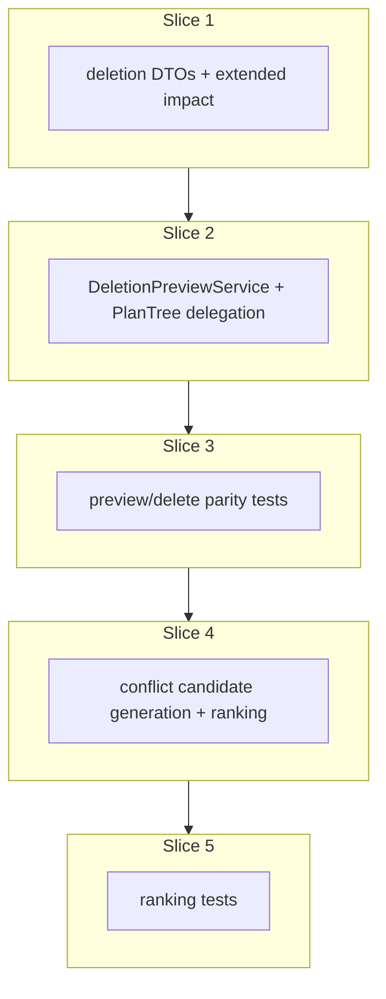

# Plan: Deletion preview and conflict deletion suggestions

**Finalized plan location:** [`docs/plans/deletion_preview_service.md`](deletion_preview_service.md)

## Context

Implement Prompt 12 from [docs/cursor_implementation_guide.md](../cursor_implementation_guide.md): **`DeletionPreviewService`** and **`ConflictDeletionSuggestionService`** per engineering design §7 (service APIs), §8.2 (DTOs), §9.6 (deletion preview + conflict suggestions), Appendix A §2 (chain / critical / ordinary cascade), and guide §0.1 (template / repetition-shell semantics superseding PDF where they differ).

**Behavior summary:**
- `DeletionPreviewService` computes **exactly** what would be deleted for a candidate deletion operation.
- **Real deletion and preview must match** — `PlanTreeService.delete_plan` uses the same impact analysis as preview.
- `ConflictDeletionSuggestionService` generates **legal** deletion operations for an assignment conflict, previews each via `DeletionPreviewService`, and **ranks** candidates (smallest structural impact first, then priority tie-breaks per PDF §9.6 / Appendix A §9).
- Cascade rules: ordinary descendant deletion; whole-chain expansion; critical-chain parent inclusion; **additional** template-root → repetition-shell when delete set includes a `RepetitionPlan.template_root_id` (guide §0.1).
- Does **not** implement task assignment solving, `ConflictAnalysisService`, or calendar writes from suggestions.

**Already done (dependencies):**
- Pure [`compute_deletion_impact`](../../calendar_backend/domain/deletion.py) — chain, descendant, critical-parent fixed-point (Prompt 8)
- Minimal [`PlanDeletionPreviewDTO`](../../calendar_backend/domain/dtos.py) (`root_plan_id`, `affected_plan_ids`, `affected_calendar_entry_ids`, `warnings`)
- [`PlanTreeService.preview_delete`](../../calendar_backend/services/plan_tree.py) / [`delete_plan`](../../calendar_backend/services/plan_tree.py) with `_load_deletion_graph`, `_execute_plan_deletes`
- Domain tests [`tests/domain/test_deletion_impact.py`](../../tests/domain/test_deletion_impact.py); integration tests [`tests/services/test_plan_tree_service.py`](../../tests/services/test_plan_tree_service.py) (preview/delete parity for Prompt 8 rules)
- Empty [`calendar_backend/deletion/`](../../calendar_backend/deletion/) package stub (layer boundary reserved)

**Locked clarifications (request-questions):**
- **Service placement:** Extract preview/cascade logic into `calendar_backend/deletion/`; **`PlanTreeService.preview_delete` / `delete_plan` remain on the external API** as thin wrappers delegating to `DeletionPreviewService` (matches [`plan_tree_service.md`](plan_tree_service.md) locked clarification + Prompt 12 note: extract/refactor only, semantics unchanged).
- **Conflict input:** Define minimal frozen **`AssignmentConflict`** plus **`DeletionOperation`** / **`DeletionCandidate`** now; add `# TODO(Prompt 14 / ConflictAnalysisService): …` on fields conflict analysis will populate later.
- **Ranking authority:** PDF §9.6 / Appendix A §9 — structural depth impact first (`affected_depth_counts_from_master`), then priority tie-break on affected items.

Build workflow: use `/build-plan-slice` per slice against this file; stop after each slice for approval.



## Non-goals

- `TaskAssignmentService`, scheduling solvers, OR-Tools — Prompts 13–14.
- `ConflictAnalysisService` full conflict detection — Prompt 14 (Prompt 12 accepts minimal `AssignmentConflict` input only).
- Executing deletion from conflict suggestions (rank/preview only).
- Mathematically minimal unschedulable conflict sets (design §9.5 / Appendix A §9).
- Free-time orphan activity cleanup on delete — Prompt 15 (`TODO` in `plan_tree.py`).
- Production HTTP API, dev CLI commands, Alembic revisions (no schema changes expected).
- Undo / audit / soft-delete / history.
- Changing Prompt 8 cascade semantics beyond template-root → shell extension.

## Locked assumptions

- **Package:** [`calendar_backend/deletion/`](../../calendar_backend/deletion/) owns preview + conflict suggestion **services**; pure DTOs and impact math stay in [`calendar_backend/domain/deletion.py`](../../calendar_backend/domain/deletion.py) (mirror [`domain/resolution.py`](../../calendar_backend/domain/resolution.py) pattern). Keep `deletion/__init__.py` empty per [package re-export policy](../../.cursor/rules/25-package-re-exports.mdc).
- **External APIs unchanged on `PlanTreeService`:** `preview_delete(plan_id)`, `delete_plan(plan_id)` — delegate internally; callers do not switch modules.
- **`DeletionPreviewService(session)`:** `preview_delete(operation: DeletionOperation) -> ServiceResult[DeletionPreview]`; also accepts convenience `preview_delete_plan(plan_id: PlanID)` building `DeletionOperation(root_plan_id=plan_id)` for `PlanTreeService` delegation.
- **`ConflictDeletionSuggestionService(session)`:** `suggest_for_conflict(conflict: AssignmentConflict) -> ServiceResult[tuple[DeletionCandidate, ...]]` — sorted best-first; does not mutate DB.
- **Shared graph load:** Move `_load_deletion_graph` from `plan_tree.py` to `deletion/preview_service.py` (or `deletion/_graph.py` if load logic grows); `PlanTreeService.delete_plan` still calls `_execute_plan_deletes` in `plan_tree.py` (persistence stays in services layer).
- **`DeletionOperation` (V1):** single root delete — `root_plan_id: PlanID` only (design allows future operation kinds; no enum/registry until a second kind exists).
- **DTO shapes (design §8.2, Prompt 12 minimal):**

| Type | Fields |
|------|--------|
| `DeletionOperation` | `root_plan_id` |
| `DeletionPreview` | `root_plan_id`, `legal_operation`, `affected_plan_ids`, `affected_task_ids`, `affected_calendar_entry_ids`, `affected_depth_counts_from_master`, `warnings` |
| `AssignmentConflict` | `conflicting_plan_ids`, `affected_priority_by_plan_id` (tie-break metadata); `# TODO(Prompt 14 / ConflictAnalysisService):` richer analysis fields |
| `DeletionCandidate` | `legal_operation`, `deletion_preview`, `ranking_keys`, `explanation` |

- **`affected_depth_counts_from_master`:** `tuple[int, ...]` where index `d` counts affected plans at structural depth `d` from master (`master` depth = 0). Compute in pure domain from loaded graph + affected set.
- **`affected_task_ids`:** sorted `PlanID` tuple of affected plans where `plan_kind == TASK` (includes completed/invalid tasks per design §9.6).
- **`ranking_keys`:** `tuple[int, ...]` for stable sort — **lower is better** (smaller legal deletion). Primary key: lexicographic compare of `affected_depth_counts_from_master` **from shallow to deep** (prefer candidates that delete fewer plans at low depths). Secondary: sum of `affected_priority_by_plan_id` for affected plans (lower = better). Tertiary: `len(affected_plan_ids)`, then `str(root_plan_id)` tie-break.
- **Template-root → shell:** In `compute_deletion_impact` fixed-point loop, after existing expansions, if any affected plan id equals some `RepetitionPlan.template_root_id`, add that repetition shell `plan_id`; re-run descendant/chain/critical expansions until stable. Index repetitions from loaded `plan.repetition_plan` rows and from repetition plans' `template_root_id` field on sibling plans.
- **Master:** never deletable; preview returns `MASTER_DELETE_FORBIDDEN`; delete aborts if master in affected set.
- **Collection types:** `tuple` at domain/service boundaries ([repo convention §6](../../.cursor/repo_conventions.md)).
- **Slice checks:** slices 1–2, 4 → ruff format, ruff check, pyright; slices 3, 5 add pytest + **Test catalog** posted in chat.
- **Test DB:** reuse [`tests/services/conftest.py`](../../tests/services/conftest.py).

## Slices

### Slice 1: Pure deletion preview data structures

**Objective:** Add design-aligned frozen DTOs, extend `compute_deletion_impact` with template-root → repetition-shell and depth/task metadata helpers; supersede minimal `PlanDeletionPreviewDTO` usage toward `DeletionPreview` without changing service wiring yet.

**Files expected to change:**
- [`calendar_backend/domain/deletion.py`](../../calendar_backend/domain/deletion.py) — `DeletionOperation`, `DeletionPreview`, `AssignmentConflict`, `DeletionCandidate`; `compute_deletion_impact` template-shell expansion; `build_deletion_preview(...)`, `compute_affected_depth_counts_from_master(...)`, `affected_task_ids_from_plans(...)`
- [`calendar_backend/domain/dtos.py`](../../calendar_backend/domain/dtos.py) — deprecate or alias `PlanDeletionPreviewDTO` → `DeletionPreview` adapter for transitional imports (remove alias once slice 2 completes)

**May also change:**
- [`tests/domain/test_deletion_impact.py`](../../tests/domain/test_deletion_impact.py) — extend pure tests for template-root → shell and depth counts (not full parity suite — slice 3)

**Implementation steps:**
1. Add frozen dataclasses in `domain/deletion.py` per locked DTO table; `AssignmentConflict` includes `# TODO(Prompt 14 / ConflictAnalysisService):` comment block for future fields (`unschedulable_task_ids`, `blocking_constraint_ids`, etc.).
2. Extend `_deletion_indexes` to map `template_root_id → repetition_plan_id` from loaded `RepetitionPlan` rows.
3. Add `_expand_repetition_shells(affected, template_root_to_repetition)` step in the `compute_deletion_impact` fixed-point loop (after chain/descendant/critical, before next iteration).
4. Implement `compute_affected_depth_counts_from_master(plans, affected_plan_ids, master_plan_id)` — BFS depth from master via `parent_id`.
5. Implement `build_deletion_preview(operation, plans, calendar_entries, *, master_plan_id) -> DeletionPreview` wrapping `compute_deletion_impact` + derived fields.
6. Keep `compute_deletion_impact` return type as `PlanDeletionPreviewDTO` **or** migrate to `DeletionPreview` in this slice — **prefer migrating** to `DeletionPreview` and updating `plan_tree.py` call sites in slice 2 only; slice 1 may add adapter `deletion_preview_to_legacy(dto)` if needed for interim compile.
7. Add pure tests: template-root delete includes repetition shell + instance descendants; indirect delete via critical chain including template root; depth count shape on nested tree.

**Tests/checks:**
```bash
uv run ruff format .
uv run ruff check .
uv run pyright
uv run pytest tests/domain/test_deletion_impact.py -m "not slow and not failure_expected"
```

**Acceptance criteria:**
- Template-root → shell rule works in pure graph tests (including TASK-template repetitions).
- `DeletionPreview` includes `affected_task_ids` and `affected_depth_counts_from_master`.
- Existing pure cascade tests (chain, descendant, critical, calendar entries) still pass.
- No SQLAlchemy session imports in `domain/deletion.py`.

**Risks/edge cases:**
- TASK-template root (`plan_kind=TASK` as `template_root_id`) must still trigger shell inclusion.
- Multiple repetitions referencing different templates — map is one-to-one per `template_root_id`.
- Empty affected set impossible for non-master root; master rejected before compute.

---

### Slice 2: Service-facing preview_delete

**Objective:** Introduce `DeletionPreviewService` in `calendar_backend/deletion/`; move graph load + preview orchestration; delegate `PlanTreeService.preview_delete` / impact path for `delete_plan` without changing external behavior.

**Files expected to change:**
- [`calendar_backend/deletion/preview_service.py`](../../calendar_backend/deletion/preview_service.py) (new) — `DeletionPreviewService`, `_load_deletion_graph`
- [`calendar_backend/services/plan_tree.py`](../../calendar_backend/services/plan_tree.py) — thin delegation for `preview_delete`; `delete_plan` uses `DeletionPreviewService` for impact then `_execute_plan_deletes`

**May also change:**
- [`calendar_backend/domain/dtos.py`](../../calendar_backend/domain/dtos.py) — remove `PlanDeletionPreviewDTO` if fully replaced
- [`tests/services/test_plan_tree_service.py`](../../tests/services/test_plan_tree_service.py) — update type expectations if return type becomes `DeletionPreview` (behavior unchanged)

**Implementation steps:**
1. Implement `DeletionPreviewService(session)` with `preview_delete(operation) -> ServiceResult[DeletionPreview]` and `preview_delete_plan(plan_id)` convenience.
2. Move `_load_deletion_graph` from `plan_tree.py` to `preview_service.py` (same eager loads: chains/items, task/repetition subtypes, constraint groups, calendar entries by `source_plan_id`).
3. Validation: `PLAN_NOT_FOUND`, `MASTER_DELETE_FORBIDDEN` before compute (same messages/codes as today).
4. `PlanTreeService.preview_delete(plan_id)` → `DeletionPreviewService.preview_delete_plan(plan_id)` inside `transaction`.
5. `PlanTreeService.delete_plan` → preview via `DeletionPreviewService`; pass resulting `DeletionPreview` to `_execute_plan_deletes` (update signature to accept `DeletionPreview` or shared affected-id view).
6. Do **not** move `_execute_plan_deletes` to deletion package (persistence remains `PlanTreeService` / services layer per layer boundaries).

**Tests/checks:**
```bash
uv run ruff format .
uv run ruff check .
uv run pyright
uv run pytest tests/services/test_plan_tree_service.py tests/domain/test_deletion_impact.py -m "not slow and not failure_expected"
```

**Acceptance criteria:**
- Existing `test_plan_tree_service` preview/delete tests pass without behavior change.
- `DeletionPreviewService` is the single owner of graph load + impact computation for delete preview.
- `PlanTreeService` public method signatures unchanged.

**Risks/edge cases:**
- Nested `transaction` when `delete_plan` calls `preview_delete` — preserve current pattern (preview in nested txn or refactor to shared txn helper without deadlocks).
- Return type change `PlanDeletionPreviewDTO` → `DeletionPreview` — update imports across codebase in this slice.

---

### Slice 3: Parity tests (post Test catalog in chat)

**Objective:** Integration and domain tests proving preview/delete parity and template-shell semantics through the delegated service path; extend coverage beyond Prompt 8 minimums.

**Files expected to change:**
- [`tests/domain/test_deletion_impact.py`](../../tests/domain/test_deletion_impact.py) — template-shell edge cases per catalog
- [`tests/services/test_plan_tree_service.py`](../../tests/services/test_plan_tree_service.py) — parity cases per catalog
- [`tests/deletion/test_preview_service.py`](../../tests/deletion/test_preview_service.py) (new) — `DeletionPreviewService` direct tests if catalog requires

**May also change:**
- [`tests/services/conftest.py`](../../tests/services/conftest.py) — shared repetition + template fixtures if catalog requires

**Implementation steps:**
1. Wait for user **Test catalog** in chat (minimums: four cascade kinds, template-root → shell + instances removed, preview IDs == delete IDs, calendar entries, master forbidden).
2. Implement catalog cases first, then extend to all behavior introduced in slices 1–2.
3. Prefer service API fixtures over raw ORM seeding (match [`repetition_service.md`](repetition_service.md) slice 5 guidance).
4. Each parity test: `preview_delete` affected IDs == DB remaining after `delete_plan` inverse check.

**Tests/checks:**
```bash
uv run ruff format .
uv run ruff check .
uv run pyright
uv run pytest -m "not slow and not failure_expected"
```

**Acceptance criteria:**
- All new tests pass.
- Test catalog cases from chat are covered.
- Existing suite still passes.

**Risks/edge cases:**
- Repetition tests require `generate_instances` before instance clones exist in graph.
- SQLite naive datetime on read — follow existing `.replace(tzinfo=UTC)` patterns in service tests if needed.

---

### Slice 4: Conflict deletion candidate generation

**Objective:** Implement pure candidate generation + ranking helpers and `ConflictDeletionSuggestionService` that previews each legal operation without executing deletes.

**Files expected to change:**
- [`calendar_backend/domain/deletion.py`](../../calendar_backend/domain/deletion.py) — `generate_deletion_operations(conflict) -> tuple[DeletionOperation, ...]`; `rank_deletion_candidates(candidates) -> tuple[DeletionCandidate, ...]`; `build_deletion_candidate(...)`
- [`calendar_backend/deletion/conflict_suggestions.py`](../../calendar_backend/deletion/conflict_suggestions.py) (new) — `ConflictDeletionSuggestionService`

**May also change:**
- [`calendar_backend/deletion/preview_service.py`](../../calendar_backend/deletion/preview_service.py) — expose package-internal helper if batch preview needed

**Implementation steps:**
1. **`generate_deletion_operations`:** for each `plan_id` in `conflict.conflicting_plan_ids`, emit `DeletionOperation(root_plan_id=plan_id)`; skip master; stable-sort by `str(plan_id)`.
2. **`ConflictDeletionSuggestionService.suggest_for_conflict`:** load graph once; for each operation call `DeletionPreviewService.preview_delete`; skip operations where preview fails (illegal); build `DeletionCandidate` with `ranking_keys` from depth + priority rules.
3. **`rank_deletion_candidates`:** pure stable sort using locked `ranking_keys` tuple comparison.
4. Set human-readable `explanation` strings (e.g. `"delete plan X — N plans affected, depth counts …"`).
5. Add `# TODO(Prompt 14 / ConflictAnalysisService):` on service method docstring for wiring from analyzed conflicts.
6. Do not call `delete_plan` anywhere in this module.

**Tests/checks:**
```bash
uv run ruff format .
uv run ruff check .
uv run pyright
```

**Acceptance criteria:**
- Service returns candidates sorted best-first for a synthetic `AssignmentConflict` with known depth/priority shape.
- Illegal operations (master, not found) omitted or fail gracefully without partial DB mutation.
- Each candidate's `deletion_preview` matches standalone `DeletionPreviewService.preview_delete` for same operation.

**Risks/edge cases:**
- Duplicate `conflicting_plan_ids` — dedupe in generation.
- Candidate that deletes entire master subtree except master — still legal if master not in affected set.
- Large conflict sets — V1 accepts O(n) previews; no batch optimization until needed.

---

### Slice 5: Ranking tests (post Test catalog in chat)

**Objective:** Domain and service tests for candidate generation and ranking tie-breaks; post **Test catalog** in chat before implementing.

**Files expected to change:**
- [`tests/domain/test_deletion_conflict.py`](../../tests/domain/test_deletion_conflict.py) (new) — pure ranking + generation
- [`tests/deletion/test_conflict_suggestions.py`](../../tests/deletion/test_conflict_suggestions.py) (new) — `ConflictDeletionSuggestionService` integration

**May also change:**
- [`tests/services/conftest.py`](../../tests/services/conftest.py) — fixtures for multi-task conflict trees

**Implementation steps:**
1. Wait for user **Test catalog** in chat (minimums: depth-first ranking prefers shallow-impact delete; priority tie-break; multiple candidates ordered deterministically).
2. Pure tests for `rank_deletion_candidates` with fabricated `DeletionCandidate` rows (no DB).
3. Integration tests: seed small master tree, build `AssignmentConflict`, assert ordering matches catalog.
4. Post catalog cases first, then extend to all behavior introduced in slice 4.

**Tests/checks:**
```bash
uv run ruff format .
uv run ruff check .
uv run pyright
uv run pytest -m "not slow and not failure_expected"
```

**Acceptance criteria:**
- All new tests pass.
- Test catalog cases from chat are covered.
- Existing suite still passes.

**Risks/edge cases:**
- Priority metadata missing for a plan — treat as 0 for tie-break.
- Equal ranking keys — deterministic tertiary tie-break required.

---

## Abstraction check

| Introduced item | Needed now? | Justification |
|-----------------|-------------|---------------|
| `DeletionOperation` | Yes | Design §8.2; shared by preview + conflict candidates |
| `DeletionPreview` | Yes | Design §8.2; supersedes minimal `PlanDeletionPreviewDTO` |
| `AssignmentConflict` | Yes | `suggest_for_conflict` input; minimal now, Prompt 14 extends |
| `DeletionCandidate` | Yes | Design §8.2 ranked suggestion row |
| `DeletionPreviewService` | Yes | Design §7; Prompt 12 extraction target from `PlanTreeService` |
| `ConflictDeletionSuggestionService` | Yes | Design §7 |
| `generate_deletion_operations` / `rank_deletion_candidates` | Yes | Pure testable steps per design §9.6 |
| `_load_deletion_graph` (moved) | Yes | Shared load for preview + conflict preview batch |
| Repository / graph loader class | No | Mirror invariant + resolution inline load |
| Strategy/registry for operation kinds | No | V1 only supports single-root delete |
| Ranking strategy class | No | Single ranking function suffices |

## Dependency changes

None expected.

```bash
uv sync   # if fresh clone only
```

## Open questions

None blocking implementation. Slices 3 and 5 test cases await **Test catalog** in chat (expected workflow, not a plan blocker).

## Changed in this revision

- Initial finalized plan for Prompt 12 (`DeletionPreviewService` + `ConflictDeletionSuggestionService`).
- Incorporated locked request-questions decisions: extract + delegate to `calendar_backend/deletion/`; minimal `AssignmentConflict` with Prompt 14 TODOs.
- Incorporated guide §0.1 template-root → repetition-shell rule and Prompt 8 carry-over semantics.
- Incorporated PDF §9.6 / Appendix A §9 ranking key ordering (depth counts shallow-first, then priority).
