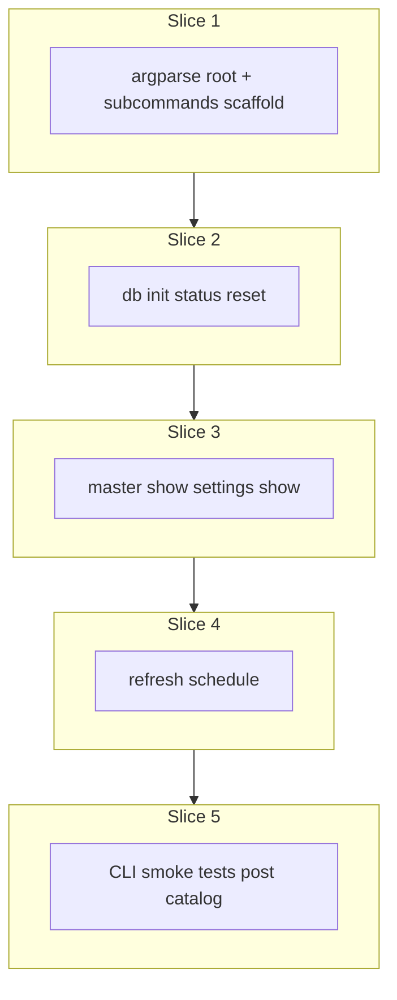

# Plan: Thin development CLI

**Finalized plan location:** [`docs/plans/development_cli.md`](development_cli.md)

## Context

Implement Prompt 18 from [docs/cursor_implementation_guide.md](../cursor_implementation_guide.md): a **local-only** development CLI at [`tools/dev_cli.py`](../../tools/dev_cli.py) (entry point `calendar-backend-dev` in [`pyproject.toml`](../../pyproject.toml)).

**Behavior summary:**
- **Thin wrapper:** parse args → open SQLAlchemy session → call **public service methods** → print human-readable results → exit with non-zero on `ServiceResult` failure.
- **No business logic** in `tools/` that is not also reachable via `calendar_backend` services ([layer rule `tools/`](../../.cursor/rules/10-layer-boundaries.mdc)).
- **Fixed database:** always [`DEFAULT_DATABASE_URL`](../../calendar_backend/db/session.py) (`sqlite:///local_data/calendar_backend.sqlite3`), aligned with [`alembic.ini`](../../alembic.ini). No `--database-url` / env override in V1.
- **DB lifecycle:**
  - `db init` → `alembic upgrade head` only (schema at head, **no row bootstrap**).
  - `db status` → show DB path, file exists, Alembic current revision.
  - `db reset` → delete SQLite file, recreate parent dir, `alembic upgrade head` (empty schema, zero rows — post-init state for iterative local testing).
- **Inspect commands:** `master show`, `settings show` — lazy-bootstrap via existing services (`ensure_master_exists`, `get_settings`).
- **`refresh schedule`:** call [`OrchestrationService.refresh_schedule`](../../calendar_backend/orchestration/refresh_schedule.py) (Prompt 16 complete); default `run_started_at` = `SystemClock().now_utc()` truncated to minute; optional `--run-started-at` ISO-8601 UTC arg.

**Already done (dependencies):**
- Placeholder [`tools/dev_cli.py`](../../tools/dev_cli.py) + [`tools/__init__.py`](../../tools/__init__.py)
- DB layer: [`create_engine_for_url`](../../calendar_backend/db/session.py), Alembic at `calendar_backend/db/migrations`
- Services: `MasterPlanService`, `AppSettingsService`, `MasterHorizonService`, full orchestration stack (Prompts 6, 16)
- Integration patterns in [`tests/services/conftest.py`](../../tests/services/conftest.py) and [`tests/orchestration/`](../../tests/orchestration/)

**Locked clarifications (request-questions):**
- `db init` = migrate only; master/settings bootstrap on first inspect service call
- Fixed `DEFAULT_DATABASE_URL` only (no URL override)
- `db reset` = delete file + `alembic upgrade head`

Build workflow: use `/build-plan-slice` per slice against this file; stop after each slice for approval.



## Non-goals

- Production HTTP API, auth, or interactive TUI
- Typer/Click or other CLI dependencies (stdlib `argparse` only)
- Configurable database URL / multi-environment profiles
- New service methods or DTOs for CLI-only reads (e.g. no `get_horizon` service)
- Goal/task/repetition CRUD commands (use services in tests or future expansion)
- Automatic scheduling, undo, or conflict-deletion UX
- JSON output mode (plain text smoke output only in V1)

## Locked assumptions

- **Package layout:** keep CLI in [`tools/dev_cli.py`](../../tools/dev_cli.py); optional small helpers in [`tools/cli_support.py`](../../tools/cli_support.py) only if `dev_cli.py` grows unwieldy (session context manager, Alembic helpers, DTO printer) — no `tools/commands/` framework.
- **Argparse structure (slice 1):**
  - `calendar-backend-dev db init|status|reset`
  - `calendar-backend-dev master show`
  - `calendar-backend-dev settings show`
  - `calendar-backend-dev refresh schedule [--run-started-at ISO]`
  - Global `--help`; subcommand `--help`
- **Session pattern:** per command: `engine = create_engine_for_url()` → `session = create_session_factory(engine)()` → try/finally `session.close()`; pass `session` + `SystemClock()` to services.
- **Alembic from CLI:** use `alembic.config.Config("alembic.ini")` + `alembic.command.upgrade/current` (same as schema tests); `db init` and `db reset` both end at `upgrade head`.
- **Exit codes:** `0` on success; `1` on validation/usage errors, Alembic failure, or `ServiceResult` with `success=False`; print `ServiceMessage` errors to stderr.
- **Output:** simple key-value lines for DTOs (plan_id, name, settings fields, refresh stage summaries); no tables/colors.
- **`refresh schedule`:** requires DB with schema; may fail on empty tree — acceptable smoke behavior; document in command help.
- **Slice checks:** slices 1–4 → ruff format, ruff check, pyright; slice 5 adds pytest + **Test catalog** posted in chat.

## Slices

### Slice 1: CLI argument structure

**Objective:** Replace placeholder `main()` with argparse root parser, subcommand tree, and stub handlers that print usage-ready structure (no DB/service calls yet).

**Files expected to change:**
- [`tools/dev_cli.py`](../../tools/dev_cli.py) — `build_parser()`, `main()`, subparser registration
- [`tools/cli_support.py`](../../tools/cli_support.py) (new, optional) — minimal dispatch helper if it improves readability

**May also change:**
- [`README.md`](../../README.md) — one-line `calendar-backend-dev --help` usage note (optional)

**Implementation steps:**
1. Add `argparse` root with subparsers: `db`, `master`, `settings`, `refresh`.
2. Register leaf commands: `db init|status|reset`, `master show`, `settings show`, `refresh schedule` with `--run-started-at` optional string dest.
3. Wire `main()` to parse and dispatch to `_cmd_*` stubs (`NotImplementedError` or “not implemented” message) until slice 2+.
4. Ensure `calendar-backend-dev --help` and each subcommand `--help` work via entry point.

**Tests/checks:**
```bash
uv run ruff format .
uv run ruff check .
uv run pyright
```

**Acceptance criteria:**
- Entry point runs; help text lists all planned commands.
- No service/Alembic imports required for help path.

**Risks/edge cases:**
- Keep `tools/` import-clean of OR-Tools scheduling internals; only import services/orchestration/db as needed in later slices.

---

### Slice 2: Database initialization, status, and reset

**Objective:** Implement `db init`, `db status`, and `db reset` against fixed `DEFAULT_DATABASE_URL`.

**Files expected to change:**
- [`tools/dev_cli.py`](../../tools/dev_cli.py) — implement `_cmd_db_init`, `_cmd_db_status`, `_cmd_db_reset`
- [`tools/cli_support.py`](../../tools/cli_support.py) — Alembic helpers (`upgrade_head`, `current_revision`), path helpers for SQLite file delete

**May also change:**
- None expected.

**Implementation steps:**
1. `db init`: resolve DB path from URL, `create_engine_for_url` (ensures parent dir), `command.upgrade(Config("alembic.ini"), "head")`, print success + revision.
2. `db status`: print absolute DB path, `exists()`, `command.current()`, human-readable “no database file” if missing.
3. `db reset`: if file exists, delete it; ensure parent dir; `upgrade head`; print “empty schema at head”.
4. Do **not** call `MasterPlanService` / `AppSettingsService` here (per locked clarification).
5. Map Alembic/process failures to exit code 1 with stderr message.

**Tests/checks:**
```bash
uv run ruff format .
uv run ruff check .
uv run pyright
```

**Acceptance criteria:**
- `db init` on fresh path yields head revision, zero application rows.
- `db reset` returns DB to same empty-at-head state after data inserted manually.
- `db status` reports path and revision consistently.

**Risks/edge cases:**
- Must run Alembic from repo root (document in help); `alembic.ini` path relative to CWD.
- Windows/WSL path: use same `Path(unquote(...))` logic as [`session.py`](../../calendar_backend/db/session.py).

---

### Slice 3: Master and settings inspection commands

**Objective:** `master show` and `settings show` call public services and print DTO fields.

**Files expected to change:**
- [`tools/dev_cli.py`](../../tools/dev_cli.py) — `_cmd_master_show`, `_cmd_settings_show`
- [`tools/cli_support.py`](../../tools/cli_support.py) — `with_session()` context manager, `print_service_result`, DTO formatters

**May also change:**
- None expected.

**Implementation steps:**
1. Open session via shared helper; use `SystemClock()`.
2. `master show` → `MasterPlanService(session).ensure_master_exists()`; print `GoalPlanDTO` fields.
3. `settings show` → `AppSettingsService(session).get_settings()`; print `AppSettingsDTO` fields (timezone, horizon duration, solver limits, heuristic flag, week start).
4. On `fail()`, print errors to stderr and exit 1.
5. First run after `db init` may insert master/settings rows (lazy bootstrap) — document in help text.

**Tests/checks:**
```bash
uv run ruff format .
uv run ruff check .
uv run pyright
```

**Acceptance criteria:**
- Commands work on DB after `db init` without prior manual seeding.
- No SQLAlchemy queries inline in CLI beyond session factory.

**Risks/edge cases:**
- Read-only from user perspective but services may bootstrap rows — acceptable.

---

### Slice 4: refresh_schedule command

**Objective:** `refresh schedule` invokes `OrchestrationService.refresh_schedule` for end-to-end local smoke.

**Files expected to change:**
- [`tools/dev_cli.py`](../../tools/dev_cli.py) — `_cmd_refresh_schedule`
- [`tools/cli_support.py`](../../tools/cli_support.py) — parse `--run-started-at` to minute-aligned UTC `datetime` (reuse domain time helpers / `require_utc` + `is_minute_aligned` validation)

**May also change:**
- None expected.

**Implementation steps:**
1. Default `run_started_at`: `SystemClock().now_utc()` with seconds/micros zeroed (minute-aligned).
2. Optional `--run-started-at`: parse ISO-8601; reject non-UTC or sub-minute (match service validation).
3. Call `OrchestrationService(session, clock).refresh_schedule(run_started_at)`.
4. Print compact summary: success/failure, counts from `ResolveTasksResult` (valid_incomplete len), assignment status, free-time entry count if present, warnings/errors.
5. Exit 1 on orchestration `fail()`; still print partial `RefreshScheduleResult` fields when `_value` present.

**Tests/checks:**
```bash
uv run ruff format .
uv run ruff check .
uv run pyright
```

**Acceptance criteria:**
- Command callable after `db init` + minimal seed (document that empty tree may fail resolution/assignment — smoke only).
- No orchestration logic duplicated in CLI.

**Risks/edge cases:**
- Empty master tree → expected failure; CLI should surface service errors clearly.
- Exact solver may be slow; acceptable for manual dev smoke (not default CI).

---

### Slice 5: Smoke tests (post Test catalog in chat)

**Objective:** Automated smoke coverage for parser dispatch, DB commands, inspect commands, and refresh entry point; post **Test catalog** in chat before implementing.

**Files expected to change:**
- [`tests/tools/test_dev_cli.py`](../../tests/tools/test_dev_cli.py) (new)
- [`tests/tools/conftest.py`](../../tests/tools/conftest.py) (new) — temp DB path override via monkeypatch of `DEFAULT_DATABASE_URL` **in tests only** (do not add production URL override)

**May also change:**
- [`tools/cli_support.py`](../../tools/cli_support.py) — injectable DB URL parameter for testability if monkeypatching module constant is awkward

**Implementation steps:**
1. Wait for user **Test catalog** in chat (minimums: `--help` lists subcommands; `db init`/`db reset` empty schema; `db status` shows revision; `master show`/`settings show` bootstrap; parser rejects bad `--run-started-at`; refresh command dispatches — may use monkeypatch/stub orchestration for deterministic exit).
2. Prefer `subprocess.run([sys.executable, "-m", "tools.dev_cli", ...])` for integration-style CLI tests; unit-test argparse via `build_parser().parse_args(...)`.
3. Use temp-directory SQLite URL in fixtures (monkeypatch `tools.cli_support.DATABASE_URL` or similar test seam).
4. Mark slow/heavy refresh integration tests `@pytest.mark.slow` if full orchestration + OR-Tools needed.

**Tests/checks:**
```bash
uv run ruff format .
uv run ruff check .
uv run pyright
uv run pytest tests/tools/ -m "not slow and not failure_expected"
```

**Acceptance criteria:**
- Test catalog cases from chat covered.
- Default suite green without requiring committed `local_data/` DB.

**Risks/edge cases:**
- CLI tests must not mutate developer’s real `local_data/calendar_backend.sqlite3` — temp paths only.

---

## Abstraction check

| Introduced item | Needed now? | Justification |
|-----------------|-------------|---------------|
| `build_parser()` | Yes | Single argparse tree; testable without subprocess |
| `with_session()` helper | Maybe | Removes duplicated engine/session boilerplate across 3 slices |
| `print_*_dto()` formatters | Maybe | Keeps `dev_cli.py` readable; pure functions, no class |
| Command framework / registry | No | Five commands; argparse subparsers suffice |
| Config file / env profiles | No | User locked fixed URL |

## Dependency changes

None — stdlib `argparse` only.

## Open questions

None blocking. Slice 5 awaits **Test catalog** in chat (workflow).

## Changed in this revision

- Finalized draft from `~/.cursor/plans/development_cli_plan_d762d8e6.plan.md` into [`docs/plans/development_cli.md`](development_cli.md).
- Normalized relative links to match sibling plans (`../cursor_implementation_guide.md`, `../../tools/...`, `../../calendar_backend/...`).
- Added **Build workflow**, **May also change**, explicit **Tests/checks** command blocks, and **Risks/edge cases** to every slice per `/revise-plan` slice-field convention.
- Locked `db reset` as delete-file + `upgrade head` (empty schema utility) per request-questions follow-up.
- Slice 4 unblocked: `OrchestrationService.refresh_schedule` is implemented (Prompt 16); no longer deferred.
