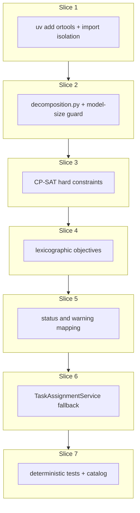

# Plan: Exact OR-Tools CP-SAT solver

**Finalized plan location:** [`docs/plans/exact_cp_sat_solver.md`](exact_cp_sat_solver.md)

## Context

Implement Prompt 17 from [docs/cursor_implementation_guide.md](../cursor_implementation_guide.md): **`ExactAssignmentSolver`** with OR-Tools CP-SAT per engineering design **§9.3** (task assignment loop), **§9.4** (assignment objectives), **§11** (solver settings), **§12** (solver warnings), **§12 Algorithm choice** (exact-first + heuristic fallback), guide §0.1 (instance-clone tasks only), and [repo convention §5](../../.cursor/repo_conventions.md) (session-free scheduling package).

**Behavior summary:**
- Install OR-Tools in this plan only (`uv add ortools`); keep OR-Tools imports isolated to [`calendar_backend/scheduling/exact_cp_sat.py`](../../calendar_backend/scheduling/exact_cp_sat.py).
- `ExactAssignmentSolver` implements existing [`AssignmentSolver`](../../calendar_backend/scheduling/types.py) protocol.
- Decompose input into **precedence-connected components** via new [`calendar_backend/scheduling/decomposition.py`](../../calendar_backend/scheduling/decomposition.py) (PDF package layout); solve components **sequentially**, passing placements from earlier components as additional hard occupied intervals.
- Respect `exact_solver_time_limit_seconds` and `exact_solver_model_size_limit` from `AppSettings`.
- **Model-size guard:** before building CP-SAT for a component, estimate bool+int variable count; if estimate exceeds `exact_solver_model_size_limit`, treat exact result as **not usable** (skip solve for that component).
- **Fallback:** per PDF §9.3 — if exact cannot produce a **usable** hard-valid assignment for a component and `heuristic_enabled`, run `HeuristicAssignmentSolver` on that component sub-input; if heuristic disabled, assignment fails.
- **Hard constraints never violated:** every returned assignment (exact or fallback) must pass [`validate_full_assignment`](../../calendar_backend/scheduling/feasibility.py) before success.
- **Status/warnings:** distinguish `OPTIMAL`, feasible-not-proven-optimal (`FEASIBLE_NOT_PROVEN_OPTIMAL`), limit reached (`SOLVER_LIMIT_REACHED`), heuristic fallback (`HEURISTIC_FEASIBLE`), and failure (`INFEASIBLE`).
- **Stability hints:** load future TASK entries into `previous_placements_by_task_id` in `TaskAssignmentService` (PDF §9.3 `load_future_task_entries_as_stability_hints`); hints are soft objectives only (PDF §9.4 level 2+).

**Already done (dependencies):**
- [`AssignmentSolver`](../../calendar_backend/scheduling/types.py), [`AssignmentInput`](../../calendar_backend/scheduling/input.py), [`HeuristicAssignmentSolver`](../../calendar_backend/scheduling/heuristic.py), [`validate_full_assignment`](../../calendar_backend/scheduling/feasibility.py) (Prompt 13)
- [`TaskAssignmentService`](../../calendar_backend/services/task_assignment.py) — heuristic-only `_solve_assignment`, `_heuristic_solver_unavailable_error`, occupied-interval loading (Prompt 14)
- [`OrchestrationService.refresh_schedule`](../../calendar_backend/orchestration/refresh_schedule.py) composes assignment (Prompt 16)
- `AppSettings` fields + defaults for solver limits (Prompt 3)
- Reserved enums/messages: `SolverStatus.OPTIMAL`, `MessageCode.SOLVER_LIMIT_REACHED`, `MessageCode.FEASIBLE_NOT_PROVEN_OPTIMAL`, `MessageCode.HEURISTIC_FEASIBLE`

**Locked clarifications (request-questions + PDF):**

| Topic | Rule |
|-------|------|
| **Model-size metric** | Estimated CP-SAT **bool + int variable count** per component (user choice; PDF §11 “count/threshold”) |
| **Decomposition** | **Precedence-connected components**; PDF §9.3 per-component solve loop |
| **Lexicographic objectives** | PDF §9.4 levels **2–7** after hard feasibility (level 1); divisible soft prefs (fewer/closer chunks, PDF task-assignment bullets) as tie-breakers within the final pass |
| **Cross-component overlap** | Later components receive **accumulated occupied** = global `occupied_intervals` + segments from already-solved components |
| **Component order** | Deterministic: sort components by `min(str(plan_id))` within each component |
| **`usable` exact result** | `status` is `OPTIMAL` or `FEASIBLE`, assignments cover all component tasks, and `validate_full_assignment` passes |
| **Not usable** | `INFEASIBLE`; model-size guard tripped; CP-SAT timeout/unknown with no solution; solver exception |
| **Limit + feasible solution** | **Usable** — persist assignment with `SOLVER_LIMIT_REACHED` + `FEASIBLE_NOT_PROVEN_OPTIMAL` warnings |
| **`heuristic_enabled=False`** | Exact-only; no fallback; fail if exact not usable |
| **Aggregate status** | PDF `weakest_status(component_statuses)`: any component `FEASIBLE` → overall `FEASIBLE`; all `OPTIMAL` → `OPTIMAL` |

Build workflow: use `/build-plan-slice` per slice against this file; stop after each slice for approval.



## Non-goals

- Alembic / schema changes (no migrations expected).
- Heuristic stability-hint consumption (heuristic continues to ignore `previous_placements_by_task_id`; exact solver uses hints in lex objectives).
- Mathematically minimal conflict analysis changes.
- Sub-minute scheduling; partial assignments on failure.
- Solver registry/factory/protocol beyond existing `AssignmentSolver`.
- Renaming [`types.py`](../../calendar_backend/scheduling/types.py) to PDF’s `interfaces.py`.
- Moving [`ConflictAnalysisService`](../../calendar_backend/deletion/conflict_analysis.py) into `scheduling/`.
- Production HTTP API / dev CLI commands.
- OR-Tools for free-time assignment.

## Locked assumptions

- **Package boundaries:** OR-Tools only in `exact_cp_sat.py`; `decomposition.py`, `heuristic.py`, `feasibility.py`, `types.py`, `input.py` remain import-clean. [`scheduling/__init__.py`](../../calendar_backend/scheduling/__init__.py) stays empty per [package re-export policy](../../.cursor/rules/25-package-re-exports.mdc).
- **Solver limits on input:** Add frozen `SolverLimits(time_limit_seconds: int, model_size_limit: int)` and optional `solver_limits: SolverLimits | None = None` on `AssignmentInput` (service sets from `AppSettings`; heuristic ignores).
- **Component sub-input:** `AssignmentComponent` frozen dataclass: `tasks`, `precedence_edges`, `occupied_intervals`, `previous_placements_by_task_id` (filtered to component tasks), `run_started_at`, `solver_limits`.
- **Time discretization:** 1-minute grid; horizon upper bound = max `end_time` across task windows, occupied intervals, and stability hints for the component (minute offset from `run_started_at`).
- **Divisible modeling:** Cap segments at `max(1, ceil(duration / minimum_chunk))` (mirror heuristic); optional segment presence bools; inactive segments length 0.
- **Indivisible modeling:** Exactly one segment with fixed `duration_minutes`.
- **Lexicographic implementation:** Sequential CP-SAT solves per objective level (fix prior level’s optimal value as constraint); abort lex chain on infeasible level and return best feasible from last successful level.
- **Result factories:** Extend [`types.py`](../../calendar_backend/scheduling/types.py) with `exact_feasible_result(...)` / `exact_optimal_result(...)` carrying appropriate warnings (distinct from `HEURISTIC_FEASIBLE`).
- **Slice checks:** slices 1–6 → ruff format, ruff check, pyright; slice 7 adds pytest + **Test catalog** posted in chat.

### PDF §9.4 objective levels (slice 4)

After hard feasibility (constraints, not objective):

1. **Preserve exact previous windows** — maximize count of tasks whose segments exactly match filtered stability hints.
2. **Minimize total moved minutes** — sum of absolute start/end deltas vs hints (0 if no hint).
3. **Minimize changed assignments** — count tasks with any segment change vs hint.
4. **Improve priority quality** — lexicographic minimize start times by `priority_path` (higher-priority tasks earlier).
5. **Consolidate free gaps** — minimize total idle span between consecutive assigned segments when sorted by start (compression).
6. **Schedule earlier** — minimize sum of segment start minute offsets.
7. **Divisible tie-breakers** — fewer segments, then minimize gaps between chunks of same task.

## Slices

### Slice 1: OR-Tools dependency and import isolation

**Objective:** Add OR-Tools dependency via uv and establish import boundaries so non-exact scheduling modules never import ortools.

**Files expected to change:**
- [`pyproject.toml`](../../pyproject.toml) / [`uv.lock`](../../uv.lock) — `uv add ortools`
- [`calendar_backend/scheduling/exact_cp_sat.py`](../../calendar_backend/scheduling/exact_cp_sat.py) (new) — module scaffold + `ExactAssignmentSolver` class stub implementing `AssignmentSolver` (raises `NotImplementedError` or returns trivial empty feasible until slice 3)
- [`tests/scheduling/test_ortools_import_isolation.py`](../../tests/scheduling/test_ortools_import_isolation.py) (new) — import smoke tests

**May also change:**
- None expected.

**Implementation steps:**
1. Run `uv add ortools` (main dependency, not dev-only).
2. Create `exact_cp_sat.py` with all `ortools` imports at module top (single isolation point).
3. Add `ExactAssignmentSolver` implementing `solve()` stub.
4. Add test proving `import calendar_backend.scheduling.heuristic` / `feasibility` / `types` / `input` does not load `ortools` submodule.
5. Add test that `ExactAssignmentSolver` is importable and instantiable.

**Tests/checks:**
```bash
uv run ruff format .
uv run ruff check .
uv run pyright
uv run pytest tests/scheduling/test_ortools_import_isolation.py -m "not slow and not failure_expected"
```

**Acceptance criteria:**
- `ortools` in project dependencies.
- No ortools imports outside `exact_cp_sat.py`.
- Suite still green.

**Risks/edge cases:**
- OR-Tools wheel size / CI install time — acceptable per V1 design.

---

### Slice 2: CP-SAT model input decomposition and model-size guard

**Objective:** Add `decomposition.py` with precedence-connected component splitting, per-component sub-input builders, accumulated-occupied orchestration helper, and pre-solve CP-SAT variable-count estimation + guard.

**Files expected to change:**
- [`calendar_backend/scheduling/decomposition.py`](../../calendar_backend/scheduling/decomposition.py) (new)
- [`calendar_backend/scheduling/input.py`](../../calendar_backend/scheduling/input.py) — `SolverLimits`, optional `solver_limits` on `AssignmentInput`
- [`calendar_backend/scheduling/exact_cp_sat.py`](../../calendar_backend/scheduling/exact_cp_sat.py) — wire `estimate_model_variable_count` / `model_size_exceeded` helpers (no full constraint model yet)
- [`tests/scheduling/test_decomposition.py`](../../tests/scheduling/test_decomposition.py) (new)

**May also change:**
- [`calendar_backend/scheduling/types.py`](../../calendar_backend/scheduling/types.py) — only if `AssignmentComponent` fits better alongside result DTOs (prefer `decomposition.py` per slice objective)

**Implementation steps:**
1. Implement `decompose_assignment_input(input) -> tuple[AssignmentComponent, ...]` using undirected connectivity from `precedence_edges`; isolated tasks are singleton components; filter edges to in-component endpoints.
2. Implement deterministic component ordering (`min(str(plan_id))` key).
3. Implement `iter_component_sub_inputs(...)` helper that accumulates placed segments into `occupied_intervals` for subsequent components (pure function returning ordered sub-inputs; consumed by `ExactAssignmentSolver` in slice 5).
4. Implement `estimate_model_variable_count(component) -> int` from task durations, window counts, divisibility caps, and occupied/hint bounds (document formula in module docstring).
5. Implement `model_size_guard_exceeded(component, limits) -> bool`.
6. Unit tests: two disconnected precedence chains → two components; single edge → one component; empty tasks → empty decomposition; guard trips on artificially low limit.

**Tests/checks:**
```bash
uv run ruff format .
uv run ruff check .
uv run pyright
uv run pytest tests/scheduling/test_decomposition.py -m "not slow and not failure_expected"
```

**Acceptance criteria:**
- Decomposition matches PDF §9.3 component loop inputs.
- Model-size estimate is deterministic and conservative (over-estimate acceptable; under-estimate not).
- No OR-Tools model built in `decomposition.py`.

**Risks/edge cases:**
- Precedence edges whose endpoints are not both in `tasks` should be ignored (same pass-through behavior as heuristic input mapping).

---

### Slice 3: Hard constraints

**Objective:** Build CP-SAT model for one `AssignmentComponent` enforcing all hard feasibility rules; extract assignments; post-validate with `validate_full_assignment`.

**Files expected to change:**
- [`calendar_backend/scheduling/exact_cp_sat.py`](../../calendar_backend/scheduling/exact_cp_sat.py) — `_build_hard_constraint_model`, `_solve_component_hard`, `ExactAssignmentSolver._solve_single_component` (feasibility-only objective: minimize 0 or dummy)
- [`tests/scheduling/test_exact_cp_sat_hard.py`](../../tests/scheduling/test_exact_cp_sat_hard.py) (new) — tiny hand-built cases

**May also change:**
- [`tests/scheduling/conftest.py`](../../tests/scheduling/conftest.py) — shared tiny-horizon fixtures if reused across exact-solver tests

**Implementation steps:**
1. Discretize timeline to minute offsets from `run_started_at` through computed horizon end.
2. Per-task segment variables (presence, start, duration) respecting indivisible/divisible rules and minimum chunk sizes.
3. Hard constraints: window membership, non-overlap (tasks + occupied), segment sum = duration, precedence (`max(pred ends) <= min(succ starts)`), inactive segment zero length.
4. Solve with time limit from `SolverLimits`; on OPTIMAL/FEASIBLE extract segments as `TimeWindow` UTC datetimes.
5. Always run `validate_full_assignment` on extracted solution; treat validation failure as not usable.
6. Tests: single indivisible placement; occupied blocker avoidance; precedence pair; divisible two-chunk placement; infeasible window → not usable.

**Tests/checks:**
```bash
uv run ruff format .
uv run ruff check .
uv run pyright
uv run pytest tests/scheduling/test_exact_cp_sat_hard.py -m "not slow and not failure_expected"
```

**Acceptance criteria:**
- Extracted assignments satisfy `validate_full_assignment` for feasible cases.
- Infeasible inputs never return usable assignments.

**Risks/edge cases:**
- Large horizons can slow CP-SAT even on tiny task counts — tests must keep windows narrow (1–3 days).

---

### Slice 4: Lexicographic objective support

**Objective:** Layer PDF §9.4 soft objectives 2–7 (plus divisible tie-breakers) as sequential lexicographic CP-SAT passes on top of slice 3 hard model.

**Files expected to change:**
- [`calendar_backend/scheduling/exact_cp_sat.py`](../../calendar_backend/scheduling/exact_cp_sat.py) — `_solve_component_lexicographic`, objective helpers per level
- [`tests/scheduling/test_exact_cp_sat_objectives.py`](../../tests/scheduling/test_exact_cp_sat_objectives.py) (new)

**May also change:**
- [`tests/scheduling/conftest.py`](../../tests/scheduling/conftest.py) — stability-hint fixtures for lex-order tests

**Implementation steps:**
1. Build hard-feasible baseline model factory reused across lex passes.
2. Level 2: maximize exact hint matches (tasks with filtered `previous_placements_by_task_id`).
3. Level 3–7: add objective, solve, fix optimal value, proceed; document objective math in comments where non-obvious.
4. Priority quality (level 4): encode as hierarchical keys from `priority_path` (higher-priority tasks get lower start-time penalties).
5. Consolidate gaps (level 5): minimize sum of idle minutes between sorted assigned segments across all tasks in component.
6. Divisible tie-breakers after level 6/7 per locked assumptions.
7. Tests with conflicting soft goals prove lex ordering (e.g. stability beats earlier start; priority beats gap consolidation when earlier levels tie).

**Tests/checks:**
```bash
uv run ruff format .
uv run ruff check .
uv run pyright
uv run pytest tests/scheduling/test_exact_cp_sat_objectives.py -m "not slow and not failure_expected"
```

**Acceptance criteria:**
- Deterministic outcomes on fixed inputs.
- Higher-priority soft levels dominate lower ones in test scenarios.

**Risks/edge cases:**
- Lex pass chain may be expensive — reuse model where possible; keep test horizons tiny.

---

### Slice 5: Solver status and warning mapping

**Objective:** Map CP-SAT outcomes + guard/fallback semantics to `AssignmentSolverResult` with correct `SolverStatus` and `ServiceMessage` warnings; compose multi-component results with `weakest_status`.

**Files expected to change:**
- [`calendar_backend/scheduling/exact_cp_sat.py`](../../calendar_backend/scheduling/exact_cp_sat.py) — `ExactAssignmentSolver.solve` full pipeline (decompose → per-component exact → aggregate)
- [`calendar_backend/scheduling/types.py`](../../calendar_backend/scheduling/types.py) — `exact_optimal_result`, `exact_feasible_result`, `weakest_solver_status`, `is_usable_solver_result`
- [`tests/scheduling/test_exact_cp_sat_status.py`](../../tests/scheduling/test_exact_cp_sat_status.py) (new)

**May also change:**
- [`calendar_backend/scheduling/decomposition.py`](../../calendar_backend/scheduling/decomposition.py) — wire `iter_component_sub_inputs` into exact solver orchestration if not already connected in slice 2

**Implementation steps:**
1. Map OR-Tools status: `OPTIMAL` → `SolverStatus.OPTIMAL`; `FEASIBLE` → `SolverStatus.FEASIBLE` + `FEASIBLE_NOT_PROVEN_OPTIMAL`; stopped by limit with solution → add `SOLVER_LIMIT_REACHED`.
2. Model-size guard → not usable (empty assignments, no throw); caller handles fallback in slice 6.
3. `weakest_solver_status`: `OPTIMAL` only if all components optimal; else `FEASIBLE`.
4. Merge component assignments + warnings; single `validate_full_assignment` on full merged input.
5. Unit tests: mocked/stub solver paths for each status; integration-style test with tiny real CP-SAT model for OPTIMAL vs time-limit FEASIBLE.

**Tests/checks:**
```bash
uv run ruff format .
uv run ruff check .
uv run pyright
uv run pytest tests/scheduling/test_exact_cp_sat_status.py -m "not slow and not failure_expected"
```

**Acceptance criteria:**
- All four user-facing outcomes covered: optimal, feasible-not-proven, limit-reached (still usable), failure/not-usable.

**Risks/edge cases:**
- Mixed per-component statuses (one OPTIMAL, one FEASIBLE) must aggregate to `FEASIBLE` per PDF `weakest_status`.

---

### Slice 6: TaskAssignmentService fallback integration

**Objective:** Wire exact-first / heuristic-fallback in `TaskAssignmentService`; load stability hints; pass solver limits; update precondition guard for exact-only mode.

**Files expected to change:**
- [`calendar_backend/services/task_assignment.py`](../../calendar_backend/services/task_assignment.py) — `_solve_assignment`, settings guard, stability hint loader
- [`calendar_backend/domain/assignment.py`](../../calendar_backend/domain/assignment.py) — `previous_placements_from_future_task_entries(...)` pure helper
- [`calendar_backend/scheduling/input.py`](../../calendar_backend/scheduling/input.py) — resolve `# TODO(Prompt 17 / heuristic stability)` where wired
- [`tests/services/test_task_assignment_service.py`](../../tests/services/test_task_assignment_service.py) — extend for exact/fallback paths (may defer heavy cases to slice 7)

**May also change:**
- [`calendar_backend/scheduling/heuristic.py`](../../calendar_backend/scheduling/heuristic.py) — update stability TODO comment only (heuristic still ignores hints in V1)

**Implementation steps:**
1. Load future TASK entries (`start_time >= run_started_at`) mapped to `previous_placements_by_task_id` filtered to schedulable tasks in current input (PDF: hints only when still valid/incomplete/schedulable).
2. Load `SolverLimits` from `AppSettingsService.get_settings()`.
3. Replace `_heuristic_solver_unavailable_error` with guard that fails only when `heuristic_enabled=False` **and** exact solver cannot run (should not happen post slice 1) — message distinct from solver failure.
4. `_solve_assignment`: delegate to `ExactAssignmentSolver.solve` (internal decomposition) first; if not usable and `heuristic_enabled`, run per-component `HeuristicAssignmentSolver` fallback + `validate_full_assignment`; if heuristic disabled, return `INFEASIBLE`.
5. Heuristic fallback result uses `feasible_result` (`HEURISTIC_FEASIBLE` warning); exact uses slice 5 factories.
6. Persist `optimization_status` via `weakest_solver_status` across components.
7. Light service tests: fallback invoked when exact guard trips (mock/patch `ExactAssignmentSolver` or tiny limit).

**Tests/checks:**
```bash
uv run ruff format .
uv run ruff check .
uv run pyright
uv run pytest tests/services/test_task_assignment_service.py -m "not slow and not failure_expected"
```

**Acceptance criteria:**
- Exact attempted before heuristic when enabled.
- `heuristic_enabled=False` uses exact only.
- Stability hints populated on assignment input.
- Successful runs never persist hard-invalid assignments.

**Risks/edge cases:**
- Future TASK entries for tasks no longer in `valid_incomplete` must be excluded from hints.
- `_persist_successful_assignment` already writes `solver_status` from result — ensure `OPTIMAL` path is exercised when exact proves optimality.

---

### Slice 7: Deterministic tests (post Test catalog in chat)

**Objective:** Comprehensive pure + service tests for exact solver, decomposition, objectives, status mapping, and fallback; post **Test catalog** in chat before implementing.

**Files expected to change:**
- [`tests/scheduling/test_exact_cp_sat_hard.py`](../../tests/scheduling/test_exact_cp_sat_hard.py)
- [`tests/scheduling/test_exact_cp_sat_objectives.py`](../../tests/scheduling/test_exact_cp_sat_objectives.py)
- [`tests/scheduling/test_exact_cp_sat_status.py`](../../tests/scheduling/test_exact_cp_sat_status.py)
- [`tests/scheduling/test_decomposition.py`](../../tests/scheduling/test_decomposition.py)
- [`tests/scheduling/test_ortools_import_isolation.py`](../../tests/scheduling/test_ortools_import_isolation.py)
- [`tests/services/test_task_assignment_service.py`](../../tests/services/test_task_assignment_service.py) — exact/fallback integration cases
- [`tests/scheduling/conftest.py`](../../tests/scheduling/conftest.py) — shared tiny horizons / limit helpers

**May also change:**
- [`tests/orchestration/test_refresh_schedule_integration.py`](../../tests/orchestration/test_refresh_schedule_integration.py) — only if a minimal exact-solver smoke path is needed (prefer assignment-service tests first)

**Implementation steps:**
1. Wait for user **Test catalog** in chat (minimums: import isolation; two-component decomposition; model-size guard fallback; hard infeasible; optimal small case; limit-reached feasible; lex stability-over-earlier; service exact-only vs fallback).
2. Implement catalog cases + coverage for all behavior introduced in slices 1–6.
3. Keep horizons small (1–3 day windows, ≤4 tasks) for deterministic fast runs; mark slow cases `@pytest.mark.slow` if needed.

**Tests/checks:**
```bash
uv run ruff format .
uv run ruff check .
uv run pyright
uv run pytest -m "not slow and not failure_expected"
```

**Acceptance criteria:**
- All catalog cases pass.
- Full suite green.

**Risks/edge cases:**
- OR-Tools timing can be flaky on shared CI — prefer tiny models and generous but bounded limits in tests.

---

## Abstraction check

| Introduced item | Needed now? | Justification |
|-----------------|-------------|---------------|
| `ExactAssignmentSolver` | Yes | Prompt 17 deliverable; PDF §12 Algorithm choice |
| `decomposition.py` | Yes | PDF package layout §scheduling/decomposition.py |
| `SolverLimits` | Yes | Thread AppSettings into session-free solver |
| `AssignmentComponent` | Yes | Typed per-component sub-input |
| `exact_*_result` helpers | Yes | Distinct warnings from heuristic path |
| Solver registry/factory | No | Two explicit implementations per abstraction rule |
| Generic CP-SAT framework | No | Single domain model |

## Dependency changes

Slice 1:

```bash
uv add ortools
```

## Open questions

None blocking. Slice 7 awaits **Test catalog** in chat (workflow, not a plan blocker).

## Changed in this revision

- Finalized draft from `~/.cursor/plans/exact_cp-sat_solver_e1f8c926.plan.md` into [`docs/plans/exact_cp_sat_solver.md`](exact_cp_sat_solver.md).
- Normalized relative links to match sibling plans (`../cursor_implementation_guide.md`, `../../calendar_backend/...`, `../../.cursor/repo_conventions.md`).
- Added **May also change**, explicit **Tests/checks** command blocks, and **Risks/edge cases** to every slice per `/revise-plan` slice-field convention.
- Recorded Prompt 16 orchestration as an already-done dependency.
- Renamed sequential helper to `iter_component_sub_inputs` for clarity (was `solve_components_sequentially` in draft).
- Locked PDF §9.4 lexicographic levels 2–7 + divisible tie-breakers per request-questions follow-up (trust PDF over informal options).
