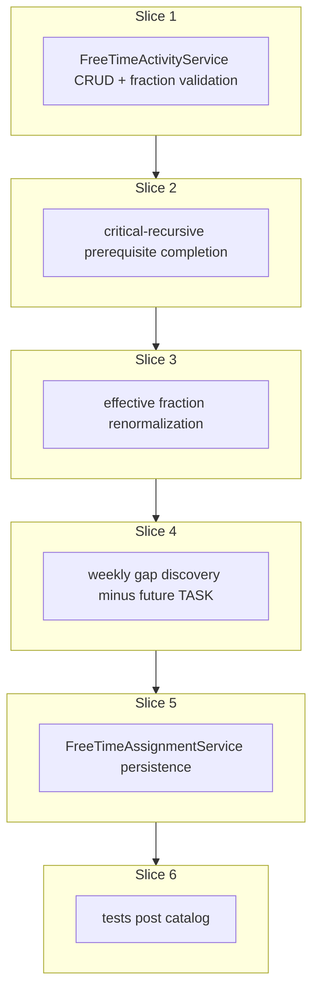

# Plan: Free-time activity and assignment services

**Finalized plan location:** [`docs/plans/free_time_activity_and_assignment.md`](free_time_activity_and_assignment.md)

## Context

Implement Prompt 15 from [docs/cursor_implementation_guide.md](../cursor_implementation_guide.md): **`FreeTimeActivityService`** and **`FreeTimeAssignmentService`** per engineering design (free-time tables §6, assignment semantics §9.x, persistence §10), guide §0.1, and [repo conventions](../../.cursor/repo_conventions.md).

**Behavior summary:**
- **`FreeTimeActivityService`** — CRUD for activities; manage `enabled`, stored `real_fraction`, `minimum_block_size_minutes`, and plan-backed prerequisites; validate enabled positive fractions sum to 1.
- **`FreeTimeAssignmentService.assign_free_time(run_started_at)`** — deterministic free-time fill in gaps; uses **future TASK** calendar entries (`start_time >= run_started_at`) as hard blockers; atomically replaces **future FREE_TIME** entries only; tiny gaps below `minimum_block_size_minutes` stay empty; blocked activities excluded and remaining enabled activities renormalized in memory.
- **Task assignment coexistence:** [`TaskAssignmentService`](../../calendar_backend/services/task_assignment.py) already ignores FREE_TIME and only replaces future TASK rows ([`task_assignment_service.md`](task_assignment_service.md) non-goals).

**Already done (dependencies):**
- [`TaskAssignmentService`](../../calendar_backend/services/task_assignment.py) + [`domain/assignment.py`](../../calendar_backend/domain/assignment.py) — TASK persistence, `CalendarEntryDTO`, occupied-interval mapping (Prompt 14)
- ORM: [`FreeTimeActivity`](../../calendar_backend/models/free_time.py), [`FreeTimeActivityPrerequisite`](../../calendar_backend/models/free_time.py), [`CalendarEntry`](../../calendar_backend/models/calendar.py) with `FREE_TIME` + `source_free_time_activity_id`
- Settings: `AppSettings.free_time_week_start_day` via [`AppSettingsService`](../../calendar_backend/services/app_settings.py)
- Horizon: [`MasterHorizonService`](../../calendar_backend/services/master_horizon.py), `get_master_horizon_end`, `validate_run_started_at`
- Plan-tree FK safety: prerequisite rows deleted on plan delete; `# TODO(Prompt 15)` orphan-activity cleanup in [`plan_tree.py`](../../calendar_backend/services/plan_tree.py)

**Locked clarifications (request-questions):**
- **Prerequisite completion (critical-recursive):** TASK → `user_completed`; GOAL → every child in every **critical** chain is recursively complete; REPETITION shell → every **critical** instance's `root_clone_id` subtree is recursively complete. Non-critical chains/instances ignored. *(Not implemented in repo today — slice 2 is new domain logic.)*
- **Gap universe:** `[run_started_at, master_horizon_end)`, minus **future TASK** entries (`entry_type == TASK`, `start_time >= run_started_at`); partitioned into weeks by `AppSettings.free_time_week_start_day`. **No** user/group time windows on activities.
- **Stored vs effective fraction:** DB column `real_fraction` = user-configured nominal fraction (CRUD validates enabled positive sum = 1). Assignment computes **effective fractions** in memory only (renormalize after blocking); do **not** persist renormalized fractions on `CalendarRun` ([`core_orm_models_part2.md`](core_orm_models_part2.md) non-goal).
- **Failure persistence (Prompt 15):** **Success-only DB writes:** replace future FREE_TIME, attach `calendar_run_id = active_calendar_run_id`. Guard/algorithm failure → `fail()` with **zero** calendar/run/state mutations (mirror task-assignment guard path). Add `# TODO(Prompt 16):` for partial-orchestration failure metadata — **leave exact partial-failure policy ambiguous** in the TODO per user direction.
- **Orchestration:** `refresh_schedule` composition and partial-failure semantics deferred to Prompt 16.

**Repo reality on “logical completion” today:** `is_critical` affects traversal order and `criticality_path` in resolution, but **no** `is_logically_complete` helper exists. Only TASK completion is explicit (`TaskPlan.user_completed` via [`TaskService`](../../calendar_backend/services/task_service.py)). Slice 2 introduces the first completion evaluator.

Build workflow: use `/build-plan-slice` per slice against this file; stop after each slice for approval.



## Non-goals

- `OrchestrationService.refresh_schedule` — Prompt 16 (include `TODO(Prompt 16)` stubs only).
- Partial-orchestration `ActiveCalendarState` / `CalendarRun` failure policy — Prompt 16.
- Persisting renormalized fractions or conflict payloads on `CalendarRun`.
- User/group time windows on free-time activities.
- `calendar_backend/scheduling/` involvement (session-free domain only).
- Alembic revisions (no schema changes expected).
- Production HTTP API / dev CLI.
- Automatic refresh after edits.

## Locked assumptions

- **Service APIs:**
  - `FreeTimeActivityService(session, clock=None)` in [`calendar_backend/services/free_time_activity.py`](../../calendar_backend/services/free_time_activity.py)
  - `FreeTimeAssignmentService(session, clock=None).assign_free_time(run_started_at) -> ServiceResult[FreeTimeAssignmentResult]` in [`calendar_backend/services/free_time_assignment.py`](../../calendar_backend/services/free_time_assignment.py)
- **Package placement:** Domain helpers in [`calendar_backend/domain/free_time.py`](../../calendar_backend/domain/free_time.py); reuse [`CalendarEntryDTO`](../../calendar_backend/domain/assignment.py) for assignment results. Keep `services/__init__.py` empty per [package re-export policy](../../.cursor/rules/25-package-re-exports.mdc).
- **Transactions:** Mutating service methods use `transaction(session)` per [repo convention §2–§3](../../.cursor/repo_conventions.md). Pure assignment runs outside SQLAlchemy.
- **DTO shapes:**

| Type | Fields |
|------|--------|
| `FreeTimeActivityDTO` | `free_time_activity_id`, `name`, `enabled`, `real_fraction` (`Decimal`), `minimum_block_size_minutes`, `prerequisite_plan_ids: tuple[PlanID, ...]`, `created_at`, `updated_at` |
| `FreeTimeGap` | `start_time`, `end_time`, `week_start` (UTC anchor for bucket) |
| `FreeTimeAssignmentResult` | `run_started_at`, `calendar_entries: tuple[CalendarEntryDTO, ...]`, `warnings`, `runtime_ms`, `calendar_run_id` (reused active run) |
| `FreeTimeCalendarEntryInsertSpec` | `source_free_time_activity_id`, `start_time`, `end_time`, `display_label` |

- **Calendar row pairing:** FREE_TIME inserts: `entry_type=FREE_TIME`, `source_plan_id=None`, `source_free_time_activity_id` set, `display_label=activity.name` (denormalized snapshot).
- **Future/past boundary:** Same `run_started_at` anchor as task assignment; inverse blocker set (future TASK blocks free time; past TASK does not).
- **Prerequisite CRUD:** `source_plan_id` must reference an existing plan; duplicate `(activity_id, source_plan_id)` rejected.
- **Orphan activities:** Wire `# TODO(Prompt 15)` in `plan_tree.py` to call `FreeTimeActivityService` disable/delete helper when last prerequisite plan is removed.
- **Guards for `assign_free_time`:** `validate_run_started_at`; require `ActiveCalendarState.active_calendar_run_id` set (caller must run task assignment first in orchestration). Guard failures → `fail()` only.
- **Determinism:** Stable sorts by `(start_time, end_time, str(activity_id))` at every allocation step; fixed week-bucket iteration order.
- **Slice checks:** slices 1–5 → ruff format, ruff check, pyright; slice 6 adds pytest + **Test catalog** posted in chat.
- **Test DB:** reuse [`tests/services/conftest.py`](../../tests/services/conftest.py).

## Slices

### Slice 1: Free-time activity CRUD/validation

**Objective:** `FreeTimeActivityService` for create/update/enable/disable, fraction validation (enabled positive sum = 1), minimum block size validation, and prerequisite add/remove.

**Files expected to change:**
- [`calendar_backend/domain/free_time.py`](../../calendar_backend/domain/free_time.py) (new) — `FreeTimeActivityDTO`, `validate_activity_fields`, `validate_enabled_fractions_sum_to_one`, row mappers
- [`calendar_backend/services/free_time_activity.py`](../../calendar_backend/services/free_time_activity.py) (new) — CRUD + prerequisite management
- [`calendar_backend/domain/errors.py`](../../calendar_backend/domain/errors.py) — new `MessageCode` values (e.g. `INVALID_FREE_TIME_FRACTIONS`, `FREE_TIME_ACTIVITY_NOT_FOUND`, `DUPLICATE_FREE_TIME_PREREQUISITE`, `INVALID_MINIMUM_BLOCK_SIZE`)

**May also change:**
- [`calendar_backend/services/plan_tree.py`](../../calendar_backend/services/plan_tree.py) — resolve `# TODO(Prompt 15)` orphan cleanup hook (disable or delete activity when prerequisites gone)

**Implementation steps:**
1. Add frozen DTOs and pure validators (fraction sum uses `Decimal`; enabled activities with `real_fraction > 0` must sum to 1 within tolerance).
2. Implement `create_activity`, `update_activity`, `set_enabled`, `add_prerequisite`, `remove_prerequisite`, `get_activity`, `list_activities` mirroring [`TaskService`](../../calendar_backend/services/task_service.py) / [`TimeConstraintService`](../../calendar_backend/services/time_constraint.py) patterns.
3. Enforce `minimum_block_size_minutes >= 0` at service boundary (DB CHECK exists).
4. On prerequisite add: verify `source_plan_id` plan exists; reject duplicates.
5. Wire orphan cleanup from plan delete path (disable activity with no remaining prerequisites, or delete if no calendar references — document choice in slice report).

**Tests/checks:**
```bash
uv run ruff format .
uv run ruff check .
uv run pyright
```

**Acceptance criteria:**
- CRUD + fraction validation + prerequisite FK safety.
- Orphan hook callable from plan delete.
- Enabled positive fractions must sum to 1 enforced on create/update/enable paths.

**Risks/edge cases:**
- `Decimal` comparison tolerance for fraction sum — use explicit epsilon or exact rational compare; document in slice report.
- Activities with zero enabled positive fractions after disable — valid configuration; assignment slice handles empty pool.
- Do not export free-time DTOs from `domain/__init__.py` unless convention requires (prefer submodule imports).

---

### Slice 2: Prerequisite completion evaluation

**Objective:** Pure critical-recursive completion evaluator for prerequisite `source_plan_id` values.

**Files expected to change:**
- [`calendar_backend/domain/free_time.py`](../../calendar_backend/domain/free_time.py) — `FreeTimePlanGraph` input type, `is_plan_logically_complete(plan_id, graph) -> bool`, `blocked_activity_ids(activities, graph) -> frozenset[FreeTimeActivityID]`

**May also change:**
- [`calendar_backend/services/free_time_activity.py`](../../calendar_backend/services/free_time_activity.py) — private graph loader for assignment path (slice 5) if needed early

**Implementation steps:**
1. Build session-free plan graph input (plans + goal chains + repetition instances + task completion flags).
2. TASK: complete iff `TaskPlan.user_completed`.
3. GOAL: complete iff every child in every **critical** `GoalChildChain` is recursively complete (traverse nested goals/repetitions/tasks via chain items).
4. REPETITION shell: complete iff every **critical** `RepetitionInstance` has a `root_clone_id` whose clone subtree is recursively complete.
5. Activity unblocked iff **all** prerequisite `source_plan_id` values are logically complete.
6. Non-critical chains/instances do not affect completion.

**Tests/checks:**
```bash
uv run ruff format .
uv run ruff check .
uv run pyright
```

**Acceptance criteria:**
- Pure functions compile; pyright passes.
- Slice 6 will add tests; slice 2 may include minimal pure tests if they unblock slice 3–5 development.

**Risks/edge cases:**
- Template / `NOT_CLONED` blueprint nodes as prerequisites — treat as incomplete (templates are unscheduled per §0.1).
- `DETACHED` clone subtrees still evaluated if referenced as prerequisite source.
- Repetition with `generated_at is null` — no instances → repetition incomplete for critical-instance rule.

---

### Slice 3: Effective fraction calculation

**Objective:** Compute per-activity effective fractions for assignment: exclude blocked activities; renormalize remaining enabled positive fractions to sum to 1.

**Files expected to change:**
- [`calendar_backend/domain/free_time.py`](../../calendar_backend/domain/free_time.py) — `compute_effective_fractions(activities, blocked_activity_ids) -> tuple[tuple[FreeTimeActivityID, Decimal], ...]`

**Implementation steps:**
1. Input: enabled activities with stored `real_fraction`, set of blocked activity IDs from slice 2.
2. Drop blocked and non-positive fractions from allocation pool.
3. Renormalize surviving fractions proportionally to sum to 1; if pool empty → empty tuple (assignment may clear future FREE_TIME with no inserts).
4. Deterministic ordering by `str(activity_id)`.

**Tests/checks:**
```bash
uv run ruff format .
uv run ruff check .
uv run pyright
```

**Acceptance criteria:**
- Renormalization math correct for multi-activity and single-survivor cases.
- All-blocked or all-disabled → empty effective-fraction tuple.

**Risks/edge cases:**
- Do not mutate stored `real_fraction` on activities.
- Disabled activities excluded before renormalization (not just blocked-by-prerequisite).

---

### Slice 4: Free-time gap discovery around TASK blockers

**Objective:** Discover assignable gaps within weekly buckets over the master horizon, subtracting future TASK blockers.

**Files expected to change:**
- [`calendar_backend/domain/free_time.py`](../../calendar_backend/domain/free_time.py) — `discover_free_time_gaps(...) -> tuple[FreeTimeGap, ...]`, week-bucketing helper using `FreeTimeWeekStartDay` + `local_timezone`

**May also change:**
- [`calendar_backend/domain/assignment.py`](../../calendar_backend/domain/assignment.py) — extract or reuse `_sqlite_utc` for ORM datetime normalization at calendar-read boundary

**Implementation steps:**
1. Universe: `[run_started_at, master_horizon_end)` from [`get_master_horizon_end`](../../calendar_backend/services/master_horizon.py).
2. Load future TASK intervals (`entry_type == TASK`, `start_time >= run_started_at`); merge overlaps; subtract from universe.
3. Split remainder into week buckets anchored on `free_time_week_start_day` (local timezone for week boundaries; UTC `TimeWindow` gaps).
4. Emit maximal contiguous minute-aligned gaps per bucket (slice 5 filters by per-activity `minimum_block_size_minutes`).
5. Normalize SQLite naive datetimes on read (mirror [`occupied_intervals_from_calendar_entries`](../../calendar_backend/domain/assignment.py)).

**Tests/checks:**
```bash
uv run ruff format .
uv run ruff check .
uv run pyright
```

**Acceptance criteria:**
- Pure gap discovery handles: no blockers, single blocker split, week boundary split, horizon end truncation.

**Risks/edge cases:**
- Past TASK entries (`start_time < run_started_at`) do **not** block free-time gaps (inverse of task-assignment occupied load).
- FREE_TIME entries do not block gap discovery (only TASK).
- Missing master horizon → guard failure in service (slice 5), not gap discovery.

---

### Slice 5: Deterministic free-time assignment

**Objective:** `FreeTimeAssignmentService.assign_free_time` — load state, run pure planner, atomically replace future FREE_TIME entries on success.

**Files expected to change:**
- [`calendar_backend/domain/free_time.py`](../../calendar_backend/domain/free_time.py) — `assign_free_time_to_gaps(...) -> tuple[FreeTimeCalendarEntryInsertSpec, ...]` (greedy proportional fill per week bucket; respect per-activity minimum block size; leave tiny remainder unassigned)
- [`calendar_backend/services/free_time_assignment.py`](../../calendar_backend/services/free_time_assignment.py) (new) — service orchestration + persistence
- [`calendar_backend/domain/assignment.py`](../../calendar_backend/domain/assignment.py) — FREE_TIME insert-spec helper; reuse `calendar_entry_dto_from_row`

**Implementation steps:**
1. Guards: `validate_run_started_at`; require `ActiveCalendarState.active_calendar_run_id` (else `fail()` with no writes).
2. Inside transaction reads: activities, prerequisites, settings, future TASK rows, active state.
3. Outside txn: blocked set → effective fractions → gaps → insert specs (pure).
4. Empty enabled/allocatable pool → **success** clearing future FREE_TIME only (mirror empty task assignment).
5. Success transaction: `delete(CalendarEntry).where(entry_type == FREE_TIME, start_time >= run_started_at)`; insert FREE_TIME rows with `calendar_run_id = active_calendar_run_id`; do **not** mutate TASK rows or `ActiveCalendarState` failure flags.
6. Guard/algorithm failure → `fail()` only; add `# TODO(Prompt 16): partial orchestration failure metadata when task assignment already succeeded`.
7. Service docstring: caller runs after task assignment; task calendar preserved on failure.

**Tests/checks:**
```bash
uv run ruff format .
uv run ruff check .
uv run pyright
```

**Acceptance criteria:**
- Success path replaces future FREE_TIME only; attaches to existing active run.
- Failure path performs zero calendar/run/state mutations.
- TASK entries untouched on success and failure.

**Risks/edge cases:**
- Standalone `assign_free_time` without prior task assignment fails guard (no `active_calendar_run_id`).
- Greedy allocator must be deterministic — document tie-break rules in code.
- Do not create a new `CalendarRun` on free-time success (reuse task SUCCESS run).

---

### Slice 6: Tests (post Test catalog in chat)

**Objective:** Domain + service tests for CRUD, completion, fractions, gaps, assignment persistence, and task-assignment coexistence.

**Files expected to change:**
- [`tests/domain/test_free_time.py`](../../tests/domain/test_free_time.py) (new)
- [`tests/services/test_free_time_activity_service.py`](../../tests/services/test_free_time_activity_service.py) (new)
- [`tests/services/test_free_time_assignment_service.py`](../../tests/services/test_free_time_assignment_service.py) (new)

**May also change:**
- [`tests/services/conftest.py`](../../tests/services/conftest.py) — shared fixtures if needed

**Implementation steps:**
1. Wait for user **Test catalog** in chat (minimums: fraction sum validation; critical-chain prerequisite blocking; renormalization; weekly gaps; future TASK blocker; future FREE_TIME replace; past FREE_TIME preserved; minimum block leaves tiny gap; failure does not mutate calendar; success attaches to active run; task assignment leaves FREE_TIME untouched on re-run).
2. Post catalog cases first, then extend to all behavior introduced in slices 1–5.

**Tests/checks:**
```bash
uv run ruff format .
uv run ruff check .
uv run pyright
uv run pytest -m "not slow and not failure_expected"
```

**Acceptance criteria:**
- All new tests pass.
- Test catalog cases from chat are covered.
- Existing suite still passes.

**Risks/edge cases:**
- Integration tests seed master horizon + task assignment before free-time assignment (mirror [`test_task_assignment_service.py`](../../tests/services/test_task_assignment_service.py)).
- SQLite naive datetime reads — follow `.replace(tzinfo=UTC)` patterns from sibling service tests.

---

## Abstraction check

| Introduced item | Needed now? | Justification |
|-----------------|-------------|---------------|
| `FreeTimeActivityService` | Yes | Prompt 15 deliverable |
| `FreeTimeAssignmentService` | Yes | Prompt 15 deliverable |
| `domain/free_time.py` | Yes | Session-free completion, fractions, gaps, planner (layer boundaries) |
| `FreeTimeAssignmentResult` | Yes | Service return type |
| `compute_effective_fractions` | Yes | Renormalization invariant, testable |
| `discover_free_time_gaps` | Yes | Blocker subtraction + weekly buckets, testable |
| Solver/registry for free time | No | Deterministic greedy allocation suffices |
| Calendar repository | No | Explicit SQL per convention §3 |

## Dependency changes

None expected.

```bash
uv sync   # if fresh clone only
```

## Open questions

None blocking — locked in request-questions. Slice 6 test cases await **Test catalog** in chat.

## Changed in this revision

- Finalized draft to [`docs/plans/free_time_activity_and_assignment.md`](free_time_activity_and_assignment.md).
- Added full slice fields (`May also change`, `Risks/edge cases`, bash `Tests/checks` blocks) per `/revise-plan` and sibling plan format.
- Added build-workflow line, slice-check assumptions, and explicit inverse TASK blocker boundary vs task assignment.
- Documented Prompt 15 success-only persistence and ambiguous `TODO(Prompt 16)` for partial orchestration failure.
