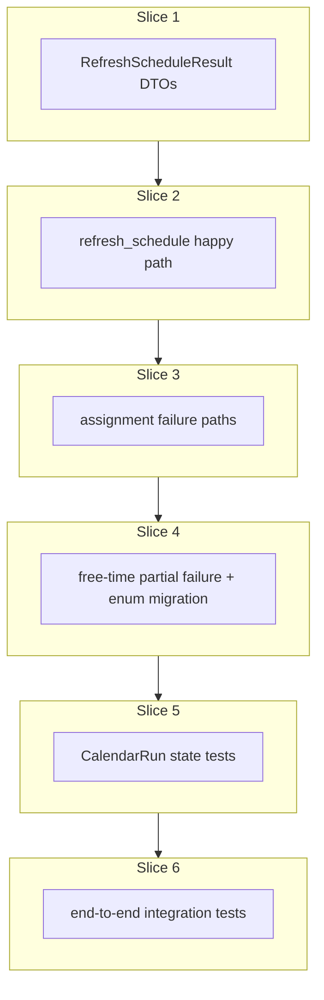

# Plan: Orchestration refresh schedule

**Finalized plan location:** [`docs/plans/orchestration_refresh_schedule.md`](orchestration_refresh_schedule.md)

## Context

Implement Prompt 16 from [docs/cursor_implementation_guide.md](../cursor_implementation_guide.md): **`OrchestrationService.refresh_schedule`** per engineering design orchestration semantics (§7 service composition, §8.2 DTOs, §10 persistence), guide §0.1 (repetition refresh before resolution; template → `LINKED` clone propagation), and [repo convention §5](../../.cursor/repo_conventions.md) (orchestration owns composed workflows; delegates persistence to services).

**Behavior summary:**
- **`OrchestrationService.refresh_schedule(run_started_at)`** — manually invoked V1 workflow composing:
  1. `TaskResolutionService.resolve_tasks` (horizon + repetition refresh + invariant validation + tree resolution)
  2. `TaskAssignmentService.assign_tasks`
  3. `FreeTimeAssignmentService.assign_free_time`
- **Happy path:** All stages succeed; task SUCCESS run becomes active; future FREE_TIME replaced; `ActiveCalendarState` failure flags cleared.
- **Resolution / early guard failure:** `fail()` with **no** calendar/run/state mutations (delegate to child `ServiceResult` errors).
- **Assignment precondition failure** (`invalid_incomplete`, `run_started_at` mismatch, heuristic disabled): orchestration persists `ASSIGNMENT_PRECONDITION_FAILED` on `ActiveCalendarState` **without** changing active TASK calendar (reserved in [`task_assignment_service.md`](task_assignment_service.md)).
- **Solver assignment failure:** Delegate to `assign_tasks` failure branch (FAILED `CalendarRun`, `last_refresh_failed`, calendar unchanged); **do not** run free-time assignment.
- **Partial failure (task success, free-time fail):** **Preserve task assignment semantics** — keep SUCCESS task calendar and `active_calendar_run_id`; **delete future FREE_TIME only** (`start_time >= run_started_at`); set `last_refresh_failed=True` with `LastFailureReason.FREE_TIME_ASSIGNMENT_FAILED`; **no** new `CalendarRun`. Rationale: stale FREE_TIME after refresh may be invalid; do not leave it.
- **Standalone `FreeTimeAssignmentService.assign_free_time`:** Unchanged Prompt 15 contract — guard/algorithm `fail()` performs **zero** mutations when called outside orchestration.

**Already done (dependencies):**
- [`TaskResolutionService`](../../calendar_backend/services/task_resolution.py) — horizon + `RepetitionService.refresh_all_repetitions` + invariant + `ResolveTasksResult` (Prompt 11)
- [`TaskAssignmentService`](../../calendar_backend/services/task_assignment.py) — SUCCESS/FAILED persistence, `fail(..., _value=AssignmentResult)` on solver failure (Prompt 14)
- [`FreeTimeAssignmentService`](../../calendar_backend/services/free_time_assignment.py) — success-only FREE_TIME persistence; `# TODO(Prompt 16)` stub (Prompt 15)
- Domain: [`ResolveTasksResult`](../../calendar_backend/domain/resolution.py), [`AssignmentResult`](../../calendar_backend/domain/assignment.py), [`FreeTimeAssignmentResult`](../../calendar_backend/domain/free_time.py)
- ORM: [`CalendarRun`](../../calendar_backend/models/runs.py), [`ActiveCalendarState`](../../calendar_backend/models/runs.py), [`CalendarEntry`](../../calendar_backend/models/calendar.py)
- [`LastFailureReason`](../../calendar_backend/domain/enums.py): `ASSIGNMENT_FAILED`, `ASSIGNMENT_PRECONDITION_FAILED` (DB CHECK in migration `7369a1e5acb0`)

**Locked clarifications (request-questions):**
- **Partial free-time failure:** Clear **future** FREE_TIME only; past FREE_TIME preserved; task SUCCESS calendar unchanged; `active_calendar_run_id` unchanged; `FREE_TIME_ASSIGNMENT_FAILED` on `ActiveCalendarState` (new enum + Alembic).
- **Orchestration owns partial-failure writes:** Clearing future FREE_TIME + failure flags lives in orchestration (not in standalone `FreeTimeAssignmentService` fail path).
- **`ServiceResult` failure-value pattern:** Return `fail(..., _value=RefreshScheduleResult(...))` when a stage produced a partial payload (mirror assignment solver failure).
- **No automatic refresh** after edits/completions in V1.

Build workflow: use `/build-plan-slice` per slice against this file; stop after each slice for approval.



## Non-goals

- Production HTTP API or [`tools/dev_cli.py`](../../tools/dev_cli.py) `refresh_schedule` command — Prompt 18 / later.
- Automatic orchestration after plan edits, task completion, or settings changes.
- `ConflictDeletionSuggestionService` invocation inside `refresh_schedule` — callers use `AssignmentResult.conflicts` separately.
- OR-Tools / exact solver / component decomposition — Prompt 17.
- Re-implementing resolution, task assignment, or free-time assignment logic inside orchestration.
- Rolling back successful task assignment when free-time fails (task calendar preserved).
- Creating a new `CalendarRun` on free-time-only failure.
- Sub-minute scheduling.
- Persisting full resolution snapshots on `CalendarRun`.

## Locked assumptions

- **Package:** [`calendar_backend/orchestration/`](../../calendar_backend/orchestration/) — new package per guide layout; [`orchestration/__init__.py`](../../calendar_backend/orchestration/__init__.py) docstring-only (no barrel exports per [package re-export policy](../../.cursor/rules/25-package-re-exports.mdc)).
- **Service API:** `OrchestrationService(session, clock=None).refresh_schedule(run_started_at: datetime) -> ServiceResult[RefreshScheduleResult]`.
- **Domain DTOs:** frozen dataclasses in [`calendar_backend/domain/orchestration.py`](../../calendar_backend/domain/orchestration.py) (new); re-export from [`domain/__init__.py`](../../calendar_backend/domain/__init__.py) per small-package policy.
- **Pipeline order:** resolve → assign_tasks → assign_free_time; stop on first hard failure per stage rules below.
- **Stage stop rules:**

| Stage outcome | Next stage | Calendar / state |
|---------------|------------|------------------|
| `resolve_tasks` fail | Stop | No orchestration writes |
| `assign_tasks` guard fail | Stop | Orchestration writes precondition failure metadata (slice 3) |
| `assign_tasks` solver fail | Stop | `assign_tasks` already persisted FAILED run + flags; no free-time |
| `assign_tasks` success | Run free-time | Task calendar + active run updated |
| `assign_free_time` success | Done | Future FREE_TIME replaced; failure flags cleared |
| `assign_free_time` fail after task success | Done (partial) | Orchestration clears future FREE_TIME + sets `FREE_TIME_ASSIGNMENT_FAILED` |

- **DTO shape:**

| Type | Fields |
|------|--------|
| `RefreshScheduleResult` | `run_started_at`, `resolved: ResolveTasksResult \| None`, `assignment: AssignmentResult \| None`, `free_time: FreeTimeAssignmentResult \| None` |

- Populate fields for stages that completed; `None` for stages not reached or not applicable.
- **Transactions:** Orchestration coordinates service calls; each service keeps its own `transaction(session)` boundaries. Orchestration partial-failure persistence (slice 4) uses one `transaction(session)` for delete future FREE_TIME + `ActiveCalendarState` update.
- **Remove Prompt 16 TODOs** in [`free_time_assignment.py`](../../calendar_backend/services/free_time_assignment.py) once slice 4 lands (replace with docstring reference to orchestration).
- **Slice checks:** slices 1–4 → ruff format, ruff check, pyright; slices 5–6 add pytest + **Test catalog** posted in chat.
- **Test DB:** reuse [`tests/services/conftest.py`](../../tests/services/conftest.py).

## Slices

### Slice 1: Orchestration DTOs and result types

**Objective:** Add session-free `RefreshScheduleResult` and module scaffold for orchestration; no `refresh_schedule` implementation yet.

**Files expected to change:**
- [`calendar_backend/domain/orchestration.py`](../../calendar_backend/domain/orchestration.py) (new) — `RefreshScheduleResult` frozen dataclass
- [`calendar_backend/domain/__init__.py`](../../calendar_backend/domain/__init__.py) — re-export `RefreshScheduleResult`
- [`calendar_backend/orchestration/__init__.py`](../../calendar_backend/orchestration/__init__.py) (new) — package docstring
- [`calendar_backend/orchestration/refresh_schedule.py`](../../calendar_backend/orchestration/refresh_schedule.py) (new) — `OrchestrationService` stub with `refresh_schedule` raising `NotImplementedError` or returning placeholder `fail()` (compile-only until slice 2)

**May also change:**
- [`calendar_backend/domain/errors.py`](../../calendar_backend/domain/errors.py) — only if a dedicated orchestration `MessageCode` is needed (prefer reusing child service codes in `errors` tuple)

**Implementation steps:**
1. Add `RefreshScheduleResult` with fields from locked DTO table; import `ResolveTasksResult`, `AssignmentResult`, `FreeTimeAssignmentResult` via submodule paths (avoid circular imports).
2. Re-export from `domain/__init__.py`.
3. Create `orchestration` package and `OrchestrationService` class skeleton mirroring sibling service constructors (`session`, optional `clock`).

**Tests/checks:**
```bash
uv run ruff format .
uv run ruff check .
uv run pyright
```

**Acceptance criteria:**
- DTOs compile; pyright passes.
- No persistence behavior yet.

**Risks/edge cases:**
- Keep `RefreshScheduleResult` minimal — do not duplicate child DTO fields.

---

### Slice 2: `refresh_schedule` happy path

**Objective:** Implement full successful pipeline: resolve → assign → assign free time; return `ok(RefreshScheduleResult(...))`.

**Files expected to change:**
- [`calendar_backend/orchestration/refresh_schedule.py`](../../calendar_backend/orchestration/refresh_schedule.py) — `OrchestrationService.refresh_schedule`

**May also change:**
- None expected

**Implementation steps:**
1. `validate_run_started_at(run_started_at)` at orchestration entry (or rely on resolution — document single validation path).
2. Call `TaskResolutionService.resolve_tasks`; on failure return `fail(*errors)` with `resolved=None` in value if using partial result pattern, or without value for early exit.
3. On resolution success, call `TaskAssignmentService.assign_tasks(resolved, run_started_at)`; on failure return child result (slice 3 expands behavior).
4. On assignment success, call `FreeTimeAssignmentService.assign_free_time(run_started_at)`; on failure defer partial handling to slice 4 (slice 2 may assume free-time always succeeds or stub fail path as unreachable).
5. Return `ok(RefreshScheduleResult(run_started_at=..., resolved=..., assignment=..., free_time=...))`.
6. Service docstring: manual invocation only; not called from other services automatically.

**Tests/checks:**
```bash
uv run ruff format .
uv run ruff check .
uv run pyright
```

**Acceptance criteria:**
- Happy-path code path compiles and wires all three services.
- Successful assignment clears failure flags (via `assign_tasks`); successful free-time attaches to active run.

**Risks/edge cases:**
- Slice 2 integration tests deferred to slice 6; manual smoke via existing service tests patterns until then.
- Empty `valid_incomplete` still runs free-time (clears/replaces future FREE_TIME).

---

### Slice 3: Assignment failure paths

**Objective:** Orchestration behavior when assignment blocked or solver fails; no free-time stage.

**Files expected to change:**
- [`calendar_backend/orchestration/refresh_schedule.py`](../../calendar_backend/orchestration/refresh_schedule.py) — guard-fail and solver-fail branches

**May also change:**
- [`calendar_backend/services/calendar_state.py`](../../calendar_backend/services/calendar_state.py) — shared `load_or_create_active_calendar_state` for precondition persistence (used by orchestration and task assignment)

**Implementation steps:**
1. **Guard failures** (`assign_tasks` returns `fail` without `_value`): detect assignment precondition errors (`INVALID_INCOMPLETE_TASKS_BLOCK_ASSIGNMENT`, `RUN_STARTED_AT_MISMATCH`, heuristic disabled, etc.).
2. Persist orchestration precondition failure in one transaction: upsert `ActiveCalendarState` with `last_refresh_failed=True`, `last_failure_at=now`, `last_failure_reason=ASSIGNMENT_PRECONDITION_FAILED`; **do not** change `active_calendar_run_id` or `calendar_entry` rows.
3. Return `fail(..., _value=RefreshScheduleResult(resolved=..., assignment=None, free_time=None))`.
4. **Solver failures** (`assign_tasks` returns `fail` with `_value=AssignmentResult`): pass through errors; populate `RefreshScheduleResult.assignment` from `result.value`; do not call free-time.
5. Resolution failures unchanged: `fail()` only, no orchestration state writes.

**Tests/checks:**
```bash
uv run ruff format .
uv run ruff check .
uv run pyright
```

**Acceptance criteria:**
- Precondition failure sets `ASSIGNMENT_PRECONDITION_FAILED` without calendar mutation.
- Solver failure delegates to existing `assign_tasks` persistence; orchestration does not call free-time.

**Risks/edge cases:**
- Distinguish guard `fail()` (no `value`) from solver `fail(..., _value=...)` reliably.
- Concurrent refresh not supported (single-writer V1).

---

### Slice 4: Free-time failure and partial orchestration behavior

**Objective:** When task assignment succeeds but free-time assignment fails: clear future FREE_TIME, set `FREE_TIME_ASSIGNMENT_FAILED`, preserve task calendar; add enum + migration.

**Files expected to change:**
- [`calendar_backend/domain/enums.py`](../../calendar_backend/domain/enums.py) — `LastFailureReason.FREE_TIME_ASSIGNMENT_FAILED`
- [`calendar_backend/domain/__init__.py`](../../calendar_backend/domain/__init__.py) — re-export if needed
- [`calendar_backend/orchestration/refresh_schedule.py`](../../calendar_backend/orchestration/refresh_schedule.py) — `_persist_partial_free_time_failure(...)` helper
- [`calendar_backend/services/free_time_assignment.py`](../../calendar_backend/services/free_time_assignment.py) — remove/replace `# TODO(Prompt 16)` with orchestration doc reference

**May also change:**
- [`calendar_backend/db/migrations/versions/`](../../calendar_backend/db/migrations/versions/) — new revision extending `last_failure_reason` CHECK (see migration workflow below)
- [`tests/models/test_core_orm_part2_schema.py`](../../tests/models/test_core_orm_part2_schema.py) — add `FREE_TIME_ASSIGNMENT_FAILED` to enum test map (mark `failure_expected` until migration applied if building tests before continue)

**Migration workflow (slice 4 — use db-revision commands, not `/build-plan-slice` for migration file):**
1. `/db-revision-preview` — Message: `add free time assignment failure reason`
2. Manual edit: extend `active_calendar_state.last_failure_reason` CHECK to include `FREE_TIME_ASSIGNMENT_FAILED` (SQLite batch mode if needed per [repo convention §4](../../.cursor/repo_conventions.md))
3. `/db-revision-continue` after migration approved

**Implementation steps (orchestration code — `/build-plan-slice` or `/small-change` after migration):**
1. On `assign_free_time` failure after successful assignment: open `transaction(session)`.
2. `delete(CalendarEntry).where(entry_type == FREE_TIME, start_time >= run_started_at)` — mirror free-time success delete predicate from [`free_time_assignment.py`](../../calendar_backend/services/free_time_assignment.py).
3. Upsert `ActiveCalendarState`: `last_refresh_failed=True`, `last_failure_at=now`, `last_failure_reason=FREE_TIME_ASSIGNMENT_FAILED`, `updated_at=now`; **do not** change `active_calendar_run_id`.
4. Return `fail(*free_time_errors, _value=RefreshScheduleResult(resolved=..., assignment=..., free_time=None))`.
5. On full success (slice 2 path): ensure `last_refresh_failed=False` (already cleared by successful `assign_tasks`).

**Tests/checks:**
```bash
uv run ruff format .
uv run ruff check .
uv run pyright
```

**Acceptance criteria:**
- Partial failure removes future FREE_TIME rows only.
- Task entries and `active_calendar_run_id` unchanged after partial failure.
- Standalone `assign_free_time` failure still performs zero mutations.
- Migration applied; enum test updated.

**Risks/edge cases:**
- Free-time guard failure after task success should be rare; treat same as algorithm failure (clear future FREE_TIME + failure flag).
- Do not create FAILED `CalendarRun` for free-time-only failure.

---

### Slice 5: CalendarRun and ActiveCalendarState tests (post Test catalog in chat)

**Objective:** Integration tests for orchestration persistence effects on `CalendarRun` and `ActiveCalendarState` across success, assignment failure, precondition failure, and partial free-time failure.

**Files expected to change:**
- [`tests/orchestration/test_refresh_schedule_state.py`](../../tests/orchestration/test_refresh_schedule_state.py) (new)
- [`tests/orchestration/conftest.py`](../../tests/orchestration/conftest.py) (new) — optional shared fixtures

**May also change:**
- [`tests/services/conftest.py`](../../tests/services/conftest.py) — shared DB fixtures if duplication is substantial

**Implementation steps:**
1. Wait for user **Test catalog** in chat (minimums: full success clears `last_refresh_failed`; solver failure leaves `active_calendar_run_id` unchanged; precondition failure sets `ASSIGNMENT_PRECONDITION_FAILED` without calendar change; partial free-time failure sets `FREE_TIME_ASSIGNMENT_FAILED`, clears future FREE_TIME, preserves task rows and active run).
2. Post catalog cases first, then extend to all orchestration state behavior from slices 1–4.

**Tests/checks:**
```bash
uv run ruff format .
uv run ruff check .
uv run pyright
uv run pytest -m "not slow and not failure_expected"
```

**Acceptance criteria:**
- All new tests pass.
- Test catalog cases covered.

**Risks/edge cases:**
- Seed data via existing master/task/activity services; mirror [`test_task_assignment_service.py`](../../tests/services/test_task_assignment_service.py) bootstrap patterns.

---

### Slice 6: End-to-end integration tests (post Test catalog in chat)

**Objective:** Full `refresh_schedule` integration tests across resolution + assignment + free-time, including repetition refresh side effects and template/LINKED clone scenarios per §0.1.

**Files expected to change:**
- [`tests/orchestration/test_refresh_schedule_integration.py`](../../tests/orchestration/test_refresh_schedule_integration.py) (new)

**May also change:**
- [`tests/orchestration/conftest.py`](../../tests/orchestration/conftest.py)

**Implementation steps:**
1. Wait for user **Test catalog** in chat (minimums: happy path produces TASK + FREE_TIME entries; invalid incomplete blocks before assignment; infeasible task set triggers conflict payload; partial free-time failure leaves TASK only in future window; repetition refresh before resolve affects resolved tasks).
2. Post catalog cases first, then extend to full pipeline behavior.

**Tests/checks:**
```bash
uv run ruff format .
uv run ruff check .
uv run pyright
uv run pytest -m "not slow and not failure_expected"
```

**Acceptance criteria:**
- End-to-end scenarios pass.
- Existing suite still passes.

**Risks/edge cases:**
- Tests may be `@pytest.mark.integration` and `@pytest.mark.slow` if full horizon spans are needed — document in Test catalog.

---

## Abstraction check

| Introduced item | Needed now? | Justification |
|-----------------|-------------|---------------|
| `OrchestrationService` | Yes | Prompt 16 deliverable; single composed workflow entry point |
| `RefreshScheduleResult` | Yes | Aggregate return type across three stages |
| `domain/orchestration.py` | Yes | Session-free result DTO per layer boundaries |
| `_persist_partial_free_time_failure` (private) | Yes | Orchestration-specific partial-failure transaction distinct from standalone free-time service |
| `_persist_assignment_precondition_failure` (private) | Yes | Prompt 16 owns `ASSIGNMENT_PRECONDITION_FAILED` writes reserved from Prompt 14 |
| Workflow registry / strategy / executor classes | No | Linear three-step pipeline suffices |

## Dependency changes

None.

## Open questions

None — blocking questions resolved in request-questions (partial failure clears future FREE_TIME; `FREE_TIME_ASSIGNMENT_FAILED` enum + migration).
