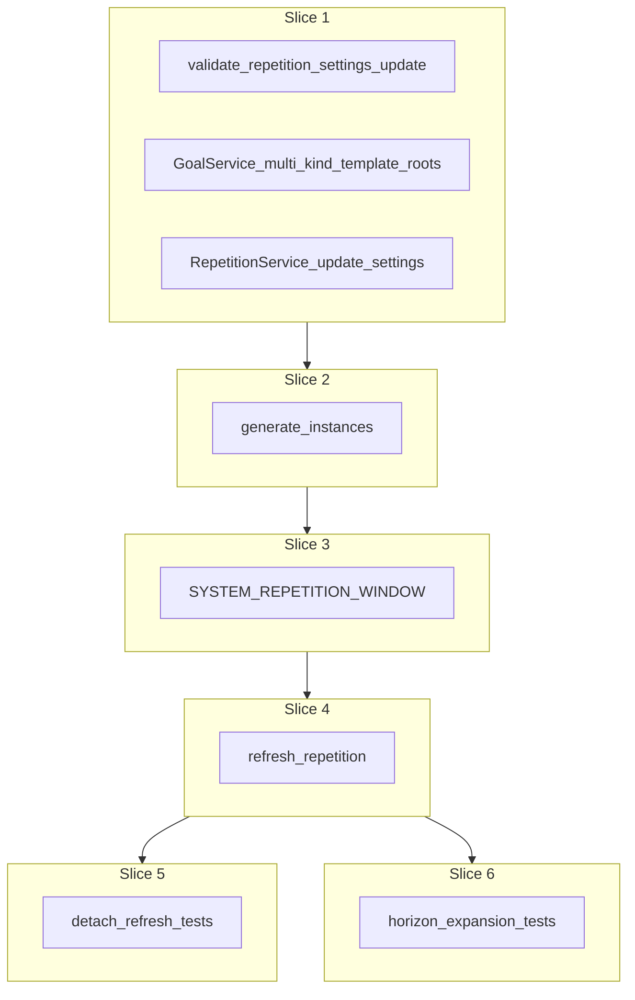

# Plan: Repetition service

**Finalized plan location:** [`docs/plans/repetition_service.md`](repetition_service.md)

## Context

Implement Prompt 10 from [docs/cursor_implementation_guide.md](../cursor_implementation_guide.md): **`RepetitionService`** for repetition settings locks, generation, refresh, and materialized `SYSTEM_REPETITION_WINDOW` constraints per engineering design and [repo convention §14](../../.cursor/repo_conventions.md). **Template semantics** follow guide §0.1 (supersedes PDF where they differ).

**Template ownership:** Creating a repetition **always** creates its template root in the same operation (`template_type` + `template_payload` on the create call). **Template authoring is not a public `RepetitionService` concern** — it stays on [`GoalService.create_child`](../../calendar_backend/services/goal.py). **Template editing** uses existing subtype/tree services (`TaskService`, `PlanTreeService.rename`, etc.). `RepetitionService` does not wrap or duplicate template edits.

### Template semantics (locked)

**Structure (already implemented; unchanged):**
- **Repetition shell** — `plan_kind=REPETITION`, `clone_status=NOT_CLONED`, in the **master** goal child chain; owns `RepetitionPlan`, instances, and generation settings.
- **Template root** — separate plan referenced by `template_root_id`; `clone_status=TEMPLATE`; direct child of the repetition shell via `parent_id`; **not** in any goal child chain.
- **Instance clones** (slice 2+) — `clone_status=LINKED`; `parent_id=repetition_plan_id`; `cloned_from_id` lineage back to template nodes.

**Otherwise normal plans:**
- Template-subtree nodes use the same services as master-tree plans: `GoalService.create_child` / `move_plan`, `TaskService`, `PlanTreeService.rename`, USER constraints, etc.
- Children under a **template goal** use normal `_attach_to_goal_chain` on that template goal; `is_critical` applies for clone-relative priority (not master-chain placement).
- Only repetition-create wiring is special: shell → master chain; template root → `attach_under_parent` under shell (no chain row on the root).

**`clone_status` policy:**
- **`TEMPLATE` on template root only**; template descendants **`NOT_CLONED`**.
- Refresh propagates by `cloned_from_id`; descendants need not be `TEMPLATE` for propagation or detachment semantics.

**Deletion (carry-over to Prompt 12 / [`domain/deletion.py`](../../calendar_backend/domain/deletion.py)):**
- Templates follow ordinary deletion rules: descendant cascade, whole-chain expansion, critical-chain parent inclusion.
- **Additional rule (supersedes PDF):** when the delete set includes a plan that is a `RepetitionPlan.template_root_id`, also include that **repetition shell** (then ordinary descendant expansion removes instance clones and related rows). Fires for template-root delete only (including when the root is removed indirectly, e.g. critical-chain upward delete).

**Scheduling:** template subtree unscheduled; `SYSTEM_REPETITION_WINDOW` on instance root clones only (slice 3).

**Already done (Prompt 8):** `GoalService.create_child(REPETITION, …)` persists repetition shell + goal `TEMPLATE` root stub; `generated_at=null`; zero instances; no system windows.

**Already done (Prompt 9):** [`detach_linked_self_and_descendants`](../../calendar_backend/services/plan_tree.py) — refresh must skip `DETACHED` subtrees.

**Deferred carry-over (address in this plan):**
- [`calendar_backend/domain/invariant_validation.py`](../../calendar_backend/domain/invariant_validation.py): relax pre-generation-only repetition check when `generated_at`/instances exist; relax `plan_kind == GOAL` for non-goal template roots (`# TODO(Prompt 10 / RepetitionService)`).
- [`calendar_backend/domain/repetitions.py`](../../calendar_backend/domain/repetitions.py): replace `_validate_repetition_template` with `validate_create_payload` for all template kinds (`# TODO(Prompt 10 / RepetitionService slice 1)`).
- [`calendar_backend/domain/deletion.py`](../../calendar_backend/domain/deletion.py): template-root delete includes owning repetition shell (`# TODO(Prompt 12)` or earlier if touched).

**Locked clarifications (request-questions):**
- **Repetition create:** Every repetition create specifies `template_type` + `template_payload`; the creating path builds shell + template root together. Slice 1 updates `GoalService.create_child(REPETITION, …)` for **goal / task / repetition** template roots (not goal-only).
- **Template subtree children:** `GoalService.create_child(parent_id, …)` when `parent_id` is a template goal (or other valid goal parent in the subtree) — **normal goal chaining**, not master-chain placement. Nested `REPETITION` under a template goal uses `create_child(REPETITION, …)` with nested `RepetitionCreatePayload`.
- **Non-goal templates:** `GOAL`, `TASK`, and `REPETITION` via `validate_create_payload` in slice 1.
- **RepetitionService public API:** `update_settings`, `generate_instances`, `refresh_repetition`, `refresh_all_repetitions` only — **no** public template-child method.
- **Private helpers:** Module-private persistence helpers in `goal.py` (e.g. shared repetition+template root wiring) are allowed; not exported from `RepetitionService`.
- **Instance timing:** `instance_start_time = start_time + instance_index * repeat_interval_minutes`.
- **Post-generation locks:** `repeat_mode`, `start_time`, `repeat_interval_minutes` immutable after `generated_at`; `manual_count` increase only ([`REPETITION_COUNT_DECREASE_AFTER_GENERATION`](../../calendar_backend/domain/errors.py)).
- **`DATE_RANGE` `end_time` after generation:** may **extend only** (later timestamp); cannot shorten, clear, or switch modes.
- **`DATE_RANGE` open end:** `end_time is null` → effective end = master horizon end; expands on refresh.
- **Refresh propagation:** template → `LINKED` clones by `cloned_from_id`; skip `DETACHED` subtrees.

Build workflow: use `/build-plan-slice` per slice against this file; stop after each slice for approval.



## Non-goals

- Public template authoring or editing on `RepetitionService`.
- `TaskResolutionService` / `refresh_schedule` orchestration (Prompts 11, 16).
- Production HTTP API, dev CLI, Alembic revisions (no schema changes expected).
- OR-Tools / assignment / calendar entry writes.
- Re-linking `DETACHED` clones.
- Auto-removal of obsolete `LINKED` clone nodes when template children are deleted (defer; document in slice 4 if discovered).

## Locked assumptions

- **Service module:** [`calendar_backend/services/repetition.py`](../../calendar_backend/services/repetition.py) with `RepetitionService(session, clock=None)`.
- **Public API:**
  - `update_settings(repetition_plan_id, …) -> ServiceResult[RepetitionPlanDTO]`
  - `generate_instances(repetition_plan_id, run_started_at) -> ServiceResult[RepetitionPlanDTO]`
  - `refresh_repetition(repetition_plan_id, run_started_at) -> ServiceResult[RepetitionPlanDTO]`
  - `refresh_all_repetitions(run_started_at) -> ServiceResult[None]`
- **Template create/edit:** [`GoalService.create_child`](../../calendar_backend/services/goal.py) only; edits via `TaskService` / `PlanTreeService` / etc. No separate template-subtree `create_child` branch — template goals use normal chaining.
- **Horizon dependency:** `DATE_RANGE` effective end from [`MasterHorizonService`](../../calendar_backend/services/master_horizon.py).
- **Clone creation (slice 2+):** deep-clone template subtree; instance root `parent_id=repetition_plan_id`, `cloned_from_id=template_root_id`, `clone_status=LINKED`; template descendants in clone graph `LINKED` with matching `cloned_from_id`.
- **`clone_status`:** `TEMPLATE` on template root only; template descendants `NOT_CLONED`.
- **Constraints:** `SYSTEM_REPETITION_WINDOW` on instance root clones only (slice 3).
- **Validation:** session-free helpers in [`domain/repetitions.py`](../../calendar_backend/domain/repetitions.py); mutations in `transaction()`.
- **Test DB:** [`tests/services/conftest.py`](../../tests/services/conftest.py).
- **Slice checks:** slices 1–4 → ruff, pyright; slices 5–6 add pytest + **Test catalog**.

## Slices

### Slice 1: Settings validation, lock rules, and GoalService template roots

**Objective:** Enable all template kinds at create time, post-generation setting locks, multi-kind template roots on `create_child(REPETITION, …)`, and `RepetitionService.update_settings` only; invariant carry-over.

**Files expected to change:**
- [`calendar_backend/domain/repetitions.py`](../../calendar_backend/domain/repetitions.py) — `validate_create_payload` for templates; `validate_repetition_settings_update`; remove `_validate_repetition_template`
- [`calendar_backend/services/goal.py`](../../calendar_backend/services/goal.py) — multi-kind template root on `create_child(REPETITION, …)`; private `_persist_repetition_with_template` (or similar) as needed
- [`calendar_backend/services/repetition.py`](../../calendar_backend/services/repetition.py) (new) — `RepetitionService`, `update_settings` only
- [`calendar_backend/domain/invariant_validation.py`](../../calendar_backend/domain/invariant_validation.py) — relax template `plan_kind == GOAL`; adjust pre-generation-only repetition check
- [`tests/domain/test_repetitions.py`](../../tests/domain/test_repetitions.py) — non-goal template + lock-rule validation
- [`tests/services/test_goal_service.py`](../../tests/services/test_goal_service.py) — template-root kinds; template-goal child uses goal chain

**May also change:**
- [`calendar_backend/services/plan_tree.py`](../../calendar_backend/services/plan_tree.py) — optional `clone_status` on `make_task` for task template roots
- [`calendar_backend/domain/errors.py`](../../calendar_backend/domain/errors.py) — only if new codes needed beyond `REPETITION_COUNT_DECREASE_AFTER_GENERATION`
- [`tests/domain/test_invariant_validation.py`](../../tests/domain/test_invariant_validation.py) — post-generation / non-goal template graphs

**Implementation steps:**
1. Replace `_validate_repetition_template` with `validate_create_payload(template_type, template_payload)` in `validate_repetition_create`.
2. Add `validate_repetition_settings_update(...)`: before generation — full create rules; after generation — lock `repeat_mode`, `start_time`, `repeat_interval_minutes`; allow `manual_count` increase only; `DATE_RANGE` `end_time` extend-only.
3. Refactor `GoalService.create_child(REPETITION, …)`: build template root from `template_type` (`make_goal` / `make_task` / nested `make_repetition` + template wiring); set `template_root_id`; shell in master chain; template root `attach_under_parent` under shell only.
4. Template-subtree children: use existing `create_child` when parent is a template goal — normal `_attach_to_goal_chain` on that goal (no special branch).
5. Implement `RepetitionService.update_settings` only (no generation, no template APIs).
6. Update repetition/template invariants per carry-over TODOs.

**Tests/checks:**
```bash
uv run ruff format .
uv run ruff check .
uv run pyright
uv run pytest tests/domain/test_repetitions.py tests/domain/test_invariant_validation.py tests/services/test_goal_service.py -m "not slow and not failure_expected"
```

**Acceptance criteria:**
- `create_child(REPETITION, …)` creates shell + matching template root for goal/task/repetition template types.
- `create_child` under a template goal creates a goal-chain item on that template goal (`is_critical` honored).
- `update_settings` rejects locked fields, `manual_count` decrease, and `DATE_RANGE` `end_time` shorten/clear after generation.
- No public template method on `RepetitionService`.
- Invariant module accepts valid post-generation graphs in tests.

**Risks/edge cases:**
- Nested `REPETITION` template: create path in slice 1; generation in slice 2.
- Task template root needs `clone_status=TEMPLATE` on `make_task` if not added to `plan_tree.py`.

---

### Slice 2: Initial instance generation

**Objective:** First-time instance materialization: `generated_at`, `RepetitionInstance` rows, and `LINKED` clone subtrees cloned from template.

**Files expected to change:**
- [`calendar_backend/services/repetition.py`](../../calendar_backend/services/repetition.py) — `generate_instances`
- [`tests/services/test_repetition_service.py`](../../tests/services/test_repetition_service.py) (new) — generation happy path + guard tests (partial; full catalog slice 5)

**May also change:**
- [`calendar_backend/services/plan_tree.py`](../../calendar_backend/services/plan_tree.py) — only if a package-private clone helper is needed (prefer module-private functions in `repetition.py` first)

**Implementation steps:**
1. `generate_instances`: reject if `generated_at` already set.
2. Compute instance indices: `MANUAL_COUNT` → `0..manual_count-1`; `DATE_RANGE` → while `start_time + n*interval < effective_end`.
3. Per index: `RepetitionInstance` row + deep-clone template → `LINKED` root and descendants with matching `cloned_from_id`.
4. Set `generated_at`; dense `sort_order` per `(is_critical)` bucket.
5. No `SYSTEM_REPETITION_WINDOW` yet (slice 3).

**Tests/checks:**
```bash
uv run ruff format .
uv run ruff check .
uv run pyright
uv run pytest tests/services/test_repetition_service.py -m "not slow and not failure_expected"
```

**Acceptance criteria:**
- Correct instance counts; clone linkage; double generation rejected.
- Template root stays `TEMPLATE`; clones `LINKED`.

**Risks/edge cases:**
- Deep/wide template trees: BFS clone.
- Nested repetition template generation: shallow test or defer with slice report.

---

### Slice 3: Shifted constraint materialization

**Objective:** Materialize `SYSTEM_REPETITION_WINDOW` on each instance root clone, shifted by `instance_start_time`.

**Files expected to change:**
- [`calendar_backend/services/repetition.py`](../../calendar_backend/services/repetition.py) — window upsert; wire into `generate_instances`
- [`tests/services/test_repetition_service.py`](../../tests/services/test_repetition_service.py) — window assertions

**May also change:**
- [`calendar_backend/domain/invariant_validation.py`](../../calendar_backend/domain/invariant_validation.py) — window ideal-shape if needed

**Implementation steps:**
1. Upsert one `SYSTEM_REPETITION_WINDOW` group + window per instance root (mirror [`MasterHorizonService`](../../calendar_backend/services/master_horizon.py) style).
2. Window: `[instance_start_time, instance_start_time + repeat_interval_minutes)`.
3. No windows on template or non-root clone nodes.
4. Hook for slice 4 new instances.

**Tests/checks:**
```bash
uv run ruff format .
uv run ruff check .
uv run pyright
uv run pytest tests/services/test_repetition_service.py -m "not slow and not failure_expected"
```

**Acceptance criteria:**
- Each instance root has correct shifted window; template has none.

**Risks/edge cases:**
- Idempotent upsert on refresh; SQLite timezone consistency.

---

### Slice 4: Refresh without overwriting detached clones

**Objective:** Post-generation refresh: propagate template → `LINKED`, add instances for `manual_count`/horizon growth, skip `DETACHED`.

**Files expected to change:**
- [`calendar_backend/services/repetition.py`](../../calendar_backend/services/repetition.py) — `refresh_repetition`, `refresh_all_repetitions`
- [`tests/services/test_repetition_service.py`](../../tests/services/test_repetition_service.py) — refresh tests (catalog slice 5)

**Implementation steps:**
1. `refresh_repetition`: require `generated_at`; load template + instances.
2. Propagate template fields to `LINKED` clones by `cloned_from_id`; skip `DETACHED` subtrees.
3. Add instances for increased `manual_count` or expanded horizon (`DATE_RANGE`).
4. Materialize missing `LINKED` clone nodes for new template children (added via `GoalService.create_child` under template goals); skip `DETACHED` parents.
5. `refresh_all_repetitions` for Prompt 11.
6. Re-run window materialization for new instance roots.

**Tests/checks:**
```bash
uv run ruff format .
uv run ruff check .
uv run pyright
```

**Acceptance criteria:**
- `LINKED` clones update; `DETACHED` unchanged; new instances on count/horizon growth.

**Risks/edge cases:**
- Template-root deletion removes shell (Prompt 12); detach-before-refresh interaction.

---

### Slice 5: Detachment behavior tests

**Objective:** Integration tests for refresh vs detachment; post **Test catalog** in chat.

**Files expected to change:**
- [`tests/services/test_repetition_service.py`](../../tests/services/test_repetition_service.py)
- [`tests/services/test_task_service.py`](../../tests/services/test_task_service.py) — optional cross-link

**Implementation steps:**
1. Template with task child; generate; detach via `TaskService`; refresh skips detached subtree.
2. Sibling instance stays `LINKED` and receives updates.
3. New template child via `GoalService.create_child` under template goal → refresh materializes on `LINKED` instances only.
4. Post **Test catalog**.

**Tests/checks:**
```bash
uv run ruff format .
uv run ruff check .
uv run pyright
uv run pytest -m "not slow and not failure_expected"
```

**Acceptance criteria:**
- All new tests pass; test catalog in chat.

**Risks/edge cases:**
- Prefer service API paths over manual seeding.

---

### Slice 6: Horizon expansion tests

**Objective:** `DATE_RANGE` null `end_time` expands instances when horizon grows; post **Test catalog** in chat.

**Files expected to change:**
- [`tests/services/test_repetition_service.py`](../../tests/services/test_repetition_service.py)
- [`tests/services/test_master_horizon_service.py`](../../tests/services/test_master_horizon_service.py) — touch only if needed

**Implementation steps:**
1. `DATE_RANGE`, `end_time=null`; generate at H1; expand horizon to H2; refresh adds instances.
2. Assert stable existing indices; new windows on new roots.
3. Post **Test catalog**.

**Tests/checks:**
```bash
uv run ruff format .
uv run ruff check .
uv run pyright
uv run pytest -m "not slow and not failure_expected"
```

**Acceptance criteria:**
- Monotonic instance growth; no duplicate `instance_index`; test catalog in chat.

**Risks/edge cases:**
- Explicit `refresh_master_horizon` in tests.

---

## Abstraction check

| Introduced item | Needed now? | Justification |
|-----------------|-------------|---------------|
| `RepetitionService` | Yes | Settings, generation, refresh; §14 repetition subtype owner |
| `validate_repetition_settings_update` | Yes | Shared lock rules ([§11](../../.cursor/repo_conventions.md)) |
| Private `_persist_repetition_with_template` in `goal.py` | Maybe | Deduplicate repetition+template root wiring; not public API |
| Private clone/propagate/window helpers in `repetition.py` | Yes | Generate + refresh |
| Separate template-subtree `create_child` branch | **No** | Template goals use normal `GoalService` chaining |
| Public `create_template_child` on `RepetitionService` | **No** | Template create stays on `GoalService` |
| Clone registry / strategy | No | One algorithm in V1 |

## Dependency changes

None expected.

```bash
uv sync   # if fresh clone only
```

## Open questions

None blocking implementation.

**Follow-up (non-blocking):** Confirm `SYSTEM_REPETITION_WINDOW` end bound against engineering design PDF during slice 3.

## Changed in this revision

- Added **Template semantics** section: structure, otherwise-normal plans, goal chains under template goals, `clone_status` (`TEMPLATE` root only), deletion template-root → shell rule (supersedes PDF).
- Removed incorrect “no chain row” / template-subtree `create_child` branch; template-goal children use normal goal chaining.
- Removed non-goal blocking `move_plan` inside template goals.
- Slice 1 rescoped: multi-kind template roots + `update_settings`; `DATE_RANGE` `end_time` extend-only after generation.
- Deletion carry-over noted for [`domain/deletion.py`](../../calendar_backend/domain/deletion.py) / Prompt 12.
- Prior revision bullets (template ownership on `GoalService`, no public `RepetitionService` template API) retained.
