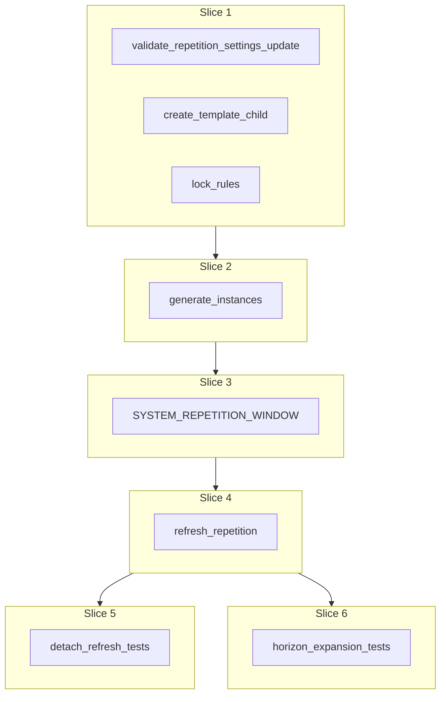

# Plan: Repetition service

**Finalized plan location:** [`docs/plans/repetition_service.md`](repetition_service.md)

## Context

Implement Prompt 10 from [docs/cursor_implementation_guide.md](../cursor_implementation_guide.md): **`RepetitionService`** for repetition generation, refresh, template subtree expansion, and materialized `SYSTEM_REPETITION_WINDOW` constraints per engineering design and [repo convention §14](../../.cursor/repo_conventions.md).

**Already done (Prompt 8):** [`GoalService.create_child`](../../calendar_backend/services/goal.py) with `PlanKind.REPETITION` persists the repetition shell, empty goal `TEMPLATE` root (`template_root_id`), `generated_at=null`, zero `RepetitionInstance` rows, no system repetition windows. Template children are **not** in goal child chains ([`docs/plans/plan_tree_service.md`](plan_tree_service.md)).

**Already done (Prompt 9):** [`detach_linked_self_and_descendants`](../../calendar_backend/services/plan_tree.py) — refresh must skip `DETACHED` subtrees; ordinary deletion still cascades descendants.

**Deferred carry-over (address in this plan):**
- [`calendar_backend/domain/invariant_validation.py`](../../calendar_backend/domain/invariant_validation.py): relax pre-generation-only repetition check when `generated_at`/instances exist; relax `plan_kind == GOAL` for non-goal template roots (`# TODO(Prompt 10 / RepetitionService)`).
- [`calendar_backend/domain/repetitions.py`](../../calendar_backend/domain/repetitions.py): replace `_validate_repetition_template` with `validate_create_payload` for all template kinds (`# TODO(Prompt 10 / RepetitionService slice 1)`).

**Locked clarifications (request-questions):**
- **Template authoring:** `RepetitionService.create_template_child` — analogous to `GoalService.create_child` (validate kind/payload match → `PlanTreeService.make_*` + `attach_under_parent`). **No** goal-chain placement. Ongoing template edits use owning services (`TaskService`, `PlanTreeService.rename`, etc.), not repetition wrappers.
- **Non-goal templates:** `GOAL`, `TASK`, and `REPETITION` template kinds via `validate_create_payload` in slice 1 (nested repetition templates allowed at validation layer; generation/refresh for deep nesting is highest-risk — see slice 2 risks).
- **Template scheduling:** template subtree stays **unscheduled** (no `SYSTEM_REPETITION_WINDOW` on `TEMPLATE` nodes).
- **Instance timing:** `instance_start_time = start_time + instance_index * repeat_interval_minutes`; instance 0 uses shift 0.
- **Post-generation locks:** `repeat_mode`, `start_time`, `repeat_interval_minutes` immutable after `generated_at` set; `manual_count` may **increase** only (reject decrease — [`REPETITION_COUNT_DECREASE_AFTER_GENERATION`](../../calendar_backend/domain/errors.py)); `DATE_RANGE` `end_time` rules per mode CHECKs.
- **`DATE_RANGE` open end:** `end_time is null` → effective end = current master horizon end; re-evaluated on refresh when horizon expands.
- **Instance metadata:** `is_critical` from `default_instance_critical` at generation; `sort_order` dense per `(repetition_plan_id, is_critical)` bucket ([guide §0.1](../cursor_implementation_guide.md)).
- **Refresh propagation:** sync template → `LINKED` clone subtrees by `cloned_from_id` identity; never overwrite `DETACHED` nodes or their descendants.
- **Detachment:** descendant-only (existing primitive); parents/siblings stay `LINKED`.

Build workflow: use `/build-plan-slice` per slice against this file; stop after each slice for approval.



## Non-goals

- `GoalService.create_child` repetition shell + initial empty template stub (Prompt 8 — keep; expand template via `RepetitionService`).
- Goal child-chain `move_plan` for template-internal layout (template subtrees use `parent_id` only).
- `TaskResolutionService` / `refresh_schedule` orchestration (Prompts 11, 16).
- Production HTTP API, dev CLI, Alembic revisions (no schema changes expected).
- OR-Tools / assignment / calendar entry writes.
- Re-linking `DETACHED` clones.
- Auto-removal of obsolete `LINKED` clone nodes when template children are deleted (unless engineering design explicitly requires — defer; document in slice 4 report if discovered).

## Locked assumptions

- **Service module:** [`calendar_backend/services/repetition.py`](../../calendar_backend/services/repetition.py) with `RepetitionService(session, clock=None)`.
- **Public API (minimum):**
  - `create_template_child(repetition_plan_id, parent_id, kind, payload) -> ServiceResult[GoalPlanDTO | TaskPlanDTO | RepetitionPlanDTO]`
  - `update_settings(repetition_plan_id, …) -> ServiceResult[RepetitionPlanDTO]` — pre/post-generation field sets per lock rules
  - `generate_instances(repetition_plan_id, run_started_at) -> ServiceResult[RepetitionPlanDTO]` — first materialization; sets `generated_at`
  - `refresh_repetition(repetition_plan_id, run_started_at) -> ServiceResult[RepetitionPlanDTO]` — post-generation sync
  - `refresh_all_repetitions(run_started_at) -> ServiceResult[None]` — master-tree scan for Prompt 11 (may return per-repetition warnings metadata later; V1 `ok(None)` acceptable)
- **Horizon dependency:** `DATE_RANGE` effective end uses [`MasterHorizonService.refresh_master_horizon`](../../calendar_backend/services/master_horizon.py) / loaded horizon window (caller refreshes horizon before repetitions in Prompt 11; slice 6 tests call horizon refresh explicitly).
- **Clone creation:** generation deep-clones template subtree; root clone `parent_id=repetition_plan_id`, `cloned_from_id=template_root_id`, `clone_status=LINKED`; descendants mirror template with `LINKED` and matching `cloned_from_id`.
- **Constraints:** `SYSTEM_REPETITION_WINDOW` on each instance **root clone** only; window derived from `instance_start_time` and repetition interval (slice 3); upsert like master horizon pattern.
- **Validation:** session-free helpers in [`domain/repetitions.py`](../../calendar_backend/domain/repetitions.py); mutations inside `transaction()` ([repo convention §2](../../.cursor/repo_conventions.md)).
- **Test DB:** reuse [`tests/services/conftest.py`](../../tests/services/conftest.py) (`service_db_session`, `FakeClock`).
- **Slice checks:** slices 1–4 → ruff format, ruff check, pyright; slices 5–6 add pytest + **Test catalog** in chat.

## Slices

### Slice 1: Repetition settings validation, lock rules, and template children

**Objective:** Enable all template kinds, post-generation setting locks, `create_template_child`, and invariant carry-over so repetitions can be configured before generation.

**Files expected to change:**
- [`calendar_backend/domain/repetitions.py`](../../calendar_backend/domain/repetitions.py) — `validate_create_payload` for templates; `validate_repetition_settings_update` (pre/post `generated_at`); remove `_validate_repetition_template` in favor of shared create validation
- [`calendar_backend/services/repetition.py`](../../calendar_backend/services/repetition.py) (new) — `RepetitionService`, `create_template_child`, `update_settings`
- [`calendar_backend/domain/invariant_validation.py`](../../calendar_backend/domain/invariant_validation.py) — relax template `plan_kind == GOAL`; remove/adjust pre-generation-only repetition violation when instances/`generated_at` are valid post-generation shape
- [`tests/domain/test_repetitions.py`](../../tests/domain/test_repetitions.py) — non-goal template acceptance; lock-rule validation cases

**May also change:**
- [`calendar_backend/domain/errors.py`](../../calendar_backend/domain/errors.py) — only if new codes needed beyond `REPETITION_COUNT_DECREASE_AFTER_GENERATION`
- [`tests/domain/test_invariant_validation.py`](../../tests/domain/test_invariant_validation.py) — updated repetition/template invariant cases
- [`calendar_backend/services/goal.py`](../../calendar_backend/services/goal.py) — only if repetition create path must delegate template validation to shared helper (behavior unchanged: empty goal template stub on shell create)

**Implementation steps:**
1. Replace `_validate_repetition_template` with `validate_create_payload(template_type, template_payload)` in `validate_repetition_create`.
2. Add `validate_repetition_settings_update(...)` enforcing: before generation — existing create rules; after generation — reject changes to `repeat_mode`, `start_time`, `repeat_interval_minutes`; allow `manual_count` increase only; `DATE_RANGE` `end_time` per mode rules.
3. Implement `create_template_child`: load repetition + verify `parent_id` is `template_root_id` or descendant within template subtree (same repetition); validate payload; `make_goal`/`make_task`/`make_repetition` + `attach_under_parent` (no chain); `TEMPLATE` nodes only under template tree for new template-kind children as design requires.
4. Implement `update_settings` calling domain validator; reject when repetition not found / not `REPETITION` subtype.
5. Update `_check_repetitions` / `_check_repetition_instances` invariants per carry-over TODOs; add post-generation ideal-shape checks (dense indices, template linkage) without replaying DB CHECKs ([§8](../../.cursor/repo_conventions.md)).
6. Do **not** create instances or system windows yet.

**Tests/checks:**
```bash
uv run ruff format .
uv run ruff check .
uv run pyright
uv run pytest tests/domain/test_repetitions.py tests/domain/test_invariant_validation.py -m "not slow and not failure_expected"
```

**Acceptance criteria:**
- `TASK` and `REPETITION` template types pass create validation when payload matches.
- `create_template_child` persists template subtree nodes under `parent_id` (not in chains).
- Post-generation `update_settings` rejects locked fields and `manual_count` decrease.
- Invariant module accepts valid post-generation repetition graphs (when instances present in tests).

**Risks/edge cases:**
- Nested `REPETITION` template: validate now; full generation deferred complexity in slice 2.
- `parent_id` guard must prevent attaching to non-template plans or other repetitions' subtrees.

---

### Slice 2: Initial instance generation

**Objective:** First-time instance materialization: `generated_at`, `RepetitionInstance` rows, and `LINKED` clone subtrees cloned from template.

**Files expected to change:**
- [`calendar_backend/services/repetition.py`](../../calendar_backend/services/repetition.py) — `generate_instances`
- [`tests/services/test_repetition_service.py`](../../tests/services/test_repetition_service.py) (new) — generation happy path + guard tests (partial; full catalog slice 5)

**May also change:**
- [`calendar_backend/services/plan_tree.py`](../../calendar_backend/services/plan_tree.py) — only if a package-private clone helper is needed (prefer module-private functions in `repetition.py` first per [abstraction discipline](../../.cursor/rules/15-abstraction-discipline.mdc))

**Implementation steps:**
1. `generate_instances`: reject if `generated_at` already set (or make idempotent — prefer **reject** with clear code unless design requires re-entrant).
2. Compute instance indices: `MANUAL_COUNT` → `0..manual_count-1`; `DATE_RANGE` → `n` while `start_time + n*interval < effective_end` (horizon end when `end_time` null).
3. For each index: create `RepetitionInstance` (`instance_index`, `instance_start_time`, `is_critical=default_instance_critical`, `sort_order` within bucket); deep-clone template → `LINKED` root + descendants; set `cloned_from_id` on each clone to corresponding template plan id.
4. Set `generated_at = clock.now_utc()`; bump `plan.updated_at`.
5. Assign dense `sort_order` per `(is_critical)` bucket after all inserts.
6. No `SYSTEM_REPETITION_WINDOW` yet (slice 3).

**Tests/checks:**
```bash
uv run ruff format .
uv run ruff check .
uv run pyright
uv run pytest tests/services/test_repetition_service.py -m "not slow and not failure_expected"
```

**Acceptance criteria:**
- After generation: correct instance count for `MANUAL_COUNT` and bounded `DATE_RANGE`.
- Each instance root clone is child of repetition plan with `cloned_from_id == template_root_id`.
- Template remains `TEMPLATE`; clone subtrees `LINKED`; `instance_index`/`sort_order` dense.
- Double generation rejected.

**Risks/edge cases:**
- Wide/deep template trees: iterative BFS clone like detach walk.
- Empty template (only root goal): still one clone root per instance.
- Nested repetition template generation: test at least one shallow case or explicitly defer with slice report.

---

### Slice 3: Shifted constraint materialization

**Objective:** Materialize `SYSTEM_REPETITION_WINDOW` on each instance root clone, shifted by `instance_start_time`.

**Files expected to change:**
- [`calendar_backend/services/repetition.py`](../../calendar_backend/services/repetition.py) — window upsert helper; call from `generate_instances` (and refresh when instances added)
- [`tests/services/test_repetition_service.py`](../../tests/services/test_repetition_service.py) — window presence/shift assertions

**May also change:**
- [`calendar_backend/domain/invariant_validation.py`](../../calendar_backend/domain/invariant_validation.py) — `SYSTEM_REPETITION_WINDOW` ideal-shape checks if not already covered for loaded graphs

**Implementation steps:**
1. For each instance root clone, upsert one `SYSTEM_REPETITION_WINDOW` group + window on that plan id (mirror [`MasterHorizonService`](../../calendar_backend/services/master_horizon.py) upsert style; explicit SQL for filtered delete/insert per §3).
2. Window bounds: start at `instance_start_time`; end at `instance_start_time + repeat_interval_minutes` (minute-aligned UTC); document in helper docstring.
3. Ensure template plans and non-root clone nodes have **no** repetition window groups.
4. Wire into `generate_instances`; prepare hook for slice 4 when new instances appear.

**Tests/checks:**
```bash
uv run ruff format .
uv run ruff check .
uv run pyright
uv run pytest tests/services/test_repetition_service.py -m "not slow and not failure_expected"
```

**Acceptance criteria:**
- Each instance root has exactly one system repetition window group with correct shifted bounds.
- Instance 0 window aligns with `start_time`.
- Template subtree has no `SYSTEM_REPETITION_WINDOW`.
- `TimeConstraintService` still rejects direct edit of system groups (existing tests).

**Risks/edge cases:**
- Regenerating windows on refresh when `instance_start_time` unchanged — idempotent upsert.
- SQLite timezone storage consistency (match Prompt 8 service tests).

---

### Slice 4: Refresh without overwriting detached clones

**Objective:** Post-generation refresh: propagate template changes to `LINKED` clones, add instances for increased `manual_count` / expanded horizon, skip `DETACHED` subtrees.

**Files expected to change:**
- [`calendar_backend/services/repetition.py`](../../calendar_backend/services/repetition.py) — `refresh_repetition`, `refresh_all_repetitions`; template→linked propagation; new instance + window creation

**May also change:**
- [`tests/services/test_repetition_service.py`](../../tests/services/test_repetition_service.py) — refresh propagation tests (detailed catalog slice 5)

**Implementation steps:**
1. `refresh_repetition`: require `generated_at`; load template subtree + instances ordered by `is_critical` desc, `sort_order`.
2. **Propagate:** walk template tree; for each template node, find clone(s) with matching `cloned_from_id` under instance roots; update allowed fields on `LINKED` nodes only; recurse; skip entire `DETACHED` subtrees ([`detach_linked_self_and_descendants`](../../calendar_backend/services/plan_tree.py) semantics).
3. **Add instances:** if `manual_count` increased, generate new indices only; if `DATE_RANGE` and horizon grew, add new indices up to new effective end; assign `sort_order` append in bucket.
4. **New template children:** after refresh, create missing `LINKED` clone nodes under correct parent clone (parent identified by `cloned_from_id`); do not attach to `DETACHED` parents.
5. `refresh_all_repetitions`: load repetitions under master tree; call `refresh_repetition` each (continue on failure vs fail-fast — prefer collect errors in `ServiceResult` warnings or fail first; document choice in slice report).
6. Re-run window materialization for new instance roots.

**Tests/checks:**
```bash
uv run ruff format .
uv run ruff check .
uv run pyright
```

**Acceptance criteria:**
- Template rename/scheduling field change reflected on `LINKED` task clones after refresh.
- `DETACHED` subtree unchanged after refresh.
- Increased `manual_count` adds instances without reshaping existing indices.
- Sibling `LINKED` instance unaffected when one instance subtree is `DETACHED`.

**Risks/edge cases:**
- Template node deletion vs orphan `LINKED` clones — document behavior; no silent resurrection of `DETACHED`.
- Concurrent instance index assignment — single transaction per refresh.
- Propagation + [`TaskService`](../../calendar_backend/services/task.py) detach interaction: user edit detaches before refresh — refresh skips.

---

### Slice 5: Detachment behavior tests

**Objective:** Integration tests for refresh vs detachment; post **Test catalog** in chat.

**Files expected to change:**
- [`tests/services/test_repetition_service.py`](../../tests/services/test_repetition_service.py) — detach + refresh interaction
- [`tests/services/test_task_service.py`](../../tests/services/test_task_service.py) — optional cross-link only if needed for refresh+detach integration

**May also change:**
- None required in production code unless slice 4 left gaps

**Implementation steps:**
1. Seed repetition with template task child; generate instances.
2. `TaskService` edit/complete on `LINKED` clone → `DETACHED`; `refresh_repetition` leaves detached fields unchanged.
3. Sibling instance / sibling branch stays `LINKED` and receives template updates.
4. New template child appears on `LINKED` instance after refresh but not under `DETACHED` instance root.
5. Post grouped **Test catalog** per guide §9.

**Tests/checks:**
```bash
uv run ruff format .
uv run ruff check .
uv run pyright
uv run pytest -m "not slow and not failure_expected"
```

**Acceptance criteria:**
- All new tests pass; suite green.
- Test catalog in chat covers every new/changed test function.

**Risks/edge cases:**
- Manual seeding vs full `generate_instances` — prefer service API path.

---

### Slice 6: Horizon expansion tests

**Objective:** `DATE_RANGE` with null `end_time` expands instances when master horizon grows; post **Test catalog** in chat.

**Files expected to change:**
- [`tests/services/test_repetition_service.py`](../../tests/services/test_repetition_service.py) — horizon roll-forward scenarios
- [`tests/services/test_master_horizon_service.py`](../../tests/services/test_master_horizon_service.py) — touch only if shared helpers needed

**Implementation steps:**
1. Create `DATE_RANGE` repetition, `end_time=null`; generate at horizon H1.
2. Refresh master horizon to H2 > H1; `refresh_repetition` adds instances for new slots within `[start_time, H2)`.
3. Assert existing instances stable; new instances have correct `instance_index` / windows.
4. Locked `start_time`/`repeat_interval` unchanged.
5. Post **Test catalog** in chat.

**Tests/checks:**
```bash
uv run ruff format .
uv run ruff check .
uv run pyright
uv run pytest -m "not slow and not failure_expected"
```

**Acceptance criteria:**
- Horizon expansion adds instances monotonically; no duplicate `instance_index`.
- Test catalog in chat.

**Risks/edge cases:**
- App settings horizon duration changes between refreshes — use explicit `refresh_master_horizon(run_started_at)` in tests.

---

## Abstraction check

| Introduced item | Needed now? | Justification |
|-----------------|-------------|---------------|
| `RepetitionService` | Yes | Prompt 10 public API; §14 subtype owner |
| `validate_repetition_settings_update` | Yes | Shared pre/post-generation lock rules ([§11](../../.cursor/repo_conventions.md)) |
| `create_template_child` | Yes | Locked clarification; template subtree not goal-chain |
| Private clone/propagate/window helpers in `repetition.py` | Yes | Remove duplication between generate and refresh |
| `refresh_all_repetitions` | Yes | Prompt 11 entry point |
| Clone registry / strategy / refresh framework | No | One repetition algorithm in V1 |
| Moving detach helper to new package | No | Reuse [`plan_tree.detach_linked_self_and_descendants`](../../calendar_backend/services/plan_tree.py) |

## Dependency changes

None expected.

```bash
uv sync   # if fresh clone only
```

## Open questions

None blocking implementation.

**Follow-up (non-blocking):** Confirm exact `SYSTEM_REPETITION_WINDOW` end bound (assumed `instance_start_time + repeat_interval_minutes`) against engineering design PDF during slice 3 if PDF differs.
