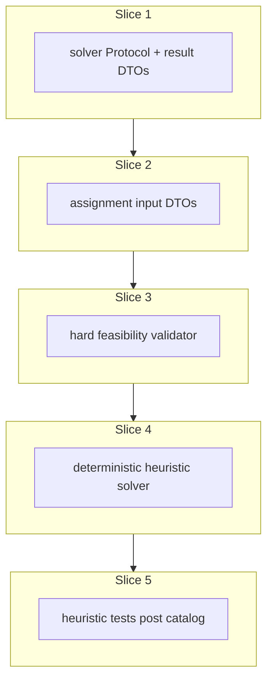

# Plan: Scheduling interfaces and heuristic solver

**Finalized plan location:** [`docs/plans/scheduling_heuristic_solver.md`](scheduling_heuristic_solver.md)

## Context

Implement Prompt 13 from [docs/cursor_implementation_guide.md](../cursor_implementation_guide.md): **`AssignmentSolver`** protocol, scheduling result types, hard feasibility validation, and a **deterministic heuristic** assignment algorithm per engineering design scheduling semantics, guide §0.1 (instance-clone tasks only; template subtree unscheduled), and [repo convention §5](../../.cursor/repo_conventions.md) (session-free scheduling package).

**Behavior summary:**
- Introduce [`calendar_backend/scheduling/`](../../calendar_backend/scheduling/) with frozen input/output DTOs and pure algorithms — **no SQLAlchemy sessions**.
- `HeuristicAssignmentSolver` implements `AssignmentSolver`; never violates hard constraints; returns **full** feasible assignment or `INFEASIBLE` (no partial success).
- Operates on **schedulable instance-clone tasks** (mapped from `ResolveTasksResult.valid_incomplete` in Prompt 14); template blueprint nodes are already excluded by resolution.
- **1-minute** granularity; half-open `TimeWindow` intervals from [`domain/time.py`](../../calendar_backend/domain/time.py).
- Hard feasibility: full duration, valid windows, non-overlap, minimum chunk size (divisible tasks), precedence edges.
- **Stability hints deferred** in v1 — optional input field + `# TODO` comments; heuristic ignores prior placements for now.

**Already done (dependencies):**
- [`TaskResolutionService`](../../calendar_backend/services/task_resolution.py) — `ResolveTasksResult`, `ResolvedTask`, `ResolvedPrecedenceConstraint` in [`domain/resolution.py`](../../calendar_backend/domain/resolution.py) (Prompt 11)
- [`TimeWindow`](../../calendar_backend/domain/time.py), [`merge_or_windows` / `intersect_time_windows`](../../calendar_backend/domain/constraints.py)
- [`SolverStatus`](../../calendar_backend/domain/enums.py), assignment-related [`MessageCode`](../../calendar_backend/domain/errors.py) values (`NO_VALID_WINDOW_FOR_TASK`, `PRECEDENCE_IMPOSSIBLE`, `MINIMUM_CHUNK_SIZE_IMPOSSIBLE`, `INSUFFICIENT_TOTAL_CAPACITY`, `HEURISTIC_FEASIBLE`, etc.)
- Placeholder [`calendar_backend/scheduling/__init__.py`](../../calendar_backend/scheduling/__init__.py) from repo skeleton (empty package)

**Locked clarifications (request-questions):**
- **Stability hints:** Defer in Prompt 13 — include optional `previous_placements_by_task_id` (or similar) on `AssignmentInput` with `# TODO(Prompt 17 / heuristic stability): …`; v1 heuristic **ignores** it; slice 5 tests omit hint behavior.
- **Occupied intervals:** Hard blockers = existing TASK calendar intervals that **persist** through assignment (align with Prompt 14 future replacement: typically entries with `start_time < run_started_at`). Mapper from DB lives in Prompt 14; slice 2 accepts hand-built `OccupiedInterval` rows in tests.
- **Divisible tasks:** Multi-segment placement when needed; each segment ≥ `minimum_chunk_size_minutes`; segment lengths sum to `duration_minutes`.
- **Deterministic placement:** Process tasks in ascending `priority_path`, then `str(plan_id)`; earliest minute-aligned feasible start within effective windows.

Build workflow: use `/build-plan-slice` per slice against this file; stop after each slice for approval.



## Non-goals

- `TaskAssignmentService`, calendar persistence, `CalendarRun` writes — Prompt 14.
- `ConflictAnalysisService` — Prompt 14.
- OR-Tools / `ExactAssignmentSolver` — Prompt 17.
- `OrchestrationService.refresh_schedule` — Prompt 16.
- Free-time assignment — Prompt 15.
- Stability / soft preference from previous future entries — deferred (TODO only in Prompt 13).
- Production HTTP API, dev CLI commands, Alembic revisions (no schema changes expected).
- Sub-minute scheduling.
- Partial assignments on heuristic failure.
- Re-implementing resolution traversal or constraint intersection (consume resolution outputs).

## Locked assumptions

- **Package:** [`calendar_backend/scheduling/`](../../calendar_backend/scheduling/) owns solver interface + algorithms only; keep `scheduling/__init__.py` empty per [package re-export policy](../../.cursor/rules/25-package-re-exports.mdc).
- **No SQLAlchemy** imports anywhere under `scheduling/`.
- **`AssignmentSolver`:** `typing.Protocol` with `solve(input: AssignmentInput) -> AssignmentSolverResult` (mirror [`Clock`](../../calendar_backend/domain/time.py) pattern; justified by Prompt 17 second implementation).
- **`HeuristicAssignmentSolver`:** stateless class implementing `AssignmentSolver`; no registry/factory.
- **Input mapping:** Prompt 14 owns `ResolveTasksResult` → `AssignmentInput`; Prompt 13 provides DTOs + optional pure `assignment_input_from_resolved(...)` helper for tests only (may live in `scheduling/input.py` with `# TODO(Prompt 14 / TaskAssignmentService):` on production mapper).
- **Schedulable task set:** Only tasks that would come from `valid_incomplete` (caller responsibility in Prompt 14); heuristic assumes all input tasks need full assignment.
- **Collection types:** `tuple` at scheduling boundaries ([repo convention §6](../../.cursor/repo_conventions.md)).
- **DTO shapes (scheduling package):**

| Type | Fields |
|------|--------|
| `OccupiedInterval` | `start_time`, `end_time` (half-open); optional `source_plan_id` for diagnostics |
| `SchedulableTask` | `plan_id`, `duration_minutes`, `divisible`, `minimum_chunk_size_minutes`, `effective_time_windows`, `priority_path` |
| `PrecedenceEdge` | `predecessor_plan_id`, `successor_plan_id` |
| `AssignmentInput` | `run_started_at`, `tasks`, `precedence_edges`, `occupied_intervals`, `previous_placements_by_task_id` (optional, ignored v1; TODO) |
| `TaskAssignment` | `plan_id`, `segments: tuple[TimeWindow, ...]` |
| `AssignmentSolverResult` | `status: SolverStatus`, `assignments: tuple[TaskAssignment, ...]`, `warnings: tuple[ServiceMessage, ...]`, `failure: ServiceMessage | None` |

- **Success:** `status=SolverStatus.FEASIBLE`, assignments cover every input task, warning includes `MessageCode.HEURISTIC_FEASIBLE`.
- **Failure:** `status=SolverStatus.INFEASIBLE`, `assignments=()`, `failure` with appropriate code (`NO_VALID_WINDOW_FOR_TASK`, `PRECEDENCE_IMPOSSIBLE`, `MINIMUM_CHUNK_SIZE_IMPOSSIBLE`, `INSUFFICIENT_TOTAL_CAPACITY`, or `SOLVER_FAILED_TO_FIND_FEASIBLE_ASSIGNMENT`).
- **Heuristic algorithm (slice 4):** Greedy earliest-feasible by `priority_path`; maintain occupied set (hard intervals + placed segments); for each task try contiguous placement first, then divisible multi-gap placement if `divisible=True`; validate with slice 3 helper before committing.
- **Slice checks:** slices 1–4 → ruff format, ruff check, pyright; slice 5 adds pytest + **Test catalog** posted in chat.
- **Tests:** pure scheduling tests under `tests/scheduling/` (no DB); hand-built `AssignmentInput` fixtures.

## Slices

### Slice 1: Solver interface and result types

**Objective:** Add `AssignmentSolver` Protocol and frozen result DTOs (`TaskAssignment`, `AssignmentSolverResult`) in the scheduling package.

**Files expected to change:**
- [`calendar_backend/scheduling/types.py`](../../calendar_backend/scheduling/types.py) (new) — `AssignmentSolver` Protocol, `TaskAssignment`, `AssignmentSolverResult`
- [`calendar_backend/scheduling/__init__.py`](../../calendar_backend/scheduling/__init__.py) — ensure empty/docstring-only

**May also change:**
- None

**Implementation steps:**
1. Add `TaskAssignment` frozen dataclass: `plan_id: PlanID`, `segments: tuple[TimeWindow, ...]`.
2. Add `AssignmentSolverResult` frozen dataclass: `status: SolverStatus`, `assignments: tuple[TaskAssignment, ...]`, `warnings: tuple[ServiceMessage, ...]`, `failure: ServiceMessage | None`.
3. Add `AssignmentSolver` Protocol with `solve(self, assignment_input: AssignmentInput) -> AssignmentSolverResult` — use forward reference or import `AssignmentInput` after slice 2 (slice 1 may use quoted annotation / move Protocol to slice 2 if needed for compile order; prefer defining minimal `AssignmentInput` stub or define Protocol in slice 2 — **prefer completing Protocol in slice 1 with TYPE_CHECKING import**).
4. Add factory helpers: `feasible_result(...)`, `infeasible_result(...)` if they reduce duplication in slice 4 (only if used immediately).

**Tests/checks:**
```bash
uv run ruff format .
uv run ruff check .
uv run pyright
```

**Acceptance criteria:**
- Result types are frozen dataclasses using existing `SolverStatus`, `PlanID`, `TimeWindow`, `ServiceMessage`.
- `AssignmentSolver` Protocol is importable without SQLAlchemy.
- No heuristic implementation yet.

**Risks/edge cases:**
- Import cycle between `types.py` and `input.py` — resolve with `TYPE_CHECKING` or define Protocol in `input.py` re-exported from `types.py`.

---

### Slice 2: Assignment input DTOs

**Objective:** Add scheduling-package input DTOs and optional test helper to build input from resolution-shaped data.

**Files expected to change:**
- [`calendar_backend/scheduling/input.py`](../../calendar_backend/scheduling/input.py) (new) — `SchedulableTask`, `PrecedenceEdge`, `OccupiedInterval`, `AssignmentInput`
- [`calendar_backend/scheduling/types.py`](../../calendar_backend/scheduling/types.py) — wire `AssignmentSolver` Protocol to concrete `AssignmentInput`

**May also change:**
- [`calendar_backend/scheduling/types.py`](../../calendar_backend/scheduling/types.py) — move Protocol here if slice 1 deferred it

**Implementation steps:**
1. Add frozen dataclasses per locked DTO table.
2. Add `previous_placements_by_task_id: tuple[tuple[PlanID, tuple[TimeWindow, ...]], ...] = ()` with module comment `# TODO(Prompt 17 / heuristic stability): use for soft placement preference`.
3. Add `assignment_input_from_resolved(resolved: ResolveTasksResult, *, occupied_intervals: tuple[OccupiedInterval, ...] = ()) -> AssignmentInput` for **tests and Prompt 14 reference** — maps `valid_incomplete` → `SchedulableTask`, `precedence_constraints` → `PrecedenceEdge`; `# TODO(Prompt 14 / TaskAssignmentService): production mapper loads occupied_intervals from calendar`.
4. Validate input invariants in helper or dedicated `validate_assignment_input` (non-empty duplicate `plan_id` rejected, minute-aligned `run_started_at`, positive durations) — keep lightweight; heavy checks in slice 3.

**Tests/checks:**
```bash
uv run ruff format .
uv run ruff check .
uv run pyright
```

**Acceptance criteria:**
- `AssignmentInput` is the sole solver entry type.
- Mapper produces tasks only from `valid_incomplete` when given `ResolveTasksResult`.
- No SQLAlchemy; importing `domain/resolution.py` is allowed (session-free).

**Risks/edge cases:**
- `ResolveTasksResult` import creates scheduling → domain dependency (acceptable; not services).
- Empty task list: solver should return feasible trivial result (Prompt 14 guard may prevent empty assign).

---

### Slice 3: Hard feasibility validator

**Objective:** Pure functions that verify a candidate assignment (or partial placement) satisfies all hard constraints.

**Files expected to change:**
- [`calendar_backend/scheduling/feasibility.py`](../../calendar_backend/scheduling/feasibility.py) (new) — segment/window/overlap/precedence/chunk validators

**May also change:**
- [`calendar_backend/scheduling/input.py`](../../calendar_backend/scheduling/input.py) — expose shared interval helpers if needed

**Implementation steps:**
1. `segment_within_windows(segment, windows) -> bool` — half-open containment in union of effective windows (reuse `domain/constraints` merge/intersect as needed).
2. `segments_non_overlapping(segments, other_segments) -> bool` — pairwise disjoint minute intervals.
3. `segments_respect_minimum_chunk(task, segments) -> bool` — indivisible ⇒ single segment; divisible ⇒ each segment ≥ min chunk.
4. `segments_total_duration(task, segments) == duration_minutes`.
5. `precedence_satisfied(assignments, edges) -> bool` — for each edge, max(pred ends) ≤ min(succ starts).
6. `validate_task_assignment(task, segments, *, occupied, other_assignments) -> ServiceMessage | None` — compose checks; return first failure code.
7. `validate_full_assignment(input, assignments) -> ServiceMessage | None` — all tasks present, all constraints.

**Tests/checks:**
```bash
uv run ruff format .
uv run ruff check .
uv run pyright
```

**Acceptance criteria:**
- Validator is pure, session-free, reusable by heuristic (slice 4) and tests (slice 5).
- Returns structured `ServiceMessage` with design-aligned codes.

**Risks/edge cases:**
- Window containment on merged OR windows — match resolution effective windows semantics (already merged OR per group, intersected AND across groups).
- Touching intervals `[a,b)` and `[b,c)` are non-overlapping.

---

### Slice 4: Deterministic heuristic algorithm

**Objective:** Implement `HeuristicAssignmentSolver` — greedy earliest-feasible placement by `priority_path` with full hard-constraint compliance.

**Files expected to change:**
- [`calendar_backend/scheduling/heuristic.py`](../../calendar_backend/scheduling/heuristic.py) (new) — `HeuristicAssignmentSolver`

**May also change:**
- [`calendar_backend/scheduling/feasibility.py`](../../calendar_backend/scheduling/feasibility.py) — small hooks if placement search needs shared gap enumeration

**Implementation steps:**
1. Sort input tasks by `(priority_path, str(plan_id))`.
2. Initialize occupied timeline from `occupied_intervals`.
3. For each task in order:
   - If indivisible (or `divisible=False`): search earliest minute-aligned start such that one segment of `duration_minutes` fits in effective windows and does not overlap occupied; commit if found.
   - If divisible: search earliest feasible **multi-segment** placement (gap enumeration within merged windows) respecting min chunk; prefer fewer segments / earlier end when ties (deterministic tie-break).
   - If no placement: return `infeasible_result` with specific code (e.g. `NO_VALID_WINDOW_FOR_TASK` or `INSUFFICIENT_TOTAL_CAPACITY`).
4. After all tasks placed, run `validate_full_assignment`; assert success in debug paths.
5. Return `feasible_result` with `HEURISTIC_FEASIBLE` warning.
6. Ignore `previous_placements_by_task_id` (comment references TODO).

**Tests/checks:**
```bash
uv run ruff format .
uv run ruff check .
uv run pyright
```

**Acceptance criteria:**
- `HeuristicAssignmentSolver` implements `AssignmentSolver`.
- Deterministic: same input ⇒ same output.
- Never returns feasible result that fails slice 3 validator.
- Does not import SQLAlchemy.

**Risks/edge cases:**
- Divisible gap search explosion — V1 acceptable with minute grid over bounded windows from tests; no optimization required.
- Precedence may make greedy order fail even when another order works — acceptable V1 limitation; return `INFEASIBLE` / `PRECEDENCE_IMPOSSIBLE` (heuristic is fallback, not complete solver).
- Empty `effective_time_windows` ⇒ immediate `NO_VALID_WINDOW_FOR_TASK`.

---

### Slice 5: Heuristic tests (post Test catalog in chat)

**Objective:** Pure tests for feasibility validator and heuristic solver; post **Test catalog** in chat before implementing.

**Files expected to change:**
- [`tests/scheduling/test_feasibility.py`](../../tests/scheduling/test_feasibility.py) (new)
- [`tests/scheduling/test_heuristic_solver.py`](../../tests/scheduling/test_heuristic_solver.py) (new)

**May also change:**
- [`tests/scheduling/conftest.py`](../../tests/scheduling/conftest.py) (new) — shared `TimeWindow` / `AssignmentInput` builders if needed

**Implementation steps:**
1. Wait for user **Test catalog** in chat (minimums: indivisible task in window; non-overlap with occupied; precedence respected; divisible multi-segment; failure when no window; deterministic repeatability).
2. Feasibility unit tests for each constraint dimension.
3. Heuristic tests with hand-built `AssignmentInput` (no DB).
4. Extend to cover all behavior introduced in slices 1–4.
5. Post grouped **Test catalog** in chat per guide §9.

**Tests/checks:**
```bash
uv run ruff format .
uv run ruff check .
uv run pyright
uv run pytest tests/scheduling/ -m "not slow and not failure_expected"
```

**Acceptance criteria:**
- All new tests pass.
- Test catalog cases from chat are covered.
- Existing suite still passes.

**Risks/edge cases:**
- Use fixed UTC datetimes and minute-aligned windows in fixtures.
- Large window grids — keep fixtures small for speed.

---

## Abstraction check

| Introduced item | Needed now? | Justification |
|-----------------|-------------|---------------|
| `AssignmentSolver` Protocol | Yes | Prompt 13 + Prompt 17 `ExactAssignmentSolver`; plan-explicit (#5 abstraction rule) |
| `HeuristicAssignmentSolver` | Yes | Prompt 13 deliverable |
| `AssignmentInput` / result DTOs | Yes | Session-free boundary between resolution (domain) and solvers (scheduling) |
| `feasibility.py` validators | Yes | Shared by heuristic and tests; encodes hard constraints once |
| `assignment_input_from_resolved` | Yes | Test + Prompt 14 reference mapper; avoids duplicating field mapping |
| Solver registry / strategy factory | No | Single heuristic now; Prompt 14 selects solver explicitly |
| Gap-search / placement strategy classes | No | Inline greedy search in `heuristic.py` until second algorithm exists |
| Stability hint engine | No | Deferred with TODO |

## Dependency changes

None expected.

```bash
uv sync   # if fresh clone only
```

## Open questions

None blocking implementation. Slice 5 test cases await **Test catalog** in chat (expected workflow, not a plan blocker).

## Changed in this revision

- Initial finalized plan for Prompt 13 (`AssignmentSolver` + deterministic heuristic).
- Incorporated locked request-questions: defer stability hints with TODO; hard occupied intervals; multi-segment divisible placement; scheduling-local DTOs.
- Incorporated guide §0.1 instance-clone scheduling scope and Prompt 14/17 boundaries.
