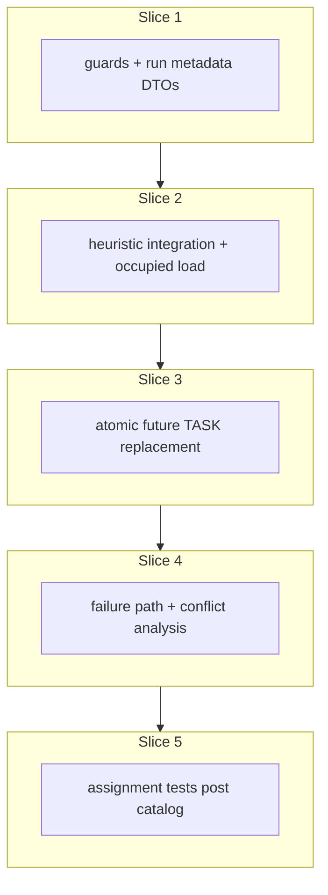

# Plan: Task assignment service and conflict analysis

**Finalized plan location:** [`docs/plans/task_assignment_service.md`](task_assignment_service.md)

## Context

Implement Prompt 14 from [docs/cursor_implementation_guide.md](../cursor_implementation_guide.md): **`TaskAssignmentService`** and **`ConflictAnalysisService`** per engineering design §7 (service APIs), §8.2 (DTOs), §9.3 (task assignment), §9.5 (conflict analysis), §10 (persistence), guide §0.1 (instance-clone tasks only; template subtree unscheduled), and [repo convention §5](../../.cursor/repo_conventions.md) (session-free scheduling vs service persistence).

**Behavior summary:**
- `TaskAssignmentService.assign_tasks(resolved, run_started_at)` accepts a pre-resolved `ResolveTasksResult` (caller runs `TaskResolutionService.resolve_tasks` separately — Prompt 16 orchestration composes both).
- **Guards:** `resolved.run_started_at` must equal `run_started_at`; non-empty `invalid_incomplete` refuses assignment (`INVALID_INCOMPLETE_TASKS_BLOCK_ASSIGNMENT`). Guard failures return `ServiceResult.fail(...)` with **no** calendar or run mutations (PDF §9.3 precondition path).
- **Solver:** Single monolithic `HeuristicAssignmentSolver.solve(...)` over all `valid_incomplete` tasks (no component decomposition, no OR-Tools — deferred to Prompt 17). Respect `AppSettings.heuristic_enabled`; fail fast when heuristic is disabled and no exact solver exists yet.
- **Occupied intervals:** Load persisted TASK entries with `start_time < run_started_at` as hard blockers; ignore `FREE_TIME` entries (Prompt 15).
- **Success:** Atomically replace **future** TASK entries (`entry_type == TASK` and `start_time >= run_started_at`); persist SUCCESS `CalendarRun`; update `ActiveCalendarState` (set `active_calendar_run_id`, clear failure flags).
- **Failure:** Leave active TASK entries unchanged; persist FAILED `CalendarRun` summary; set `ActiveCalendarState.last_refresh_failed`; run staged deterministic `ConflictAnalysisService` (PDF §9.5 — useful, not mathematically minimal).
- **Calendar rows:** One `CalendarEntry` per assignment segment; `display_label` from `ResolvedTask.name` (denormalized snapshot per design §13); `source_plan_id` = instance-clone task `plan_id` only.

**Already done (dependencies):**
- [`TaskResolutionService`](../../calendar_backend/services/task_resolution.py) + [`domain/resolution.py`](../../calendar_backend/domain/resolution.py) — four buckets, precedence, `INVALID_INCOMPLETE_TASKS_BLOCK_ASSIGNMENT` doc (Prompt 11)
- [`HeuristicAssignmentSolver`](../../calendar_backend/scheduling/heuristic.py), [`AssignmentInput`](../../calendar_backend/scheduling/input.py), [`assignment_input_from_resolved`](../../calendar_backend/scheduling/input.py) test mapper with `# TODO(Prompt 14 / TaskAssignmentService)` (Prompt 13)
- ORM: [`CalendarEntry`](../../calendar_backend/models/calendar.py), [`CalendarRun`](../../calendar_backend/models/runs.py), [`ActiveCalendarState`](../../calendar_backend/models/runs.py)
- Minimal [`AssignmentConflict`](../../calendar_backend/domain/deletion.py) + [`ConflictDeletionSuggestionService`](../../calendar_backend/deletion/conflict_suggestions.py) (Prompt 12) — analysis extends conflict DTO; deletion suggestions **not** invoked inside `assign_tasks` (Prompt 16 / callers wire `suggest_for_conflict`)

**Locked clarifications (request-questions):**
- **Guard vs solver failure:** Preconditions (`invalid_incomplete`, `run_started_at` mismatch, `validate_run_started_at`) → `fail()` only. Solver `INFEASIBLE` → failed run summary + unchanged calendar. Reserve `LastFailureReason.ASSIGNMENT_PRECONDITION_FAILED` for orchestration (Prompt 16) unless a slice explicitly needs it.
- **Stability hints:** Defer `previous_placements_by_task_id` / future-entry hints (`# TODO(Prompt 17)`); Prompt 14 loads **occupied** intervals only.
- **Component decomposition / exact solver:** PDF §9.3 loop deferred to Prompt 17; Prompt 14 = one solver call on full input.
- **`AssignmentConflict` extension:** Keep `conflicting_plan_ids` + `affected_priority_by_plan_id` for deletion ranking; add analysis fields aligned with §9.5 (`reason_code`, `task_ids`, `explanation`, optional `is_global` / `is_approximate`). Do **not** embed `deletion_candidates` on the conflict DTO in Prompt 14.
- **Future vs persisted boundary:** Persisted blockers = TASK with `start_time < run_started_at` (full half-open interval blocks even if it spans `run_started_at`). Future replacement set = TASK with `start_time >= run_started_at`.
- **Empty schedulable set:** Zero `valid_incomplete` → feasible empty assignment; success still clears future TASK entries.

Build workflow: use `/build-plan-slice` per slice against this file; stop after each slice for approval.



## Non-goals

- OR-Tools / `ExactAssignmentSolver` / component decomposition — Prompt 17.
- `OrchestrationService.refresh_schedule` — Prompt 16.
- `FreeTimeAssignmentService` and FREE_TIME calendar writes — Prompt 15.
- `ConflictDeletionSuggestionService` invocation inside `assign_tasks` — callers use analyzed `AssignmentConflict`(s) separately.
- Stability / soft preference from previous future TASK entries — Prompt 17 (`# TODO` only).
- Mathematically minimal conflict sets (PDF §9.5 explicitly defers this).
- Production HTTP API, dev CLI commands, Alembic revisions (no schema changes expected).
- Partial assignments on heuristic failure.
- Re-running `TaskResolutionService` inside `assign_tasks`.
- Sub-minute scheduling.

## Locked assumptions

- **Service API:** `TaskAssignmentService(session, clock=None).assign_tasks(resolved: ResolveTasksResult, run_started_at: datetime) -> ServiceResult[AssignmentResult]`.
- **Package placement:** `TaskAssignmentService` in [`calendar_backend/services/task_assignment.py`](../../calendar_backend/services/task_assignment.py); `ConflictAnalysisService` in [`calendar_backend/deletion/conflict_analysis.py`](../../calendar_backend/deletion/conflict_analysis.py); pure assignment/conflict DTOs and staging helpers in [`calendar_backend/domain/assignment.py`](../../calendar_backend/domain/assignment.py) (new) and extensions in [`calendar_backend/domain/deletion.py`](../../calendar_backend/domain/deletion.py). Keep `services/__init__.py` and `deletion/__init__.py` empty per [package re-export policy](../../.cursor/rules/25-package-re-exports.mdc).
- **Transactions:** Every mutating `assign_tasks` path uses `transaction(session)` per [repo convention §3](../../.cursor/repo_conventions.md). Solver runs **outside** SQLAlchemy (pure scheduling); persistence in same transaction as calendar/run writes.
- **DTO shapes (Prompt 14 subset of design §8.2):**

| Type | Fields |
|------|--------|
| `CalendarEntryDTO` | `calendar_entry_id`, `entry_type`, `start_time`, `end_time`, `source_plan_id`, `source_free_time_activity_id`, `display_label`, `calendar_run_id` |
| `AssignmentResult` | `run_started_at`, `optimization_status` (`SolverStatus`), `calendar_entries` (`tuple[CalendarEntryDTO, ...]`), `conflicts` (`tuple[AssignmentConflict, ...]`), `warnings`, `runtime_ms`, `calendar_run_id` |
| `AssignmentConflict` (extended) | `conflicting_plan_ids`, `affected_priority_by_plan_id`, `reason_code` (`MessageCode`), `task_ids` (`tuple[PlanID, ...]`), `explanation` (`str`); optional `is_global: bool = False`, `is_approximate: bool = True` |

- **`conflicting_plan_ids`:** Sorted unique unschedulable / conflict-root task `PlanID`s derived from staged analysis (typically the failing task and any deterministic culprits); must remain compatible with `generate_deletion_operations`.
- **`affected_priority_by_plan_id`:** Sorted `tuple[tuple[PlanID, int], ...]` — priority tie-break metadata for deletion ranking (leaf `priority_path[-1]` or sum per plan; stable sort by `str(plan_id)`).
- **`optimization_status`:** For Prompt 14 single heuristic path, `SolverStatus.FEASIBLE` on success; `INFEASIBLE` conflicts carry solver failure code in `reason_code`.
- **`CalendarRun` fields:** `run_started_at`, `run_finished_at`, `status` (`SUCCESS` / `FAILED`), `solver_status`, `conflict_count` (= `len(conflicts)` on failure, else `0`), `warning_count`, `runtime_ms`, `created_at`.
- **`ActiveCalendarState`:** Upsert singleton (`singleton_id=1`) on first assignment — mirror `AppSettingsService._load_or_create_settings` pattern.
- **Production mapper:** Move occupied-interval loading into `TaskAssignmentService` (or `domain/assignment.py` pure helper taking loaded `CalendarEntry` rows); update `assignment_input_from_resolved` TODO in [`scheduling/input.py`](../../calendar_backend/scheduling/input.py) to call service-owned loader or accept `occupied_intervals` from service only.
- **Slice build order:** Slices 1–2 may exercise solver without calendar persistence; slices 3–4 wire success/failure persistence respectively; slice 5 tests full behavior.
- **Slice checks:** slices 1–4 → ruff format, ruff check, pyright; slice 5 adds pytest + **Test catalog** posted in chat.
- **Test DB:** reuse [`tests/services/conftest.py`](../../tests/services/conftest.py).

## Slices

### Slice 1: Assignment service guards and run metadata

**Objective:** Add assignment result DTOs, extend `AssignmentConflict`, and implement `TaskAssignmentService` guard/precondition path plus run-metadata helpers (no solver call, no calendar writes).

**Files expected to change:**
- [`calendar_backend/domain/assignment.py`](../../calendar_backend/domain/assignment.py) (new) — `CalendarEntryDTO`, `AssignmentResult`, row→DTO mappers, `calendar_entry_dto_from_row(...)`
- [`calendar_backend/domain/deletion.py`](../../calendar_backend/domain/deletion.py) — extend `AssignmentConflict` with `reason_code`, `task_ids`, `explanation`, `is_global`, `is_approximate`; remove Prompt 14 TODO block once populated
- [`calendar_backend/services/task_assignment.py`](../../calendar_backend/services/task_assignment.py) (new) — `TaskAssignmentService`, `assign_tasks` guard path, `load_or_create_active_calendar_state(...)` from [`calendar_state.py`](../../calendar_backend/services/calendar_state.py), `_new_calendar_run(...)` helpers (unused until slices 3–4)

**May also change:**
- [`calendar_backend/domain/dtos.py`](../../calendar_backend/domain/dtos.py) — only if `CalendarEntryDTO` fits existing DTO module better (prefer dedicated `domain/assignment.py` per slice objective)

**Implementation steps:**
1. Add frozen `CalendarEntryDTO` and `AssignmentResult` per locked DTO table; mappers from ORM `CalendarEntry` / `CalendarRun` rows.
2. Extend `AssignmentConflict` — keep existing fields; add analysis fields; ensure `generate_deletion_operations` still works with `conflicting_plan_ids` only.
3. Implement `TaskAssignmentService.__init__(session, clock=None)` mirroring sibling services.
4. Implement `assign_tasks` guard sequence: `validate_run_started_at(run_started_at)`; require `resolved.run_started_at == run_started_at` → `RUN_STARTED_AT_MISMATCH`; require `not resolved.invalid_incomplete` → `INVALID_INCOMPLETE_TASKS_BLOCK_ASSIGNMENT`; return `fail(...)` without opening a mutating transaction (or read-only transaction only).
5. Add private helpers for `CalendarRun` row construction and `ActiveCalendarState` upsert — callable from slices 3–4; slice 1 may unit-test helpers via direct calls or leave covered in slice 5.
6. Document in service docstring: caller supplies pre-resolved result; invalid completed tasks do not block; template nodes excluded by resolution.

**Tests/checks:**
```bash
uv run ruff format .
uv run ruff check .
uv run pyright
```

**Acceptance criteria:**
- `assign_tasks` returns structured failures for mismatch and `invalid_incomplete` without mutating `calendar_entry`, `calendar_run`, or `active_calendar_state`.
- DTOs compile and pyright passes.
- Extended `AssignmentConflict` remains frozen and compatible with [`ConflictDeletionSuggestionService`](../../calendar_backend/deletion/conflict_suggestions.py).

**Risks/edge cases:**
- Do not export assignment DTOs from `domain/__init__.py` unless convention requires — large `domain/` barrel policy: add to `__init__.py` only if other modules need barrel imports (prefer submodule imports).
- Guard path must not create partial `CalendarRun` rows.

---

### Slice 2: Integration with heuristic solver

**Objective:** Load occupied TASK intervals from DB, build production `AssignmentInput`, invoke `HeuristicAssignmentSolver`, and return solver outcome inside `assign_tasks` without persisting calendar entries or run rows yet.

**Files expected to change:**
- [`calendar_backend/services/task_assignment.py`](../../calendar_backend/services/task_assignment.py) — occupied-interval load, settings check (`heuristic_enabled`), solver invocation, internal `_solve_assignment(...)` seam
- [`calendar_backend/domain/assignment.py`](../../calendar_backend/domain/assignment.py) — pure `occupied_intervals_from_calendar_entries(entries, run_started_at) -> tuple[OccupiedInterval, ...]` (TASK only, `start_time < run_started_at`)

**May also change:**
- [`calendar_backend/scheduling/input.py`](../../calendar_backend/scheduling/input.py) — update/remove `# TODO(Prompt 14 / TaskAssignmentService)` comment; clarify `assignment_input_from_resolved` accepts service-loaded `occupied_intervals`
- [`calendar_backend/services/app_settings.py`](../../calendar_backend/services/app_settings.py) — read `heuristic_enabled` via existing `get_settings()` only (no API change expected)

**Implementation steps:**
1. Add SQL load of active TASK `CalendarEntry` rows linked to `ActiveCalendarState.active_calendar_run_id` when present (else empty occupied set); filter `entry_type == TASK` and `start_time < run_started_at`; map to `OccupiedInterval` with `source_plan_id`.
2. Check `AppSettingsService.get_settings().heuristic_enabled`; if false, return `fail(SOLVER_FAILED_TO_FIND_FEASIBLE_ASSIGNMENT)` or dedicated precondition message (document choice in service).
3. Build `AssignmentInput` via `assignment_input_from_resolved(resolved, occupied_intervals=...)`.
4. Instantiate `HeuristicAssignmentSolver()` inline (no registry); call `solve(assignment_input)`; capture `AssignmentSolverResult`, `runtime_ms` via `Clock`.
5. Wire into `assign_tasks` after guards pass: on `FEASIBLE`, return intermediate success path stub **or** `ok(AssignmentResult(...))` with empty `calendar_entries` / `calendar_run_id=None` until slice 3 — document that persistence is slice 3; do not delete/insert calendar rows in slice 2.
6. On `INFEASIBLE`, return failure `ServiceResult` with solver `failure` message in errors **or** structured `AssignmentResult` with empty entries — align with slice 4 (prefer errors-only in slice 2, full failure persistence in slice 4).

**Tests/checks:**
```bash
uv run ruff format .
uv run ruff check .
uv run pyright
```

**Acceptance criteria:**
- Occupied intervals from persisted TASK entries block heuristic placement in integration tests (slice 5) or manual verification; slice 2 pyright-clean.
- `heuristic_enabled=False` refuses before solver or returns clear failure.
- No `calendar_entry` / `calendar_run` mutations in slice 2.

**Risks/edge cases:**
- First assignment with no `active_calendar_run_id` → empty occupied set (correct).
- SQLite timezone-naive reads in tests — follow `.replace(tzinfo=UTC)` patterns from sibling service tests.
- Tasks with no `effective_time_windows` should surface `NO_VALID_WINDOW_FOR_TASK` from solver (resolution validity unchanged).

---

### Slice 3: Atomic future TASK entry replacement

**Objective:** On solver success, atomically delete future TASK entries and insert new TASK entries from solver output; persist SUCCESS `CalendarRun` and update `ActiveCalendarState`.

**Files expected to change:**
- [`calendar_backend/services/task_assignment.py`](../../calendar_backend/services/task_assignment.py) — `_replace_future_task_entries(...)`, `_persist_successful_run(...)`, success branch in `assign_tasks`
- [`calendar_backend/domain/assignment.py`](../../calendar_backend/domain/assignment.py) — pure `assignment_to_calendar_entry_specs(assignments, resolved_tasks_by_id, run_started_at, calendar_run_id, clock) -> tuple[...]` for insert payloads (plan_id, windows, display_label, timestamps)

**May also change:**
- [`calendar_backend/models/calendar.py`](../../calendar_backend/models/calendar.py) — only if relationship navigation needed (prefer explicit SQL per convention §3)

**Implementation steps:**
1. In one `transaction`: delete `CalendarEntry` where `entry_type == TASK` and `start_time >= run_started_at` (do not delete FREE_TIME; do not delete `start_time < run_started_at` TASK rows).
2. For each `TaskAssignment` segment, insert `CalendarEntry` with `entry_type=TASK`, `source_plan_id=plan_id`, `display_label` from matching `ResolvedTask.name`, `calendar_run_id` set to new run, `created_at`/`updated_at` from `Clock`.
3. Insert `CalendarRun` (`status=SUCCESS`, `solver_status=FEASIBLE`, `conflict_count=0`, `warning_count=len(warnings)`, `runtime_ms`, `run_finished_at=now`).
4. Upsert `ActiveCalendarState`: `active_calendar_run_id` = new run, `last_refresh_failed=False`, clear `last_failure_at` / `last_failure_reason`, `updated_at=now`.
5. Return `ok(AssignmentResult(...))` with `calendar_entries` DTOs and `optimization_status=FEASIBLE`.
6. Handle zero-task success: delete future TASK entries only, insert none, still SUCCESS run.

**Tests/checks:**
```bash
uv run ruff format .
uv run ruff check .
uv run pyright
```

**Acceptance criteria:**
- Successful assignment replaces only future TASK entries; persisted (`start_time < run_started_at`) TASK entries unchanged.
- FREE_TIME entries untouched.
- `ActiveCalendarState.active_calendar_run_id` points at new SUCCESS run.
- Divisible task produces multiple `CalendarEntry` rows per plan.

**Risks/edge cases:**
- Concurrent refresh not supported in V1 — single-writer assumption.
- Orphan future TASK entries for tasks no longer in `valid_incomplete` are removed (replacement is full future TASK layer, not patch).
- Explicit `delete(CalendarEntry)...` per convention §3 — no reliance on ORM cascade.

---

### Slice 4: Failure behavior and conflict analysis

**Objective:** On solver failure, leave calendar unchanged, persist FAILED `CalendarRun` summary, update failure flags on `ActiveCalendarState`, and run deterministic `ConflictAnalysisService`.

**Files expected to change:**
- [`calendar_backend/deletion/conflict_analysis.py`](../../calendar_backend/deletion/conflict_analysis.py) (new) — `ConflictAnalysisService.analyze(...)`
- [`calendar_backend/domain/assignment.py`](../../calendar_backend/domain/assignment.py) — pure staged analysis helpers, e.g. `analyze_assignment_conflict(assignment_input, resolved, solver_result) -> tuple[AssignmentConflict, ...]`
- [`calendar_backend/domain/deletion.py`](../../calendar_backend/domain/deletion.py) — finalize `AssignmentConflict` builders used by analysis
- [`calendar_backend/services/task_assignment.py`](../../calendar_backend/services/task_assignment.py) — failure branch: no calendar mutation, failed run persist, invoke analysis

**May also change:**
- [`calendar_backend/domain/results.py`](../../calendar_backend/domain/results.py) — wire `fail(..., _value=...)` into `ServiceResult.value`
- [`calendar_backend/deletion/conflict_suggestions.py`](../../calendar_backend/deletion/conflict_suggestions.py) — update TODO docstring to reference `ConflictAnalysisService` output shape

**Implementation steps:**
1. Implement pure staged analysis (PDF §9.5): map solver `failure.code` to one or more `AssignmentConflict` rows; populate `reason_code`, `task_ids`, `conflicting_plan_ids`, `explanation`, `affected_priority_by_plan_id`; set `is_approximate=True` where analysis is diagnostic rather than minimal.
2. Support failure codes: `NO_VALID_WINDOW_FOR_TASK`, `INSUFFICIENT_TOTAL_CAPACITY`, `PRECEDENCE_IMPOSSIBLE`, `MINIMUM_CHUNK_SIZE_IMPOSSIBLE`, `TASK_OVERLAP_REQUIRED`, `SOLVER_FAILED_TO_FIND_FEASIBLE_ASSIGNMENT` (stage order deterministic, stable sorts by `str(plan_id)`).
3. `ConflictAnalysisService.analyze(assignment_input, resolved, solver_result) -> ServiceResult[tuple[AssignmentConflict, ...]]` — session-free wrapper delegating to domain pure function (no DB reads required for v1; pass resolved + solver output).
4. Failure transaction: insert FAILED `CalendarRun` (`solver_status=INFEASIBLE`, `conflict_count=len(conflicts)`, `warning_count`, `runtime_ms`); upsert `ActiveCalendarState` with `last_refresh_failed=True`, `last_failure_at`, `last_failure_reason=ASSIGNMENT_FAILED`; **do not** change `active_calendar_run_id` or `calendar_entry` rows.
5. Return `fail(solver.failure, _value=AssignmentResult(...))` after wiring [`fail()`](../../calendar_backend/domain/results.py) to pass `_value` into `ServiceResult.value` (parameter exists today but is dropped — fix in slice 4). Failure payload includes `conflicts`, `calendar_run_id` of the FAILED run, `optimization_status=INFEASIBLE`, empty `calendar_entries`. Callers (Prompt 16) read `result.value.conflicts` even when `success=False`.
6. Remove obsolete `# TODO(Prompt 14 / ConflictAnalysisService)` comments in `domain/deletion.py` and `conflict_suggestions.py`.

**Tests/checks:**
```bash
uv run ruff format .
uv run ruff check .
uv run pyright
```

**Acceptance criteria:**
- Solver failure does not change `calendar_entry` count or active TASK intervals.
- FAILED `CalendarRun` row persisted with non-zero `conflict_count` when analysis finds conflicts.
- `ActiveCalendarState.last_refresh_failed` is true; `active_calendar_run_id` unchanged.
- Analysis output is deterministic for the same inputs.

**Risks/edge cases:**
- `ServiceResult` failure-value pattern must be chosen once and tested in slice 5.
- Global vs local conflict distinction (`is_global`) — set conservatively (e.g. `INSUFFICIENT_TOTAL_CAPACITY` → `is_global=True`).
- Multiple conflicts — V1 may return a single primary `AssignmentConflict`; tuple allows extension.

---

### Slice 5: Tests for success/failure/no-calendar-replacement (post Test catalog in chat)

**Objective:** Service and domain tests for assignment success, solver failure without calendar mutation, and guard failures without calendar mutation; post **Test catalog** in chat before implementing.

**Files expected to change:**
- [`tests/services/test_task_assignment_service.py`](../../tests/services/test_task_assignment_service.py) (new) — integration tests with DB
- [`tests/domain/test_assignment.py`](../../tests/domain/test_assignment.py) (new) — pure occupied-interval + conflict analysis tests
- [`tests/deletion/test_conflict_analysis.py`](../../tests/deletion/test_conflict_analysis.py) (new) — `ConflictAnalysisService` smoke tests

**May also change:**
- [`tests/services/conftest.py`](../../tests/services/conftest.py) — fixtures for seeded tasks, constraints, existing calendar entries
- [`tests/scheduling/`](../../tests/scheduling/) — only if shared fixtures help (avoid duplicating heuristic tests)

**Implementation steps:**
1. Wait for user **Test catalog** in chat (minimums: guard `invalid_incomplete` no DB change; guard `run_started_at` mismatch; success replaces future TASK only; persisted TASK survives; solver failure leaves calendar unchanged; failed run + `last_refresh_failed`; occupied interval blocks placement; empty `valid_incomplete` clears future TASK; divisible multi-segment entries).
2. Pure tests for `occupied_intervals_from_calendar_entries` and `analyze_assignment_conflict`.
3. Integration tests seeding master tree + constraints via existing services; call `assign_tasks` with hand-built or resolved fixtures.
4. Post catalog cases first, then extend to all behavior introduced in slices 1–4.

**Tests/checks:**
```bash
uv run ruff format .
uv run ruff check .
uv run pyright
uv run pytest -m "not slow and not failure_expected"
```

**Acceptance criteria:**
- All new tests pass.
- Test catalog cases from chat are covered.
- Existing suite still passes.

**Risks/edge cases:**
- Seed data must use instance clones (not template nodes) per §0.1.
- Tests needing master horizon should call `MasterHorizonService.refresh_master_horizon` or use `_resolve_from_current_tree` seam where resolution is not under test.

---

## Abstraction check

| Introduced item | Needed now? | Justification |
|-----------------|-------------|---------------|
| `TaskAssignmentService` | Yes | Prompt 14 deliverable; design §7 |
| `ConflictAnalysisService` | Yes | Prompt 14 deliverable; design §9.5 |
| `AssignmentResult` / `CalendarEntryDTO` | Yes | Design §8.2 service return type |
| Extended `AssignmentConflict` | Yes | Prompt 12 minimal DTO extended per §9.5; feeds deletion suggestions |
| `occupied_intervals_from_calendar_entries` | Yes | Pure mapping; testable boundary between ORM rows and scheduling input |
| `assignment_to_calendar_entry_specs` (or equivalent) | Yes | Maps solver output → insert payloads without ORM in domain |
| `analyze_assignment_conflict` pure helper | Yes | Session-free §9.5 staging; mirrors `domain/deletion.py` pattern |
| Solver registry / factory | No | Single `HeuristicAssignmentSolver`; Prompt 17 adds second implementation |
| Component decomposer | No | Deferred Prompt 17 |
| Calendar repository class | No | Explicit SQL per convention §3 |
| Conflict analysis strategy classes | No | Single staged function suffices |

## Dependency changes

None expected.

```bash
uv sync   # if fresh clone only
```

## Open questions

None blocking implementation. Slice 5 test cases await **Test catalog** in chat (expected workflow, not a plan blocker).

## Changed in this revision

- Initial finalized plan for Prompt 14 (`TaskAssignmentService` + `ConflictAnalysisService`).
- Incorporated request-questions locked decisions: guard vs failure persistence, occupied/future boundary, no OR-Tools/decomposition, analysis-only (no deletion suggestions in `assign_tasks`), extended `AssignmentConflict` compatible with Prompt 12.
- Incorporated PDF §9.3–§9.5 and §10 persistence rules; guide §0.1 instance-clone scope.
- Five slices per guide Prompt 14: guards/metadata → heuristic integration → atomic replacement → failure/analysis → tests.
