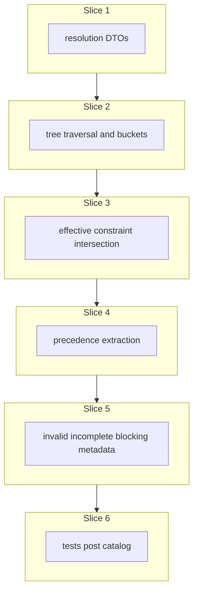

# Plan: Task resolution service

**Finalized plan location:** [`docs/plans/task_resolution_service.md`](task_resolution_service.md)

## Context

Implement Prompt 11 from [docs/cursor_implementation_guide.md](../cursor_implementation_guide.md): **`TaskResolutionService`** per engineering design §7 (Resolve tasks), §8.2 (DTOs), §9.1 (algorithm), and guide §0.1 (template / instance semantics superseding PDF where they differ).

**Behavior summary:**
- `resolve_tasks(run_started_at)` refreshes master horizon and repetitions, validates the master tree, then resolves the current tree into four task buckets plus precedence constraints.
- Traverse **instance clones** (`LINKED` / `DETACHED`), not template blueprint nodes.
- Repetition instances in **critical-first** order (`is_critical desc`, then `sort_order` within bucket), analogous to goal child chains.
- Within each instance-clone subtree, respect goal-child-chain criticality cloned from the template (guide §0.1).
- Output buckets: `valid_incomplete`, `valid_completed`, `invalid_incomplete`, `invalid_completed`.
- Include inherited effective constraints and constraint-source metadata on each `ResolvedTask`.
- Completed predecessors are ignored for active precedence edges.
- **Invalid incomplete tasks globally block assignment** (Prompt 14 guard); resolution does **not** write calendar entries.

**Already done (dependencies):**
- [`MasterHorizonService.refresh_master_horizon`](../../calendar_backend/services/master_horizon.py) (Prompt 6)
- [`RepetitionService.refresh_all_repetitions`](../../calendar_backend/services/repetition.py) (Prompt 10)
- [`PlanTreeInvariantService.validate_master_tree`](../../calendar_backend/services/plan_tree_invariant.py) (Prompt 7)
- Chain ordering helpers in [`goal.py`](../../calendar_backend/services/goal.py) (`_ordered_chains_for_goal`, `_sorted_chain_items`)
- OR-window merge in [`domain/constraints.py`](../../calendar_backend/domain/constraints.py) (`merge_or_windows`)
- Domain `TimeWindow` + validation in [`domain/time.py`](../../calendar_backend/domain/time.py)

**Locked clarifications (request-questions + PDF Section 7):**
- **Valid vs invalid:** `invalid` = bad task **definitions** (`validation_errors` non-empty) — e.g. non-positive duration, malformed ancestor windows propagating to descendants. **Not** conditional scheduling conflicts.
- **Empty `effective_time_windows`:** task remains **valid** (potentially unschedulable at assignment); assignment may raise `NO_VALID_WINDOW_FOR_TASK`.
- **Completion vs validity:** orthogonal; incomplete tasks under logically completed goals/repetitions are still resolved and may be scheduled.
- **Critical vs non-critical chains:** affect traversal / `priority_path` / logical goal completion only — **not** task validity.
- **Precedence:** separate `ResolvedPrecedenceConstraint` rows; incomplete chain predecessors constrain scheduling order; **completed predecessors ignored**.
- **Repetition instances:** traversal priority only — instances do **not** precedence-constrain each other (guide §0.1).

Build workflow: use `/build-plan-slice` per slice against this file; stop after each slice for approval.



## Non-goals

- `TaskAssignmentService`, scheduling solvers, calendar entry writes — Prompts 13–14.
- `OrchestrationService.refresh_schedule` — Prompt 16.
- Deletion preview / conflict deletion — Prompt 12.
- Production HTTP API, dev CLI commands, Alembic revisions (no schema changes expected).
- OR-Tools / `calendar_backend/scheduling/` package.
- Persisting resolution snapshots or `CalendarRun` rows.
- Auto-repair of invariant violations.
- Traversing or resolving template blueprint subtrees (`clone_status=TEMPLATE` root and its `NOT_CLONED` descendants).
- Re-linking `DETACHED` clones.

## Locked assumptions

- **Service module:** [`calendar_backend/services/task_resolution.py`](../../calendar_backend/services/task_resolution.py) with `TaskResolutionService(session, clock=None)`.
- **Public API:** `resolve_tasks(run_started_at: datetime) -> ServiceResult[ResolveTasksResult]`.
- **Internal helper:** `_resolve_from_current_tree(run_started_at, *, loaded_graph) -> ResolveTasksResult` (read-only over an already-loaded graph; callable from tests without refresh side effects).
- **Pre-resolution (inside one `transaction(session)`):**
  1. `MasterHorizonService.refresh_master_horizon(run_started_at)` — abort on failure ([repo convention §15](../../.cursor/repo_conventions.md): call owner, do not duplicate horizon SQL).
  2. `RepetitionService.refresh_all_repetitions(run_started_at)` — abort on failure.
  3. `PlanTreeInvariantService.validate_master_tree()` — abort on violations (design §9.1 “invariants not corrupted”).
  4. Load full master plan graph (same eager-load pattern as invariant service).
  5. Run pure resolution helpers → `ResolveTasksResult`.
- **`run_started_at`:** validated via existing [`validate_run_started_at`](../../calendar_backend/services/master_horizon.py) before entering the transaction.
- **DTO module:** [`calendar_backend/domain/resolution.py`](../../calendar_backend/domain/resolution.py) — frozen dataclasses + session-free pure functions ([repo convention §5](../../.cursor/repo_conventions.md)).
- **Collection types:** `tuple` at domain/service boundaries ([repo convention §6](../../.cursor/repo_conventions.md)).
- **DTO shapes (design §8.2):**

| Type | Fields |
|------|--------|
| `ResolvedTask` | `plan_id`, `name`, `duration_minutes`, `divisible`, `minimum_chunk_size_minutes`, `user_completed`, `completed_at`, `effective_time_windows`, `constraint_sources`, `priority_path`, `criticality_path`, `parent_path`, `chain_path`, `validation_errors` |
| `ConstraintSource` | `plan_id`, `constraint_kind`, `constraint_group_id` (minimal source metadata for debug) |
| `ResolvedPrecedenceConstraint` | `predecessor_task_id`, `successor_task_id`, `source_chain_id`, `reason` |
| `ResolveTasksResult` | `run_started_at`, `valid_incomplete`, `valid_completed`, `invalid_incomplete`, `invalid_completed`, `precedence_constraints`, `warnings` |

- **Traversal ordering:**
  - Master (and nested goal) children via goal child chains: `is_critical desc`, `sort_order`, `goal_child_chain_id` tie-break (mirror [`_ordered_chains_for_goal`](../../calendar_backend/services/goal.py)); items by `position`.
  - `REPETITION` chain member: expand `RepetitionInstance` rows for that shell where `generated_at is not null`; instances ordered `is_critical desc`, `sort_order`, `repetition_instance_id` tie-break; enter each `root_clone_id` subtree; **skip** `RepetitionPlan.template_root_id` and its descendants.
  - `priority_path` assigned in global critical-first traversal order (monotonic index).
- **Validity rules (`validation_errors`):**
  - Task `duration_minutes <= 0` → `INVALID_DURATION`.
  - Any malformed `TimeWindow` on the task’s ancestor path (USER or system groups) → propagate `INVALID_TIME_WINDOW` / `NON_MINUTE_ALIGNED_WINDOW` to affected descendant tasks (design §5 Time constraints).
  - Divisibility/chunk rules already enforced at write path; resolution does not re-derive `MINIMUM_CHUNK_SIZE_IMPOSSIBLE` (assignment conflict).
- **Slice checks:** slices 1–5 → ruff format, ruff check, pyright; slice 6 adds pytest + **Test catalog** in chat.
- **Test DB:** reuse [`tests/services/conftest.py`](../../tests/services/conftest.py) (`service_db_session`, `FakeClock`).

## Slices

### Slice 1: Resolution DTOs

**Objective:** Add frozen resolution DTOs and result types per design §8.2; no traversal logic yet.

**Files expected to change:**
- [`calendar_backend/domain/resolution.py`](../../calendar_backend/domain/resolution.py) (new) — `ResolvedTask`, `ConstraintSource`, `ResolvedPrecedenceConstraint`, `ResolveTasksResult`
- [`calendar_backend/domain/__init__.py`](../../calendar_backend/domain/__init__.py) — re-export new public names per [repo convention package re-exports](../../.cursor/rules/25-package-re-exports.mdc)

**May also change:**
- [`calendar_backend/domain/errors.py`](../../calendar_backend/domain/errors.py) — only if a dedicated resolution validation code is needed (prefer reusing existing `MessageCode` values inside `validation_errors`)

**Implementation steps:**
1. Add frozen dataclasses using domain `TimeWindow`, `PlanID`, `GoalChildChainID`, `TimeConstraintGroupID`, `ServiceMessage`.
2. `ResolvedTask.validation_errors: tuple[ServiceMessage, ...]` — empty tuple means definition-valid.
3. Path fields as honest tuples (e.g. `parent_path: tuple[PlanID, ...]` master→task; `criticality_path: tuple[bool, ...]`; `chain_path: tuple[tuple[GoalChildChainID, int], ...]` for `(chain_id, position)` steps; `priority_path: tuple[int, ...]` populated in slice 2).
4. `ResolveTasksResult` exposes four buckets as `tuple[ResolvedTask, ...]` plus `precedence_constraints` and `warnings`.
5. Add small factory/helper `task_is_valid(resolved: ResolvedTask) -> bool` only if it removes duplication in slices 2–5 (optional).

**Tests/checks:**
```bash
uv run ruff format .
uv run ruff check .
uv run pyright
```

**Acceptance criteria:**
- DTOs are frozen, session-free, and match design §8.2 field names.
- Strict pyright passes on `domain/resolution.py`.
- `domain/__init__.py` re-exports all new public symbols.

**Risks/edge cases:**
- Do not import SQLAlchemy in `domain/resolution.py`.
- Keep `effective_time_windows` present on all resolved tasks (empty tuple allowed).

---

### Slice 2: Tree traversal and task bucket classification

**Objective:** Implement master-tree traversal over instance clones (not templates) and classify tasks into valid/invalid × complete/incomplete buckets.

**Files expected to change:**
- [`calendar_backend/domain/resolution.py`](../../calendar_backend/domain/resolution.py) — pure traversal + classification helpers (e.g. `resolve_tasks_from_graph(...)` skeleton returning partial `ResolvedTask` rows without effective windows yet)
- [`calendar_backend/services/task_resolution.py`](../../calendar_backend/services/task_resolution.py) (new) — `TaskResolutionService`, `resolve_tasks`, `_resolve_from_current_tree`; graph load mirroring [`plan_tree_invariant.py`](../../calendar_backend/services/plan_tree_invariant.py)

**May also change:**
- [`calendar_backend/services/repetition.py`](../../calendar_backend/services/repetition.py) — only if a small owner read helper is needed for instance ordering (prefer inline query in resolution service first per [§15](../../.cursor/repo_conventions.md))

**Implementation steps:**
1. Eager-load plans with `goal_plan.chains.items`, `task_plan`, `repetition_plan.instances`, `constraint_groups.windows` (same pattern as invariant service).
2. Build in-memory indexes: `plans_by_id`, `children_by_parent`, `chain_item_by_child`, repetition `template_root_id` set for exclusion.
3. **Traversal** from master goal:
   - Walk goal child chains in critical-first order.
   - `GOAL` chain item → recurse into that goal’s chains and nested structure.
   - `TASK` chain item → collect `ResolvedTask` stub (direct fields from `Plan` + `TaskPlan`).
   - `REPETITION` chain item → if `generated_at is null`, skip instances; else iterate instances (`is_critical desc`, `sort_order`); for each `root_clone_id`, traverse clone subtree (same chain rules on nested goals); **never** enter `template_root_id` subtree.
4. Include `LINKED` and `DETACHED` clone subtrees; exclude `TEMPLATE` / template descendants.
5. Populate `parent_path`, `criticality_path`, `chain_path`, `priority_path` during walk.
6. **Classification:**
   - `complete` iff `user_completed`.
   - `invalid` iff `validation_errors` non-empty: non-positive `duration_minutes`; malformed windows on ancestor path (use `validate_time_window` on loaded group windows — do not re-check UTC on rows beyond window shape per [§12](../../.cursor/repo_conventions.md) for invariants, but resolution **does** need to detect malformed windows for invalidity propagation per design).
   - Partition into four buckets; leave `effective_time_windows=()`, `constraint_sources=()` empty until slice 3.
7. `resolve_tasks`: validate `run_started_at`; single transaction calling horizon refresh → `refresh_all_repetitions` → `validate_master_tree` → `_resolve_from_current_tree`; return `ok(result)`.
8. Wire `ServiceTransactionAborted` pattern if delegating to mutating services inside transaction (mirror [`master_horizon.py`](../../calendar_backend/services/master_horizon.py)).

**Tests/checks:**
```bash
uv run ruff format .
uv run ruff check .
uv run pyright
```

**Acceptance criteria:**
- Traversal visits master tasks and instance-clone tasks in deterministic critical-first order.
- Template-subtree tasks never appear in any bucket.
- Four buckets populated; `complete`/`invalid` semantics match locked assumptions.
- `resolve_tasks` performs refresh + invariant check + resolution without calendar writes.
- Ungenerated repetitions contribute no instance tasks.

**Risks/edge cases:**
- Repetition shell is a chain member but not a task — only instance roots/subtrees emit tasks.
- Deep clone subtrees after detach must still resolve.
- Empty graph / master-only tree returns four empty buckets.

---

### Slice 3: Effective constraint intersection

**Objective:** Compute inherited effective time windows and constraint-source metadata per resolved task.

**Files expected to change:**
- [`calendar_backend/domain/resolution.py`](../../calendar_backend/domain/resolution.py) — `intersect_time_windows`, `compute_effective_constraints` (AND-of-OR intersection along ancestor path)
- [`calendar_backend/domain/constraints.py`](../../calendar_backend/domain/constraints.py) — optional `intersect_or_window_sets` if it shares logic with `merge_or_windows` without duplication
- [`calendar_backend/services/task_resolution.py`](../../calendar_backend/services/task_resolution.py) — call constraint pass after traversal stubs built

**Implementation steps:**
1. For each task, collect constraint groups along `parent_path` including master (`SYSTEM_MASTER_HORIZON`), repetition instance root (`SYSTEM_REPETITION_WINDOW` when applicable), and local `USER` / system groups on each ancestor and the task itself.
2. Within each group: map ORM windows → domain `TimeWindow`, `merge_or_windows`.
3. Across groups: AND-intersect merged group windows into `effective_time_windows` (half-open `[start, end)`); empty outer group list at a plan means no local restriction at that level.
4. Emit `constraint_sources` per contributing group (plan id, kind, group id).
5. **Do not** flip validity when intersection is empty — empty result is allowed on valid tasks (PDF Section 7).
6. Re-run bucket partition if validity changed only via malformed-window detection (should already be set in slice 2).

**Tests/checks:**
```bash
uv run ruff format .
uv run ruff check .
uv run pyright
```

**Acceptance criteria:**
- Effective windows equal AND-intersection of merged OR-groups along the ancestor chain.
- System-owned windows appear in effective results and `constraint_sources`.
- Valid task may have empty `effective_time_windows`.
- Intersection is deterministic for a fixed graph.

**Risks/edge cases:**
- Many groups → performance on large trees (acceptable for V1; no indexing layer).
- Touching/overlapping window merge vs intersection order must match design (merge within group, intersect across groups).
- Master horizon window uses `run_started_at`-anchored refresh from slice 2’s pre-step.

---

### Slice 4: Precedence constraint extraction

**Objective:** Collect `ResolvedPrecedenceConstraint` rows from goal child chain order; ignore completed predecessors.

**Files expected to change:**
- [`calendar_backend/domain/resolution.py`](../../calendar_backend/domain/resolution.py) — `collect_precedence_constraints` (pure, over resolved tasks + chain graph)
- [`calendar_backend/services/task_resolution.py`](../../calendar_backend/services/task_resolution.py) — attach `precedence_constraints` to `ResolveTasksResult`

**Implementation steps:**
1. For each `GoalChildChain`, walk items by `position`.
2. Track the nearest **incomplete** predecessor task in that chain (skip `user_completed` tasks when advancing predecessor pointer).
3. When visiting a task chain item, if an incomplete predecessor task exists in the same chain, emit `ResolvedPrecedenceConstraint(predecessor_task_id, successor_task_id, source_chain_id, reason)`.
4. Do **not** emit precedence between repetition instances or across unrelated branches.
5. Goals/repetitions in chain do not become precedence endpoints (DTO uses task ids only).
6. Attach resulting tuple to `ResolveTasksResult`.

**Tests/checks:**
```bash
uv run ruff format .
uv run ruff check .
uv run pyright
```

**Acceptance criteria:**
- Chain order produces predecessor→successor edges for incomplete predecessors only.
- Completed predecessor tasks do not generate active edges.
- No precedence edges between instance roots of the same repetition.

**Risks/edge cases:**
- Multiple tasks in one chain with completed middle task: edge links to nearest earlier **incomplete** task.
- Tasks only reachable under instance clones still participate in chains cloned from template goals.

---

### Slice 5: Invalid incomplete task blocking metadata

**Objective:** Finalize assignment-blocking metadata and warnings on `ResolveTasksResult`.

**Files expected to change:**
- [`calendar_backend/domain/resolution.py`](../../calendar_backend/domain/resolution.py) — helpers to validate result shape (e.g. `invalid_incomplete` = invalid ∧ incomplete)
- [`calendar_backend/services/task_resolution.py`](../../calendar_backend/services/task_resolution.py) — ensure buckets are mutually consistent; populate `warnings` if needed

**Implementation steps:**
1. Ensure `invalid_incomplete` bucket equals tasks where `validation_errors` non-empty and `not user_completed` (subset of full traversal).
2. Document in service docstring: Prompt 14 `assign_tasks` refuses when `invalid_incomplete` is non-empty (`INVALID_INCOMPLETE_TASKS_BLOCK_ASSIGNMENT`).
3. Add `warnings: tuple[ServiceMessage, ...]` on result (empty in V1 unless soft conditions discovered during resolution).
4. Verify `run_started_at` on `ResolveTasksResult` matches input.
5. Expose read-only `_resolve_from_current_tree` for tests that seed DB without repeating refresh logic.

**Tests/checks:**
```bash
uv run ruff format .
uv run ruff check .
uv run pyright
```

**Acceptance criteria:**
- `invalid_incomplete` is exactly invalid ∧ incomplete tasks.
- `ResolveTasksResult` is complete for downstream assignment integration.
- No calendar or task mutation during resolution.

**Risks/edge cases:**
- Invalid completed tasks appear in `invalid_completed` but do not block assignment.
- Duplicate tasks across buckets impossible by construction.

---

### Slice 6: Tests (post Test catalog in chat)

**Objective:** Integration and domain tests for resolution behavior; post **Test catalog** in chat before implementing.

**Files expected to change:**
- [`tests/domain/test_resolution.py`](../../tests/domain/test_resolution.py) (new) — pure intersection, precedence, classification helpers
- [`tests/services/test_task_resolution_service.py`](../../tests/services/test_task_resolution_service.py) (new) — `resolve_tasks` end-to-end

**May also change:**
- [`tests/services/conftest.py`](../../tests/services/conftest.py) — shared fixtures for repetition + instance clone trees if catalog requires

**Implementation steps:**
1. Wait for user **Test catalog** in chat (design §13 / guide Prompt 11 minimums include: four buckets, completed predecessors ignored, invalid incomplete blocks assignment, inherited constraints + sources intersect correctly).
2. Domain tests: window merge+intersect; malformed ancestor window marks descendant invalid; empty effective windows on valid task.
3. Service tests: master task + nested goal task; repetition with two instances (critical-first order); template tasks excluded; detached clone still resolved; `invalid_incomplete` blocks metadata present; refresh side effects invoked once.
4. Post catalog cases first, then extend to cover all behavior introduced in slices 1–5.

**Tests/checks:**
```bash
uv run ruff format .
uv run ruff check .
uv run pyright
uv run pytest -m "not slow and not failure_expected"
```

**Acceptance criteria:**
- All new tests pass.
- Test catalog cases from chat are covered.
- Existing suite still passes.

**Risks/edge cases:**
- Prefer service API fixtures over raw ORM seeding (match [`repetition_service.md`](repetition_service.md) slice 5 guidance).
- Fake clock for deterministic `run_started_at` / horizon windows.

---

## Abstraction check

| Introduced item | Needed now? | Justification |
|-----------------|-------------|---------------|
| `domain/resolution.py` DTOs | Yes | Design §8.2; deferred since [`domain_primitives.md`](domain_primitives.md) |
| `intersect_time_windows` / `compute_effective_constraints` | Yes | Core AND-of-OR semantics (design §5.5, §9.1); testable pure logic |
| `collect_precedence_constraints` | Yes | Separates precedence from bucket classification per slice plan |
| `TaskResolutionService` | Yes | Design §7 public service |
| `_resolve_from_current_tree` | Yes | PDF-named internal helper; test seam without refresh |
| `ConstraintSource` dataclass | Yes | Design §8.2 source metadata |
| Repository / graph loader class | No | Mirror invariant service inline load |
| Strategy/registry for traversal | No | Single traversal algorithm |
| Scheduling package types | No | Prompt 13 |

## Dependency changes

None expected.

```bash
uv sync   # if fresh clone only
```

## Open questions

None blocking implementation. Slice 6 test cases await **Test catalog** in chat (expected workflow, not a plan blocker).

## Changed in this revision

- Initial finalized plan for Prompt 11 (`TaskResolutionService`).
- Incorporated PDF Section 7 locked rules (empty effective windows → valid; invalid = bad definitions).
- Incorporated guide §0.1 template/instance traversal superseding PDF §6 `is_effectively_critical`.
- Incorporated request-questions clarifications on precedence vs validity.
