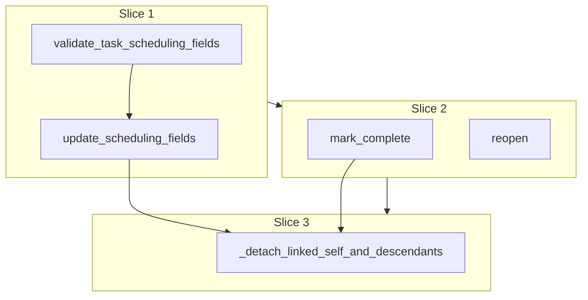

# Plan: Task service

**Finalized plan location:** [`docs/plans/task_service.md`](task_service.md)

## Context

Implement Prompt 9 from [docs/cursor_implementation_guide.md](../cursor_implementation_guide.md): **`TaskService`** for task subtype self-edits per engineering design task completion and scheduling semantics and [repo convention §14](../../.cursor/repo_conventions.md) (sibling to `GoalService` / `PlanTreeService`).

Design constraints:
- [`calendar_backend/services/`](../../calendar_backend/services/) owns public mutation methods, validation, transactions, and persistence-changing behavior ([layer boundaries](../../.cursor/rules/10-layer-boundaries.mdc)).
- Public methods return **`ServiceResult[TaskPlanDTO]`** via [`calendar_backend/domain/results.py`](../../calendar_backend/domain/results.py); mutations run inside [`transaction(session)`](../../calendar_backend/db/session.py) ([repo convention §2](../../.cursor/repo_conventions.md)).
- Scheduling field rules already exist at create in [`domain/tasks.py`](../../calendar_backend/domain/tasks.py) (`validate_task_create`) with matching ORM CHECKs on [`TaskPlan`](../../calendar_backend/models/plans.py) ([repo convention §11](../../.cursor/repo_conventions.md)).
- **Prompt 8 complete:** `GoalService.create_child` persists tasks; `TaskPlanDTO` + mapper exist in [`domain/dtos.py`](../../calendar_backend/domain/dtos.py).
- **Clone detachment** is a primitive for Prompt 10 repetition refresh; Prompt 9 does **not** implement generation, refresh, or `SYSTEM_REPETITION_WINDOW` materialization.

**Locked clarifications (request-questions):**
- **Detachment scope:** On `update_scheduling_fields` or `mark_complete`, when the target plan has `clone_status=LINKED`, set `clone_status=DETACHED` on the **mutated plan and all descendants** (children, grandchildren, …). **Parents and siblings remain `LINKED`.**
- **Completed + scheduling:** `update_scheduling_fields` is **allowed** while `user_completed=True` (no forced reopen).
- **`reopen`:** Clears `user_completed=False` and `completed_at=None` only; **does not** trigger detachment and **does not** re-link `DETACHED` clones.
- **`mark_complete` idempotency:** **Reject** if already `user_completed=True` (fail with a dedicated message code).
- **Manual completion only:** `mark_complete` sets `user_completed` + `completed_at`; no assignment/calendar side effects.

Build workflow: use `/build-plan-slice` per slice against this file; stop after each slice for approval.



## Non-goals

- `RepetitionService` generation, refresh, lock rules, instance materialization — Prompt 10.
- Task resolution, assignment, calendar entry writes — Prompts 11–14.
- `PlanTreeService` rename/delete/move/create — Prompt 8 (done).
- Auto-completion from scheduling/assignment.
- Production HTTP API, dev CLI commands, Alembic revisions (no schema changes expected).
- OR-Tools / solver code.
- Detaching parents or siblings on edit/complete.
- Re-linking detached clones on reopen.

## Locked assumptions

- **Service module:** [`calendar_backend/services/task.py`](../../calendar_backend/services/task.py) with `TaskService(session, clock=None)`.
- **Public API:**
  - `update_scheduling_fields(plan_id, duration_minutes, divisible, minimum_chunk_size_minutes) -> ServiceResult[TaskPlanDTO]`
  - `mark_complete(plan_id) -> ServiceResult[TaskPlanDTO]`
  - `reopen(plan_id) -> ServiceResult[TaskPlanDTO]`
- **Validation:** Shared session-free `validate_task_scheduling_fields(duration_minutes, divisible, minimum_chunk_size_minutes)` in [`domain/tasks.py`](../../calendar_backend/domain/tasks.py); `validate_task_create` delegates to it (same error codes as today).
- **Guards:** `PLAN_NOT_FOUND`; `PLAN_SUBTYPE_MISMATCH` when `plan_kind != TASK` or missing `task_plan`; reject `mark_complete` when already completed.
- **Timestamps:** `completed_at = clock.now_utc()` on complete; bump `plan.updated_at` on all successful mutations.
- **Detach trigger:** Only when pre-mutation `plan.clone_status == CloneStatus.LINKED`; `NOT_CLONED`, `TEMPLATE`, `DETACHED` → detach helper no-op.
- **Descendant walk:** Traverse `Plan.children` (or explicit `select` by `parent_id`) within transaction; flip only rows currently `LINKED` to `DETACHED`.
- **Slice checks:** slices 1–3 → ruff format, ruff check, pyright; slice 4 adds pytest + **Test catalog** in chat.
- **Test DB:** reuse [`tests/services/conftest.py`](../../tests/services/conftest.py) (`service_db_session`, `FakeClock`).

## Slices

### Slice 1: Task scheduling field validation and update

**Objective:** Extract shared scheduling validation and implement `TaskService.update_scheduling_fields`.

**Files expected to change:**
- [`calendar_backend/domain/tasks.py`](../../calendar_backend/domain/tasks.py) — `validate_task_scheduling_fields`; refactor `validate_task_create` to call it
- [`calendar_backend/services/task.py`](../../calendar_backend/services/task.py) (new) — `TaskService`, `update_scheduling_fields`
- [`tests/domain/test_tasks.py`](../../tests/domain/test_tasks.py) — cover shared validator if create tests need adjustment

**May also change:**
- [`calendar_backend/domain/errors.py`](../../calendar_backend/domain/errors.py) — only if a new code is required (unlikely; reuse existing task codes)

**Implementation steps:**
1. Add `validate_task_scheduling_fields(duration_minutes, divisible, minimum_chunk_size_minutes) -> ServiceMessage | None` with the same rules as current `validate_task_create` (positive duration; indivisible ⇒ `minimum_chunk_size_minutes is None`; divisible ⇒ positive chunk ≤ duration).
2. Refactor `validate_task_create` to call `validate_task_scheduling_fields` on payload fields (preserve existing tests/behavior).
3. Implement `TaskService` with `update_scheduling_fields`: validate **before** `transaction()`; inside transaction load `Plan` + `TaskPlan` by id; apply guards; update `task_plan` fields; set `plan.updated_at`; return `task_plan_dto_from_rows`.
4. Do **not** wire clone detachment yet (slice 3).
5. No new CHECK migration — existing `task_plan` CHECKs mirror validator ([§11](../../.cursor/repo_conventions.md)).

**Tests/checks:**
```bash
uv run ruff format .
uv run ruff check .
uv run pyright
```

**Acceptance criteria:**
- Valid scheduling updates persist and return updated `TaskPlanDTO`.
- Invalid duration/divisibility/chunk combinations fail without partial writes (same codes as create validation).
- `PLAN_NOT_FOUND` / `PLAN_SUBTYPE_MISMATCH` for missing or non-task plans.
- Update succeeds on `user_completed=True` tasks (scheduling fields change; completion fields unchanged unless caller uses slice 2 methods).

**Risks/edge cases:**
- Toggling `divisible` must clear or set `minimum_chunk_size_minutes` consistently with validation (reject invalid pairings rather than silent coercion).
- No-op update (same values) should still succeed.

---

### Slice 2: mark_complete and reopen

**Objective:** Implement manual completion and reopen on task plans.

**Files expected to change:**
- [`calendar_backend/services/task.py`](../../calendar_backend/services/task.py) — `mark_complete`, `reopen`
- [`calendar_backend/domain/errors.py`](../../calendar_backend/domain/errors.py) — e.g. `TASK_ALREADY_COMPLETED` (or equivalent)
- [`calendar_backend/domain/invariant_validation.py`](../../calendar_backend/domain/invariant_validation.py) — `user_completed` ↔ `completed_at` pairing on loaded task rows ([§11](../../.cursor/repo_conventions.md))

**May also change:**
- [`tests/domain/test_invariant_validation.py`](../../tests/domain/test_invariant_validation.py) — pairing violation case

**Implementation steps:**
1. **`mark_complete`:** load task inside transaction; reject if `user_completed` already true; set `user_completed=True`, `completed_at=clock.now_utc()`, `plan.updated_at`; return DTO. No detach wiring yet.
2. **`reopen`:** load task; set `user_completed=False`, `completed_at=None`, `plan.updated_at`; return DTO (idempotent reopen on already-open task is acceptable — succeed).
3. Add invariant check: completed tasks must have non-null `completed_at`; incomplete tasks must have null `completed_at` (graph rule on loaded `TaskPlan` rows).
4. Do **not** wire clone detachment yet (slice 3).

**Tests/checks:**
```bash
uv run ruff format .
uv run ruff check .
uv run pyright
```

**Acceptance criteria:**
- `mark_complete` sets completion fields; rejects double-complete.
- `reopen` clears completion fields; does not change scheduling fields or `clone_status`.
- Invariant module reports pairing violations for corrupt graphs.

**Risks/edge cases:**
- `completed_at` uses injected `Clock` for test determinism.
- Master plan is a goal, not a task — `PLAN_SUBTYPE_MISMATCH` only.

---

### Slice 3: Clone detachment hooks

**Objective:** Detach `LINKED` repetition clones on scheduling edit and manual complete per locked scope.

**Files expected to change:**
- [`calendar_backend/services/task.py`](../../calendar_backend/services/task.py) — private `_detach_linked_self_and_descendants(txn, plan)`; call from `update_scheduling_fields` and `mark_complete` after successful field mutation, before commit

**May also change:**
- None required outside `task.py` unless descendant walk needs eager load helper

**Implementation steps:**
1. Implement `_detach_linked_self_and_descendants(txn, plan)`:
   - If `plan.clone_status != LINKED`, return immediately.
   - Collect **self + all descendants** via `parent_id` tree walk (BFS/DFS from `plan.plan_id` using in-txn queries or loaded `children` with explicit `selectinload` depth as needed).
   - For each collected plan with `clone_status == LINKED`, set `DETACHED` and update `updated_at`.
   - **Do not** modify parents or siblings.
2. Call detach helper at end of successful `update_scheduling_fields` and `mark_complete` paths (after field writes, same transaction).
3. **`reopen` does not call detach.**
4. Document in helper docstring: Prompt 10 `RepetitionService` refresh must skip `DETACHED` subtrees; extract/reuse later if needed.

**Tests/checks:**
```bash
uv run ruff format .
uv run ruff check .
uv run pyright
```

**Acceptance criteria:**
- Editing/completing a `LINKED` task detaches self + descendants; parent/sibling `LINKED` clones unchanged.
- `NOT_CLONED` / `TEMPLATE` / already `DETACHED` tasks mutate without erroneous status changes on unrelated plans.
- Nested clone subtree: editing parent task detaches parent + nested children; sibling subtree stays `LINKED`.

**Risks/edge cases:**
- Deep/wide trees: prefer iterative `select(Plan).where(parent_id.in_(frontier))` to avoid loading entire master tree.
- Only flip `LINKED` → `DETACHED` (idempotent on already-detached descendants).
- Tasks under repetition template (`TEMPLATE`) or ordinary chains (`NOT_CLONED`) — detach no-op.

---

### Slice 4: Service tests

**Objective:** Integration + domain test coverage for all Prompt 9 behavior; post **Test catalog** in chat.

**Files expected to change:**
- [`tests/services/test_task_service.py`](../../tests/services/test_task_service.py) (new)
- [`tests/domain/test_tasks.py`](../../tests/domain/test_tasks.py) — extend for `validate_task_scheduling_fields` if not fully covered via create tests
- [`tests/domain/test_invariant_validation.py`](../../tests/domain/test_invariant_validation.py) — completion pairing tests if not added in slice 2

**May also change:**
- Test-only ORM builders for `LINKED` clone subtrees with `RepetitionInstance` (inline in test file, mirroring [`tests/domain/test_invariant_validation.py`](../../tests/domain/test_invariant_validation.py) `_valid_repetition_graph` patterns)

**Implementation steps:**
1. Bootstrap master + horizon via existing service fixtures; create tasks through `GoalService.create_child` where convenient.
2. **Scheduling:** happy path; each validation failure; non-task / missing plan; update while completed.
3. **Complete/reopen:** mark complete; reject second mark; reopen clears fields; scheduling unchanged after reopen.
4. **Detachment:** manually seed repetition + `LINKED` clone subtree with nested task children; assert detach scope on `update_scheduling_fields` and `mark_complete`; assert `reopen` does not re-link or detach extras.
5. Optional: `PlanTreeInvariantService.validate_master_tree()` after representative mutations.
6. Post grouped **Test catalog** per guide §9.

**Tests/checks:**
```bash
uv run ruff format .
uv run ruff check .
uv run pyright
uv run pytest -m "not slow and not failure_expected"
```

**Acceptance criteria:**
- All new tests pass; existing suite still green.
- Tests cover **all** public behavior from slices 1–3.
- Chat report includes **Test catalog**.

**Risks/edge cases:**
- No `RepetitionService` — tests must insert clone/instance rows manually.
- SQLite datetime timezone consistency (match Prompt 8 service tests).

---

## Abstraction check

| Introduced item | Needed now? | Justification |
|-----------------|-------------|---------------|
| `TaskService` | Yes | Prompt 9 public API; §14 subtype self-edit owner |
| `validate_task_scheduling_fields` | Yes | Shared create + update rules; avoids duplicated validation ([§5](../../.cursor/repo_conventions.md)) |
| `_detach_linked_self_and_descendants` | Yes | Single detach primitive for edit + complete; Prompt 10 reuse candidate |
| `calendar_backend/deletion/` or detach package | No | One caller; keep private on `task.py` until Prompt 10 proves reuse |
| Repository / DAO / service base class | No | Matches existing services |
| Strategy/registry for detach | No | One detachment rule in V1 |

## Dependency changes

None expected — stdlib + existing SQLAlchemy stack.

```bash
uv sync   # if fresh clone only
```

## Open questions

None blocking implementation.

**Prompt 10 note:** When implementing repetition refresh, reuse or extract `_detach_linked_self_and_descendants` semantics; refresh must not overwrite `DETACHED` subtrees.
