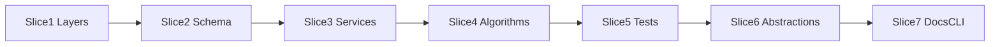

# Plan: Final V1 design conformance audit

**Finalized plan location:** [`docs/plans/v1_design_conformance_audit.md`](v1_design_conformance_audit.md)

## Context

Implement Prompt 20 from [docs/cursor_implementation_guide.md](../cursor_implementation_guide.md): **final V1 design conformance audit** after Prompts 6–19 and [`test_hardening.md`](test_hardening.md) (8 slices) are complete.

Compare implemented code against:
1. [`.cursor/repo_conventions.md`](../../.cursor/repo_conventions.md) (highest authority)
2. Guide **§0.1** template semantics and supersession table
3. Finalized per-prompt plans in [`docs/plans/`](.)
4. Engineering design PDF (cited, not stored in-repo — guide/plans supersede on conflicts)

**Workflow (locked):** Combined **audit + fix** per slice — each `/build-plan-slice` turn inventories gaps against the slice checklist, fixes in-scope issues, runs checks, and posts a **Findings summary** in chat before stopping for approval.

**Already done (dependencies):**
- Prompts 1–18: infrastructure, ORM, domain, services, scheduling, orchestration, dev CLI
- Prompt 19: [`test_hardening.md`](test_hardening.md) — invariant through orchestration test hardening
- 18 finalized implementation plans under [`docs/plans/`](.)
- Remaining `# TODO(Prompt 20)` in source: [`calendar_backend/domain/enums.py`](../../calendar_backend/domain/enums.py), [`calendar_backend/domain/errors.py`](../../calendar_backend/domain/errors.py)

Build workflow: use `/build-plan-slice` per slice against this file; stop after each slice for approval.



## Non-goals

- New V1 features, HTTP API, production CLI, external calendar sync, OS notifications
- Recurring availability constraints, undo/audit/soft-delete, orphan active plans, plan-type conversion, sub-minute scheduling
- Broad refactors unrelated to a documented conformance gap (rename-only, style-only)
- Re-implementing services already covered by per-prompt plans
- Replacing [`test_hardening.md`](test_hardening.md) work wholesale — Slice 5 is a **fresh conformance pass** but fixes should avoid redundant duplicate tests when an existing test already asserts the same guarantee
- Autogenerate Alembic revisions inside `/build-plan-slice` — use [`/db-revision-preview`](../.cursor/commands/db-revision-preview.md) / [`/db-revision-continue`](../.cursor/commands/db-revision-continue.md) when schema fixes require migration

## Locked assumptions

- **Authority order:** repo conventions → guide §0.1 → finalized plans → PDF → existing code (update code when conventions apply).
- **Bug-fix policy:** Real conformance gaps fixed in the **same slice**; note under **Consistency & divergence**; prefer separate commits (behavior vs tests) via `/commit-changes`.
- **Findings format:** Each slice posts in chat: (1) **Conformance gaps found**, (2) **Fixes applied**, (3) **Deferred** (with reason), (4) **Test catalog** when tests change (guide §9).
- **Migration policy:** Slice 2 may add `failure_expected` schema tests and stop for `/db-revision-preview`; unmark in `/db-revision-continue` per repo §13.
- **Template semantics (§0.1):** Any slice touching repetition/delete/refresh/scheduling must verify the mandated trio where category-relevant:
  1. Template-goal chaining → refresh materializes on `LINKED` instances
  2. Template-root delete includes repetition shell
  3. Refresh vs `DETACHED` — linked fields propagate; detached task subtree fields not overwritten
- **Slice checks:** ruff format, ruff check, pyright; targeted pytest first; full `uv run pytest -m "not slow and not failure_expected"` when shared infra or cross-cutting behavior changes.
- **Abstraction discipline:** No new frameworks; inlining/simplification only when audit proves violation of [`.cursor/rules/15-abstraction-discipline.mdc`](../../.cursor/rules/15-abstraction-discipline.mdc).

## Audit baseline (starting inventory)

| Area | Primary references | Starting signals |
|------|-------------------|------------------|
| Layers | [10-layer-boundaries.mdc](../../.cursor/rules/10-layer-boundaries.mdc), [25-package-re-exports.mdc](../../.cursor/rules/25-package-re-exports.mdc) | `domain/`/`scheduling/` SQLAlchemy imports; `tools/` business logic; barrel exports in large packages |
| Schema | [`tests/models/`](../../tests/models/), [`db/migrations/`](../../calendar_backend/db/migrations/), ORM in [`models/`](../../calendar_backend/models/) | ORM CHECK vs migration parity; FK `relationship()` symmetry (guide §0.2); `env.py` model imports |
| Services | Finalized plans Prompts 6–16 | Transaction boundaries (repo §2); cross-service read ownership (repo §15); §0.1 repetition/delete/orchestration semantics |
| Algorithms | [`scheduling/`](../../calendar_backend/scheduling/), Prompts 13–14, 17 plans | Heuristic/exact selection, precedence, partial failure, stability-hint deferrals |
| Tests | Full [`tests/`](../../tests/) tree | Design-required behaviors without tests; weak assertions (`>= 1` only); stale `failure_expected`; missing markers |
| Abstractions | [15-abstraction-discipline.mdc](../../.cursor/rules/15-abstraction-discipline.mdc) | Pass-through helpers, single-impl protocols, unused enum/MessageCode values |
| Docs/CLI | Guide Prompt 20 carry-over, [`development_cli.md`](development_cli.md) | Stale **Deferred carry-over** bullets; CLI vs service API drift |

## Slices

### Slice 1: Package and layer boundary audit

**Objective:** Verify package ownership, import direction, and re-export policy; fix layer violations and accidental coupling between persistence, domain, scheduling, and tools.

**Files expected to change:**
- [`calendar_backend/domain/`](../../calendar_backend/domain/) — remove/fix any SQLAlchemy session imports if found
- [`calendar_backend/scheduling/`](../../calendar_backend/scheduling/) — confirm no `Session` / `models` imports
- [`calendar_backend/services/`](../../calendar_backend/services/) — fix misplaced validation or scheduling logic discovered during audit
- [`calendar_backend/orchestration/`](../../calendar_backend/orchestration/), [`calendar_backend/deletion/`](../../calendar_backend/deletion/)
- [`tools/dev_cli.py`](../../tools/dev_cli.py) — confirm thin-wrapper only (no new business rules)
- [`calendar_backend/domain/__init__.py`](../../calendar_backend/domain/__init__.py), [`calendar_backend/db/__init__.py`](../../calendar_backend/db/__init__.py) — re-export completeness per repo §25

**May also change:**
- [`calendar_backend/models/`](../../calendar_backend/models/) — **only if** audit finds behavior in models that belongs in services (move logic out, do not add model methods)

**Implementation steps:**
1. Run import-graph audit: `domain`, `scheduling`, `deletion`, `orchestration` must not import `sqlalchemy.orm.Session` or write paths; `services` may import models/domain/scheduling; `tools` imports services only.
2. Verify large packages (`services`, `models`, `scheduling`, `deletion`, `orchestration`) keep empty/docstring-only `__init__.py`; small packages (`db`, `domain`) match `__all__` barrel policy.
3. Check for persistence writes outside `transaction()` in mutating service methods (repo §2).
4. Check for cross-service direct ORM loads of another aggregate where owner read helper exists (repo §15) — fix or document intentional exception in slice report.
5. Fix violations found; post **Findings summary** + **Test catalog** if any test added for regression guard (e.g. import smoke test).

**Tests/checks:**
```bash
uv run ruff format .
uv run ruff check .
uv run pyright
# Optional targeted import smoke if added:
uv run pytest tests/ -m "not slow and not failure_expected" -q --co -q  # collect-only sanity
uv run pytest tests/domain/ tests/services/test_plan_tree_invariant_service.py -m "not slow and not failure_expected"
```

**Acceptance criteria:** No upward layer imports (domain/scheduling → services/db); tools remain thin; findings summary posted; fixes applied or explicitly deferred with reason.

**Risks/edge cases:** `assignment_input_from_resolved` in `scheduling/input.py` is an allowed test seam — do not delete without moving test callers.

---

### Slice 2: Data model and schema audit

**Objective:** Align ORM models, CHECK constraints, relationships, and Alembic migrations; fix schema drift and symmetric wiring gaps per guide §0.2.

**Files expected to change:**
- [`calendar_backend/models/`](../../calendar_backend/models/) — relationship/CHECK fixes
- [`calendar_backend/db/migrations/env.py`](../../calendar_backend/db/migrations/env.py) — model import registration if missing
- [`tests/models/`](../../tests/models/) — extend schema/integration tests for any new or corrected enforcement

**May also change:**
- New migration under [`calendar_backend/db/migrations/versions/`](../../calendar_backend/db/migrations/versions/) — **only via** `/db-revision-preview` + manual edit + `/db-revision-continue` workflow (not inline in `/build-plan-slice`)

**Implementation steps:**
1. Compare each ORM `CheckConstraint` / FK in [`models/`](../../calendar_backend/models/) to latest migration revision; flag ORM-only or migration-only rules.
2. Audit FK columns for matching `relationship()` where sibling FKs in the same module have one (guide §0.2); add navigations, not `Plan` back-populates unless already present in module.
3. Verify `env.py` imports all model modules used by autogenerate.
4. Run existing [`tests/models/`](../../tests/models/) suite; add targeted tests for discovered drift.
5. If migration required: stop slice after preview report; complete migration in separate db-revision turns before marking slice done.

**Tests/checks:**
```bash
uv run ruff format .
uv run ruff check .
uv run pyright
uv run pytest tests/models/ -m "not slow and not failure_expected"
```

**Acceptance criteria:** No known ORM/migration semantic drift without a tracked migration path; schema tests green or correctly `failure_expected` pending migration; findings summary posted.

**Risks/edge cases:** SQLite `batch_alter_table` for ALTER constraints; do not weaken CHECKs to green tests without design justification.

---

### Slice 3: Service behavior audit

**Objective:** Audit public service behavior against finalized plans (Prompts 6–16) and §0.1 template semantics; fix missing behavior, accidental non-goals, and invariant/transaction violations.

**Files expected to change:**
- [`calendar_backend/services/`](../../calendar_backend/services/) — primary fix target
- [`calendar_backend/orchestration/refresh_schedule.py`](../../calendar_backend/orchestration/refresh_schedule.py)
- [`calendar_backend/deletion/`](../../calendar_backend/deletion/)
- Corresponding [`tests/services/`](../../tests/services/), [`tests/deletion/`](../../tests/deletion/), [`tests/orchestration/`](../../tests/orchestration/) — regression tests for fixes

**May also change:**
- [`calendar_backend/domain/`](../../calendar_backend/domain/) — pure helpers if service audit exposes wrong boundary placement (repo §5)

**Implementation steps:**
1. Per-service checklist against owning plan (see table below); sample critical paths, not exhaustive re-read of every test.
2. **§0.1 trio** on `GoalService`, `RepetitionService`, `PlanTreeService`, `TaskResolutionService`, `OrchestrationService`.
3. Verify orchestration stage ordering: repetition refresh → resolve → assign → free-time; invalid incomplete blocks assignment; partial free-time failure preserves tasks.
4. Verify deletion: template-root includes shell; critical-chain rules; detached clone local impact.
5. Fix gaps; add/strengthen service tests; post **Findings summary** + **Test catalog**.

| Service module | Plan reference | Focus checks |
|----------------|----------------|--------------|
| `master_plan`, `app_settings`, `master_horizon` | [master_plan_app_settings_master_horizon_services.md](master_plan_app_settings_master_horizon_services.md) | Bootstrap idempotency, settings validation, horizon refresh |
| `time_constraint`, `plan_tree_invariant` | [time_constraint_invariant_validation.md](time_constraint_invariant_validation.md) | USER vs SYSTEM groups, invariant ideal shape |
| `goal`, `plan_tree` | [plan_tree_service.md](plan_tree_service.md) | create_child, move, rename, delete cascade, template-root delete |
| `task` | [task_service.md](task_service.md) | detach on edit/complete, scheduling validation |
| `repetition` | [repetition_service.md](repetition_service.md) | generation, refresh, DETACHED skip, settings locks |
| `task_resolution` | [task_resolution_service.md](task_resolution_service.md) | template exclusion, instance traversal, invalid_incomplete |
| `task_assignment` | [task_assignment_service.md](task_assignment_service.md) | precondition guard, atomic future TASK replace |
| `free_time_activity`, `free_time_assignment` | [free_time_activity_and_assignment.md](free_time_activity_and_assignment.md) | fractions, prerequisites, partial failure semantics |
| `orchestration` | [orchestration_refresh_schedule.md](orchestration_refresh_schedule.md) | composed pipeline, active state metadata |
| `deletion/*` | [deletion_preview_service.md](deletion_preview_service.md) | preview parity, suggestions |

**Tests/checks:**
```bash
uv run ruff format .
uv run ruff check .
uv run pyright
uv run pytest tests/services/ tests/deletion/ tests/orchestration/ -m "not slow and not failure_expected"
```

**Acceptance criteria:** No unfixed P0 service conformance gaps (wrong semantics vs plan/§0.1); findings summary documents P1/P2 deferrals; test catalog when tests change.

**Risks/edge cases:** Do not expand scope into Prompt 17 stability hints or new CLI commands.

---

### Slice 4: Algorithm behavior audit

**Objective:** Audit scheduling solvers and feasibility logic against Prompts 13–14 and [exact_cp_sat_solver.md](exact_cp_sat_solver.md); fix incorrect precedence, model-size guard, status/warning mapping, or free-time/task interaction bugs.

**Files expected to change:**
- [`calendar_backend/scheduling/`](../../calendar_backend/scheduling/) — `heuristic.py`, `exact_cp_sat.py`, `feasibility.py`, `decomposition.py`, `input.py`, `types.py`
- [`calendar_backend/domain/assignment.py`](../../calendar_backend/domain/assignment.py) — DTO mapping if audit finds drift
- [`tests/scheduling/`](../../tests/scheduling/) — strengthen or add regression tests

**May also change:**
- [`calendar_backend/services/task_assignment.py`](../../calendar_backend/services/task_assignment.py) — if bug is in guard/solver dispatch not algorithm core

**Implementation steps:**
1. Verify `AssignmentInput` mapping: precedence edges, occupied intervals, effective windows, minute granularity.
2. Verify heuristic fallback when `exact_solver_model_size_limit` exceeded; exact-only failure when heuristic disabled.
3. Verify exact solver: component decomposition, OPTIMAL vs FEASIBLE, `HEURISTIC_FEASIBLE` not emitted from exact path.
4. Verify feasibility helpers align with assignment service conflict analysis shapes.
5. Confirm stability-hint fields remain deferred (Prompt 17) — document in findings if PDF expects them, do not implement.
6. Fix gaps; post **Findings summary** + **Test catalog**.

**Tests/checks:**
```bash
uv run ruff format .
uv run ruff check .
uv run pyright
uv run pytest tests/scheduling/ tests/services/test_task_assignment_service.py tests/deletion/test_conflict_analysis.py -m "not slow and not failure_expected"
```

**Acceptance criteria:** Solver selection and status/warning contracts match plans; no silent wrong assignments from audit-found bugs; findings summary posted.

**Risks/edge cases:** OR-Tools timing — keep fixtures tiny; use `@pytest.mark.slow` only when unavoidable.

---

### Slice 5: Test coverage audit (fresh conformance pass)

**Objective:** Full fresh audit of test suite against V1 design requirements (independent of test_hardening intent); fix weak tests, missing guarantees, stale markers, and absent design-required scenarios.

**Files expected to change:**
- [`tests/`](../../tests/) — any module where audit finds gap or weak assertion
- [`pyproject.toml`](../../pyproject.toml) — marker config **only if** audit proves misconfiguration

**May also change:**
- Production code in any package — **only when** a new/regression test exposes a real bug (same-slice fix)

**Implementation steps:**
1. Build requirement matrix from guide Prompts 6–18 acceptance themes + §0.1 trio + orchestration failure paths; map to existing tests (grep + spot read).
2. Flag: tests asserting only `>= 1` counts without semantic checks; missing negative cases; duplicate tests with weaker assertions (prefer strengthening one).
3. Audit `@pytest.mark.failure_expected` — remove stale; keep only with repo §13 justification.
4. Audit `@pytest.mark.integration` / `slow` usage vs repo conventions.
5. Add/fix tests for uncovered design requirements; avoid duplicating test_hardening tests that already assert the same guarantee — strengthen or cross-reference instead.
6. Post **Findings summary** (coverage matrix deltas) + full **Test catalog** for changed tests.

**Tests/checks:**
```bash
uv run ruff format .
uv run ruff check .
uv run pyright
uv run pytest -m "not slow and not failure_expected"
```

**Acceptance criteria:** Every design-critical behavior category has at least one meaningful test (repo §19) or documented intentional deferral; no stale `failure_expected`; full suite green; test catalog posted.

**Risks/edge cases:** Overlap with test_hardening may inflate diff — prefer assertion strengthening over new near-duplicate tests.

---

### Slice 6: Abstraction discipline audit

**Objective:** Remove unnecessary abstractions and dead API surface; resolve `# TODO(Prompt 20)` enum/MessageCode cleanup; inline pass-through helpers where safe.

**Files expected to change:**
- [`calendar_backend/domain/enums.py`](../../calendar_backend/domain/enums.py) — remove unreferenced StrEnum members per TODO
- [`calendar_backend/domain/errors.py`](../../calendar_backend/domain/errors.py) — remove unreferenced `MessageCode` values per TODO
- Any production module flagged by `/review-abstractions`-style pass — simplify only clear wins

**May also change:**
- Call sites across `services/`, `scheduling/`, `deletion/`, `domain/` if enum/message removal cascades
- [`tests/domain/test_enums_errors.py`](../../tests/domain/test_enums_errors.py) — update if values removed

**Implementation steps:**
1. Run reference scan for each `StrEnum` / `MessageCode` value; remove only those with zero production and test references (keep if part of forward-compatible error contract documented in plan).
2. Scan for pass-through wrappers, single-method classes, duplicate mappers added during Prompts 6–18 — inline when removal does not hurt readability.
3. Do **not** remove `OrchestrationService`, solver classes, or plan-tree helpers that satisfy abstraction-discipline exceptions (real boundaries, duplicated logic removal).
4. Remove resolved `# TODO(Prompt 20)` comments after work complete.
5. Post **Findings summary** (kept vs removed abstractions) + **Test catalog** if tests change.

**Tests/checks:**
```bash
uv run ruff format .
uv run ruff check .
uv run pyright
uv run pytest tests/domain/test_enums_errors.py -m "not slow and not failure_expected"
uv run pytest -m "not slow and not failure_expected"  # full suite if enum/message removal is wide
```

**Acceptance criteria:** Prompt 20 TODOs resolved; no unjustified new abstractions introduced; full suite green; findings summary posted.

**Risks/edge cases:** Removing `MessageCode` values may break string-stable error contracts — grep docs/tools before delete.

---

### Slice 7: Docs and dev CLI audit

**Objective:** Align guide, finalized plans, and dev CLI with implemented behavior; reconcile stale **Deferred carry-over** registry; ensure CLI remains a thin service wrapper.

**Files expected to change:**
- [`docs/cursor_implementation_guide.md`](../cursor_implementation_guide.md) — remove/update stale **Deferred carry-over** bullets superseded by implementation
- [`docs/plans/`](.) — fix plan text contradicted by code **only when** audit slice proved code is correct (markdown-only corrections)
- [`tools/dev_cli.py`](../../tools/dev_cli.py), [`tools/cli_support.py`](../../tools/cli_support.py) if present
- [`tests/tools/`](../../tests/tools/) or CLI tests — extend if gaps found
- [`pyproject.toml`](../../pyproject.toml) — entry point doc alignment if needed

**May also change:**
- [`.cursor/rules/`](../../.cursor/rules/) — **do not edit** unless user invokes `/add-repo-convention`; note convention gaps in findings only

**Implementation steps:**
1. Audit `calendar-backend-dev` commands vs [development_cli.md](development_cli.md): `db init|status|reset`, `master show`, `settings show`, `refresh schedule`.
2. Verify fixed `DEFAULT_DATABASE_URL`, exit codes, stderr on `ServiceResult` failure, no business logic in `tools/`.
3. Walk guide **Deferred carry-over** under Prompts 7–19; remove bullets for completed work; leave bullets only for genuinely outstanding non-Prompt-20 items (should be rare post-audit).
4. Add Prompt 20 **completion note** to guide § Prompt 20 (outside fenced prompt block) listing audit plan path and date — optional one-line status.
5. Post **Findings summary**; **Test catalog** if CLI tests change.

**Tests/checks:**
```bash
uv run ruff format .
uv run ruff check .
uv run pyright
uv run pytest tests/tools/ -m "not slow and not failure_expected"  # if present
uv run calendar-backend-dev --help
```

**Acceptance criteria:** CLI matches development_cli plan; no stale deferred carry-over for completed prompts; docs contradictions fixed or documented; findings summary posted.

**Risks/edge cases:** Guide edits are agent-facing — keep changes minimal and factual; do not rewrite prompt templates.

---

## Abstraction check

| Item | Verdict |
|------|---------|
| New service classes / frameworks | **No** — audit may **remove** unnecessary helpers only |
| New test base classes / registries | **No** — fixtures and module-private helpers only |
| New scheduling solver implementations | **No** |
| Extraction of shared audit scripts | **No** — use inline grep/pytest collection during slices; optional one-off shell in slice report only |

## Dependency changes

None expected. If Slice 4 discovers a missing declared dependency, add with `uv add` in that slice only.

## Open questions

None — blocking questions resolved in request-questions (combined audit+fix workflow; Slice 5 full fresh test pass).

## Changed in this revision

- Initial finalized plan from Prompt 20 draft request.
- Locked combined audit+fix per slice and full fresh test coverage audit (Slice 5).
- Mapped slices to concrete packages, plan references, and migration workflow.
