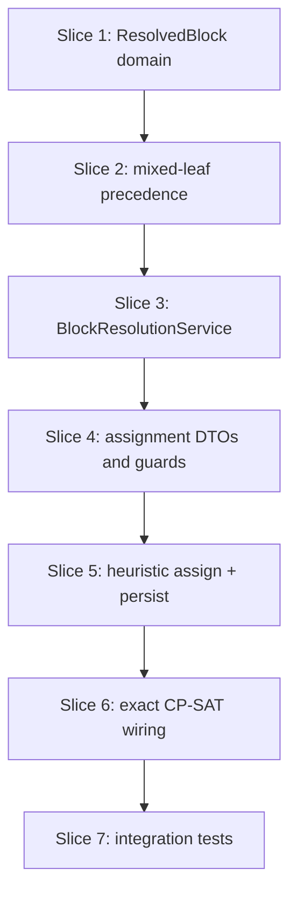

# Plan: Block resolution and phase-1 assignment

**Finalized plan location:** [`docs/plans/v2_block_assignment.md`](../../docs/plans/v2_block_assignment.md)

## Context

V2 Phase 4 per [`docs/v2_cursor_implementation_guide.md`](../../docs/v2_cursor_implementation_guide.md) Phase 4: add **`ResolvedBlock`**, **block resolution traversal**, **full block precedence** (plan-prerequisite + immediate, including task↔block leaves), **heuristic then exact CP-SAT block assignment**, and **`BlockAssignmentService`** persistence to **`block_calendar_entry`** per [`docs/v2_engineering_design.md`](../../docs/v2_engineering_design.md) §4, §11, §13–§14.

**Authority:** V2 design §4.3–§4.4 (block calendar + phase-1 scheduling), §11 (task and block resolution), §13 (`block_calendar_entry`), §14 (INV-BLK-1).

**Current repo state (post Phase 3):**
- Migration head `39ab2bfa6051`; `block_plan`, `block_calendar_entry`, `BlockService`, block prerequisite wiring exist.
- [`calendar_backend/domain/resolution.py`](../../calendar_backend/domain/resolution.py): task-only traversal and `collect_precedence_constraints` (incomplete/completed sets are task IDs only).
- [`calendar_backend/domain/prerequisites.py`](../../calendar_backend/domain/prerequisites.py): `leaf_task_ids_in_subtree` includes blocks; `expand_immediate_precedence` reads **`task_plan`** immediate FK only.
- No `ResolvedBlock`, `BlockResolutionService`, `BlockAssignmentService`, or block solver input mappers.
- Task assignment ([`TaskAssignmentService`](../../calendar_backend/services/task_assignment.py)) uses heuristic + exact CP-SAT over `AssignmentInput`; block phase-1 mirrors this without task-family narrowing.

**Locked clarifications (request-questions):**
- **Block lex objective:** Defer downstream **task-feasibility** lex to Phase 5. Phase 4 objectives = **USER/SYSTEM effective windows + priority paths + precedence** only (same hard-constraint stack as task heuristic/exact, no family-based window narrowing).
- **Block precedence:** **Full** block precedence — extend plan-prerequisite leaf expansion and immediate expansion to **block leaves**, including **task↔block** mixed edges; feed block solver input.
- **Solver rollout:** **Heuristic first** (dedicated slice), then **exact CP-SAT sub-slice** at end of Phase 4 (reuse existing `HeuristicAssignmentSolver` / `ExactAssignmentSolver` via block-shaped `AssignmentInput` mappers — no new solver framework).

Build workflow: loop runs `/build-plan-slice` per slice; no Alembic slices expected (schema complete from Phase 3).



## Non-goals

- Task-feasibility lex objective for block placement (Phase 5).
- `task_plan.allowed_block_families`, effective window narrowing from block placements, block calendar as task occupied intervals (Phase 5).
- `refresh_schedule` orchestration pipeline (Phase 7).
- Free-time assignment changes (Phase 6).
- Block rows on user-facing `CalendarEntry` (INV-BLK-1).
- Deletion preview / conflict analysis for blocks (Phase 7).
- Production HTTP API or new dev CLI commands beyond test fixture updates.
- Sub-minute scheduling.
- New Alembic revisions unless an unexpected schema gap appears.

## Locked assumptions

- **Resolution API:** `resolve_blocks_from_graph(run_started_at, plans) -> ResolveBlocksResult` with four buckets (`valid_incomplete`, `valid_completed`, `invalid_incomplete`, `invalid_completed`), `precedence_constraints`, `warnings`; mirror [`ResolveTasksResult`](../../calendar_backend/domain/resolution.py) shape with `ResolvedBlock` (includes `block_family`).
- **Traversal:** Same goal-child / repetition walk as tasks; emit **BLOCK** leaves only; skip template subtrees; apply inherited constraint errors and effective USER/SYSTEM windows via existing `compute_effective_constraints`.
- **Precedence:** Generalize `collect_precedence_constraints` (or add `collect_block_precedence_constraints` called from block resolution) to use **incomplete/completed schedulable leaf IDs** (tasks **and** blocks). `expand_immediate_precedence` must emit edges for **`block_plan.immediate_prerequisite_plan_id`**. Plan-prerequisite expansion already enumerates block leaves via `leaf_task_ids_in_subtree` — fix ID-set filtering so block leaves participate.
- **`ResolvedPrecedenceConstraint`:** Keep type; field names `predecessor_task_id` / `successor_task_id` remain but hold **any schedulable leaf plan ID** (task or block). Document in dataclass docstring; no rename migration in Phase 4.
- **Service ownership:** [`BlockResolutionService`](../../calendar_backend/services/block_resolution.py) mirrors `TaskResolutionService` (horizon refresh, repetition refresh, invariant validate, graph load with `selectinload(Plan.block_plan)`); [`BlockAssignmentService`](../../calendar_backend/services/block_assignment.py) owns **`block_calendar_entry`** writes per repo convention §14.
- **Assignment API:** `BlockAssignmentService.assign_blocks(resolved: ResolveBlocksResult, run_started_at) -> ServiceResult[BlockAssignmentResult]`.
- **Guards:** `run_started_at` validation + mismatch check; non-empty `invalid_incomplete` → new `MessageCode.INVALID_INCOMPLETE_BLOCKS_BLOCK_ASSIGNMENT`; **no** calendar/run mutations on guard failure (mirror task assignment).
- **Occupied intervals:** Persisted **TASK** `CalendarEntry` rows with `start_time < run_started_at` (same policy as task assignment Phase 4 — block calendar not yet consumed as blockers).
- **Future replacement:** Delete/replace **`block_calendar_entry`** rows with `start_time >= run_started_at` on success; leave past block rows unchanged.
- **Completed blocks:** Excluded from schedulable set (resolution buckets); do not block assignment when only invalid **completed** blocks exist.
- **Solver reuse:** Map `ResolvedBlock` → `SchedulableTask` for [`AssignmentInput`](../../calendar_backend/scheduling/input.py) (duration, divisibility, windows, priority_path; ignore `block_family` in Phase 4 solver). Reuse `HeuristicAssignmentSolver` and `ExactAssignmentSolver` without forking algorithm code.
- **Calendar run:** Successful/failed block assignment persists `CalendarRun` + updates `ActiveCalendarState` analogously to task assignment (same singleton run state — block phase-1 runs before task phase-2 in Phase 7 orchestration).
- **Settings:** Respect `AppSettings.heuristic_enabled` and exact solver limits like task assignment; fail fast when heuristic disabled and exact unavailable.
- **Package placement:** block resolution DTOs in [`calendar_backend/domain/block_resolution.py`](../../calendar_backend/domain/block_resolution.py) (new); block assignment DTOs in [`calendar_backend/domain/block_assignment.py`](../../calendar_backend/domain/block_assignment.py) (new) or extend `domain/assignment.py` only if duplication is real — prefer separate module for block assignment result types. Keep `services/__init__.py` empty.
- **Slice checks:** ruff format, ruff check, pyright; test-creation slices add pytest + **Test catalog** in chat report.

## Slices

### Slice 1: ResolvedBlock domain and block resolution traversal

**Objective:** Add `ResolvedBlock`, `ResolveBlocksResult`, and pure `resolve_blocks_from_graph` with four-bucket partitioning and effective constraint application — no service layer yet.

**Files expected to change:**
- [`calendar_backend/domain/block_resolution.py`](../../calendar_backend/domain/block_resolution.py) (new)
- [`calendar_backend/domain/resolution.py`](../../calendar_backend/domain/resolution.py) — reuse `build_resolution_indexes`, `compute_effective_constraints`, shared partition helpers where duplication is real

**May also change:**
- [`tests/domain/test_block_resolution.py`](../../tests/domain/test_block_resolution.py) (new)

**Implementation steps:**
1. Define frozen `ResolvedBlock` (mirror `ResolvedTask` fields + `block_family: str`).
2. Define `ResolveBlocksResult` with same bucket/precedence/warning shape as tasks.
3. Implement `_BlockCollector` traversal parallel to `_TaskCollector`: visit goal children / repetition instances; emit BLOCK leaves; inherit priority/criticality paths.
4. Apply effective constraints; partition into four buckets; `validate_resolve_blocks_result`.
5. **Precedence stub:** return empty `precedence_constraints` until slice 2 (or call shared collector if slice 2 lands first — prefer empty stub then wire in slice 2).
6. Unit tests: template subtree skipped; invalid duration; completed vs incomplete buckets; effective window inheritance.

**Tests/checks:**
```bash
uv run ruff format .
uv run ruff check .
uv run pyright
uv run pytest tests/domain/test_block_resolution.py -m "not slow and not failure_expected"
```

**Acceptance criteria:**
- Pure resolution produces deterministic four buckets for block-only fixture graphs.
- No SQLAlchemy imports in domain module.

**Risks/edge cases:**
- Mixed goal children (task + block) — block collector must not emit tasks.
- Empty schedulable set is valid.

---

### Slice 2: Mixed-leaf precedence expansion

**Objective:** Extend prerequisite precedence emission so block leaves and task↔block edges feed block (and task) resolution.

**Files expected to change:**
- [`calendar_backend/domain/prerequisites.py`](../../calendar_backend/domain/prerequisites.py)
- [`calendar_backend/domain/resolution.py`](../../calendar_backend/domain/resolution.py) — update `collect_precedence_constraints` to accept schedulable leaf IDs from both task and block resolved sets
- [`calendar_backend/domain/block_resolution.py`](../../calendar_backend/domain/block_resolution.py) — call shared precedence collector
- [`tests/domain/test_prerequisites.py`](../../tests/domain/test_prerequisites.py)
- [`tests/domain/test_block_resolution.py`](../../tests/domain/test_block_resolution.py)

**Implementation steps:**
1. Add helper to collect incomplete/completed **schedulable leaf IDs** from resolved tasks and/or blocks (or accept explicit frozensets).
2. Update `expand_immediate_precedence` to scan `block_plan.immediate_prerequisite_plan_id` in addition to task rows.
3. Update plan-prerequisite expansion filters to use generalized incomplete/completed leaf sets (blocks included).
4. Wire `resolve_blocks_from_graph` and `resolve_tasks_from_graph` to pass correct leaf ID sets into `collect_precedence_constraints`.
5. Tests: plan prereq task→block, block→task, immediate block→block, block→task; completed predecessor omitted; template leaves excluded.

**Tests/checks:**
```bash
uv run ruff format .
uv run ruff check .
uv run pyright
uv run pytest tests/domain/test_prerequisites.py tests/domain/test_block_resolution.py -m "not slow and not failure_expected"
```

**Acceptance criteria:**
- Deterministic sorted precedence edges including mixed task/block leaves.
- Task resolution precedence unchanged for task-only graphs.

**Risks/edge cases:**
- Self-edge skip when predecessor equals successor in same subtree edge expansion.
- Immediate prereq on completed block successor — no edge.

---

### Slice 3: BlockResolutionService

**Objective:** Session-backed service mirroring `TaskResolutionService.resolve_tasks` for blocks.

**Files expected to change:**
- [`calendar_backend/services/block_resolution.py`](../../calendar_backend/services/block_resolution.py) (new)
- [`calendar_backend/services/task_resolution.py`](../../calendar_backend/services/task_resolution.py) — add `selectinload(Plan.block_plan)` to `load_plan_graph` (symmetric wiring)
- [`tests/services/test_block_resolution_service.py`](../../tests/services/test_block_resolution_service.py) (new)

**Implementation steps:**
1. Implement `BlockResolutionService.resolve_blocks(run_started_at)` with horizon/repetition/invariant transaction pattern from task resolution.
2. Reuse `load_plan_graph` (extended load) + `resolve_blocks_from_graph`.
3. Expose read-only `_resolve_from_current_tree` test seam.
4. Service tests: happy path with block under goal; invalid incomplete block present in result; docstring notes assignment guard.

**Tests/checks:**
```bash
uv run ruff format .
uv run ruff check .
uv run pyright
uv run pytest tests/services/test_block_resolution_service.py -m "not slow and not failure_expected"
```

**Acceptance criteria:**
- `resolve_blocks` returns `ResolveBlocksResult` after refresh side effects.
- Graph load includes block subtype rows.

**Risks/edge cases:**
- SQLite timezone normalization for constraint windows (reuse task resolution helper).

---

### Slice 4: Block assignment DTOs and guard path

**Objective:** Add block assignment result types, `MessageCode.INVALID_INCOMPLETE_BLOCKS_BLOCK_ASSIGNMENT`, and `BlockAssignmentService.assign_blocks` precondition path without solver/persistence.

**Files expected to change:**
- [`calendar_backend/domain/block_assignment.py`](../../calendar_backend/domain/block_assignment.py) (new)
- [`calendar_backend/domain/errors.py`](../../calendar_backend/domain/errors.py)
- [`calendar_backend/domain/__init__.py`](../../calendar_backend/domain/__init__.py) — re-export new public symbols
- [`calendar_backend/services/block_assignment.py`](../../calendar_backend/services/block_assignment.py) (new)
- [`calendar_backend/scheduling/input.py`](../../calendar_backend/scheduling/input.py) — `block_assignment_input_from_resolved(...)` mapper
- [`tests/services/test_block_assignment_service.py`](../../tests/services/test_block_assignment_service.py) (new)

**Implementation steps:**
1. Define `BlockCalendarEntryDTO`, `BlockAssignmentResult` (mirror task assignment subset — block entries only, conflicts tuple may be empty stub until failure slice).
2. Add message code + row→DTO mappers for `BlockCalendarEntry`.
3. Implement `assign_blocks` guards: `validate_run_started_at`, `run_started_at` mismatch, `invalid_incomplete` non-empty.
4. Implement `block_assignment_input_from_resolved` mapping blocks to `SchedulableTask` + precedence edges.
5. Tests: guard failures return `fail()` without DB mutations.

**Tests/checks:**
```bash
uv run ruff format .
uv run ruff check .
uv run pyright
uv run pytest tests/services/test_block_assignment_service.py -m "not slow and not failure_expected"
```

**Acceptance criteria:**
- Guard failures produce expected message codes; no `block_calendar_entry` writes.

**Risks/edge cases:**
- Domain barrel export policy — add only public DTOs/errors to `domain/__init__.py`.

---

### Slice 5: Heuristic block assignment and block calendar persistence

**Objective:** Wire heuristic solver, success-path atomic replacement of future block calendar rows, and `CalendarRun` / `ActiveCalendarState` updates.

**Files expected to change:**
- [`calendar_backend/services/block_assignment.py`](../../calendar_backend/services/block_assignment.py)
- [`calendar_backend/domain/block_assignment.py`](../../calendar_backend/domain/block_assignment.py) — insert specs, occupied interval helpers for TASK entries
- [`tests/services/test_block_assignment_service.py`](../../tests/services/test_block_assignment_service.py)

**Implementation steps:**
1. Load occupied intervals from TASK `CalendarEntry` (`start_time < run_started_at`).
2. Load/replace future `block_calendar_entry` (`start_time >= run_started_at`) on success.
3. Run `HeuristicAssignmentSolver` when `heuristic_enabled`; map segments to `BlockCalendarEntry` rows with `display_label` from `ResolvedBlock.name`.
4. Persist SUCCESS `CalendarRun`; update `ActiveCalendarState`.
5. Empty schedulable set → success clearing future block rows.
6. Tests: single block assigned; precedence respected; past block row preserved; guard still no-op on failure.

**Tests/checks:**
```bash
uv run ruff format .
uv run ruff check .
uv run pyright
uv run pytest tests/services/test_block_assignment_service.py -m "not slow and not failure_expected"
```

**Acceptance criteria:**
- INV-BLK-1: no block rows written to `calendar_entry`.
- Future block rows replaced atomically within transaction.

**Risks/edge cases:**
- Divisible block multi-segment rows — one row per segment like tasks.
- Heuristic disabled without exact → fail fast (until slice 6).

---

### Slice 6: Exact CP-SAT block assignment wiring

**Objective:** Add exact-first + heuristic fallback path to `BlockAssignmentService`, reusing `ExactAssignmentSolver` and component decomposition like task assignment — **no** task-feasibility lex objective.

**Files expected to change:**
- [`calendar_backend/services/block_assignment.py`](../../calendar_backend/services/block_assignment.py)
- [`tests/services/test_block_assignment_service.py`](../../tests/services/test_block_assignment_service.py)
- [`tests/scheduling/test_block_assignment_solver.py`](../../tests/scheduling/test_block_assignment_solver.py) (new, if pure mapper tests help)

**Implementation steps:**
1. Mirror task assignment solver pipeline: exact attempt per settings/limits, heuristic fallback, `validate_full_assignment`.
2. Failure path: leave block calendar unchanged; persist FAILED `CalendarRun` (conflict analysis deferred to Phase 7 — minimal failure summary like early task assignment).
3. Tests: exact path assigns small fixture; heuristic fallback when exact guard trips; infeasible precedence returns failed run without calendar mutation.

**Tests/checks:**
```bash
uv run ruff format .
uv run ruff check .
uv run pyright
uv run pytest tests/services/test_block_assignment_service.py tests/scheduling/test_block_assignment_solver.py -m "not slow and not failure_expected"
```

**Acceptance criteria:**
- Block assignment uses same solver stack as tasks for hard constraints + priority ordering.
- No OR-Tools import from services (scheduling package only).

**Risks/edge cases:**
- OR-Tools optional import — skip exact tests when unavailable if repo pattern requires marker (follow existing `test_exact_cp_sat` conventions).

---

### Slice 7: Block resolution and assignment integration tests

**Objective:** End-to-end smoke: resolve → assign blocks with precedence and persistence; post **Test catalog**.

**Files expected to change:**
- [`tests/services/test_block_resolution_service.py`](../../tests/services/test_block_resolution_service.py)
- [`tests/services/test_block_assignment_service.py`](../../tests/services/test_block_assignment_service.py)
- [`tests/domain/test_block_resolution.py`](../../tests/domain/test_block_resolution.py)

**Implementation steps:**
1. Integration: master goal with two blocks + plan prereq; resolve then assign; assert `block_calendar_entry` order respects precedence.
2. Integration: immediate prereq task→block affects block resolution edges (domain) and assignment ordering.
3. Integration: invalid incomplete block blocks assignment (`INVALID_INCOMPLETE_BLOCKS_BLOCK_ASSIGNMENT`).
4. Post **Test catalog** for all new/changed tests in this phase.

**Tests/checks:**
```bash
uv run ruff format .
uv run ruff check .
uv run pyright
uv run pytest tests/domain/test_block_resolution.py tests/services/test_block_resolution_service.py tests/services/test_block_assignment_service.py -m "not slow and not failure_expected"
```

**Acceptance criteria:**
- Cross-service resolve+assign path works on shared fixtures.
- Test catalog covers every new test function.

**Risks/edge cases:**
- Fixture clock alignment for minute-grid windows.

---

## Abstraction check

| Introduced | Needed now? |
|---|---|
| `ResolvedBlock` / `ResolveBlocksResult` | **Yes** — V2 §11 block resolution DTOs (mirrors existing task resolution types). |
| `BlockResolutionService` | **Yes** — service-layer entry parallel to `TaskResolutionService`. |
| `BlockAssignmentService` | **Yes** — owns `block_calendar_entry` writes per Phase 3 deferral. |
| `block_assignment_input_from_resolved` | **Yes** — maps resolution DTOs to existing solver input (removes duplication at solver boundary). |
| Separate block heuristic solver class | **No** — reuse `HeuristicAssignmentSolver` / `ExactAssignmentSolver`. |
| Block conflict analysis service | **No** — Phase 7. |

## Dependency changes

None — OR-Tools already optional for exact task solver; block exact slice reuses existing dependency.

## Open questions

None — request-questions completed; locked clarifications above govern build.
