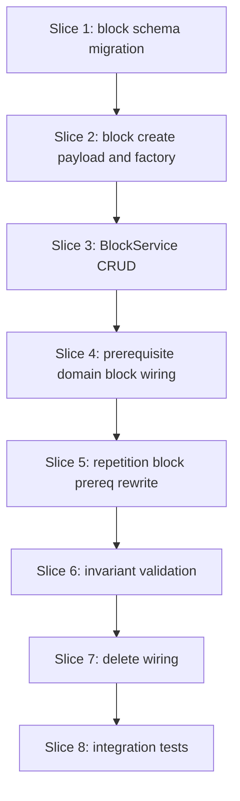

# Plan: Block ORM and block calendar schema

**Finalized plan location:** [`docs/plans/v2_block_orm.md`](../../docs/plans/v2_block_orm.md)

## Context

V2 Phase 3 per [`docs/v2_cursor_implementation_guide.md`](../../docs/v2_cursor_implementation_guide.md) Phase 3: add **`PlanKind.BLOCK`**, **`BlockPlan`**, **`BlockCalendarEntry`**, and **block services** (CRUD parity with tasks where applicable) per [`docs/v2_engineering_design.md`](../../docs/v2_engineering_design.md) §3–§4, §5.2–§5.3, §13–§14.

**Authority:** V2 design §3.1 (plan kinds), §4 (blocks), §5.2 (plan completion includes block leaves), §5.3 (immediate prereqs on tasks and blocks), §13 (persistence sketch), §14 (INV-BLK-1, INV-CPL-1, INV-PRQ-3).

**Current repo state (post Phase 2):**
- Migration head `12d2c5cab97e`; `plan_prerequisite`, `task_plan.immediate_prerequisite_plan_id` exist.
- [`calendar_backend/domain/enums.py`](../../calendar_backend/domain/enums.py): `PlanKind` has GOAL/TASK/REPETITION only.
- [`calendar_backend/domain/prerequisites.py`](../../calendar_backend/domain/prerequisites.py): leaf enumeration and completion count **task** leaves only; immediate prereq validation requires **TASK** predecessor and successor.
- [`calendar_backend/services/repetition.py`](../../calendar_backend/services/repetition.py): pass-2 rewrite handles `task_plan.immediate_prerequisite_plan_id` only.
- No `block_plan`, `block_calendar_entry`, `BlockService`, or block create payload.

**Locked clarifications (request-questions):**
- Phase 3 **includes** block-aware prerequisite wiring: `is_plan_subtree_complete`, immediate prereq validation (task↔block), repetition pass-2 rewrite for `block_plan.immediate_prerequisite_plan_id`, and INV-PRQ coverage for blocks — in addition to schema and `BlockService` CRUD.
- **`task_plan.allowed_block_families` deferred to Phase 5** — Phase 3 migration adds `block_plan` + `block_calendar_entry` only.
- **`BlockCalendarEntry`:** schema + ORM only; **no write/delete persistence helpers** in Phase 3 (Phase 4 `BlockAssignmentService` owns writes).
- **`block_family`:** non-empty string validated at service write; no enum CHECK in Phase 3 migration.
- Blocks created via **`GoalService.create_child`** with new **`BlockCreatePayload`**; self-edit via separate **`BlockService`** mirroring `TaskService` ([repo convention §14](../../.cursor/repo_conventions.md)).

Build workflow: loop runs build slices; Alembic slice 1 uses five-step pattern per V2 guide §0.2.



## Non-goals

- `ResolvedBlock`, block resolution traversal, block assignment, OR-Tools changes (Phase 4).
- `task_plan.allowed_block_families` column and task window narrowing (Phase 5).
- `BlockCalendarEntry` insert/replace/clear services or refresh_schedule orchestration (Phases 4–7).
- Block precedence emission in `collect_precedence_constraints` for block leaves (Phase 4 — task-only resolution remains until block assignment phase).
- Deletion preview / conflict analysis for blocks (Phase 7).
- Production HTTP API or new dev CLI commands beyond test fixture updates.

## Locked assumptions

- **`block_plan`:** 1:1 with `plan` where `plan_kind = BLOCK`; fields mirror `task_plan` scheduling/completion columns plus **`block_family: str`** (non-empty); **`immediate_prerequisite_plan_id`** nullable FK → `plan.plan_id`.
- **`block_calendar_entry`:** separate from `calendar_entry`; columns analogous to task calendar rows (`start_time`, `end_time`, `source_plan_id` → block plan, `calendar_run_id`, timestamps); **no** `entry_type` mixing with task/free-time enums unless a dedicated block entry type is required — use block-only table with FK to block plan.
- **`PlanKind.BLOCK`:** added to domain enum and SQLite `plan_kind` string column (no separate migration enum type).
- **ORM:** new [`calendar_backend/models/blocks.py`](../../calendar_backend/models/blocks.py) with `BlockPlan` and `BlockCalendarEntry`; `Plan.block_plan` relationship; import in `env.py`.
- **Validation reuse:** block scheduling fields use shared divisibility rules with tasks via new [`calendar_backend/domain/blocks.py`](../../calendar_backend/domain/blocks.py) helpers (or shared extract from `tasks.py` only if duplication is real now).
- **Immediate prereq ownership:** `TaskService` keeps task-row immediate edits; **`BlockService`** owns `block_plan.immediate_prerequisite_plan_id` mutations.
- **Delete order:** remove `block_calendar_entry` and null cross-leaf immediate FKs before deleting `block_plan` / `plan` rows (SQLite RESTRICT).
- **Migration slice 1:** five-step pattern; schema tests with `failure_expected` until `/db-revision-continue`.

## Slices

### Slice 1: Block schema migration

**Objective:** Add `PlanKind.BLOCK`, `block_plan`, and `block_calendar_entry` tables via Alembic; ORM mappings only in pre-alembic (no service behavior yet).

**Files expected to change:**
- [`calendar_backend/domain/enums.py`](../../calendar_backend/domain/enums.py)
- [`calendar_backend/models/blocks.py`](../../calendar_backend/models/blocks.py) (new)
- [`calendar_backend/models/plans.py`](../../calendar_backend/models/plans.py)
- [`calendar_backend/db/migrations/env.py`](../../calendar_backend/db/migrations/env.py)
- [`tests/models/test_blocks_schema.py`](../../tests/models/test_blocks_schema.py) (new)

**May also change:**
- [`calendar_backend/models/__init__.py`](../../calendar_backend/models/__init__.py) — docstring-only

**Implementation steps:**
1. **pre-alembic:** Add `PlanKind.BLOCK`; `BlockPlan` + `BlockCalendarEntry` ORM with CHECKs mirroring task divisibility rules + `block_family` non-empty CHECK; `Plan.block_plan` relationship; import blocks in `env.py`. Schema tests: tables in metadata, FKs, PKs, CHECK names; mark `failure_expected` until continue.
2. **`/db-revision-preview`** — message: `add block plan and block calendar schema`.
3. **Migration manual edit:** Create `block_plan` and `block_calendar_entry` with named FKs/CHECKs per [repo convention §4](../../.cursor/repo_conventions.md); ensure `plan_kind` accepts `BLOCK` (string enum — no ALTER to enum type).
4. **`/db-revision-continue`:** `upgrade head`; unmark `failure_expected`; pytest models.
5. **post-alembic:** Confirm no service reads/writes block tables yet.

**Tests/checks:**
```bash
uv run ruff format .
uv run ruff check .
uv run pyright
uv run pytest tests/models/test_blocks_schema.py -m "not slow and not failure_expected"
```

**Acceptance criteria:**
- DB has `block_plan` and `block_calendar_entry` with expected constraints.
- ORM metadata matches migration; no runtime service usage required yet.

**Risks/edge cases:**
- Mirror task_plan CHECK set on block_plan; `block_family` CHECK `length(trim(block_family)) > 0` or service-only validation if CHECK awkward in SQLite.
- `block_calendar_entry.source_plan_id` FK must reference block plans only (service-enforced; optional CHECK deferred).

---

### Slice 2: Block create payload and plan tree factory

**Objective:** Create block plans under goals via `GoalService.create_child` with validated payload and `PlanTreeFactory.make_block`.

**Files expected to change:**
- [`calendar_backend/domain/plan_create.py`](../../calendar_backend/domain/plan_create.py)
- [`calendar_backend/domain/blocks.py`](../../calendar_backend/domain/blocks.py) (new)
- [`calendar_backend/services/plan_tree.py`](../../calendar_backend/services/plan_tree.py)
- [`calendar_backend/services/goal.py`](../../calendar_backend/services/goal.py)
- [`calendar_backend/domain/dtos.py`](../../calendar_backend/domain/dtos.py) — `BlockPlanDTO` if needed for symmetry
- [`tests/services/test_goal_service.py`](../../tests/services/test_goal_service.py)

**Implementation steps:**
1. Add `BlockCreatePayload(name, duration_minutes, divisible, minimum_chunk_size_minutes, block_family)`.
2. `validate_block_create` / `validate_block_scheduling_fields` — reuse task divisibility rules; reject empty `block_family`.
3. Wire `validate_create_payload`, `PlanTreeFactory.make_block`, `make_from_create_payload` for `PlanKind.BLOCK`.
4. Extend `GoalService.create_child` overload for BLOCK; attach under parent goal like tasks.
5. Tests: happy-path create; invalid family/scheduling fields rejected.

**Tests/checks:**
```bash
uv run ruff format .
uv run ruff check .
uv run pyright
uv run pytest tests/services/test_goal_service.py -m "not slow and not failure_expected"
```

**Acceptance criteria:**
- Block plan rows persist with `plan_kind=BLOCK` and matching `block_plan` subtype row.
- Invalid payloads fail transactionally with `ServiceMessage`.

**Risks/edge cases:**
- Mixed goal children (task + block siblings) use same ordering fields as tasks.
- Template/repetition template blocks follow existing clone_status rules on create.

---

### Slice 3: BlockService CRUD and immediate prerequisite API

**Objective:** `BlockService` self-edit surface mirroring `TaskService`: scheduling fields, completion, immediate prereq set/clear with trace validation (task or block predecessor).

**Files expected to change:**
- [`calendar_backend/services/block.py`](../../calendar_backend/services/block.py) (new)
- [`calendar_backend/domain/prerequisites.py`](../../calendar_backend/domain/prerequisites.py) — extend `validate_immediate_prerequisite_link` for TASK|BLOCK leaves
- [`calendar_backend/domain/errors.py`](../../calendar_backend/domain/errors.py) — codes if needed (reuse immediate prereq codes)
- [`tests/services/test_block_service.py`](../../tests/services/test_block_service.py) (new)

**Implementation steps:**
1. `BlockService.update_scheduling_fields`, `mark_complete`, `reopen` — mirror task behavior including `detach_linked_self_and_descendants`.
2. `set_immediate_prerequisite` / `clear_immediate_prerequisite` on block rows; predecessor must be TASK or BLOCK with matching trace.
3. DTO helper `block_plan_dto_from_rows` in `domain/dtos.py`.
4. Tests: CRUD happy paths; trace mismatch; non-leaf predecessor rejected; linked-clone detach on mutation.

**Tests/checks:**
```bash
uv run ruff format .
uv run ruff check .
uv run pyright
uv run pytest tests/services/test_block_service.py -m "not slow and not failure_expected"
```

**Acceptance criteria:**
- `block_plan` fields update transactionally; immediate FK persisted/cleared with validation messages on violation.

**Risks/edge cases:**
- Predecessor validation loads graph like `TaskService._load_plans_by_id`.
- Self-edge and missing plan errors mirror task immediate API.

---

### Slice 4: Prerequisite domain block-aware completion

**Objective:** Extend plan completion and leaf enumeration to include block leaves; update `TaskService` immediate validation call path if shared helper changes signature.

**Files expected to change:**
- [`calendar_backend/domain/prerequisites.py`](../../calendar_backend/domain/prerequisites.py)
- [`tests/domain/test_prerequisites.py`](../../tests/domain/test_prerequisites.py)

**Implementation steps:**
1. Rename or generalize `leaf_task_ids_in_subtree` → collect **task and block** leaf plan IDs (keep exported name or add alias — prefer single function used by completion/precedence).
2. `is_plan_subtree_complete` treats block leaves with `user_completed` like tasks.
3. Tests: goal with task + block children; completion true/false cases.

**Tests/checks:**
```bash
uv run ruff format .
uv run ruff check .
uv run pyright
uv run pytest tests/domain/test_prerequisites.py -m "not slow and not failure_expected"
```

**Acceptance criteria:**
- Incomplete block leaf causes subtree incomplete; all task+block leaves completed → complete.

**Risks/edge cases:**
- Empty subtree (goal with no leaves) completion semantics unchanged (vacuously complete).

---

### Slice 5: Repetition pass-2 block immediate prerequisite rewrite

**Objective:** Extend `_rewrite_clone_prerequisite_refs` to rewrite `block_plan.immediate_prerequisite_plan_id` on cloned block rows.

**Files expected to change:**
- [`calendar_backend/services/repetition.py`](../../calendar_backend/services/repetition.py)
- [`tests/services/test_repetition_service.py`](../../tests/services/test_repetition_service.py)

**Implementation steps:**
1. In pass-2 rewrite loop, for each template plan with `block_plan`, copy/rewrite immediate FK on clone `block_plan` using clone map (same rules as task immediate rewrite).
2. Test: template goal with two block children + immediate link → instance clones reference clone IDs.

**Tests/checks:**
```bash
uv run ruff format .
uv run ruff check .
uv run pyright
uv run pytest tests/services/test_repetition_service.py -m "not slow and not failure_expected"
```

**Acceptance criteria:**
- After `generate_instances`, clone block rows reference clone IDs for template-local immediate prereqs.

**Risks/edge cases:**
- Master-tree immediate targets unchanged; missing clone map entry fails transaction.

---

### Slice 6: Block and prerequisite invariant validation

**Objective:** ORM invariant checks for BLOCK subtype pairing, block completion pairing, and immediate prereq trace parity on block rows.

**Files expected to change:**
- [`calendar_backend/domain/invariant_validation.py`](../../calendar_backend/domain/invariant_validation.py)
- [`calendar_backend/services/plan_tree_invariant.py`](../../calendar_backend/services/plan_tree_invariant.py)
- [`tests/domain/test_invariant_validation.py`](../../tests/domain/test_invariant_validation.py)
- [`tests/services/test_plan_tree_invariant_service.py`](../../tests/services/test_plan_tree_invariant_service.py)

**Implementation steps:**
1. Extend `_PLAN_KIND_TO_DETAIL_ATTR` and `_check_subtype_pairing` for BLOCK ↔ `block_plan`.
2. Extend `_check_task_completion_pairing` to block rows (or parallel `_check_block_completion_pairing` if clearer).
3. Extend `_check_plan_prerequisites` immediate trace checks to cover `block_plan.immediate_prerequisite_plan_id`.
4. Eager-load `block_plan` in invariant service graph loader.
5. Tests: valid block graph passes; injected violations detected.

**Tests/checks:**
```bash
uv run ruff format .
uv run ruff check .
uv run pyright
uv run pytest tests/domain/test_invariant_validation.py tests/services/test_plan_tree_invariant_service.py -m "not slow and not failure_expected"
```

**Acceptance criteria:**
- INV-CPL-1 and INV-PRQ-3 cover block leaves; invariant service loads block subtype without N+1.

**Risks/edge cases:**
- Do not re-check CHECK-covered divisibility rules in invariants ([repo convention §8](../../.cursor/repo_conventions.md)).

---

### Slice 7: Delete wiring for blocks and block calendar rows

**Objective:** Extend plan delete execution to remove `block_calendar_entry` rows, null immediate FKs pointing at deleted blocks, and delete `block_plan` rows in correct FK order.

**Files expected to change:**
- [`calendar_backend/services/plan_tree.py`](../../calendar_backend/services/plan_tree.py)
- [`tests/services/test_plan_tree_service.py`](../../tests/services/test_plan_tree_service.py)

**Implementation steps:**
1. In `_execute_plan_deletes`: delete `block_calendar_entry` where `source_plan_id` in affected set; null `task_plan.immediate_prerequisite_plan_id` and `block_plan.immediate_prerequisite_plan_id` pointing at affected plans; delete `block_plan` before plan waves (mirror task_plan delete order).
2. Tests: delete block plan with calendar entry row (insert via test session) succeeds; no orphan block_calendar rows.

**Tests/checks:**
```bash
uv run ruff format .
uv run ruff check .
uv run pyright
uv run pytest tests/services/test_plan_tree_service.py -m "not slow and not failure_expected"
```

**Acceptance criteria:**
- Plan delete with block subtree and block_calendar_entry present succeeds; FK RESTRICT not violated.

**Risks/edge cases:**
- Delete waves must remove children before parents; block entries before block plans.

---

### Slice 8: Block ORM integration tests

**Objective:** End-to-end smoke across create → BlockService edit → immediate prereq between task and block → invariant pass → delete.

**Files expected to change:**
- [`tests/services/test_block_service.py`](../../tests/services/test_block_service.py)
- [`tests/services/test_plan_tree_service.py`](../../tests/services/test_plan_tree_service.py)

**Implementation steps:**
1. Integration test: master goal with task + block; set immediate prereq both directions (separate cases); tree invariant passes.
2. Integration test: delete prerequisite block clears dependent immediate FK and plan_prerequisite edges (extend existing delete tests if needed).
3. Post **Test catalog** for new/changed tests.

**Tests/checks:**
```bash
uv run ruff format .
uv run ruff check .
uv run pyright
uv run pytest tests/services/test_block_service.py tests/services/test_plan_tree_service.py -m "not slow and not failure_expected"
```

**Acceptance criteria:**
- Cross-leaf immediate prereq between task and block works under master tree; delete leaves consistent graph.

**Risks/edge cases:**
- Trace mismatch between master-only task and template block still rejected (existing trace rules).

---

## Abstraction check

| Introduced | Needed now? |
|---|---|
| `BlockService` | **Yes** — subtype self-edit per repo convention §14 (mirrors `TaskService`). |
| `domain/blocks.py` | **Yes** — block scheduling validation shared by create and update paths. |
| `models/blocks.py` | **Yes** — persistence mapping for block subtype and block calendar. |
| Block/task unified leaf service | **No** — extend existing `prerequisites.py` helpers only. |
| Block calendar repository | **No** — Phase 4 assignment owns writes; Phase 3 delete uses direct SQLAlchemy in plan_tree. |

## Dependency changes

None — no new uv packages.

## Open questions

None — request-questions completed; locked clarifications above govern build.
