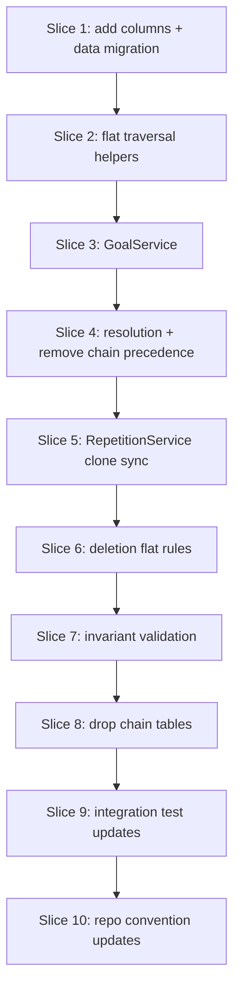

# Plan: Flat goal children (remove chains)

**Finalized plan location:** [`docs/plans/v2_flat_goal_children.md`](../../docs/plans/v2_flat_goal_children.md)

## Context

V2 Phase 1 per [`docs/v2_cursor_implementation_guide.md`](../../docs/v2_cursor_implementation_guide.md) Phase 1 and Prompt V2-1: replace V1 **goal child chains** with **direct ordering fields** on `Plan` rows under goal parents, migrate existing data, update traversal, services, invariants, deletion, and tests.

**Authority:** [`docs/v2_engineering_design.md`](../../docs/v2_engineering_design.md) §3 (flat goal children), §8.2 (clone sync), §11 (traversal / precedence), §12 (deletion), §13–§15 (persistence sketch, INV-GCH-1, V1→V2 migration).

**Current repo state:**
- Chain ORM in [`calendar_backend/models/chains.py`](../../calendar_backend/models/chains.py); `GoalPlan.chains` relationship in [`calendar_backend/models/plans.py`](../../calendar_backend/models/plans.py).
- Chain layout in [`calendar_backend/services/goal.py`](../../calendar_backend/services/goal.py); clone sync in [`calendar_backend/services/repetition.py`](../../calendar_backend/services/repetition.py) (`_sync_clone_goal_chains`).
- Chain traversal in [`calendar_backend/domain/plan_traversal.py`](../../calendar_backend/domain/plan_traversal.py) and [`calendar_backend/domain/resolution.py`](../../calendar_backend/domain/resolution.py); chain precedence via `goal_child_chain_order`.
- Chain deletion expansion in [`calendar_backend/domain/deletion.py`](../../calendar_backend/domain/deletion.py).
- Chain invariant checks in [`calendar_backend/domain/invariant_validation.py`](../../calendar_backend/domain/invariant_validation.py).
- Migration head: `7111454550a7`; chain tables created in `be7d178b7c5a`.

**Locked clarifications (request-questions):**
- Column names: `plan.goal_is_critical`, `plan.goal_sort_order` (nullable; set when parent is a goal).
- Ordering scope: goal-parent direct children only; repetition instances keep `is_critical` / `sort_order`; template roots under shells stay outside goal ordering.
- Sort rule: `(goal_is_critical DESC, goal_sort_order ASC)`; dense `0..n-1` per `(parent_goal_id, goal_is_critical)`.
- Master children remain non-critical only.
- Data migration: flatten V1 chains — order chains by `(is_critical, chain.sort_order)`, then items by `position`; assign contiguous `goal_sort_order` per bucket.
- Phase 1 removes chain adjacency precedence; **no** `plan_prerequisite` edges until Phase 2.
- Deletion: V2 §12 **critical sibling** expansion replaces V1 whole-chain expansion; non-critical deletes are single-plan + descendants (no sibling expansion).
- Drop chain tables only after all readers/writers use flat fields (V2 §15 step 4).

Build workflow: use `/build-plan-slice` per slice against this file; stop after each slice for approval.



## Non-goals

- Plan-level prerequisites, immediate prerequisites, `plan_prerequisite` table (Phase 2).
- Block ORM, block calendar, two-phase scheduling, orchestration pipeline changes (Phases 3–7).
- Production HTTP API, dev CLI behavior changes beyond test fixture updates.
- OR-Tools / solver algorithm changes (update tests only where chain precedence assumptions change).
- Re-linking DETACHED clones or repetition template semantics beyond clone ordering sync.

## Locked assumptions

- **Ordering columns on `Plan`:** `goal_is_critical: bool | None`, `goal_sort_order: int | None`. NULL when the plan is not a direct ordered child of a goal (master, template roots under shells, structural `parent_id` children of non-goals).
- **CHECK constraints (SQLite-friendly):**
  - `(goal_is_critical IS NULL AND goal_sort_order IS NULL) OR (goal_is_critical IS NOT NULL AND goal_sort_order IS NOT NULL AND goal_sort_order >= 0)`.
  - Master goal direct children: `goal_is_critical = 0` when parent is master (enforce in service + invariant; optional CHECK via parent join deferred to migration manual edit if autogen misses it).
- **`GoalService` public API after slice 3:**
  - `create_child(..., is_critical: bool)` — sets `goal_is_critical` and appends at end of bucket (`goal_sort_order = max + 1` or `0`).
  - `move_plan(plan_id, position: int)` — reorder within current `(parent_id, goal_is_critical)` bucket; dense renumber after move.
  - `move_plan(plan_id, is_critical: bool, position: int)` — move to another criticality bucket under the same parent goal at `position`; dense renumber both buckets.
  - No reparenting; no `chain_index` overload.
- **Traversal:** replace `ordered_chains` / `sorted_chain_items` with `ordered_goal_children(parent_plan, all_plans_by_id)` or equivalent using loaded `Plan.children` filtered to goal-ordered direct children.
- **Resolution DTOs:** remove `chain_path`, `source_chain_id`, and chain-related `ChainPathStep`; keep `criticality_path` / priority path steps aligned with flat ordering.
- **Migration slices:** use five-step pattern per [V2 guide §0.2](../../docs/v2_cursor_implementation_guide.md); reference [`/db-revision-preview`](../../.cursor/commands/db-revision-preview.md) and [`/db-revision-continue`](../../.cursor/commands/db-revision-continue.md) in slice text.
- **Slice checks:** ordinary slices → ruff format, ruff check, pyright; test-creation slices add pytest + **Test catalog** in chat report.
- **Schema tests before migration:** `@pytest.mark.failure_expected`; remove marker in slice 1 `/db-revision-continue` (add columns) and slice 8 `/db-revision-continue` (drop chains).

## Slices

### Slice 1: Goal ordering columns and data migration

**Objective:** Add `goal_is_critical` / `goal_sort_order` to `plan`; migrate chain data into direct fields; keep chain tables until slice 8.

**Files expected to change:**
- [`calendar_backend/models/plans.py`](../../calendar_backend/models/plans.py)
- [`tests/models/test_plans_schema.py`](../../tests/models/test_plans_schema.py)

**May also change:**
- [`calendar_backend/db/migrations/env.py`](../../calendar_backend/db/migrations/env.py) — only if preview requires import verification

**Implementation steps:**
1. **pre-alembic (build-plan-slice):** Add nullable `goal_is_critical` and `goal_sort_order` columns on `Plan` with CHECK per locked assumptions. Do **not** remove `GoalPlan.chains` yet. Add schema INSERT tests for column nullability and CHECK violations; mark `failure_expected` per [repo convention §13](../../.cursor/repo_conventions.md).
2. **`/db-revision-preview`** — message: `add goal child ordering columns on plan`.
3. **Migration manual edit:** Ensure data migration SQL (or batch op) copies chain membership:
   - For each `goal_child_chain` ordered by `(parent_goal_id, is_critical, sort_order)` and items by `position`, set child `plan.goal_is_critical = chain.is_critical`, `goal_sort_order = running_index` per `(parent_goal_id, is_critical)` bucket.
   - Assert no direct goal child (non-TEMPLATE, parent is goal) lacks ordering after copy; abort migration if orphan chain membership found.
   - Apply CHECK constraints and naming per [repo convention §4](../../.cursor/repo_conventions.md).
4. **`/db-revision-continue`:** `upgrade head`; remove `failure_expected` from slice 1 schema tests; pytest.
5. **post-alembic:** Verify migrated dev DB rows: spot-check chain rows match flat fields; no service code changes yet (readers may still use chains).

**Tests/checks:**
```bash
uv run ruff format .
uv run ruff check .
uv run pyright
uv run pytest tests/models/test_plans_schema.py -m "not slow and not failure_expected"
```

**Acceptance criteria:**
- `plan` table has nullable ordering columns with CHECK enforced after migration.
- Existing DB data: every chain item child has matching `goal_is_critical` / `goal_sort_order`.
- Chain tables still present; no production code path required to read new columns yet.

**Risks/edge cases:**
- Multiple V1 chains in one bucket flatten to one dense sequence — preserve global order via chain `sort_order` then item `position`.
- Template goal children under template goals must receive ordering fields during migration if they had chain rows.

---

### Slice 2: Flat goal-child traversal helpers

**Objective:** Replace chain-based ordering helpers in `plan_traversal.py` with flat goal-child sort utilities used by resolution, free-time, and invariants.

**Files expected to change:**
- [`calendar_backend/domain/plan_traversal.py`](../../calendar_backend/domain/plan_traversal.py)
- [`tests/domain/test_plan_traversal.py`](../../tests/domain/test_plan_traversal.py) (new)

**May also change:**
- [`calendar_backend/domain/free_time.py`](../../calendar_backend/domain/free_time.py) — switch call sites from `ordered_chains` to new helpers if touched for compile

**Implementation steps:**
1. Add `ordered_goal_children(parent: Plan, *, children: tuple[Plan, ...] | None = None) -> tuple[Plan, ...]` sorting by `(not goal_is_critical, goal_sort_order, str(plan_id))` — critical-first matches V2 §11.1 (`goal_is_critical DESC`).
2. Add helper to collect direct children of a goal from a loaded graph (filter `parent_id == goal.plan_id`, exclude `CloneStatus.TEMPLATE` roots under repetition shells per existing conventions).
3. Remove `ordered_chains` and `sorted_chain_items` (or deprecate with thin wrappers only if needed for interim compile — prefer delete once call sites updated in slice 4).
4. Keep `ordered_repetition_instances` unchanged.
5. Pure unit tests: critical-before-non-critical; dense sort_order within bucket; stable tie-break by plan_id.

**Tests/checks:**
```bash
uv run ruff format .
uv run ruff check .
uv run pyright
uv run pytest tests/domain/test_plan_traversal.py -m "not slow"
```

**Acceptance criteria:**
- Flat sort matches V1 chain-walk order for fixture graphs that have both chain rows and migrated columns (test with ORM objects carrying both during transition).
- No imports from `calendar_backend.models.chains` in `plan_traversal.py` after slice completes (may temporarily remain if slice 4 not yet done — finish removal in slice 4).

**Risks/edge cases:**
- Children with NULL ordering under goals should not appear in ordered list — invariant slice 7 will flag; traversal skips or treats as error per convention.

---

### Slice 3: GoalService flat ordering

**Objective:** Replace `_attach_to_goal_chain` and chain-based `move_plan` with direct field persistence on `Plan`.

**Files expected to change:**
- [`calendar_backend/services/goal.py`](../../calendar_backend/services/goal.py)
- [`tests/services/test_goal_service.py`](../../tests/services/test_goal_service.py)

**May also change:**
- [`calendar_backend/services/plan_tree.py`](../../calendar_backend/services/plan_tree.py) — remove chain row creation/deletion on create paths if any remain outside GoalService

**Implementation steps:**
1. **`create_child`:** After `PlanTreeService` creates plan with `parent_id`, set `goal_is_critical` and append `goal_sort_order` at bucket end; stop creating `GoalChildChain` / `GoalChildChainItem` rows (dual-write to chains optional only if needed before slice 8 — prefer stop writing chains immediately).
2. **`move_plan(plan_id, position)`:** Load child under goal parent; reorder within bucket; dense-renumber `goal_sort_order`.
3. **`move_plan(plan_id, is_critical, position)`:** Cross-bucket move under same parent; renumber source and target buckets.
4. Preserve validations: master rejects critical children; parent must be goal; no reparenting.
5. Remove module-private chain helpers (`_create_chain_at_bucket_end`, `_attach_to_goal_chain`, chain item loaders).
6. Update tests: replace chain assertions with ordering field assertions; cover within-bucket and cross-bucket moves, master non-critical rule.

**Tests/checks:**
```bash
uv run ruff format .
uv run ruff check .
uv run pyright
uv run pytest tests/services/test_goal_service.py -m "not slow"
```

**Acceptance criteria:**
- New creates and moves persist only flat fields (no new chain rows after this slice).
- `PlanTreeInvariantService.validate_master_tree()` passes on graphs built via GoalService (may still fail chain invariants until slice 7 — note in report if expected).

**Risks/edge cases:**
- Concurrent moves rare in tests; use transaction isolation as today.
- `@overload` stubs updated for new `move_plan` signature per [repo convention §10](../../.cursor/repo_conventions.md).

---

### Slice 4: Resolution flat traversal and remove chain precedence

**Objective:** Walk goal subtrees via flat ordering; remove chain adjacency precedence collection and chain DTO fields.

**Files expected to change:**
- [`calendar_backend/domain/resolution.py`](../../calendar_backend/domain/resolution.py)
- [`calendar_backend/services/task_resolution.py`](../../calendar_backend/services/task_resolution.py)
- [`tests/domain/test_resolution.py`](../../tests/domain/test_resolution.py)

**May also change:**
- [`calendar_backend/domain/free_time.py`](../../calendar_backend/domain/free_time.py)
- [`tests/domain/test_free_time.py`](../../tests/domain/test_free_time.py)
- [`tests/services/test_task_resolution_service.py`](../../tests/services/test_task_resolution_service.py)

**Implementation steps:**
1. Replace `traverse_goal_chains` with flat child traversal using slice 2 helpers.
2. Remove `collect_precedence_constraints` chain walking (`goal_child_chain_order` edges). Precedence list empty of chain edges until Phase 2 plan prerequisites.
3. Remove `chain_path`, `ChainPathStep`, `source_chain_id` from resolution DTOs and collectors; update `priority_path` / `criticality_path` to use goal-child steps without chain IDs.
4. Update `TaskResolutionService` eager loads: drop `GoalPlan.chains` selectinload; load `Plan.children` as needed.
5. Update free-time prerequisite walking if it used chain helpers.
6. Rewrite tests: traversal order unchanged vs V1 fixtures; remove precedence tests that asserted chain touch-order (or mark behavior change — assignment defers to slice 9).

**Tests/checks:**
```bash
uv run ruff format .
uv run ruff check .
uv run pyright
uv run pytest tests/domain/test_resolution.py tests/domain/test_free_time.py -m "not slow"
```

**Acceptance criteria:**
- Resolved task ordering matches critical-first flat goal-child order for nested goals and repetition instance clones.
- No chain IDs in resolution output; no precedence edges from goal child order.

**Risks/edge cases:**
- Tests importing `GoalChildChain` for fixture setup may remain until slice 8; prefer building fixtures via GoalService with migrated columns.

---

### Slice 5: RepetitionService clone ordering sync

**Objective:** Replace `_sync_clone_goal_chains` with direct copy of `goal_is_critical` / `goal_sort_order` from template goal children to matching clone goal children.

**Files expected to change:**
- [`calendar_backend/services/repetition.py`](../../calendar_backend/services/repetition.py)
- [`tests/services/test_repetition_service.py`](../../tests/services/test_repetition_service.py)

**Implementation steps:**
1. Rename/replace `_sync_clone_goal_chains` → `_sync_clone_goal_child_order` (or inline with clear name): match template/clone goals by `cloned_from_id`; copy ordering fields on direct goal children.
2. Remove all `GoalChildChain` / `GoalChildChainItem` creation in refresh/generate paths.
3. Preserve template trace pairing rules; template goals use same flat ordering as master goals.
4. Update tests that asserted chain row parity between template and clone subtrees.

**Tests/checks:**
```bash
uv run ruff format .
uv run ruff check .
uv run pyright
uv run pytest tests/services/test_repetition_service.py -m "not slow"
```

**Acceptance criteria:**
- After `generate_instances` / `refresh_repetition`, clone goal children have ordering fields matching template goal children for corresponding `cloned_from_id` nodes.
- No new chain rows created during repetition refresh.

**Risks/edge cases:**
- New template children added after generation: refresh must update clone ordering on next refresh.

---

### Slice 6: Deletion flat rules

**Objective:** Replace V1 whole-chain deletion expansion with V2 critical-sibling expansion under flat ordering.

**Files expected to change:**
- [`calendar_backend/domain/deletion.py`](../../calendar_backend/domain/deletion.py)
- [`tests/domain/test_deletion_impact.py`](../../tests/domain/test_deletion_impact.py)
- [`calendar_backend/deletion/preview_service.py`](../../calendar_backend/deletion/preview_service.py)

**May also change:**
- [`tests/deletion/test_preview_service.py`](../../tests/deletion/test_preview_service.py)
- [`tests/deletion/test_conflict_analysis.py`](../../tests/deletion/test_conflict_analysis.py)
- [`tests/services/test_plan_tree_service.py`](../../tests/services/test_plan_tree_service.py)

**Implementation steps:**
1. Replace `_deletion_indexes` chain maps with indexes over `(parent_goal_id, goal_is_critical)` sibling sets built from flat fields.
2. **`_expand_chain_members` → `_expand_critical_siblings`:** when deleting a plan that is a direct goal child with `goal_is_critical=True`, expand to all siblings sharing same `(parent_id, goal_is_critical=True)`; then descendant cascade as today.
3. **Non-critical goal child delete:** single plan + descendants only (no sibling expansion) — behavior change from V1 multi-item non-critical chains documented in tests.
4. **Critical upward rule:** when delete set equals all critical siblings under a goal, include parent goal; recurse upward (adapt V1 critical-chain-parent rule).
5. Update preview service eager loads (drop chain selectinload).
6. Update pure and service deletion tests.

**Tests/checks:**
```bash
uv run ruff format .
uv run ruff check .
uv run pyright
uv run pytest tests/domain/test_deletion_impact.py tests/deletion/ tests/services/test_plan_tree_service.py -m "not slow and not failure_expected"
```

**Acceptance criteria:**
- Deleting one critical sibling expands to all critical siblings under the same goal parent.
- Deleting non-critical goal child does not expand to non-critical siblings.
- Template-root delete still includes repetition shell (unchanged V1 rule).

**Risks/edge cases:**
- Plans with NULL ordering under goals: treat as not participating in sibling expansion; invariant slice should prevent in steady state.

---

### Slice 7: Invariant validation for flat goal children

**Objective:** Replace chain invariant checks with INV-GCH-1 dense ordering and goal-child membership rules on flat fields.

**Files expected to change:**
- [`calendar_backend/domain/invariant_validation.py`](../../calendar_backend/domain/invariant_validation.py)
- [`tests/domain/test_invariant_validation.py`](../../tests/domain/test_invariant_validation.py)
- [`tests/services/test_plan_tree_invariant_service.py`](../../tests/services/test_plan_tree_invariant_service.py)

**Implementation steps:**
1. Remove `_check_chains`, `_check_goal_chain_membership`, `_check_master_chains_non_critical` chain walkers.
2. Add **`_check_goal_child_ordering`:** under each goal, direct non-TEMPLATE children with goal parent must have non-NULL ordering fields; dense `0..n-1` per `(parent_id, goal_is_critical)`; `parent_id` aligns with stated parent.
3. Add **`_check_master_goal_children_non_critical`:** master direct children must have `goal_is_critical=False`.
4. Update [`calendar_backend/services/plan_tree_invariant.py`](../../calendar_backend/services/plan_tree_invariant.py) eager load strategy (children instead of chains).
5. Post **Test catalog** per guide §7.

**Tests/checks:**
```bash
uv run ruff format .
uv run ruff check .
uv run pyright
uv run pytest tests/domain/test_invariant_validation.py tests/services/test_plan_tree_invariant_service.py -m "not slow"
```

**Acceptance criteria:**
- Violations reported for gaps in sort_order, duplicate `(parent, bucket, sort_order)`, NULL ordering on required goal children, critical master children.
- `validate_master_tree()` passes on graphs built solely through updated GoalService paths.

**Risks/edge cases:**
- Repetition template roots under shells correctly excluded from goal-child ordering checks.

---

### Slice 8: Drop goal child chain tables

**Objective:** Remove chain ORM module and drop `goal_child_chain` / `goal_child_chain_item` tables after all readers use flat fields.

**Files expected to change:**
- [`calendar_backend/models/chains.py`](../../calendar_backend/models/chains.py) (delete)
- [`calendar_backend/models/plans.py`](../../calendar_backend/models/plans.py)
- [`calendar_backend/db/migrations/env.py`](../../calendar_backend/db/migrations/env.py)
- [`tests/models/test_plans_schema.py`](../../tests/models/test_plans_schema.py)

**May also change:**
- Any remaining chain imports across services/tests discovered during pre-alembic compile

**Implementation steps:**
1. **pre-alembic:** Remove `GoalPlan.chains` relationship and `chains` TYPE_CHECKING import; delete `models/chains.py`; remove `chains` import from `env.py` and [`calendar_backend/models/__init__.py`](../../calendar_backend/models/__init__.py) if present; fix all Python importers (plan_tree, goal tests, conftest helpers, ids.py if chain ID types removed from hot paths). Keep `GoalChildChainID` types in `domain/ids.py` only if still referenced — remove if unused.
2. Add schema test asserting chain tables absent after migration (`failure_expected` until continue).
3. **`/db-revision-preview`** — message: `drop goal child chain tables`.
4. **Migration manual edit:** drop `goal_child_chain_item` then `goal_child_chain`; SQLite batch per §4.
5. **`/db-revision-continue`:** upgrade; unmark failure_expected; full pytest models + domain.
6. **post-alembic:** Grep repo for `GoalChildChain` — zero hits outside migration history docs.

**Tests/checks:**
```bash
uv run ruff format .
uv run ruff check .
uv run pyright
uv run pytest tests/models/ -m "not slow and not failure_expected"
```

**Acceptance criteria:**
- No chain tables in SQLite schema; no chain ORM mappings.
- All tests pass without chain fixture helpers (or helpers rewritten to set flat fields only).

**Risks/edge cases:**
- FK drop order: items before chains; ensure no lingering ORM metadata references.

---

### Slice 9: Assignment and integration test updates

**Objective:** Update tests and fixtures that assumed chain-based precedence or chain fixture builders; verify end-to-end paths without chain rows.

**Files expected to change:**
- [`tests/services/test_task_assignment_service.py`](../../tests/services/test_task_assignment_service.py)
- [`tests/orchestration/test_refresh_schedule_integration.py`](../../tests/orchestration/test_refresh_schedule_integration.py)
- [`tests/orchestration/orch_helpers.py`](../../tests/orchestration/orch_helpers.py)
- [`tests/orchestration/conftest.py`](../../tests/orchestration/conftest.py)
- [`tests/scheduling/conftest.py`](../../tests/scheduling/conftest.py)
- [`tests/services/conftest.py`](../../tests/services/conftest.py)

**May also change:**
- [`tests/tools/test_dev_cli.py`](../../tests/tools/test_dev_cli.py)
- [`tests/scheduling/test_decomposition.py`](../../tests/scheduling/test_decomposition.py)

**Implementation steps:**
1. Replace `_create_goal_template_repetition_with_chained_tasks` and similar helpers with flat-ordering setup via GoalService.
2. Rewrite or remove `test_assign_tasks_repetition_clone_chain_precedence_orders_calendar` — assert priority-path ordering without chain touch-precedence until Phase 2 plan prerequisites restore explicit precedence tests.
3. Update orchestration integration fixtures to stop creating chain rows.
4. Post **Test catalog** listing every changed/removed test and new behavior asserted.

**Tests/checks:**
```bash
uv run ruff format .
uv run ruff check .
uv run pyright
uv run pytest -m "not slow and not failure_expected"
```

**Acceptance criteria:**
- Full default pytest suite green without chain tables or chain imports in test code.
- Assignment integration tests reflect priority-only goal ordering (no hidden chain precedence).

**Risks/edge cases:**
- Interim Phase 1→2 gap: document in test names/comments where precedence behavior awaits Phase 2.

---

### Slice 10: Repo convention updates

**Objective:** Update repo conventions §8 and §14 to describe flat goal children instead of chains.

**Files expected to change:**
- [`.cursor/repo_conventions.md`](../../.cursor/repo_conventions.md)

**Implementation steps:**
1. §8 examples: replace chain replay wording with flat goal-child ordering density and parent alignment.
2. §14: `GoalService` owns **direct goal child ordering** (`create_child`, `move_plan` within/cross criticality bucket); remove chain-specific examples.
3. §15 example: remove `GoalService` chain reorder reference; cite flat ordering helpers.
4. Do **not** add new convention numbers; edit existing §8, §14, §15 text only.

**Tests/checks:**
```bash
uv run ruff format .
uv run ruff check .
uv run pyright
uv run pytest -m "not slow and not failure_expected"
```

**Acceptance criteria:**
- Convention text matches implemented V2 flat goal child behavior; no stale `_attach_to_goal_chain` references in §14.

**Risks/edge cases:**
- §20 V2 summary table already correct — no change required unless cross-reference fixes needed.

---

## Abstraction check

| Introduced | Needed now? |
|---|---|
| New classes/protocols/factories | **No** — flat fields on existing `Plan` ORM; function helpers in `plan_traversal` only. |
| `ordered_goal_children` helper | **Yes** — removes duplicated sort key logic already duplicated between traversal, resolution, and free-time (repo convention §15: one meaningful domain step). |
| `_sync_clone_goal_child_order` | **Yes** — replaces `_sync_clone_goal_chains` with same seam for repetition refresh. |

No registries, strategies, or pass-through service wrappers.

## Dependency changes

None — no new uv packages.

## Open questions

None — request-questions completed; locked assumptions above govern build.
