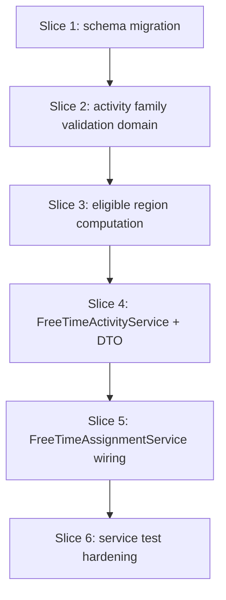

# Plan: Free-time activity block families

**Finalized plan location:** [`docs/plans/v2_free_time_families.md`](../../docs/plans/v2_free_time_families.md)

## Context

V2 Phase 6 per [`docs/v2_cursor_implementation_guide.md`](../../docs/v2_cursor_implementation_guide.md) Phase 6: add **`free_time_activity.allowed_block_families`**, **activity family normalization** (V2 design §9), **per-activity eligible region computation** integrating block calendar and `"free-time"` block windows, and update **`FreeTimeActivityService`** / **`FreeTimeAssignmentService`**.

**Authority:** V2 design §7.4 (free-time family blocks), §9 (activity family lists + normalization), §10 (assignment order), §11 (block placements).

**Current repo state (post Phase 5):**
- Migration head `be1ebe6c5fe7`; `task_plan.allowed_block_families`, block calendar load in task resolution/assignment, `domain/task_families.py` with `BlockPlacementSnapshot` and narrowing helpers.
- [`calendar_backend/domain/free_time.py`](../../calendar_backend/domain/free_time.py): gap discovery subtracts **future TASK** calendar entries only; no activity family field; global gap pool for all activities.
- [`calendar_backend/models/free_time.py`](../../calendar_backend/models/free_time.py): no `allowed_block_families` column.
- [`calendar_backend/services/free_time_assignment.py`](../../calendar_backend/services/free_time_assignment.py): does not load block calendar; `prerequisite_plan_ids` logical blocking unchanged.

**Locked clarifications (request-questions):**
- **Base gap blockers:** Subtract **block calendar + TASK** entries from the base gap pool first (same past/active-run load policy as task assignment); per-activity family union may **re-add** matching block windows.
- **Storage:** **SQLite TEXT JSON array** on `free_time_activity`; validate/normalize at `FreeTimeActivityService` write boundary.
- **Integration scope:** **Service-level tests only** — manual block/task calendar fixtures; defer `refresh_schedule` pipeline to Phase 7.

Build workflow: loop runs build slices; slice 1 uses five-step Alembic pattern per V2 guide §0.2.



## Non-goals

- `refresh_schedule` orchestration pipeline (Phase 7).
- Deletion preview / conflict analysis updates (Phase 7).
- Production HTTP API or new dev CLI commands beyond test fixture updates.
- Changes to task family semantics (Phase 5 complete).
- Sub-minute scheduling.
- Junction-table storage for allowed families.

## Locked assumptions

- **Effective families (activities):** Persisted `null`/empty → effective `("free-time", "default")`; explicit `["free-time"]` only → effective `("free-time",)` (excludes default by intent); other explicit lists append `"free-time"` when missing (e.g. `["transit"]` → `("free-time", "transit")`).
- **Prerequisites unchanged:** `prerequisite_plan_ids` remain **full logical blockers** via existing `blocked_activity_ids`; family lists control **where** only.
- **Base gap pool:** Weekly buckets in `[run_started_at, master_horizon_end)` minus **future TASK calendar entries** and **block calendar entries** (past + active-run policy mirroring task/block assignment load).
- **Per-activity eligible regions:** Union of (1) base free-time gaps when `"free-time"` in effective set, (2) default-unblocked regions when `"default"` in effective set, (3) block placement windows per non-default family in effective set; merged per week bucket before greedy fill.
- **Assignment algorithm:** Keep existing proportional greedy fill (`assign_free_time_to_gaps`); feed **per-activity** eligible gap lists derived from merged regions.
- **Service API:** `FreeTimeActivityService.set_allowed_block_families` / `clear_allowed_block_families` mirroring TaskService mutation style.
- **Reuse:** `BlockPlacementSnapshot` and JSON parse helpers from [`domain/task_families.py`](../../calendar_backend/domain/task_families.py) where applicable; activity-specific normalization lives in [`domain/free_time.py`](../../calendar_backend/domain/free_time.py).
- **Slice checks:** ruff format, ruff check, pyright; test-creation slices add pytest + **Test catalog** in chat report.

## Slices

### Slice 1: allowed_block_families schema migration

**Objective:** Add nullable `free_time_activity.allowed_block_families` TEXT (JSON array) via Alembic; ORM column only in pre-alembic.

**Files expected to change:**
- [`calendar_backend/models/free_time.py`](../../calendar_backend/models/free_time.py)
- [`calendar_backend/db/migrations/env.py`](../../calendar_backend/db/migrations/env.py)
- [`tests/models/test_free_time_schema.py`](../../tests/models/test_free_time_schema.py) (new or extend)

**May also change:**
- New `tests/models/test_free_time_families_schema.py`

**Implementation steps:**
1. **pre-alembic:** Add `FreeTimeActivity.allowed_block_families: Mapped[str | None]`. Schema tests: column exists, nullable, accepts valid JSON array; mark `failure_expected` until continue.
2. **`/db-revision-preview`** — message: `add free_time_activity allowed_block_families`.
3. **Migration manual edit:** `batch_alter_table` on `free_time_activity`; column nullable TEXT; no CHECK on JSON shape (validated at service boundary).
4. **`/db-revision-continue`:** `upgrade head`; unmark `failure_expected`; pytest models.
5. **post-alembic:** Confirm no service reads/writes column yet.

**Tests/checks:**
```bash
uv run ruff format .
uv run ruff check .
uv run pyright
uv run pytest tests/models/ -m "not slow and not failure_expected"
```

**Acceptance criteria:**
- DB has nullable `free_time_activity.allowed_block_families` TEXT column.
- ORM metadata matches migration.

**Risks/edge cases:**
- SQLite batch alter on `free_time_activity`; existing rows default NULL.

---

### Slice 2: Activity family validation domain

**Objective:** Pure validation/normalization helpers for activity allowed families per V2 §9.

**Files expected to change:**
- [`calendar_backend/domain/free_time.py`](../../calendar_backend/domain/free_time.py)
- [`calendar_backend/domain/errors.py`](../../calendar_backend/domain/errors.py) — reuse or extend message codes
- [`tests/domain/test_free_time_families.py`](../../tests/domain/test_free_time_families.py) (new)

**Implementation steps:**
1. `effective_activity_block_families(stored: str | None) -> tuple[str, ...]` — null/empty → `("free-time", "default")`; explicit `("free-time",)` only when stored list normalizes to free-time alone.
2. `normalize_activity_block_families_for_write(families: tuple[str, ...]) -> tuple[str, ...] | ServiceMessage` — dedupe/sort; append `"free-time"` when absent unless write is explicitly free-time-only list.
3. `serialize_activity_block_families` / parse JSON via shared parse helper from `task_families` where shape matches.
4. Unit tests: null→free-time+default; transit→free-time+transit; explicit free-time only; reject invalid JSON.

**Tests/checks:**
```bash
uv run ruff format .
uv run ruff check .
uv run pyright
uv run pytest tests/domain/test_free_time_families.py -m "not slow and not failure_expected"
```

**Acceptance criteria:**
- Domain module has no SQLAlchemy session imports.
- Normalization matches V2 §9 table.

**Risks/edge cases:**
- Distinct empty semantics vs tasks (null → two-family default for activities).

---

### Slice 3: Per-activity eligible region computation

**Objective:** Compute weekly eligible gaps/regions from base blockers, block placements, and activity effective families.

**Files expected to change:**
- [`calendar_backend/domain/free_time.py`](../../calendar_backend/domain/free_time.py)
- [`calendar_backend/domain/task_families.py`](../../calendar_backend/domain/task_families.py) — optional shared default-unblocked helper
- [`tests/domain/test_free_time_families.py`](../../tests/domain/test_free_time_families.py)

**Implementation steps:**
1. `combined_gap_blockers(task_blockers, block_blockers) -> tuple[TimeWindow, ...]` — merge TASK + block calendar intervals.
2. `default_unblocked_regions_in_bucket(bucket, placements) -> tuple[TimeWindow, ...]` — gaps not covered by non-`default` block families.
3. `eligible_free_time_gaps_for_activity(...)` — union base gaps (when free-time in effective), default-unblocked, and family-specific block windows; return `FreeTimeGap` tuples per week.
4. Tests: transit block re-added for transit activity; default+free-time uses gaps ∪ default; free-time-only excludes default regions.

**Tests/checks:**
```bash
uv run ruff format .
uv run ruff check .
uv run pyright
uv run pytest tests/domain/test_free_time_families.py -m "not slow and not failure_expected"
```

**Acceptance criteria:**
- Deterministic eligible regions for fixture placements and family sets.
- Block calendar subtracted from base pool then re-added only for matching families.

**Risks/edge cases:**
- Overlapping regions merged before gap conversion.
- Minute-aligned inputs assumed.

---

### Slice 4: FreeTimeActivityService and DTO wiring

**Objective:** Persist and expose activity allowed families; validate at write boundary.

**Files expected to change:**
- [`calendar_backend/services/free_time_activity.py`](../../calendar_backend/services/free_time_activity.py)
- [`calendar_backend/domain/free_time.py`](../../calendar_backend/domain/free_time.py) — DTO field
- [`calendar_backend/domain/invariant_validation.py`](../../calendar_backend/domain/invariant_validation.py) — optional stored JSON check
- [`tests/services/test_free_time_activity_service.py`](../../tests/services/test_free_time_activity_service.py)

**Implementation steps:**
1. Extend `FreeTimeActivityDTO` with `allowed_block_families: tuple[str, ...]` (effective on read).
2. `free_time_activity_dto_from_row` parses stored JSON via domain helpers.
3. `set_allowed_block_families` / `clear_allowed_block_families` on `FreeTimeActivityService`.
4. Service tests for set/clear/normalization round-trip.

**Tests/checks:**
```bash
uv run ruff format .
uv run ruff check .
uv run pyright
uv run pytest tests/services/test_free_time_activity_service.py -m "not slow and not failure_expected"
```

**Acceptance criteria:**
- Round-trip persist/read for family lists.
- Invalid writes rejected without mutation.

**Risks/edge cases:**
- Fraction validation still runs after family mutation.

---

### Slice 5: FreeTimeAssignmentService block calendar integration

**Objective:** Load block calendar; compute per-activity eligible gaps; assign using existing greedy fill.

**Files expected to change:**
- [`calendar_backend/services/free_time_assignment.py`](../../calendar_backend/services/free_time_assignment.py)
- [`calendar_backend/domain/assignment.py`](../../calendar_backend/domain/assignment.py) — optional blocker helper reuse
- [`tests/services/test_free_time_assignment_service.py`](../../tests/services/test_free_time_assignment_service.py)

**Implementation steps:**
1. Load block calendar entries (mirror task assignment past/active-run policy).
2. Build `combined_gap_blockers` from TASK + block entries.
3. Build block placement snapshots from block calendar + graph block families.
4. For each schedulable activity, compute `eligible_free_time_gaps_for_activity`; run proportional fill per activity or refactor `assign_free_time_to_gaps` to accept per-activity gap maps.
5. Service tests: block consumes base gap; transit activity uses transit block window; prerequisite blocking unchanged.

**Tests/checks:**
```bash
uv run ruff format .
uv run ruff check .
uv run pyright
uv run pytest tests/services/test_free_time_assignment_service.py -m "not slow and not failure_expected"
```

**Acceptance criteria:**
- Assignment respects family-specific eligible regions.
- Block + TASK entries subtract from shared base gap pool.
- Logical prerequisite blocking unchanged.

**Risks/edge cases:**
- Performance: per-activity gap computation — acceptable for V2 scale.
- Active calendar run required (existing guard).

---

### Slice 6: Phase 6 service/domain test hardening

**Objective:** Consolidate cross-module coverage for normalization + eligible regions + assignment at service boundaries.

**Files expected to change:**
- [`tests/domain/test_free_time_families.py`](../../tests/domain/test_free_time_families.py)
- [`tests/services/test_free_time_activity_service.py`](../../tests/services/test_free_time_activity_service.py)
- [`tests/services/test_free_time_assignment_service.py`](../../tests/services/test_free_time_assignment_service.py)

**Implementation steps:**
1. End-to-end service fixture: activity with transit families + transit block calendar → assignment lands in transit window.
2. free-time-only activity excludes default-eligible regions when focus block present.
3. Post **Test catalog** in chat report per V2 guide §7.

**Tests/checks:**
```bash
uv run ruff format .
uv run ruff check .
uv run pyright
uv run pytest tests/domain/test_free_time_families.py tests/services/test_free_time_activity_service.py tests/services/test_free_time_assignment_service.py -m "not slow and not failure_expected"
```

**Acceptance criteria:**
- All Phase 6 behaviors covered by named tests.
- No regression in existing free-time assignment tests.

**Risks/edge cases:**
- Fixture verbosity — reuse service DB bootstrap patterns from Phase 5.

---

## Abstraction check

| Introduced | Justification |
|---|---|
| Activity family helpers in `domain/free_time.py` | Real domain concept (§9) distinct from task normalization; colocated with gap/assignment pure functions. |
| `eligible_free_time_gaps_for_activity` | Two call sites (assignment service + tests); encodes §9 union semantics in one place. |

No new solver frameworks, registries, or service base classes.

## Dependency changes

None.

## Open questions

None — Phase 6 request-questions locked all blocking decisions.
