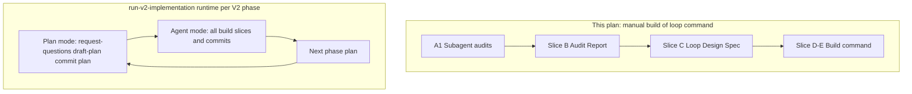

# Plan: V2 implementation loop command

**Finalized plan location:** [`docs/plans/v2_implementation_loop_command.md`](v2_implementation_loop_command.md)

## Context

Build a **single-PR, multi-plan** Cursor workflow for all V2 phases in [`docs/v2_cursor_implementation_guide.md`](../v2_cursor_implementation_guide.md). One command (`.cursor/commands/run-v2-implementation.md`) drives a **state machine** that:

- Runs **`/request-questions` once per V2 phase plan** (before `/draft-plan`), then **all build slices in Agent mode** without another `/request-questions` pass
- Per phase: Plan mode block → `/request-questions` → `/draft-plan` → finalize in `docs/plans/` → commit plan → Agent mode slice loop until the next phase plan
- Uses **non-interactive commits for every commit**; you open the PR manually after all commits
- Collapses Alembic five-step groups: no commit on preview / manual-edit middle steps; `db-revision-continue` owns its commit (no `/request-questions` on any build slice)
- Uses **`--skip-tests` until the last slice of the entire PR**, then runs full checks once
- Persists progress in a **git-tracked** [`.cursor/v2_implementation_loop.json`](../../.cursor/v2_implementation_loop.json) with `next_required_mode: plan|agent` and `active_batch_mode` while a mode stretch runs
- **Pauses** when the current Cursor mode cannot run the next macro block; you switch mode and invoke `/run-v2-implementation` once (Plan mode at `phase_N_plan_block`; Agent at `phase_N_agent_block`). Mid-batch continuation uses the stop hook (`active_batch_mode`, not `next_required_mode`) — not manual re-invoke. The `beforeSubmitPrompt` hook clears `active_batch_mode` for any prompt other than `/run-v2-implementation`.

This plan covers **audit → design → command build** only. It does **not** implement V2 domain features (blocks, prerequisites, etc.).

**Authority:** [`.cursor/repo_conventions.md`](../../.cursor/repo_conventions.md) §20; [`docs/v2_cursor_implementation_guide.md`](../v2_cursor_implementation_guide.md).



## Non-goals

- Implementing V2 feature code (flat goal children, blocks, prerequisites, etc.)
- Opening or merging a GitHub PR automatically
- Replacing individual slash commands (`/build-plan-slice`, `/db-revision-preview`, etc.) — the loop **invokes** them
- Running subagents inside `/run-v2-implementation` (subagents run only during Slice A)
- Interactive `git add -p` in the loop (all commits non-interactive)
- MCPs, new skills, or custom subagent types

## Locked assumptions

| Topic | Decision |
|---|---|
| Scope | All V2 guide phases 0–7 (each phase → finalized plan in `docs/plans/`) |
| Loop start | Full pipeline including draft + finalize plan docs per phase |
| Commits | Fully non-interactive for every commit |
| State file | Git-tracked `.cursor/v2_implementation_loop.json` |
| Mode handoff | State records `next_required_mode` + `next_step`; command exits with resume instruction |
| PR | Single branch; many atomic commits; manual PR at end |
| skip-tests on commit | Every loop commit uses `--skip-tests` (C1, SC-9); full [`checks.sh`](../../scripts/cursor/checks.sh) at **end of each phase** (C4) and again at loop `done` |
| Phase 0 | Included (C3); **skip-if-done** before every phase/slice step when predicate already satisfied |
| AskQuestion | Plan mode only — loop must not invoke in agent steps |
| Slice clarification | **No `/request-questions` before build slices** — only before drafting each phase plan |
| Plan mode frequency | Plan mode at **phase plan bootstrap** only; Agent mode for all slices; **`plan_mode_escape_hatches`: []** — mid-phase plan fixes via `/small-change` in Agent mode (C2) |
| Slice ambiguity | `/build-plan-slice` blocking questions use **Agent-mode chat**, not `/request-questions` |

Build workflow: use `/build-plan-slice` per slice **of this plan**; stop after each slice for approval.

### Slice-type taxonomy (baseline — Slice A must confirm)

| Slice kind | Plan mode | Agent mode | Commit? |
|---|---|---|---|
| Phase plan bootstrap | request-questions, draft-plan, finalize | — | Yes (plan doc) |
| Ordinary build slice | — | build-plan-slice + reviews | Yes |
| pre-alembic | — | build-plan-slice (ORM only) | Yes |
| alembic-preview | — | db-revision-preview | No |
| migration-script-edits | — | Human edit or `/small-change` | No |
| alembic-continue | — | db-revision-continue | Yes (internal) |
| post-alembic | — | build-plan-slice | Yes |
| plan_mode_escape_hatch | per Slice A catalog (rare) | — | varies |

## Slices

### Slice A: Subagent audit battery

**Objective:** Run four read-only subagent audits in parallel; collect structured findings for the main-agent Audit Report (Slice B). Do not edit files.

**Files expected to change:** None (read-only).

**Implementation steps:**

1. Launch **A1** (`explore`, very thorough): [`.cursor/commands/`](../../.cursor/commands/), [`scripts/cursor/commit_changes.py`](../../scripts/cursor/commit_changes.py), [`scripts/cursor/checks.sh`](../../scripts/cursor/checks.sh), [`.cursor/rules/30-planning-slices.mdc`](../../.cursor/rules/30-planning-slices.mdc), [`.cursor/rules/05-command-invocation-hygiene.mdc`](../../.cursor/rules/05-command-invocation-hygiene.mdc).
   - Return: command → mode → mutates? → tests? → commit? table; loop blockers; non-interactive commit extension points; **`plan_mode_escape_hatches`** — any command or stop that requires Plan mode beyond phase plan bootstrap (may be empty).

2. Launch **A2** (`explore`, very thorough): [`docs/plans/*.md`](../../docs/plans/), [`docs/v2_cursor_implementation_guide.md`](../v2_cursor_implementation_guide.md) §4, §6, §9.
   - Return: slice naming patterns; per V2 phase expected plan filename and migration groups; `/build-plan-slice` deviations.

3. Launch **A3** (`explore`, medium): [`calendar_backend/db/migrations/`](../../calendar_backend/db/migrations/), `failure_expected` in `tests/`, [`calendar_backend/models/chains.py`](../../calendar_backend/models/chains.py).
   - Return: migration head; failure_expected inventory; Phase 1 migration risks.

4. Launch **A4** (`generalPurpose`): agent transcript `8dc9c240-72b2-41c9-81aa-0f4929e5626e` — search commit-changes, skip-tests, db-revision, build-plan-slice, mode switches, user stops.
   - Return: friction points; override patterns; idempotency recommendations.

**Tests/checks:** None (read-only).

**Acceptance criteria:**
- All four subagent reports captured in chat or attached notes
- Known special cases from this plan §Locked assumptions baseline table are explicitly confirmed or contradicted
- **plan_mode_escape_hatches** list included in A1 output (explicitly empty if none)

**Risks/edge cases:**
- Transcript may be large — scope searches to workflow keywords
- Subagent findings may conflict — Slice B resolves

---

### Slice B: Main-agent audit synthesis

**Objective:** Consolidate A1–A4 into a single **Audit Report** in chat; stop for user review before Slice C.

**Files expected to change:** None.

**Implementation steps:**

1. Merge subagent outputs into:
   - **Special-case catalog** (numbered; severity: blocker / adapt / ignore)
   - **Proposed state machine** (step → mode → command → commit? → tests?)
   - **plan_mode_escape_hatches** (from A1; step IDs requiring rare Plan-mode return)
   - **Alembic group template** (collapsed vs manual loop)
   - **Non-interactive commit spec** (staging rubric vs [`commit splitting rubric`](../cursor_implementation_guide.md))
   - **Open design forks** for Slice C (optional `/request-questions` — manual meta-plan step only)

2. Post report; do not implement command yet.

**Tests/checks:** None.

**Acceptance criteria:**
- Audit Report posted with all sections above
- State machine shows **Agent-only** stretches between phase plan bootstraps unless an escape hatch applies

**Risks/edge cases:**
- Do not silently drop contradictions between A1 and A2

---

### Slice C: Loop design spec

**Objective:** Incorporate Audit Report findings and any user clarifications into a **Loop Design Spec** (chat addendum or short markdown in plan notes). No command file yet.

**Files expected to change:** None (optional: append **Loop Design Spec** section to this plan file if user approves).

**Implementation steps:**

1. Resolve open forks from Audit Report (user may use `/request-questions` — **manual meta-plan step**; not part of `/run-v2-implementation` runtime).
2. Record resolved forks, e.g.:
   - Non-interactive staging rubric (one commit per slice vs split)
   - Whether `/revise-plan` is a loop step or manual-only escape hatch
   - Phase 0 skip predicate
   - Final check suite after skip-tests period (pytest only vs full checks)
   - **`plan_mode_escape_hatches`** finalized for state file
3. Publish Loop Design Spec; unblock Slice D.

**Tests/checks:** None.

**Acceptance criteria:**
- No unresolved **blocker**-severity forks remain for command implementation
- Loop Design Spec references Audit Report catalog IDs where applicable
- Spec states **`/request-questions` only at phase plan bootstrap** in runtime loop

**Risks/edge cases:**
- If blockers remain, stop and re-ask — do not start Slice D

---

### Slice D: Build loop infrastructure

**Objective:** Implement the loop command, git-tracked state file, non-interactive commit support, and V2 guide cross-reference.

**Files expected to change:**
- [`.cursor/commands/run-v2-implementation.md`](../../.cursor/commands/run-v2-implementation.md) (new)
- [`.cursor/v2_implementation_loop.json`](../../.cursor/v2_implementation_loop.json) (new, git-tracked)
- [`scripts/cursor/commit_changes.py`](../../scripts/cursor/commit_changes.py) — add `--non-interactive`, `--message`, deterministic staging
- [`docs/v2_cursor_implementation_guide.md`](../v2_cursor_implementation_guide.md) — §2 single-PR loop + mode handoff

**May also change:**
- [`scripts/cursor/v2_loop_state.py`](../../scripts/cursor/v2_loop_state.py) (new, optional) — validate/advance state JSON
- [`docs/cursor_implementation_guide.md`](../cursor_implementation_guide.md) — one-line pointer to loop command (optional)

**Implementation steps:**

1. Implement state schema per Loop Design Spec (draft fields):
   - `version`, `branch`, `next_required_mode`, `next_step`, `current_phase`, `current_plan_path`, `current_slice_id`, `skip_tests_on_commit`, `completed_steps`, `alembic_group`, `plan_mode_escape_hatches`
2. Write `run-v2-implementation.md` with labeled parameters: `Resume`, `Reset`, optional `Phase` (if spec allows).
3. Document step handlers: mode check → run all same-mode steps → advance state after each → exit when mode changes or notify done.
   - **Plan mode macro block:** `phase_N_plan_block` (internal: `plan_bootstrap`, `request_questions`). **Agent mode macro block:** `phase_N_agent_block` (internal: `draft_plan`, `finalize_plan`, slice substeps, `phase_checks`). Plus `phase_0_verify` and `done`.
4. Extend `commit_changes.py`:
   - `--non-interactive`: stage all changed files matching rubric OR explicit pathspec list; no `input()` prompts
   - `--message` for commit message; honor `--skip-tests` / `--skip-checks` as today
5. Initialize state: Phase 0 complete if V2 docs exist; else first step `phase_0_verify`.
6. Map V2 phases 1–7 to plan prompt names from guide §9 (filenames finalized when each phase plan is drafted).
7. Update V2 guide §2 with loop usage, **request-questions only before each phase plan**, and Plan/Agent resume instructions.

**Tests/checks:**
```bash
uv run ruff format scripts/cursor/commit_changes.py
uv run ruff check scripts/cursor/commit_changes.py
uv run pyright scripts/cursor/commit_changes.py
# Manual: python scripts/cursor/commit_changes.py --help shows --non-interactive
```

**Acceptance criteria:**
- Command doc covers every step, mode gate, pause/resume, and completion notification
- **No `/request-questions` on build slices** — only at phase plan bootstrap (+ documented escape hatches)
- Alembic groups: no double-commit; no request-questions on preview/manual-edit
- Long **Agent-only** stretches between phase plan bootstraps in documented state machine
- `skip_tests_on_commit` always true; `phase_N_phase_checks` and `done` run full `checks.sh` (Loop Design Spec C4)
- State file is valid JSON and git-tracked (not gitignored)
- Non-interactive commit path works on a trivial doc-only change (smoke test in Slice E or manual note)

**Risks/edge cases:**
- `db-revision-continue` already calls commit — loop must set `commit: false` for redundant commit steps
- Parameter hygiene: loop command must not infer trailing untrusted text ([rule 05](../rules/05-command-invocation-hygiene.mdc))

---

### Slice E: Dry-run validation

**Objective:** Walk state transitions for **V2 Phase 1** (flat goal children) without executing real domain implementation; fix command doc ambiguities.

**Files expected to change:**
- [`.cursor/commands/run-v2-implementation.md`](../../.cursor/commands/run-v2-implementation.md) — clarifications from dry-run
- [`.cursor/v2_implementation_loop.json`](../../.cursor/v2_implementation_loop.json) — example snapshot for Phase 1 start (optional)

**Implementation steps:**

1. Simulate state progression: **Plan mode** at `phase_1_plan_bootstrap` only → **Agent mode** through pre-alembic → preview → manual-edit pause → continue → post-alembic → **Plan mode** at `phase_2_plan_bootstrap`.
2. Verify each transition sets correct `next_required_mode` and `next_step` (Agent for all build slices).
3. Verify mode-mismatch exit message is actionable.
4. Document manual gates (migration-script-edits approval) in command doc.
5. Verify slice ambiguity is documented as Agent-mode chat, not `/request-questions`.
6. Post **Dry-run report** in chat: transitions tested, issues fixed, ready to run loop on real V2 work.

**Tests/checks:**
```bash
# If v2_loop_state.py exists:
uv run python scripts/cursor/v2_loop_state.py validate
uv run ruff format .
uv run ruff check .
uv run pyright
```

**Acceptance criteria:**
- Dry-run report posted
- No ambiguous `next_step` IDs for Phase 1 migration group
- Command doc lists explicit user actions at manual gates
- Dry-run confirms **one Plan-mode block per phase plan**, not per slice

**Risks/edge cases:**
- Dry-run does not invoke real `/build-plan-slice` on Phase 1 code

---

## Target command surface (reference for Slice D)

**Command:** `/run-v2-implementation`

**Parameters:**
- `Resume: true|false` (default true)
- `Reset: true|false` (reinitialize from guide phase list)
- `Phase: 0-7` (optional — implement only if Loop Design Spec approves)

---

## Runtime loop pattern (reference for Slice D)

Per V2 phase (after loop command exists):

```text
[Plan mode] /request-questions → /draft-plan → finalize plan → commit plan doc
[Agent mode] for each slice in plan:
  /build-plan-slice (or db-revision-preview / manual edit / db-revision-continue)
  → reviews → non-interactive commit
[Plan mode] only when starting next phase plan (or rare escape hatch)
```

**Completion:** When `next_step` is `done`, notify in chat: total commits, final check run, manual PR checklist. Do not run `gh pr create`.

## Abstraction check

| Addition | Justification |
|---|---|
| `.cursor/v2_implementation_loop.json` | Cross-mode resume requires persisted cursor; git-tracked for single-PR continuity |
| `scripts/cursor/v2_loop_state.py` (optional) | Deterministic validate/advance; avoids agent drift on JSON edits — include only if command doc stays readable without it |
| `--non-interactive` on `commit_changes.py` | Loop requirement; extends existing script rather than parallel commit path |

No new subagent types, registries, or MCPs.

## Dependency changes

None.

## Open questions

**Resolved in Slice C** — see [Loop Design Spec](#loop-design-spec) (forks C1–C8). No blocker-severity forks remain for Slice D.

---

## Loop Design Spec

**Status:** Locked for Slice D implementation. Incorporates Audit Report (Slice B) catalog IDs and user clarifications from `/request-questions` Mode: change.

### Resolved forks (C1–C8)

| ID | Topic | Decision | Audit refs |
|---|---|---|---|
| C1 | Commit granularity | **One non-interactive commit per loop step** that commits (ordinary build, pre/post-alembic, plan doc, phase 0 verify). No atomic splits within a single loop step. | SC-9, SC-10 |
| C2 | Plan-mode escape hatches | **`plan_mode_escape_hatches`: []**. Mid-phase plan fixes use **`/small-change`** in Agent mode. **`/revise-plan`** is manual-only (outside loop); not a state step. | SC-3, A1 |
| C3 | Phase 0 + idempotency | **Include Phase 0** in the state machine. **Skip-if-done** runs before **every** phase and slice step when its completion predicate is already satisfied (covers mostly-done Phase 0). | SC-11 |
| C4 | Check suite timing | Run **[`scripts/cursor/checks.sh`](../../scripts/cursor/checks.sh)** (ruff format, ruff check, pyright, pytest) at **end of each V2 phase** and again when `next_step` is `done`. Loop commits still pass `--skip-tests`. | SC-9, SC-12 |
| C5 | Plan file mapping | **One finalized plan per phase 0–7** (split old V2-3 mega-plan). See [Phase → plan paths](#phase--plan-paths) below. | A2, guide §9 |
| C6 | Human approval | **No chat approval** between slices. User invokes **`/run-v2-implementation`** once per **mode stretch** (macro block). Agent runs all `substeps_remaining` via `current-substep` / `substep-complete`. Turn-boundary auto-resume via stop hook using **`active_batch_mode`**. **False “batch complete”** while `next_required_mode` still equals `batch_mode` is a protocol violation — use `batch-exit-check`. | SC-13 |
| C7 | Non-interactive staging | **`commit_changes.py --non-interactive --message "…"`** stages **all working-tree changes** (tracked + untracked, non-ignored). No `input()` prompts. | SC-1, SC-10 |
| C8 | Pre-commit reviews | Run audit-commit-readiness then review-abstractions before each loop commit step. **Auto-fix only in current substep scope**; if still blocked, set `pause_auto_resume true` and **stop** with error (no chat override). | SC-14 |

### Runtime `/request-questions` policy

- **Runtime loop:** `/request-questions` **only** at `phase_N_request_questions` (**Plan** mode), before Agent-mode `draft_plan`.
- **Not in runtime loop:** build slices, pre-alembic, Alembic preview/manual-edit/continue, post-alembic, commit steps.
- **Slice ambiguity during build:** **`AskQuestion` tool** only when unavoidable; not phase-plan clarification.
- **Meta-plan (this document):** `/request-questions` allowed manually between slices A–E; not encoded in `v2_implementation_loop.json`.

### Phase → plan paths

| Phase | Objective (guide §6) | Finalized plan path | Bootstrap step ID |
|---|---|---|---|
| 0 | V2 docs + authority | *(verify-only — no plan file)* | `phase_0_verify` |
| 1 | Flat goal children | `docs/plans/v2_flat_goal_children.md` | `phase_1_plan_bootstrap` |
| 2 | Plan + immediate prerequisites | `docs/plans/v2_prerequisites.md` | `phase_2_plan_bootstrap` |
| 3 | Block ORM + block calendar | `docs/plans/v2_block_orm.md` | `phase_3_plan_bootstrap` |
| 4 | Block resolution + phase-1 assignment | `docs/plans/v2_block_assignment.md` | `phase_4_plan_bootstrap` |
| 5 | Task family narrowing + phase-2 assignment | `docs/plans/v2_task_families.md` | `phase_5_plan_bootstrap` |
| 6 | Free-time family semantics | `docs/plans/v2_free_time_families.md` | `phase_6_plan_bootstrap` |
| 7 | Orchestration, deletion, CLI, integration | `docs/plans/v2_orchestration_integration.md` | `phase_7_plan_bootstrap` |

Filenames are illustrative until each phase plan is drafted; state stores `current_plan_path` after finalize.

### Skip-if-done predicates

Run before executing a step; if satisfied, append step ID to `completed_steps`, advance `next_step`, and **do not** re-run work.

| Step kind | Skip when |
|---|---|
| `phase_0_verify` | All exist: `docs/v2_engineering_design.md`, `docs/v2_cursor_implementation_guide.md`, `.cursor/rules/00-project-source-of-truth.mdc`, `.cursor/repo_conventions.md` §20 |
| `phase_N_plan_bootstrap` (N≥1) | `current_plan_path` file exists **and** listed in `completed_steps` as finalized (or path on disk + prior `phase_N_finalize_plan` in `completed_steps`) |
| `phase_N_request_questions` | Same phase plan already has `phase_N_draft_plan` in `completed_steps` |
| `phase_N_draft_plan` | Plan file exists at `current_plan_path` |
| `phase_N_finalize_plan` | Plan file exists and contains `## Slices` with at least one slice heading |
| Build slice step | Slice ID in plan marked done in `completed_steps` **or** slice acceptance criteria detectable in repo (Slice D defines per-slice predicates when plan is loaded) |
| Alembic preview | No ORM/schema diff vs head requiring migration in current slice group |
| `phase_N_phase_checks` | Last `phase_N_*` build step complete and checks passed in `completed_steps` |
| `done` | All phases 0–7 complete |

Slice-level skip predicates for domain work are **loaded from the active phase plan** at runtime (Slice D); the loop only stores slice IDs and plan path.

### State schema v1

Git-tracked [`.cursor/v2_implementation_loop.json`](../../.cursor/v2_implementation_loop.json):

```json
{
  "version": 1,
  "branch": "<git branch name>",
  "next_required_mode": "plan|agent",
  "next_step": "<step_id>",
  "current_phase": 0,
  "current_plan_path": null,
  "current_slice_id": null,
  "skip_tests_on_commit": true,
  "completed_steps": [],
  "alembic_group": null,
  "plan_mode_escape_hatches": [],
  "pause_auto_resume": false,
  "active_batch_mode": null
}
```

Field notes:

- **`next_required_mode`:** `plan` only for `phase_N_plan_bootstrap` and `phase_N_request_questions`; `agent` for `draft_plan`, `finalize_plan`, all build, db-revision, commit, and check steps.
- **`active_batch_mode`:** Set when a `/run-v2-implementation` invocation passes the mode gate; cleared when the stop hook sees `may_exit: true` or when the user submits any prompt other than `/run-v2-implementation` (`beforeSubmitPrompt` hook). The stop hook uses this field (not `next_required_mode`) for `batch-exit-check`.
- **`pause_auto_resume`:** When `true`, the stop hook does not auto-submit `/run-v2-implementation` (AskQuestion, hard failure, or batch end awaiting mode switch).
- **`alembic_group`:** When inside a five-step migration group, holds `{ "slice_id", "phase", "substep": "pre_alembic|preview|manual_edit|continue|post_alembic" }`; cleared after post-alembic commit.
- **`skip_tests_on_commit`:** Always `true` during loop; phase-end and final steps run full `checks.sh` explicitly (C4).
- **`plan_mode_escape_hatches`:** Empty array; reserved for future rare Plan-mode returns (C2).

### Step handler catalog (per V2 phase N ≥ 1)

Each phase follows this ordered subgraph (Agent unless noted):

```text
phase_N_plan_bootstrap          [Plan]  mode gate only — user switches to Plan
  → phase_N_request_questions   [Plan]  /request-questions Mode: plan
  → phase_N_draft_plan          [Agent] /draft-plan (loop context)
  → phase_N_finalize_plan       [Agent] finalize in docs/plans/ + commit (non-interactive)
  → phase_N_slice_loop          [Agent] iterate slices from plan (see below)
  → phase_N_phase_checks        [Agent] scripts/cursor/checks.sh
  → phase_{N+1}_plan_bootstrap  [Plan]  or done when N=7
```

**Phase 0 only:**

```text
phase_0_verify [Agent] verify authority files → commit if missing → phase_1_plan_bootstrap
```

### Slice loop step types (Agent mode)

| Substep ID suffix | Command | Commit? | Notes |
|---|---|---|---|
| `_build` | `/build-plan-slice` | Yes (C1, C7) | Includes review-validation + review-consistency per build-plan-slice |
| `_pre_alembic` | `/build-plan-slice` | Yes | ORM/schema only |
| `_alembic_preview` | `/db-revision-preview` | **No** | SC-5 |
| `_migration_manual_edit` | Agent applies preview edits | **No** | Loop auto-edits revision; no user edit, no AskQuestion (SC-6) |
| `_alembic_continue` | `/db-revision-continue` | Yes (internal) | **No second loop commit** after continue (SC-7) |
| `_post_alembic` | `/build-plan-slice` | Yes | Remove `failure_expected` markers per continue |

Alembic middle steps set `alembic_group.substep`; loop does not call `commit_changes.py` on preview or manual-edit.

### Commit step rubric (C1, C7, C8)

For every step with `commit: true`:

1. Audit-commit-readiness on working tree — auto-fix blocking findings in current step scope; **stop** if still blocked (no chat override).
2. Review-abstractions on diff — auto-fix only in current step scope (C8).
3. `python scripts/cursor/commit_changes.py --non-interactive --message "<message>" --skip-tests`
4. Append step ID to `completed_steps`; advance `next_step`.

**Excluded from loop commit:** `db-revision-preview`, migration manual edit, and redundant post-continue commit (continue owns commit).

### Mode mismatch behavior

If Cursor mode ≠ `next_required_mode`, command **does not** advance state. Exit message must include:

- Current `next_step` and required mode
- Exact re-invocation: `/run-v2-implementation`

### Phase 1 dry-run step IDs (Slice E reference)

Illustrative IDs for first domain phase after loop exists (exact slice IDs come from `v2_flat_goal_children.md` when drafted):

```text
phase_1_plan_bootstrap
phase_1_request_questions
phase_1_draft_plan
phase_1_finalize_plan
phase_1_slice_<id>_pre_alembic
phase_1_slice_<id>_alembic_preview
phase_1_slice_<id>_migration_manual_edit
phase_1_slice_<id>_alembic_continue
phase_1_slice_<id>_post_alembic
phase_1_slice_<id>_build
phase_1_phase_checks
phase_2_plan_bootstrap
```

### Completion notification

When `next_step` is `done`:

- Run `checks.sh` one final time (C4)
- Chat summary: branch name, commit count, phases completed, manual PR checklist
- Do **not** run `gh pr create`

### Audit Report cross-reference (Slice B)

| Severity | ID | Loop handling |
|---|---|---|
| Blocker | SC-1 | C7 `--non-interactive` |
| Blocker | SC-5 | No commit on preview |
| Blocker | SC-6 | Manual gate on migration edit |
| Blocker | SC-7 | Single commit from continue only |
| Adapt | SC-9 | C1 + C4 skip-tests vs phase checks |
| Adapt | SC-10 | C7 stage all changes |
| Adapt | SC-11 | C3 skip-if-done |
| Adapt | SC-13 | C6 mode-batched execution |
| Adapt | SC-14 | C8 pre-commit reviews |

---

## Changed in this revision

- **`/request-questions` only at phase plan bootstrap** — removed from ordinary, pre-alembic, and Alembic middle slices in the slice-type taxonomy.
- **Plan mode frequency:** Plan mode when starting each V2 phase plan; Agent mode for all build slices within a plan; rare Plan-mode return only via `plan_mode_escape_hatches` (from Slice A audit).
- **Slice ambiguity:** documented as Agent-mode chat, not `/request-questions`.
- **Locked assumptions:** added rows for slice clarification, plan mode frequency, and slice ambiguity handling.
- **Slice A1 / B:** A1 catalogs `plan_mode_escape_hatches`; Audit Report includes them in the state machine.
- **Slice C:** `/request-questions` labeled manual meta-plan step, not runtime loop behavior.
- **Slice D / E:** state schema, acceptance criteria, dry-run, and **Runtime loop pattern** updated for Agent-only stretches between phase plans.
- **Diagram:** replaced meta-plan vs runtime-loop mermaid to separate building the command from running it.
- **Slice C:** published [Loop Design Spec](#loop-design-spec); resolved forks C1–C8; locked `plan_mode_escape_hatches: []`; phase-end `checks.sh`; one commit per loop step; skip-if-done matrix; state schema v1; Phase 1 dry-run step ID catalog.
- **Zero-friction UX:** loop command is closed orchestrator; user only switches mode, invokes `/run-v2-implementation`, and answers AskQuestion; migration manual edit automated.
