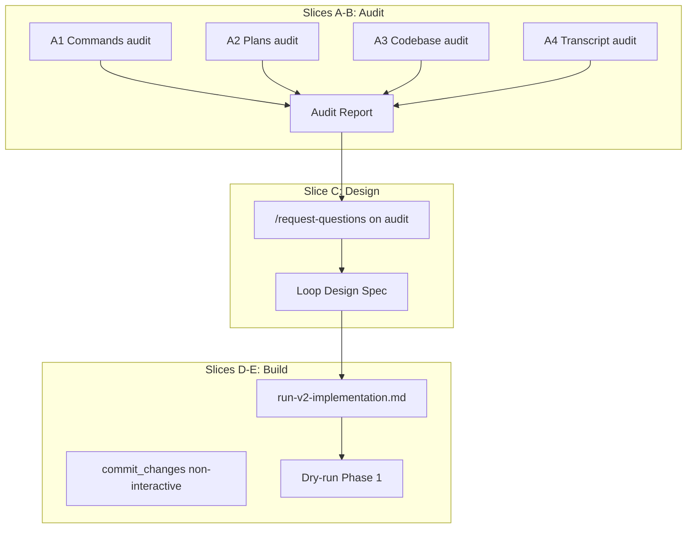

# Plan: V2 implementation loop command

**Finalized plan location:** [`docs/plans/v2_implementation_loop_command.md`](v2_implementation_loop_command.md)

## Context

Build a **single-PR, multi-plan** Cursor workflow for all V2 phases in [`docs/v2_cursor_implementation_guide.md`](../v2_cursor_implementation_guide.md). One command (`.cursor/commands/run-v2-implementation.md`) drives a **state machine** that:

- Runs the full pipeline per V2 phase plan: `/request-questions` → `/draft-plan` → finalize in `docs/plans/` → commit → per-slice loop
- Uses **non-interactive commits for every commit**; you open the PR manually after all commits
- Collapses Alembic five-step groups: no `/request-questions` or commit on preview / manual-edit middle steps; `db-revision-continue` owns its commit
- Uses **`--skip-tests` until the last slice of the entire PR**, then runs full checks once
- Persists progress in a **git-tracked** [`.cursor/v2_implementation_loop.json`](../../.cursor/v2_implementation_loop.json) with `next_required_mode: plan|agent`
- **Pauses** when the current Cursor mode cannot run the next step; you switch mode and re-invoke the command

This plan covers **audit → design → command build** only. It does **not** implement V2 domain features (blocks, prerequisites, etc.).

**Authority:** [`.cursor/repo_conventions.md`](../../.cursor/repo_conventions.md) §20; [`docs/v2_cursor_implementation_guide.md`](../v2_cursor_implementation_guide.md).



## Non-goals

- Implementing V2 feature code (flat goal children, blocks, prerequisites, etc.)
- Opening or merging a GitHub PR automatically
- Replacing individual slash commands (`/build-plan-slice`, `/db-revision-preview`, etc.) — the loop **invokes** them
- Running subagents inside `/run-v2-implementation` (subagents run only during Slice A)
- Interactive `git add -p` in the loop (all commits non-interactive)
- MCPs, new skills, or custom subagent types

## Locked assumptions

| Topic | Decision |
|---|---|
| Scope | All V2 guide phases 0–7 (each phase → finalized plan in `docs/plans/`) |
| Loop start | Full pipeline including draft + finalize plan docs per phase |
| Commits | Fully non-interactive for every commit |
| State file | Git-tracked `.cursor/v2_implementation_loop.json` |
| Mode handoff | State records `next_required_mode` + `next_step`; command exits with resume instruction |
| PR | Single branch; many atomic commits; manual PR at end |
| skip-tests | Entire multi-plan PR until final slice; then full pytest (audit may confirm ruff/pyright scope) |
| Phase 0 | Skip when V2 docs + authority files already exist (Slice D initializes state accordingly) |
| AskQuestion | Plan mode only — loop must not invoke in agent steps |

Build workflow: use `/build-plan-slice` per slice **of this plan**; stop after each slice for approval.

### Slice-type taxonomy (baseline — Slice A must confirm)

| Slice kind | Plan mode | Agent mode | Commit? |
|---|---|---|---|
| Phase plan bootstrap | request-questions, draft-plan, finalize | — | Yes (plan doc) |
| Ordinary build slice | request-questions (optional per audit) | build-plan-slice + reviews | Yes |
| pre-alembic | request-questions if blocking | build-plan-slice (ORM only) | Yes |
| alembic-preview | — | db-revision-preview | No |
| migration-script-edits | — | Human edit or `/small-change` | No |
| alembic-continue | — | db-revision-continue | Yes (internal) |
| post-alembic | — | build-plan-slice | Yes |

## Slices

### Slice A: Subagent audit battery

**Objective:** Run four read-only subagent audits in parallel; collect structured findings for the main-agent Audit Report (Slice B). Do not edit files.

**Files expected to change:** None (read-only).

**Implementation steps:**

1. Launch **A1** (`explore`, very thorough): [`.cursor/commands/`](../../.cursor/commands/), [`scripts/cursor/commit_changes.py`](../../scripts/cursor/commit_changes.py), [`scripts/cursor/checks.sh`](../../scripts/cursor/checks.sh), [`.cursor/rules/30-planning-slices.mdc`](../../.cursor/rules/30-planning-slices.mdc), [`.cursor/rules/05-command-invocation-hygiene.mdc`](../../.cursor/rules/05-command-invocation-hygiene.mdc).
   - Return: command → mode → mutates? → tests? → commit? table; loop blockers; non-interactive commit extension points.

2. Launch **A2** (`explore`, very thorough): [`docs/plans/*.md`](../../docs/plans/), [`docs/v2_cursor_implementation_guide.md`](../v2_cursor_implementation_guide.md) §4, §6, §9.
   - Return: slice naming patterns; per V2 phase expected plan filename and migration groups; `/build-plan-slice` deviations.

3. Launch **A3** (`explore`, medium): [`calendar_backend/db/migrations/`](../../calendar_backend/db/migrations/), `failure_expected` in `tests/`, [`calendar_backend/models/chains.py`](../../calendar_backend/models/chains.py).
   - Return: migration head; failure_expected inventory; Phase 1 migration risks.

4. Launch **A4** (`generalPurpose`): agent transcript `8dc9c240-72b2-41c9-81aa-0f4929e5626e` — search commit-changes, skip-tests, db-revision, build-plan-slice, mode switches, user stops.
   - Return: friction points; override patterns; idempotency recommendations.

**Tests/checks:** None (read-only).

**Acceptance criteria:**
- All four subagent reports captured in chat or attached notes
- Known special cases from this plan §Locked assumptions baseline table are explicitly confirmed or contradicted

**Risks/edge cases:**
- Transcript may be large — scope searches to workflow keywords
- Subagent findings may conflict — Slice B resolves

---

### Slice B: Main-agent audit synthesis

**Objective:** Consolidate A1–A4 into a single **Audit Report** in chat; stop for user `/request-questions`.

**Files expected to change:** None.

**Implementation steps:**

1. Merge subagent outputs into:
   - **Special-case catalog** (numbered; severity: blocker / adapt / ignore)
   - **Proposed state machine** (step → mode → command → commit? → tests?)
   - **Alembic group template** (collapsed vs manual loop)
   - **Non-interactive commit spec** (staging rubric vs [`commit splitting rubric`](../cursor_implementation_guide.md))
   - **Open design forks** for post-audit `/request-questions`

2. Post report; do not implement command yet.

**Tests/checks:** None.

**Acceptance criteria:**
- Audit Report posted with all five sections
- User can run `/request-questions` against findings without reading raw subagent logs

**Risks/edge cases:**
- Do not silently drop contradictions between A1 and A2

---

### Slice C: Loop design spec

**Objective:** Incorporate user `/request-questions` answers into a **Loop Design Spec** (chat addendum or short markdown in plan notes). No command file yet.

**Files expected to change:** None (optional: append **Loop Design Spec** section to this plan file if user approves).

**Implementation steps:**

1. User runs `/request-questions` on Audit Report (Mode: plan).
2. Record resolved forks, e.g.:
   - Non-interactive staging rubric (one commit per slice vs split)
   - Whether `/revise-plan` is a loop step
   - Phase 0 skip predicate
   - Final check suite after skip-tests period (pytest only vs full checks)
3. Publish Loop Design Spec; unblock Slice D.

**Tests/checks:** None.

**Acceptance criteria:**
- No unresolved **blocker**-severity forks remain for command implementation
- Loop Design Spec references Audit Report catalog IDs where applicable

**Risks/edge cases:**
- If blockers remain, stop and re-ask — do not start Slice D

---

### Slice D: Build loop infrastructure

**Objective:** Implement the loop command, git-tracked state file, non-interactive commit support, and V2 guide cross-reference.

**Files expected to change:**
- [`.cursor/commands/run-v2-implementation.md`](../../.cursor/commands/run-v2-implementation.md) (new)
- [`.cursor/v2_implementation_loop.json`](../../.cursor/v2_implementation_loop.json) (new, git-tracked)
- [`scripts/cursor/commit_changes.py`](../../scripts/cursor/commit_changes.py) — add `--non-interactive`, `--message`, deterministic staging
- [`docs/v2_cursor_implementation_guide.md`](../v2_cursor_implementation_guide.md) — §2 single-PR loop + mode handoff

**May also change:**
- [`scripts/cursor/v2_loop_state.py`](../../scripts/cursor/v2_loop_state.py) (new, optional) — validate/advance state JSON
- [`docs/cursor_implementation_guide.md`](../cursor_implementation_guide.md) — one-line pointer to loop command (optional)

**Implementation steps:**

1. Implement state schema per Loop Design Spec (draft fields):
   - `version`, `branch`, `next_required_mode`, `next_step`, `current_phase`, `current_plan_path`, `current_slice_id`, `skip_tests_until_final`, `completed_steps`, `alembic_group`
2. Write `run-v2-implementation.md` with labeled parameters: `Resume`, `Reset`, optional `Phase` (if spec allows).
3. Document step handlers: mode check → run one step → advance state → exit or notify done.
4. Extend `commit_changes.py`:
   - `--non-interactive`: stage all changed files matching rubric OR explicit pathspec list; no `input()` prompts
   - `--message` for commit message; honor `--skip-tests` / `--skip-checks` as today
5. Initialize state: Phase 0 complete if V2 docs exist; else first step `phase_0_verify`.
6. Map V2 phases 1–7 to plan prompt names from guide §9 (filenames finalized when each phase plan is drafted).
7. Update V2 guide §2 with loop usage and Plan/Agent resume instructions.

**Tests/checks:**
```bash
uv run ruff format scripts/cursor/commit_changes.py
uv run ruff check scripts/cursor/commit_changes.py
uv run pyright scripts/cursor/commit_changes.py
# Manual: python scripts/cursor/commit_changes.py --help shows --non-interactive
```

**Acceptance criteria:**
- Command doc covers every step, mode gate, pause/resume, and completion notification
- Alembic groups: no double-commit; no request-questions on preview/manual-edit
- `skip_tests_until_final` honored until last PR slice
- State file is valid JSON and git-tracked (not gitignored)
- Non-interactive commit path works on a trivial doc-only change (smoke test in Slice E or manual note)

**Risks/edge cases:**
- `db-revision-continue` already calls commit — loop must set `commit: false` for redundant commit steps
- Parameter hygiene: loop command must not infer trailing untrusted text ([rule 05](../rules/05-command-invocation-hygiene.mdc))

---

### Slice E: Dry-run validation

**Objective:** Walk state transitions for **V2 Phase 1** (flat goal children) without executing real domain implementation; fix command doc ambiguities.

**Files expected to change:**
- [`.cursor/commands/run-v2-implementation.md`](../../.cursor/commands/run-v2-implementation.md) — clarifications from dry-run
- [`.cursor/v2_implementation_loop.json`](../../.cursor/v2_implementation_loop.json) — example snapshot for Phase 1 start (optional)

**Implementation steps:**

1. Simulate state progression: phase plan bootstrap → pre-alembic → preview → manual-edit pause → continue → post-alembic → next phase.
2. Verify each transition sets correct `next_required_mode` and `next_step`.
3. Verify mode-mismatch exit message is actionable.
4. Document manual gates (migration-script-edits approval) in command doc.
5. Post **Dry-run report** in chat: transitions tested, issues fixed, ready to run loop on real V2 work.

**Tests/checks:**
```bash
# If v2_loop_state.py exists:
uv run python scripts/cursor/v2_loop_state.py validate
uv run ruff format .
uv run ruff check .
uv run pyright
```

**Acceptance criteria:**
- Dry-run report posted
- No ambiguous `next_step` IDs for Phase 1 migration group
- Command doc lists explicit user actions at manual gates

**Risks/edge cases:**
- Dry-run does not invoke real `/build-plan-slice` on Phase 1 code

---

## Target command surface (reference for Slice D)

**Command:** `/run-v2-implementation`

**Parameters:**
- `Resume: true|false` (default true)
- `Reset: true|false` (reinitialize from guide phase list)
- `Phase: 0-7` (optional — implement only if Loop Design Spec approves)

**Completion:** When `next_step` is `done`, notify in chat: total commits, final check run, manual PR checklist. Do not run `gh pr create`.

## Abstraction check

| Addition | Justification |
|---|---|
| `.cursor/v2_implementation_loop.json` | Cross-mode resume requires persisted cursor; git-tracked for single-PR continuity |
| `scripts/cursor/v2_loop_state.py` (optional) | Deterministic validate/advance; avoids agent drift on JSON edits — include only if command doc stays readable without it |
| `--non-interactive` on `commit_changes.py` | Loop requirement; extends existing script rather than parallel commit path |

No new subagent types, registries, or MCPs.

## Dependency changes

None.

## Open questions

Resolve in Slice C via `/request-questions` on Audit Report (Slice B):

- Exact non-interactive staging rubric (one commit per slice vs atomic splits within slice)
- Whether `/revise-plan` is a loop step or manual-only
- Phase 0 skip predicate (file existence vs explicit state flag)
- Final check suite after skip-tests period (pytest only vs ruff + pyright + pytest)

Do not start Slice D until Slice C closes blocker-severity forks.
