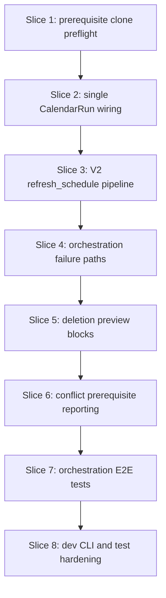

# Plan: Orchestration, deletion, CLI, integration

**Finalized plan location:** [`docs/plans/v2_orchestration_integration.md`](../../docs/plans/v2_orchestration_integration.md)

## Context

V2 Phase 7 per [`docs/v2_cursor_implementation_guide.md`](../../docs/v2_cursor_implementation_guide.md) Phase 7: wire the **V2 `refresh_schedule` pipeline** (blocks → tasks → free time), **prerequisite clone preflight**, **single `CalendarRun` per refresh**, **deletion/conflict updates** for blocks and plan prerequisites, **dev CLI** summary updates, and **end-to-end integration tests**.

**Authority:** V2 design §5.1 (missing clone hard error), §10 (`refresh_schedule` pipeline), §12 (deletion/conflict), §14 (INV-BLK-1).

**Current repo state (post Phase 6):**
- Migration head `4254240455e7`; block ORM/assignment/resolution, task family narrowing, free-time family assignment complete.
- [`calendar_backend/orchestration/refresh_schedule.py`](../../calendar_backend/orchestration/refresh_schedule.py): V1 pipeline — resolve tasks → assign tasks → assign free time only; no block stages.
- [`calendar_backend/domain/orchestration.py`](../../calendar_backend/domain/orchestration.py): `RefreshScheduleResult` holds task resolution/assignment/free-time only.
- Block and task assignment each create a **separate** `CalendarRun` and update `active_calendar_run_id` — breaks downstream block loads after task assign.
- [`calendar_backend/deletion/preview_service.py`](../../calendar_backend/deletion/preview_service.py): loads TASK `CalendarEntry` only; no `block_calendar_entry` or `affected_block_ids`.
- [`tools/dev_cli.py`](../../tools/dev_cli.py): `refresh schedule` wired; summary omits block stages.

**Locked clarifications (request-questions):**
- **CalendarRun lifecycle:** **Single run per refresh** — block assign creates the run; task assign adds TASK rows to the **same** run (no second run id); free time uses that same `active_calendar_run_id`.
- **Missing prerequisite clones:** **Orchestration preflight** after repetition refresh, before block resolution (new domain helper + `MessageCode`).
- **Deletion/conflict scope:** **Full V2 §12** — deletion preview includes block plans + `block_calendar_entry`; plan_prerequisite blocking in conflict suggestions; block subtree expansion mirroring tasks.

Build workflow: loop runs build slices; no Alembic unless a slice adds enum DB CHECK (unlikely — reuse existing `LastFailureReason` where possible).



## Non-goals

- Production HTTP API or new dev CLI commands beyond summary/output updates.
- Automatic refresh after plan edits or completions.
- OR-Tools / solver algorithm changes.
- Re-implementing block/task/free-time assignment logic inside orchestration.
- User-facing calendar export of `BlockCalendarEntry` rows (diagnostic/tests only per V2 §12).
- Sub-minute scheduling.
- Rolling back successful block assignment when task assignment fails (preserve block calendar; mirror existing task-failure semantics).

## Locked assumptions

- **Pipeline order:** horizon + repetition refresh (in first resolution service) → **preflight** → resolve blocks → assign blocks → resolve tasks → assign tasks → assign free time.
- **Preflight placement:** After `RepetitionService.refresh_all_repetitions` succeeds inside the first resolution transaction boundary; orchestration calls a pure domain helper with loaded plan graph before block resolve.
- **Shared refresh:** Block and task resolution may each run horizon/repetition/invariant refresh (idempotent); preflight runs once in orchestration after the first refresh boundary.
- **Single run API:** Extend block/task assignment to accept optional `calendar_run_id: CalendarRunID | None`; when set, persist entries on that run and do not create a new run; when `None`, preserve standalone service behavior for direct callers.
- **Partial free-time failure:** Unchanged V1 semantics — preserve SUCCESS task (+ block) calendar; clear future FREE_TIME only; `FREE_TIME_ASSIGNMENT_FAILED`.
- **Block assignment failure:** Mirror task assignment — precondition → `ASSIGNMENT_PRECONDITION_FAILED` without calendar mutation; solver INFEASIBLE → failed run + `ASSIGNMENT_FAILED`; do not run task/free-time stages.
- **Deletion DTO:** Extend `DeletionPreview` with `affected_block_ids` and `affected_block_calendar_entry_ids`; keep `affected_task_ids` for tasks.
- **Slice checks:** ruff format, ruff check, pyright; test-creation slices post **Test catalog** in chat report.

## Slices

### Slice 1: Prerequisite clone preflight domain

**Objective:** Pure helper detecting plan prerequisites whose targets require repetition instance clones that do not exist yet; new `MessageCode` for orchestration hard-fail.

**Files expected to change:**
- [`calendar_backend/domain/prerequisites.py`](../../calendar_backend/domain/prerequisites.py) or new focused module under `domain/`
- [`calendar_backend/domain/errors.py`](../../calendar_backend/domain/errors.py)
- [`tests/domain/test_prerequisites.py`](../../tests/domain/test_prerequisites.py) or new `tests/domain/test_prerequisite_clone_preflight.py`

**May also change:**
- [`calendar_backend/domain/template_trace.py`](../../calendar_backend/domain/template_trace.py) — reuse trace helpers

**Implementation steps:**
1. `find_missing_prerequisite_clone_targets(plans, ...) -> tuple[PlanID, ...]` — for each `plan_prerequisite` edge where prerequisite target is template-local and no matching instance clone exists for required repetition context.
2. `validate_prerequisite_clones_for_refresh(...) -> ServiceMessage | None` wrapping above with diagnostic details.
3. Add `MessageCode.PREREQUISITE_CLONES_NOT_GENERATED` (or reuse/extend `REPETITION_NOT_GENERATED` only if semantics match exactly).
4. Unit tests: master-tree stable prereq OK; template prereq without generated instance fails; generated instance OK.

**Tests/checks:**
```bash
uv run ruff format .
uv run ruff check .
uv run pyright
uv run pytest tests/domain/test_prerequisites.py tests/domain/test_prerequisite_clone_preflight.py -m "not slow and not failure_expected"
```

**Acceptance criteria:**
- Domain helper has no SQLAlchemy session imports.
- Deterministic failure list for fixture graphs.

**Risks/edge cases:**
- Distinguish master-tree prereqs (stable IDs) from template-local targets needing clone map.

---

### Slice 2: Single CalendarRun per refresh

**Objective:** Allow block and task assignment to persist on an orchestration-created `CalendarRun` without replacing `active_calendar_run_id` mid-pipeline.

**Files expected to change:**
- [`calendar_backend/services/block_assignment.py`](../../calendar_backend/services/block_assignment.py)
- [`calendar_backend/services/task_assignment.py`](../../calendar_backend/services/task_assignment.py)
- [`calendar_backend/domain/block_assignment.py`](../../calendar_backend/domain/block_assignment.py) — optional param on result types if needed
- [`tests/services/test_block_assignment_service.py`](../../tests/services/test_block_assignment_service.py)
- [`tests/services/test_task_assignment_service.py`](../../tests/services/test_task_assignment_service.py)

**Implementation steps:**
1. Add optional `calendar_run_id: CalendarRunID | None = None` to `assign_blocks` / `assign_tasks`.
2. When provided: skip `_new_calendar_run`; write entries with that id; update active state once (block path creates run if none passed; task path reuses).
3. When `None`: preserve existing standalone behavior (each service creates its own run).
4. Service tests: task assign with explicit run id adds TASK rows to block-created run; block entries remain addressable by active run after task assign.

**Tests/checks:**
```bash
uv run ruff format .
uv run ruff check .
uv run pyright
uv run pytest tests/services/test_block_assignment_service.py tests/services/test_task_assignment_service.py -m "not slow and not failure_expected"
```

**Acceptance criteria:**
- Future `BlockCalendarEntry` rows remain visible to task resolution and free-time assignment after task assign on shared run.

**Risks/edge cases:**
- Failed assignment paths must not leave orphan runs when orchestration owns run creation.

---

### Slice 3: V2 refresh_schedule pipeline and DTO extension

**Objective:** Rewrite `OrchestrationService.refresh_schedule` to run block stages, preflight, and extended result DTO.

**Files expected to change:**
- [`calendar_backend/orchestration/refresh_schedule.py`](../../calendar_backend/orchestration/refresh_schedule.py)
- [`calendar_backend/domain/orchestration.py`](../../calendar_backend/domain/orchestration.py)
- [`calendar_backend/domain/__init__.py`](../../calendar_backend/domain/__init__.py) — re-export if public DTO fields added
- [`calendar_backend/services/block_resolution.py`](../../calendar_backend/services/block_resolution.py)
- [`calendar_backend/services/block_assignment.py`](../../calendar_backend/services/block_assignment.py)
- [`tests/orchestration/test_refresh_schedule_integration.py`](../../tests/orchestration/test_refresh_schedule_integration.py) — happy-path V2 smoke

**Implementation steps:**
1. Extend `RefreshScheduleResult` with `resolved_blocks`, `block_assignment` (nullable on early failure).
2. Orchestration: call block resolve → block assign (create shared run) → task resolve → task assign (same run id) → free time assign.
3. Run preflight after first resolution refresh (block resolve transaction) before assign blocks; fail with no calendar mutation.
4. Happy-path integration test: master tree with block + task → block calendar + task calendar + free time on one active run.

**Tests/checks:**
```bash
uv run ruff format .
uv run ruff check .
uv run pyright
uv run pytest tests/orchestration/test_refresh_schedule_integration.py -m "not slow and not failure_expected" -k "v2 or block"
```

**Acceptance criteria:**
- Pipeline order matches V2 design §10 diagram.
- Single `active_calendar_run_id` after full success.

**Risks/edge cases:**
- Double horizon/repetition refresh acceptable; preflight must not run before repetitions refreshed.

---

### Slice 4: Orchestration failure paths

**Objective:** Update failure branches for block stages and refresh partial outcomes; fix existing orchestration state tests for V2.

**Files expected to change:**
- [`calendar_backend/orchestration/refresh_schedule.py`](../../calendar_backend/orchestration/refresh_schedule.py)
- [`tests/orchestration/test_refresh_schedule_state.py`](../../tests/orchestration/test_refresh_schedule_state.py)
- [`tests/orchestration/test_refresh_schedule_integration.py`](../../tests/orchestration/test_refresh_schedule_integration.py)

**Implementation steps:**
1. Block precondition failure → `ASSIGNMENT_PRECONDITION_FAILED`, no calendar mutation.
2. Block solver failure → `ASSIGNMENT_FAILED`, no task/free-time stages (mirror task failure).
3. Preflight failure → resolution-style fail, no calendar mutation.
4. Update/adapt existing partial free-time and task failure tests for shared-run semantics.

**Tests/checks:**
```bash
uv run ruff format .
uv run ruff check .
uv run pyright
uv run pytest tests/orchestration/ -m "not slow and not failure_expected"
```

**Acceptance criteria:**
- All orchestration state tests pass with V2 pipeline.
- Partial free-time failure still clears future FREE_TIME only.

**Risks/edge cases:**
- Block calendar preserved when task assignment fails after successful block assign.

---

### Slice 5: Deletion preview block expansion

**Objective:** Include block plans and `block_calendar_entry` rows in deletion previews.

**Files expected to change:**
- [`calendar_backend/domain/deletion.py`](../../calendar_backend/domain/deletion.py)
- [`calendar_backend/deletion/preview_service.py`](../../calendar_backend/deletion/preview_service.py)
- [`tests/domain/test_deletion_impact.py`](../../tests/domain/test_deletion_impact.py)
- [`tests/deletion/test_preview_service.py`](../../tests/deletion/test_preview_service.py)

**Implementation steps:**
1. Extend `DeletionPreview` / `PlanDeletionPreviewDTO` with `affected_block_ids`, `affected_block_calendar_entry_ids`.
2. `affected_block_ids_from_plans` mirroring task helper.
3. Load `BlockCalendarEntry` in preview service graph load; map entries by `source_plan_id`.
4. Tests: delete block subtree root includes block calendar rows; task-only delete excludes unrelated block entries.

**Tests/checks:**
```bash
uv run ruff format .
uv run ruff check .
uv run pyright
uv run pytest tests/domain/test_deletion_impact.py tests/deletion/test_preview_service.py -m "not slow and not failure_expected"
```

**Acceptance criteria:**
- Preview lists affected block plans and block calendar entries deterministically.

**Risks/edge cases:**
- Block under goal uses same descendant expansion as tasks.

---

### Slice 6: Conflict and deletion prerequisite reporting

**Objective:** Full V2 §12 — plan prerequisite edges reported as blocking relationships in conflict suggestions; block subtrees in deletion candidate expansion.

**Files expected to change:**
- [`calendar_backend/deletion/conflict_suggestions.py`](../../calendar_backend/deletion/conflict_suggestions.py)
- [`calendar_backend/deletion/conflict_analysis.py`](../../calendar_backend/deletion/conflict_analysis.py) — only if prerequisite-aware conflicts needed
- [`calendar_backend/domain/deletion.py`](../../calendar_backend/domain/deletion.py)
- [`tests/deletion/test_conflict_suggestions.py`](../../tests/deletion/test_conflict_suggestions.py)
- [`tests/deletion/test_conflict_analysis.py`](../../tests/deletion/test_conflict_analysis.py)

**Implementation steps:**
1. When building deletion candidates from assignment conflicts, include plan_prerequisite blocking plans in explanations/ranking where relevant.
2. Ensure block plan delete expands like task subtree (reuse `compute_deletion_impact`).
3. Integration tests: conflict suggestion references prerequisite blocker; block delete preview matches task analog.

**Tests/checks:**
```bash
uv run ruff format .
uv run ruff check .
uv run pyright
uv run pytest tests/deletion/ -m "not slow and not failure_expected"
```

**Acceptance criteria:**
- Deletion/conflict modules cover block + prerequisite cases named in V2 §12.

**Risks/edge cases:**
- Do not surface block calendar in user-facing conflict views unless diagnostic flag (tests use internal DTOs).

---

### Slice 7: Orchestration E2E integration tests

**Objective:** End-to-end V2 pipeline tests deferred from Phases 5–6: block → task family narrowing → free-time families through `refresh_schedule`.

**Files expected to change:**
- [`tests/orchestration/test_refresh_schedule_integration.py`](../../tests/orchestration/test_refresh_schedule_integration.py)
- [`tests/orchestration/orch_helpers.py`](../../tests/orchestration/orch_helpers.py)

**Implementation steps:**
1. Fixture: block plan + task with transit families + free-time activity with transit families → refresh lands assignments in consistent windows.
2. Prerequisite clone preflight hard-fail integration test.
3. Block consumes gap; transit activity uses transit window via full pipeline.
4. Post **Test catalog** in slice report.

**Tests/checks:**
```bash
uv run ruff format .
uv run ruff check .
uv run pyright
uv run pytest tests/orchestration/test_refresh_schedule_integration.py -m "not slow and not failure_expected"
```

**Acceptance criteria:**
- Named tests cover full V2 refresh path and preflight failure.
- No regression in existing repetition/template refresh tests.

**Risks/edge cases:**
- Fixture verbosity — extend `orch_helpers.py` minimally.

---

### Slice 8: Dev CLI summary and phase test hardening

**Objective:** Update CLI output for extended `RefreshScheduleResult`; final cross-module smoke.

**Files expected to change:**
- [`tools/cli_support.py`](../../tools/cli_support.py)
- [`tests/tools/test_dev_cli.py`](../../tests/tools/test_dev_cli.py)

**May also change:**
- Minor fixes from phase checks in prior modules

**Implementation steps:**
1. `print_refresh_schedule_summary`: print block valid/invalid counts and block entry count when present.
2. Update stubbed CLI tests for new summary lines.
3. Post **Test catalog** for CLI changes.

**Tests/checks:**
```bash
uv run ruff format .
uv run ruff check .
uv run pyright
uv run pytest tests/tools/test_dev_cli.py -m "not slow and not failure_expected"
```

**Acceptance criteria:**
- CLI refresh summary reflects V2 result shape.

**Risks/edge cases:**
- None.

---

## Abstraction check

| Introduced | Justification |
|---|---|
| `validate_prerequisite_clones_for_refresh` (domain) | Real V2 §5.1 invariant; orchestration + tests need one deterministic entry point. |
| Optional `calendar_run_id` on assign services | Two real call patterns exist now: standalone services vs orchestration-composed refresh. |

No new orchestration frameworks, registries, or service base classes.

## Dependency changes

None.

## Open questions

None — Phase 7 request-questions locked all blocking decisions.
