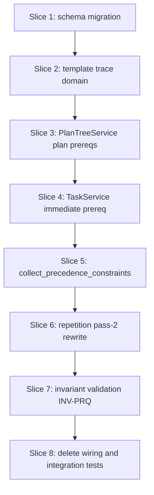

# Plan: Plan and immediate prerequisites

**Finalized plan location:** [`docs/plans/v2_prerequisites.md`](../../docs/plans/v2_prerequisites.md)

## Context

V2 Phase 2 per [`docs/v2_cursor_implementation_guide.md`](../../docs/v2_cursor_implementation_guide.md) Phase 2 and Prompt V2-2: add **plan-level prerequisites** and **immediate prerequisites** on tasks, **template trace** validation, **eager clone rewrite** in `RepetitionService.generate_instances`, and replace the Phase 1 stub `collect_precedence_constraints` with real precedence emission per [`docs/v2_engineering_design.md`](../../docs/v2_engineering_design.md) §5–§6, §11.3, §14 (INV-PRQ-*), §13.

**Authority:** V2 design §5 (prerequisites / plan completion), §6 (template trace + clone wiring), §11.3 (precedence collection), §13 (persistence sketch), §14 (invariants INV-PRQ-1–3).

**Current repo state (post Phase 1):**
- Flat goal-child ordering on `plan.goal_is_critical` / `plan.goal_sort_order`; chain tables dropped; migration head `5210d24989f8`.
- [`calendar_backend/domain/resolution.py`](../../calendar_backend/domain/resolution.py): `collect_precedence_constraints` returns `()` (Phase 1 stub).
- [`calendar_backend/services/repetition.py`](../../calendar_backend/services/repetition.py): pass-1 clone materialization + `_sync_clone_goal_child_order`; **no** prerequisite rewrite pass.
- [`calendar_backend/domain/free_time.py`](../../calendar_backend/domain/free_time.py): critical-recursive **logical completion** for free-time — **not** the same as V2 §5.2 plan completion for prerequisites.
- No `plan_prerequisite` table or `task_plan.immediate_prerequisite_plan_id` column.

**Locked clarifications (request-questions):**
- Phase 2 adds **`plan_prerequisite`** junction and **`task_plan.immediate_prerequisite_plan_id`** only; **`block_plan.immediate_prerequisite_plan_id` deferred to Phase 3** when `BlockPlan` ORM exists.
- **Plan prerequisite mutations** on **`PlanTreeService`** (`add_plan_prerequisite`, `remove_plan_prerequisite`); **immediate prerequisite** on **`TaskService`** (`set_immediate_prerequisite`, `clear_immediate_prerequisite`).
- **Template trace** per V2 §6.1: ordered `(repetition_plan_id, repeat_interval_minutes)` steps walking `parent_id` toward master, jumping from template root to repetition shell.
- **Write-time validation:** DAG for plan prerequisites (reject cycles and self-edges); trace equality for plan-level and immediate links; immediate predecessor/successor must be **TASK** plans in Phase 2 (blocks in Phase 3).
- **Plan completion for precedence** (V2 §5.2): recursive **all descendant leaf tasks** `user_completed` (blocks ignored until Phase 3 adds them).
- **Precedence expansion:** for each direct `plan_prerequisite` edge `(prereq_plan_id → dependent_plan_id)` where prereq subtree is **incomplete**, emit deterministic **leaf-to-leaf** edges from each **incomplete** task leaf in the prereq subtree to each **schedulable incomplete** task leaf in the dependent subtree; omit edges when prereq subtree is complete. Apply **transitive closure** over plan-prerequisite edges before leaf expansion. **Immediate** edges: one `ResolvedPrecedenceConstraint` per active `task_plan.immediate_prerequisite_plan_id` among resolved tasks.
- **`refresh_schedule` hard failure** when repetition clones for prerequisite targets are missing — **Phase 7** orchestration slice; Phase 2 resolves against persisted IDs (master-tree stable; template IDs until pass-2 rewrite on generate).
- **Deletion preview / conflict expansion** for plan prerequisites — **Phase 7**; Phase 2 only wires **delete** cleanup for `plan_prerequisite` rows in [`plan_tree.py`](../../calendar_backend/services/plan_tree.py).

Build workflow: loop runs `/build-plan-slice` per slice; Alembic slices use five-step pattern per V2 guide §0.2.



## Non-goals

- `BlockPlan`, `block_plan.immediate_prerequisite_plan_id`, block precedence (Phase 3–4).
- `allowed_block_families`, block calendar, two-phase scheduling (Phases 3–5).
- `refresh_schedule` orchestration pipeline changes and missing-clone hard errors (Phase 7).
- Deletion preview / conflict analysis reporting of plan prerequisites (Phase 7).
- Production HTTP API or dev CLI new commands beyond test fixture updates.
- OR-Tools / solver algorithm changes (existing precedence machinery consumes `ResolvedPrecedenceConstraint`).
- Free-time **logical completion** semantics change (remains critical-recursive; separate from §5.2 plan completion helper).

## Locked assumptions

- **Table `plan_prerequisite`:** columns `plan_id` (dependent), `prerequisite_plan_id` (prerequisite); composite PK `(plan_id, prerequisite_plan_id)`; FKs → `plan.plan_id`; **no** self-row (`plan_id != prerequisite_plan_id` enforced at service + optional CHECK in migration manual edit).
- **Column `task_plan.immediate_prerequisite_plan_id`:** nullable FK → `plan.plan_id`; NULL = no immediate prereq.
- **ORM:** new [`calendar_backend/models/prerequisites.py`](../../calendar_backend/models/prerequisites.py) with `PlanPrerequisite` mapping; relationship on `Plan` for outgoing/incoming prereq edges as needed for invariant loads (minimal — avoid heavy graph on `Plan` if explicit select suffices).
- **Template trace type:** frozen dataclass `TemplateTraceStep(repetition_plan_id: PlanID, repeat_interval_minutes: int)` and `TemplateTrace = tuple[TemplateTraceStep, ...]` in domain; master-only plans → empty tuple.
- **Service ownership:** [repo convention §14](../../.cursor/repo_conventions.md) — cross-plan graph edges on `PlanTreeService`; task-row field on `TaskService`.
- **Migration slice 1:** five-step pattern; schema tests with `failure_expected` until `/db-revision-continue`.
- **Slice checks:** ruff format, ruff check, pyright; test-creation slices add pytest + **Test catalog** in chat report.

## Slices

### Slice 1: Prerequisite schema migration

**Objective:** Add `plan_prerequisite` table and `task_plan.immediate_prerequisite_plan_id` column via Alembic; ORM mappings only in pre-alembic (no service behavior yet).

**Files expected to change:**
- [`calendar_backend/models/prerequisites.py`](../../calendar_backend/models/prerequisites.py) (new)
- [`calendar_backend/models/plans.py`](../../calendar_backend/models/plans.py)
- [`calendar_backend/db/migrations/env.py`](../../calendar_backend/db/migrations/env.py)
- [`tests/models/test_plans_schema.py`](../../tests/models/test_plans_schema.py) or new `tests/models/test_prerequisites_schema.py`

**May also change:**
- [`calendar_backend/models/__init__.py`](../../calendar_backend/models/__init__.py) — docstring-only; no barrel exports per convention

**Implementation steps:**
1. **pre-alembic:** Add `PlanPrerequisite` ORM; add `TaskPlan.immediate_prerequisite_plan_id` mapped column + relationship stub if useful; import `prerequisites` in `env.py`. Schema tests: table exists in metadata, FK targets, composite PK, nullable immediate column; mark `failure_expected` until continue.
2. **`/db-revision-preview`** — message: `add plan prerequisite schema`.
3. **Migration manual edit:** Create `plan_prerequisite` with named FKs; add column on `task_plan` via `batch_alter_table` per [repo convention §4](../../.cursor/repo_conventions.md); optional CHECK `plan_id != prerequisite_plan_id` on junction.
4. **`/db-revision-continue`:** `upgrade head`; unmark `failure_expected`; pytest models.
5. **post-alembic:** Grep confirms no service reads/writes new tables yet.

**Tests/checks:**
```bash
uv run ruff format .
uv run ruff check .
uv run pyright
uv run pytest tests/models/ -m "not slow and not failure_expected"
```

**Acceptance criteria:**
- DB schema has `plan_prerequisite` and `task_plan.immediate_prerequisite_plan_id`.
- ORM metadata matches migration; no runtime service usage required yet.

**Risks/edge cases:**
- SQLite batch alter for `task_plan` column add; FK to `plan` must allow NULL.

---

### Slice 2: Template trace domain

**Objective:** Pure template-trace computation and equality/matching helpers used by validation, invariants, and services.

**Files expected to change:**
- [`calendar_backend/domain/template_trace.py`](../../calendar_backend/domain/template_trace.py) (new)
- [`tests/domain/test_template_trace.py`](../../tests/domain/test_template_trace.py) (new)

**May also change:**
- [`calendar_backend/domain/__init__.py`](../../calendar_backend/domain/__init__.py) — re-export public trace types if barrel policy applies to new submodule (follow `plan_traversal` pattern: consumers import submodule directly unless convention requires barrel)

**Implementation steps:**
1. Implement `compute_template_trace(plan_id, plans_by_id) -> TemplateTrace` per V2 §6.1 (template-root → shell jump, stop at master).
2. Implement `traces_match(a, b) -> bool` (exact tuple equality).
3. Unit tests: master-only `[]`; single repetition template + clone share trace; nested repetitions; negative — different intervals or repetition IDs.

**Tests/checks:**
```bash
uv run ruff format .
uv run ruff check .
uv run pyright
uv run pytest tests/domain/test_template_trace.py -m "not slow and not failure_expected"
```

**Acceptance criteria:**
- Trace algorithm matches V2 §6.1 worked examples (master, template under shell, clone equals template).
- No SQLAlchemy session imports in domain module.

**Risks/edge cases:**
- Template root identification: `clone_status=TEMPLATE` and parent is repetition shell's template child (match existing repetition clone tests).
- Walking past template root must continue from repetition **shell** plan id, not template root's parent chain incorrectly.

---

### Slice 3: PlanTreeService plan prerequisite API

**Objective:** Add/remove plan-level prerequisite edges with DAG and template-trace validation at write time.

**Files expected to change:**
- [`calendar_backend/services/plan_tree.py`](../../calendar_backend/services/plan_tree.py)
- [`calendar_backend/domain/errors.py`](../../calendar_backend/domain/errors.py) — codes for cycle, trace mismatch, duplicate edge
- [`tests/services/test_plan_tree_service.py`](../../tests/services/test_plan_tree_service.py)

**May also change:**
- [`calendar_backend/domain/prerequisites.py`](../../calendar_backend/domain/prerequisites.py) (new) — pure `would_create_prerequisite_cycle`, `validate_plan_prerequisite_link` helpers

**Implementation steps:**
1. Domain helpers: load-free validation inputs (plan ids + existing edge list + traces) for cycle detection and trace match.
2. `PlanTreeService.add_plan_prerequisite(dependent_id, prerequisite_id)` — reject self-edge, duplicate, trace mismatch, cycle; insert row.
3. `PlanTreeService.remove_plan_prerequisite(dependent_id, prerequisite_id)` — idempotent remove.
4. Service tests: happy path master→master; template pair with matching trace; reject cross-trace; reject 3-cycle.

**Tests/checks:**
```bash
uv run ruff format .
uv run ruff check .
uv run pyright
uv run pytest tests/services/test_plan_tree_service.py -m "not slow and not failure_expected"
```

**Acceptance criteria:**
- Public API persists edges only when INV-PRQ-1 and INV-PRQ-2 rules satisfied at write time.
- Errors use `ServiceResult` / `MessageCode` patterns.

**Risks/edge cases:**
- Cycle check must include the proposed edge against full graph loaded in transaction.
- Prerequisite on repetition **shell** vs template subtree plans — any plan id allowed if traces match.

---

### Slice 4: TaskService immediate prerequisite API

**Objective:** Set/clear immediate prerequisite on task plans with trace and leaf-type validation.

**Files expected to change:**
- [`calendar_backend/services/task.py`](../../calendar_backend/services/task.py)
- [`calendar_backend/domain/prerequisites.py`](../../calendar_backend/domain/prerequisites.py) — extend validation for immediate link
- [`tests/services/test_task_service.py`](../../tests/services/test_task_service.py)

**Implementation steps:**
1. `TaskService.set_immediate_prerequisite(task_id, predecessor_task_id)` — both TASK kind; traces match; reject self; optional reject if predecessor would create logical cycle with immediate edges (document: only single immediate edge per task, no chain cycle via immediate + plan prereqs in Phase 2 — at minimum reject predecessor == successor).
2. `TaskService.clear_immediate_prerequisite(task_id)`.
3. Detach linked clones on mutation (match `update_scheduling_fields` / `mark_complete` behavior).
4. Tests: set/clear; trace mismatch fails; non-task predecessor fails.

**Tests/checks:**
```bash
uv run ruff format .
uv run ruff check .
uv run pyright
uv run pytest tests/services/test_task_service.py -m "not slow and not failure_expected"
```

**Acceptance criteria:**
- `task_plan.immediate_prerequisite_plan_id` updated transactionally with validation messages on violation.

**Risks/edge cases:**
- Predecessor must exist and be TASK; goal/repetition as predecessor rejected until blocks exist in Phase 3.

---

### Slice 5: Plan completion helper and collect_precedence_constraints

**Objective:** Implement V2 §5.2 plan-subtree completion check and replace precedence stub with plan-prerequisite + immediate edge collection.

**Files expected to change:**
- [`calendar_backend/domain/prerequisites.py`](../../calendar_backend/domain/prerequisites.py) — `is_plan_subtree_complete`, edge expansion helpers
- [`calendar_backend/domain/resolution.py`](../../calendar_backend/domain/resolution.py)
- [`tests/domain/test_prerequisites.py`](../../tests/domain/test_prerequisites.py) (new)
- [`tests/domain/test_resolution.py`](../../tests/domain/test_resolution.py)
- [`tests/services/test_task_resolution_service.py`](../../tests/services/test_task_resolution_service.py)

**Implementation steps:**
1. `is_plan_subtree_complete(plan_id, indexes)` — all descendant **task** leaves `user_completed` (ignore blocks Phase 3).
2. `collect_precedence_constraints`: build transitive plan-prerequisite closure; for incomplete prereq subtrees emit deterministic leaf-to-leaf edges among resolved incomplete tasks; add immediate edges from `task_plan.immediate_prerequisite_plan_id`.
3. Skip edges where predecessor task is `valid_completed` (mirror prior chain test intent).
4. Restore/update resolution and assignment tests for explicit precedence (replace Phase 1 “no chain precedence” placeholders).

**Tests/checks:**
```bash
uv run ruff format .
uv run ruff check .
uv run pyright
uv run pytest tests/domain/test_prerequisites.py tests/domain/test_resolution.py tests/services/test_task_resolution_service.py -m "not slow and not failure_expected"
```

**Acceptance criteria:**
- Non-empty `precedence_constraints` when plan prereq incomplete or immediate link present.
- Edge set deterministic (sort keys documented in tests).
- Goal child order still does **not** emit precedence.

**Risks/edge cases:**
- Leaf enumeration must use same traversal as resolution task collection.
- Large Cartesian products — acceptable for V2 scope; document if performance concern arises.

---

### Slice 6: Repetition eager prerequisite rewrite (pass 2)

**Objective:** After clone materialization in `generate_instances` / refresh paths, rewrite template-local plan and immediate prerequisite IDs to clone IDs.

**Files expected to change:**
- [`calendar_backend/services/repetition.py`](../../calendar_backend/services/repetition.py)
- [`tests/services/test_repetition_service.py`](../../tests/services/test_repetition_service.py)

**Implementation steps:**
1. Add `_rewrite_clone_prerequisite_refs(txn, root_clone_id, clone_by_template)` invoked after pass-1 clone map built (generate + linked refresh).
2. Rewrite `plan_prerequisite` rows where `plan_id` or `prerequisite_plan_id` maps via `cloned_from_id`.
3. Rewrite `task_plan.immediate_prerequisite_plan_id` on cloned task rows.
4. Master-tree targets unchanged; fail transaction with explicit `ServiceMessage` if template-local id missing from map.
5. Tests: repetition with template tasks + plan prereq + immediate prereq → instance clones carry rewritten ids.

**Tests/checks:**
```bash
uv run ruff format .
uv run ruff check .
uv run pyright
uv run pytest tests/services/test_repetition_service.py -m "not slow and not failure_expected"
```

**Acceptance criteria:**
- After `generate_instances`, clone rows reference clone ids only for template-local prereqs.
- Failure when clone map incomplete for required template reference.

**Risks/edge cases:**
- Rewriting order: after all clones exist, before commit.
- Re-refresh must not duplicate junction rows — update in place.

---

### Slice 7: Prerequisite invariant validation (INV-PRQ)

**Objective:** ORM invariant checks for prerequisite DAG, trace matching, and immediate prereq trace parity.

**Files expected to change:**
- [`calendar_backend/domain/invariant_validation.py`](../../calendar_backend/domain/invariant_validation.py)
- [`calendar_backend/services/plan_tree_invariant.py`](../../calendar_backend/services/plan_tree_invariant.py)
- [`tests/domain/test_invariant_validation.py`](../../tests/domain/test_invariant_validation.py)
- [`tests/services/test_plan_tree_invariant_service.py`](../../tests/services/test_plan_tree_invariant_service.py)

**Implementation steps:**
1. `_check_plan_prerequisite_dag`, `_check_plan_prerequisite_traces`, `_check_immediate_prerequisite_traces` on loaded graph.
2. Eager-load `plan_prerequisite` and `task_plan.immediate_prerequisite_plan_id` in invariant service loader.
3. Tests: valid graph passes; injected violation detected.

**Tests/checks:**
```bash
uv run ruff format .
uv run ruff check .
uv run pyright
uv run pytest tests/domain/test_invariant_validation.py tests/services/test_plan_tree_invariant_service.py -m "not slow and not failure_expected"
```

**Acceptance criteria:**
- INV-PRQ-1–3 covered in pure invariant module.
- Plan tree invariant service loads prerequisite data without N+1.

**Risks/edge cases:**
- DAG check on persisted graph only (not hypothetical edges).

---

### Slice 8: Delete wiring and assignment integration tests

**Objective:** Delete plan prerequisites when plans removed; end-to-end assignment respects restored precedence.

**Files expected to change:**
- [`calendar_backend/services/plan_tree.py`](../../calendar_backend/services/plan_tree.py) — delete `plan_prerequisite` rows touching affected plans; clear immediate prereq FKs pointing at deleted plans
- [`tests/services/test_plan_tree_service.py`](../../tests/services/test_plan_tree_service.py)
- [`tests/services/test_task_assignment_service.py`](../../tests/services/test_task_assignment_service.py)

**Implementation steps:**
1. In `_execute_plan_deletes`, delete junction rows where `plan_id` or `prerequisite_plan_id` in affected set; null or delete violating `task_plan.immediate_prerequisite_plan_id` (FK RESTRICT — delete/update before plan delete waves).
2. Assignment integration: restore temporal ordering test using plan prereqs or immediate prereqs on repetition clone tasks (replace Phase 1 flat-order-only test where appropriate).
3. Post **Test catalog** for changed assignment/deletion tests.

**Tests/checks:**
```bash
uv run ruff format .
uv run ruff check .
uv run pyright
uv run pytest -m "not slow and not failure_expected"
```

**Acceptance criteria:**
- Plan delete succeeds with prerequisite edges present; no orphan junction rows.
- Assignment test demonstrates precedence-constrained calendar ordering for at least one plan-prereq or immediate-prereq scenario.

**Risks/edge cases:**
- FK order: clear immediate prereq pointers before deleting referenced task plans.
- SQLite RESTRICT requires explicit cleanup (no cascade).

---

## Abstraction check

| Introduced | Needed now? |
|---|---|
| New service classes | **No** — extend `PlanTreeService` and `TaskService`. |
| `domain/template_trace.py` | **Yes** — shared pure trace algorithm for validation, invariants, and tests (V2 §6 domain concept). |
| `domain/prerequisites.py` | **Yes** — completion check, cycle detection, precedence expansion share one seam (replaces empty `collect_precedence_constraints` body). |
| Registries / strategy objects | **No**. |

## Dependency changes

None — no new uv packages.

## Open questions

None — request-questions completed; locked assumptions above govern build.
