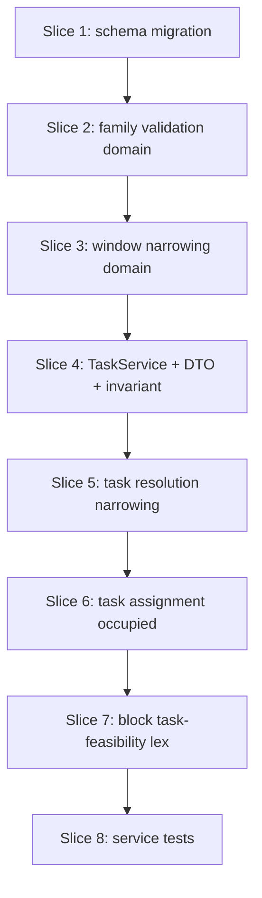

# Plan: Task family narrowing and phase-2 assignment

**Finalized plan location:** [`docs/plans/v2_task_families.md`](../../docs/plans/v2_task_families.md)

## Context

V2 Phase 5 per [`docs/v2_cursor_implementation_guide.md`](../../docs/v2_cursor_implementation_guide.md) Phase 5: add **`task_plan.allowed_block_families`**, **effective window narrowing** from phase-1 block placements and default-time computation (V2 design §7–§7.3, §11.2), **block calendar as task occupied intervals** (§10), **retrofit block task-feasibility lex** (§4.4 — deferred from Phase 4), and update **`TaskResolutionService`** / **`TaskAssignmentService`** / **`TaskService`**.

**Authority:** V2 design §4.4 (block lex for downstream task feasibility), §7 (block families + task allowed families + default time), §10 (`refresh_schedule` occupied policy), §11.2 (effective windows), §13 (`task_plan.allowed_block_families`), §14 (INV-BLK-2).

**Current repo state (post Phase 4):**
- Migration head `39ab2bfa6051`; `block_plan`, `block_calendar_entry`, `BlockAssignmentService`, `BlockResolutionService`, mixed-leaf precedence exist.
- [`calendar_backend/domain/resolution.py`](../../calendar_backend/domain/resolution.py): `ResolvedTask.effective_time_windows` = USER/SYSTEM only; no `allowed_block_families` on task rows or DTOs.
- [`calendar_backend/services/task_assignment.py`](../../calendar_backend/services/task_assignment.py): occupied intervals from TASK `CalendarEntry` only.
- [`calendar_backend/services/task_resolution.py`](../../calendar_backend/services/task_resolution.py): `resolve_tasks_from_graph` does not consume block calendar.
- Block exact solver reuses task lex chain without downstream-task-feasibility term.

**Locked clarifications (request-questions):**
- **Block task-feasibility lex:** **Implement in Phase 5** — add §4.4 downstream task-feasibility lex to block exact assignment using real `allowed_block_families` narrowing.
- **`allowed_block_families` storage:** **SQLite TEXT JSON array** on `task_plan`; validate/normalize once at TaskService write boundary (dedupe sorted unique, reject `"free-time"`, empty/null → effective `["default"]` in domain).
- **Integration scope:** **Service-level tests only** — manual block-calendar fixtures; defer full block→task pipeline integration to Phase 7.

Build workflow: loop runs build slices; slice 1 uses five-step Alembic pattern per V2 guide §0.2.



## Non-goals

- `refresh_schedule` orchestration pipeline (Phase 7).
- Free-time activity family normalization / assignment changes (Phase 6).
- Full BlockAssignmentService → TaskResolutionService → TaskAssignmentService pipeline integration tests (Phase 7).
- Deletion preview / conflict analysis updates (Phase 7).
- Production HTTP API or new dev CLI commands beyond test fixture updates.
- Sub-minute scheduling.
- Junction-table storage for allowed families.

## Locked assumptions

- **Effective families:** Persisted `null`/empty JSON → effective `("default",)` at read/narrowing boundary; explicit list stored as-is after normalization (must not contain `"free-time"`).
- **Narrowing location:** Apply family narrowing inside `resolve_tasks_from_graph` when `block_placements` supplied; `TaskResolutionService` loads `block_calendar_entry` rows (past + active-run policy mirroring task calendar load) and passes snapshots to resolution.
- **Default time (§7.3):** Within each base effective window, **default-eligible** regions = gaps not covered by blocks whose family **≠** `"default"`; explicit `"default"` block intervals are **not** subtracted from default eligibility.
- **Family union (§7.2):** Final narrowed windows = merged union of per-family eligible regions intersected with base USER/SYSTEM effective windows; list order is not priority.
- **Empty narrowing result:** Task lands in `invalid_incomplete` with appropriate window diagnostic (reuse/extend `NO_VALID_WINDOW_FOR_TASK` or family-specific code if needed).
- **Occupied intervals for tasks:** Load `block_calendar_entry` with same filter as TASK entries (`start_time < run_started_at` OR `calendar_run_id == active_run`); merge with task occupied intervals in `TaskAssignmentService`.
- **`ResolvedTask`:** Add `allowed_block_families: tuple[str, ...]` (effective set used by assignment/export).
- **Block lex inputs:** Block exact solver receives unresolved task summaries (plan id, duration, allowed families, base USER/SYSTEM windows) to score candidate block placements; heuristic block path unchanged (feasibility-first only).
- **TaskService API:** `set_allowed_block_families(plan_id, families)` and `clear_allowed_block_families(plan_id)` mirroring immediate-prerequisite mutation style.
- **Slice checks:** ruff format, ruff check, pyright; test-creation slices add pytest + **Test catalog** in chat report.

## Slices

### Slice 1: allowed_block_families schema migration

**Objective:** Add nullable `task_plan.allowed_block_families` TEXT (JSON array) via Alembic; ORM column only in pre-alembic.

**Files expected to change:**
- [`calendar_backend/models/plans.py`](../../calendar_backend/models/plans.py)
- [`calendar_backend/db/migrations/env.py`](../../calendar_backend/db/migrations/env.py)
- [`tests/models/test_plans_schema.py`](../../tests/models/test_plans_schema.py)

**May also change:**
- New `tests/models/test_task_families_schema.py`

**Implementation steps:**
1. **pre-alembic:** Add `TaskPlan.allowed_block_families: Mapped[str | None]` (TEXT storing JSON array). Schema tests: column exists, nullable, accepts valid JSON array; mark `failure_expected` until continue.
2. **`/db-revision-preview`** — message: `add task_plan allowed_block_families`.
3. **Migration manual edit:** `batch_alter_table` on `task_plan`; column nullable TEXT; no CHECK on JSON shape (validated at service boundary).
4. **`/db-revision-continue`:** `upgrade head`; unmark `failure_expected`; pytest models.
5. **post-alembic:** Confirm no service reads/writes column yet.

**Tests/checks:**
```bash
uv run ruff format .
uv run ruff check .
uv run pyright
uv run pytest tests/models/ -m "not slow and not failure_expected"
```

**Acceptance criteria:**
- DB has nullable `task_plan.allowed_block_families` TEXT column.
- ORM metadata matches migration.

**Risks/edge cases:**
- SQLite batch alter on `task_plan`; existing rows default NULL.

---

### Slice 2: Allowed-family validation domain

**Objective:** Pure validation/normalization helpers and effective-family computation per V2 §7.2 and INV-BLK-2.

**Files expected to change:**
- [`calendar_backend/domain/task_families.py`](../../calendar_backend/domain/task_families.py) (new)
- [`calendar_backend/domain/errors.py`](../../calendar_backend/domain/errors.py) — new message code(s) if needed
- [`tests/domain/test_task_families.py`](../../tests/domain/test_task_families.py) (new)

**Implementation steps:**
1. `normalize_allowed_block_families(raw: str | None) -> tuple[str, ...] | ServiceMessage` — parse JSON array, strip/dedupe/sort, reject empty strings, reserved misuse (`"free-time"`), non-array JSON.
2. `effective_allowed_block_families(stored: str | None) -> tuple[str, ...]` — null/empty → `("default",)`.
3. `validate_allowed_block_families_for_write(families: tuple[str, ...]) -> ServiceMessage | None`.
4. Unit tests: null→default; explicit default; transit+default; reject free-time; reject invalid JSON.

**Tests/checks:**
```bash
uv run ruff format .
uv run ruff check .
uv run pyright
uv run pytest tests/domain/test_task_families.py -m "not slow and not failure_expected"
```

**Acceptance criteria:**
- Domain module has no SQLAlchemy imports.
- INV-BLK-2 enforced at write-validation helper.

**Risks/edge cases:**
- Case-sensitive family strings preserved.

---

### Slice 3: Family window narrowing pure functions

**Objective:** Compute default-time regions and narrow task effective windows from block placement snapshots.

**Files expected to change:**
- [`calendar_backend/domain/task_families.py`](../../calendar_backend/domain/task_families.py)
- [`tests/domain/test_task_families.py`](../../tests/domain/test_task_families.py)

**Implementation steps:**
1. Define frozen `BlockPlacementSnapshot(family: str, window: TimeWindow, source_plan_id: PlanID)`.
2. `narrow_task_effective_windows(base_windows, allowed_families, placements) -> tuple[TimeWindow, ...]` — per §7.2–§7.3 using `gaps_in_window`, `intersect_time_windows`, `merge_or_windows`.
3. Tests: default-only with transit block subtracted; transit-only; transit+default union; empty result; overlapping block families.

**Tests/checks:**
```bash
uv run ruff format .
uv run ruff check .
uv run pyright
uv run pytest tests/domain/test_task_families.py -m "not slow and not failure_expected"
```

**Acceptance criteria:**
- Deterministic narrowed windows for fixture placements.
- Default regions exclude non-`default` block coverage only.

**Risks/edge cases:**
- Multiple placements same family merged before intersect.
- Minute-aligned inputs assumed (block/task calendar already aligned).

---

### Slice 4: TaskService, DTO, and invariant wiring

**Objective:** Persist and expose `allowed_block_families`; enforce INV-BLK-2 at write and invariant validation.

**Files expected to change:**
- [`calendar_backend/services/task.py`](../../calendar_backend/services/task.py)
- [`calendar_backend/domain/dtos.py`](../../calendar_backend/domain/dtos.py)
- [`calendar_backend/domain/invariant_validation.py`](../../calendar_backend/domain/invariant_validation.py)
- [`tests/services/test_task_service.py`](../../tests/services/test_task_service.py)

**Implementation steps:**
1. Extend `TaskPlanDTO` with `allowed_block_families: tuple[str, ...]` (effective on read).
2. `task_plan_dto_from_rows` parses stored JSON via domain helpers.
3. `TaskService.set_allowed_block_families` / `clear_allowed_block_families` (clear stores NULL).
4. Invariant check: stored JSON must not contain `"free-time"`.
5. Service tests for set/clear/reject free-time.

**Tests/checks:**
```bash
uv run ruff format .
uv run ruff check .
uv run pyright
uv run pytest tests/services/test_task_service.py -m "not slow and not failure_expected"
```

**Acceptance criteria:**
- Round-trip persist/read for family lists.
- Invalid writes rejected without mutation.

**Risks/edge cases:**
- Linked clone detach on mutation (mirror other TaskService writes).

---

### Slice 5: Task resolution family narrowing

**Objective:** Extend resolution to carry allowed families and apply narrowing from block calendar snapshots.

**Files expected to change:**
- [`calendar_backend/domain/resolution.py`](../../calendar_backend/domain/resolution.py)
- [`calendar_backend/services/task_resolution.py`](../../calendar_backend/services/task_resolution.py)
- [`calendar_backend/domain/task_families.py`](../../calendar_backend/domain/task_families.py) — loader helper from ORM rows optional
- [`tests/domain/test_resolution.py`](../../tests/domain/test_resolution.py)
- [`tests/services/test_task_resolution_service.py`](../../tests/services/test_task_resolution_service.py)

**Implementation steps:**
1. Add `allowed_block_families` to `ResolvedTask`; populate from `task_plan.allowed_block_families` during collection.
2. Extend `resolve_tasks_from_graph(..., block_placements=())` — when non-empty, replace `effective_time_windows` with narrowed set; empty narrowed → validation error on task.
3. `TaskResolutionService`: load block calendar entries (mirror task calendar policy); build snapshots with `block_plan.block_family` join via graph; pass to resolver.
4. Tests: narrowed windows in service; invalid when family mismatch leaves no window.

**Tests/checks:**
```bash
uv run ruff format .
uv run ruff check .
uv run pyright
uv run pytest tests/domain/test_resolution.py tests/services/test_task_resolution_service.py -m "not slow and not failure_expected"
```

**Acceptance criteria:**
- Resolved tasks reflect family-narrowed windows when block placements supplied.
- Resolution without placements keeps Phase 4 behavior (USER/SYSTEM only).

**Risks/edge cases:**
- Block calendar rows for blocks not in graph ignored or mapped via `source_plan_id`.
- Completed tasks skip narrowing changes to bucket placement.

---

### Slice 6: Task assignment block occupied intervals

**Objective:** Treat block calendar entries as hard occupied intervals during task assignment.

**Files expected to change:**
- [`calendar_backend/domain/assignment.py`](../../calendar_backend/domain/assignment.py) or [`calendar_backend/domain/block_assignment.py`](../../calendar_backend/domain/block_assignment.py)
- [`calendar_backend/services/task_assignment.py`](../../calendar_backend/services/task_assignment.py)
- [`tests/domain/test_assignment.py`](../../tests/domain/test_assignment.py)
- [`tests/services/test_task_assignment_service.py`](../../tests/services/test_task_assignment_service.py)

**Implementation steps:**
1. `occupied_intervals_from_block_calendar_entries(entries, run_started_at)` — same past/active-run filter as tasks.
2. `TaskAssignmentService.assign_tasks` merges task + block occupied intervals before `assignment_input_from_resolved`.
3. Tests: task cannot overlap persisted block calendar segment.

**Tests/checks:**
```bash
uv run ruff format .
uv run ruff check .
uv run pyright
uv run pytest tests/domain/test_assignment.py tests/services/test_task_assignment_service.py -m "not slow and not failure_expected"
```

**Acceptance criteria:**
- Block intervals block task placement in solver input.
- Past-only block rows still occupy.

**Risks/edge cases:**
- Occupied merge ordering deterministic.

---

### Slice 7: Block task-feasibility lex objective

**Objective:** Add downstream task-feasibility lex pass to block exact assignment using real family narrowing.

**Files expected to change:**
- [`calendar_backend/domain/task_families.py`](../../calendar_backend/domain/task_families.py) — feasibility volume helper
- [`calendar_backend/scheduling/exact_cp_sat.py`](../../calendar_backend/scheduling/exact_cp_sat.py) — optional block lex hook
- [`calendar_backend/scheduling/input.py`](../../calendar_backend/scheduling/input.py) — block assignment metadata if needed
- [`calendar_backend/services/block_assignment.py`](../../calendar_backend/services/block_assignment.py) — supply task context for lex
- [`tests/scheduling/test_exact_cp_sat_objectives.py`](../../tests/scheduling/test_exact_cp_sat_objectives.py) or new block lex tests

**Implementation steps:**
1. Define pure helper `downstream_task_feasible_minute_count(block_window, task_summaries, existing_placements)` using family narrowing rules.
2. Wire block-only lex pass in exact solver (maximize total downstream feasible minutes) **before** stability/priority soft objectives or per V2 §4.4 as primary block-specific lex tier.
3. `BlockAssignmentService` loads unresolved task summaries from plan graph for lex scoring.
4. Tests: block placement choice prefers option that leaves more task-feasible volume when tied on hard constraints.

**Tests/checks:**
```bash
uv run ruff format .
uv run ruff check .
uv run pyright
uv run pytest tests/scheduling/ -m "not slow and not failure_expected" -k "block or lex or feasibility"
```

**Acceptance criteria:**
- Exact block assignment measurably prefers higher downstream feasibility when alternatives exist.
- Task assignment lex chain unchanged.

**Risks/edge cases:**
- Lex evaluation cost — limit to incomplete tasks in graph; use minute counts not full solver.
- Heuristic block path remains without feasibility lex.

---

### Slice 8: Phase 5 service/domain test hardening

**Objective:** Consolidate cross-module coverage for family narrowing + occupied + INV-BLK-2 at service boundaries.

**Files expected to change:**
- [`tests/services/test_task_resolution_service.py`](../../tests/services/test_task_resolution_service.py)
- [`tests/services/test_task_assignment_service.py`](../../tests/services/test_task_assignment_service.py)
- [`tests/services/test_block_assignment_service.py`](../../tests/services/test_block_assignment_service.py)
- [`tests/domain/test_task_families.py`](../../tests/domain/test_task_families.py)

**Implementation steps:**
1. End-to-end service fixtures: create task with transit-only families + block calendar transit placement → task resolves with narrowed window.
2. Task assignment respects block occupied + narrowed windows together.
3. Block assignment lex fixture (if not covered in slice 7).
4. Post **Test catalog** in chat report per V2 guide §7.

**Tests/checks:**
```bash
uv run ruff format .
uv run ruff check .
uv run pyright
uv run pytest tests/domain/test_task_families.py tests/services/test_task_resolution_service.py tests/services/test_task_assignment_service.py tests/services/test_block_assignment_service.py -m "not slow and not failure_expected"
```

**Acceptance criteria:**
- All Phase 5 behaviors covered by named tests.
- No regression in Phase 4 block assignment tests.

**Risks/edge cases:**
- Fixture verbosity — reuse service DB bootstrap patterns.

---

## Abstraction check

| Introduced | Justification |
|---|---|
| `domain/task_families.py` | Real domain concept (§7) with validation + narrowing + feasibility helpers; avoids duplicating family rules across resolution, services, and lex scoring. |
| `BlockPlacementSnapshot` | Stable pure input for narrowing from DB rows or test fixtures — two call sites (resolution, lex). |

No new solver frameworks, registries, or service base classes.

## Dependency changes

None.

## Open questions

None — Phase 5 request-questions locked all blocking decisions.
