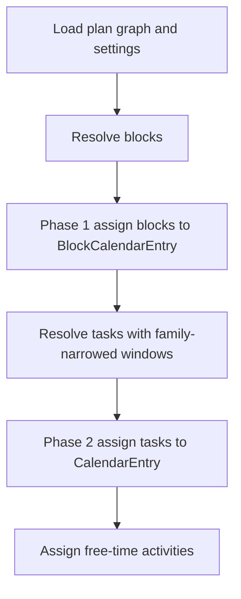

# calendar_backend V2 Engineering Design

Recommended location: `docs/v2_engineering_design.md`

This document is the **architectural source of truth** for V2 behavior and persisted shape. It supersedes [`docs/calendar_backend_v1_engineering_design_updated.pdf`](calendar_backend_v1_engineering_design_updated.pdf) and [`docs/cursor_implementation_guide.md`](cursor_implementation_guide.md) wherever they conflict.

**Precedence (highest first):**

1. [`.cursor/repo_conventions.md`](../.cursor/repo_conventions.md)
2. This document and finalized plans in [`docs/plans/`](plans/)
3. Archived V1 PDF and V1 implementation guide

**Relationship to the codebase:** V2 is implemented by **evolving the existing repository in place** (breaking schema and service refactors are expected). V1 behavior described in archived docs is historical unless this document says otherwise.

---

## 1. Overview

`calendar_backend` is a Python service-layer backend for personal calendar scheduling. Persistence uses SQLite through SQLAlchemy ORM and Alembic. Mutations go through services inside transactions. Scheduling algorithms are isolated from persistence.

V2 extends V1 with:

- **Blocks** — leaf plan nodes scheduled before tasks; they constrain where tasks may be placed but do not appear on the user-facing task calendar.
- **Block families** — string labels that define which task windows overlap which block intervals.
- **Plan-level prerequisites** — generalized precedence replacing goal child chains.
- **Immediate prerequisites** — touch-time constraints between leaf tasks and blocks.
- **Flat goal children** — direct ordered children under goals; **goal child chain objects are removed**.

Core principles unchanged from V1: correctness, readability, deterministic behavior, explicit invariants, minute-granularity scheduling, frozen domain DTOs.

---

## 2. Non-goals (V2)

Do not implement unless explicitly requested:

- Production HTTP API or mobile frontend
- OS notification scheduler
- External calendar sync
- Recurring availability constraints (beyond repetition instance generation)
- Undo / audit / soft-delete / history system
- Orphan active plans
- Mutable plan type or plan type conversion
- Sub-minute scheduling
- Blocks on the user-facing task calendar export

---

## 3. Plan tree

### 3.1 Plan kinds

| Kind | Role |
|---|---|
| `GOAL` | Non-leaf container; may hold child plans and time constraints |
| `TASK` | Leaf; schedulable work with duration and completion |
| `BLOCK` | Leaf; schedulable constraint interval (phase 1); not exported on task calendar |
| `REPETITION` | Shell owning template root, instances, and generation settings |

Exactly one master goal exists. Template and instance-clone semantics from V1 remain (see §8).

### 3.2 Tree edges

- **`parent_id`** — structural tree membership (goal nesting, repetition shell → template root / instance clones).
- **Goal child ordering** — direct children of a goal carry **`goal_is_critical`** and **`goal_sort_order`** on the child `Plan` row (names illustrative; exact column names are an implementation detail).

**Removed:** `GoalChildChain`, `GoalChildChainItem`, and all chain-based traversal.

### 3.3 Goal child ordering

Under each `GoalPlan`:

- Children are partitioned into **critical** and **non-critical** buckets via `goal_is_critical`.
- Within each bucket, **`goal_sort_order`** is dense `0..n-1` (separate sequences per `(parent_goal_id, goal_is_critical)`).
- Ordering affects resolution traversal and assignment priority.
- Ordering **does not** impose scheduling precedence by itself (precedence comes from §5).

**Scope:** Goal parents only. **`RepetitionInstance.is_critical` / `sort_order`** remain the ordering mechanism for repetition instances under a repetition shell (unchanged from V1).

**Repetition shell under master:** The repetition shell is a direct ordered child of the master goal (same fields as other goal children).

**Template goals:** Template-subtree goals use the same direct child ordering. Instance generation copies ordering from template goal children to matching clone goal children.

### 3.4 Leaf rules

- Goals may contain goals, tasks, blocks, and repetition shells.
- Tasks and blocks are **leaves** (no children).
- A goal cannot contain both a task/block and a nested goal as scheduling siblings under the same parent unless the design explicitly allows mixed children (V2 **allows** mixed children under goals, same as V1 task nesting patterns).

---

## 4. Blocks

### 4.1 Purpose

Blocks represent periods that **constrain** task placement without becoming task-calendar entries. Example: a **transit** block on a train — tasks that allow the `transit` family may be scheduled there; tasks requiring a desktop cannot.

### 4.2 BlockPlan fields

Blocks mirror tasks for scheduling-relevant fields:

- `duration_minutes` (positive)
- `divisible` / `minimum_chunk_size_minutes` (same divisibility rules as tasks)
- `user_completed` / `completed_at` (same completion model as tasks)
- **`block_family: str`** — family label for constraint propagation

Blocks inherit USER and SYSTEM time constraints like tasks.

### 4.3 Block calendar persistence

Block placements persist in a **separate table** from task `CalendarEntry` (e.g. `block_calendar_entry`):

- Stores assigned intervals for blocks after phase 1
- Not merged into task calendar views or export
- Cleared and rebuilt on refresh (same general policy as task assignment unless a slice specifies stickiness)

### 4.4 Block scheduling (phase 1)

Scheduling runs in **two phases**:

1. **Phase 1 — blocks:** Assign block intervals into feasible windows.
2. **Phase 2 — tasks:** Assign tasks using windows narrowed by block families and block placements.

Phase 1 uses solver machinery **analogous to task assignment** (same lexicographic objective structure where applicable), with a block-specific objective component: **prefer placements that maximize downstream task feasible window volume/count** (subject to priority paths and constraints).

Blocks may not overlap occupied intervals from fixed calendar entries (same occupied-interval policy as tasks unless a slice refines it).

### 4.5 Block completion and plan rollup

- **`user_completed`** on blocks follows the task model (placement does not auto-complete).
- Plan completion (§5.2) counts incomplete leaf blocks as blocking completion.

---

## 5. Prerequisites and precedence

V2 replaces goal child chain precedence with two mechanisms: **plan-level prerequisites** and **immediate prerequisites**.

### 5.1 Plan-level prerequisites

Each plan may declare an **unordered set** of prerequisite plans (`plan_prerequisite` junction or equivalent):

- **DAG enforced at write time** — cycles rejected.
- **Any plan** may prereq **any other plan** (goal, task container subtree, repetition shell, etc.).
- Before any **task or block** belonging to plan **B** may be scheduled, every prerequisite plan **A** must be **complete** (§5.2).

**Scheduling translation:** Incomplete prerequisite plans block all schedulable leaves in the dependent plan subtree. Resolution emits precedence edges from prerequisite leaves to dependent leaves (exact edge expansion is an implementation detail; must be deterministic).

**Cross-repetition guard:** Prerequisites are validated with **template trace matching** (§6). Mismatched traces are rejected at write time.

**Not-yet-generated repetition:** If a prerequisite target requires instance clones that do not exist yet, **`refresh_schedule` fails with a hard error** (explicit diagnostic). No auto-generate, no silent skip.

### 5.2 Plan completion

Plan **A** is **complete** when **every leaf task and block** in **A**'s subtree (recursive) is **`user_completed`**.

Non-leaf goals do not have a separate completion flag; completion is derived from leaves.

### 5.3 Immediate prerequisites

Each task and block may reference **one immediate prerequisite** — another task or block plan such that:

- The predecessor’s **last assigned segment end** equals the successor’s **first assigned segment start** (touch-time).
- Applies to assignment output, not merely declared duration.
- Predecessor must be assigned (or validation fails) when the constraint is active.

**Scope:** Any leaf task or block with **matching template trace** (§6) to the successor.

**Removed:** Chain-adjacency precedence (`goal_child_chain_order` edges).

### 5.4 Priority vs precedence

- **Goal child order** and **repetition instance order** still define **priority paths** for assignment.
- **Plan prerequisites** and **immediate prerequisites** define **hard precedence constraints** for the solver.

---

## 6. Template trace

### 6.1 Definition

For a plan **P**, the **template trace** is an ordered list of steps `(repetition_plan_id, repeat_interval_minutes)` obtained by:

1. Start at **P**.
2. Walk `parent_id` toward the master.
3. When encountering a plan that is a **template root** (`clone_status=TEMPLATE` root of a repetition template subtree), append `(repetition_plan_id, repeat_interval_minutes)` from that repetition shell and continue tracing from the **repetition shell** (not from the template root upward through the template).
4. Stop when reaching the **master** plan.

**Master-only plans** have trace **`[]`**.

### 6.2 Matching rule

Two plans may be linked by prerequisites (plan-level or immediate) only if their template traces are **exactly equal** (same length, same repetition IDs, same intervals in order).

**Corollaries:**

- Master plan `[]` may prereq only other master-tree plans with trace `[]`.
- Instance clones of the same template node share trace with each other and with template nodes (trace reflects repetition steps, not `instance_index`).
- Cross-repetition links with different traces are **invalid**.

### 6.3 Instance generation and prerequisite wiring

**Hybrid eager resolution** at repetition instance generation:

1. **Pass 1:** Clone all template nodes for instance index `n`; build `cloned_from_id → clone_id` map.
2. **Pass 2:** Rewrite template-local prerequisite and immediate-prerequisite references to matching clone IDs using the map.

Master-tree prerequisite targets keep stable IDs (no rewrite).

If a prerequisite cannot be resolved to a clone in pass 2, generation **fails** with an explicit error.

---

## 7. Block families

### 7.1 Family strings

- **Free-form, case-sensitive** strings (e.g. `"transit"`, `"focus"`).
- **Reserved:** `"default"`, `"free-time"`.
- Multiple blocks may share the same family.
- No central registry table in V2 (validation only).

### 7.2 Task allowed families

Each task stores **`allowed_block_families`** (persisted list; empty means default-only).

| Stored value | Effective families | Eligible time |
|---|---|---|
| Omitted / empty | `["default"]` | USER windows intersect **default** (unblocked / non-special) time only |
| `["transit", "default"]` | Union | USER ∩ transit block intervals **∪** USER ∩ default time |

**Union semantics:** list order is **not** priority. The solver chooses among the combined eligible set.

**Validation:** Tasks **must not** include `"free-time"` in `allowed_block_families`.

### 7.3 Default time

**Default** is the portion of the horizon not covered by blocks whose family is **not** `"default"`. Explicit `"default"` blocks may exist but unlabeled time behaves as default-eligible for tasks that include `"default"`.

### 7.4 Free-time family blocks

A block with family **`"free-time"`** reserves windows where:

- **No tasks** may be placed (tasks never use `"free-time"` in their family list).
- **Free-time activities** may be placed (subject to §7.5).

Without `"free-time"` blocks, free-time assignment behaves as V1 regarding **gaps** after tasks.

---

## 8. Repetition and templates

V1 template semantics apply except where this document supersedes:

### 8.1 Structure (unchanged)

- **Repetition shell** — `plan_kind=REPETITION`, direct ordered child of master goal.
- **Template root** — `clone_status=TEMPLATE`, child of shell, not in goal ordering as a special case beyond `parent_id`.
- **Instance clones** — `clone_status=LINKED` or `DETACHED`; `cloned_from_id` points at template node.

### 8.2 Supersessions vs V1

| Topic | V1 | V2 |
|---|---|---|
| Master / template goal child layout | Goal child chains | Direct `goal_is_critical` / `goal_sort_order` on child plans |
| Clone chain sync | `_sync_clone_goal_chains` | Sync direct child ordering fields on clone goals |
| Precedence under goals | Chain item order | Plan prerequisites + immediate prerequisites |
| Template goal ordering | Chain buckets | Direct goal child fields |

### 8.3 Scheduling

- Template subtree remains unscheduled.
- Instance clones receive shifted `SYSTEM_REPETITION_WINDOW` constraints.

### 8.4 Deletion

- Template-root delete still includes repetition shell (V1 rule preserved).
- Deletion expansion respects plan prerequisites and goal child ordering for diagnostics; exact delete-set rules follow V1 cascade patterns updated for flat goal children (implementation slice).

---

## 9. Free-time activities

Free-time activities retain **`prerequisite_plan_ids`** with **logical completion** semantics:

- If any prerequisite plan is **incomplete**, the activity is **not schedulable at all** (full blocker — not a spatial constraint).

**Block family list** (separate from logical prerequisites) controls **where** an eligible activity may go:

| User-provided list | Effective families (after normalization) | Eligible regions |
|---|---|---|
| Omitted | `["free-time", "default"]` | Free-time gaps ∪ default unblocked time |
| `["transit"]` | `["free-time", "transit"]` | Free-time gaps ∪ transit block windows |
| `["free-time"]` only | `["free-time"]` | Free-time gaps and `"free-time"` block windows **only** (excludes default) |

**Normalization rule:** Always append `"free-time"` to the effective set unless the user explicitly provides a list that omits it (explicit `["free-time"]` only excludes default by intent).

**Assignment order:** Tasks (phase 2) → free-time activities fill remaining eligible regions (after block reservations).

---

## 10. refresh_schedule pipeline

**Occupied intervals for tasks** include block calendar entries (blocks consume time).

**Hard errors:**

- Prerequisite repetition not generated
- Invalid template-trace links
- Unassigned immediate prerequisite when required

---

## 11. Task and block resolution

### 11.1 Traversal

Replace chain traversal with: under each goal, visit direct children sorted by `(goal_is_critical desc, goal_sort_order asc)` (exact critical-first rule must match implementation conventions).

**Removed DTO fields:** `chain_path` / chain IDs in resolution output.

**Added / replaced:** goal-child path steps, plan prerequisite edges, immediate prerequisite edges, block family metadata on resolved tasks/blocks.

### 11.2 Effective windows (tasks)

For each task:

1. Compute USER/SYSTEM effective windows (V1 logic).
2. Narrow by **allowed_block_families** using phase-1 block placements and default-time computation (§7).
3. Empty intersection → invalid for scheduling (diagnostics).

### 11.3 Precedence collection

Collect from:

- Plan prerequisite transitive closure (leaf-to-leaf)
- Immediate prerequisite edges

**Not** from goal child order.

---

## 12. Deletion and conflict analysis

Deletion previews and conflict suggestions follow V1 patterns updated for:

- Flat goal children (expand critical siblings and descendants without chain tables)
- Block subtrees treated analogously to task subtrees
- Plan prerequisite references reported as blocking relationships where relevant

Blocks do not appear in user-facing calendar conflict views unless a diagnostic mode explicitly includes `BlockCalendarEntry`.

---

## 13. Persistence sketch

New or materially changed tables (illustrative):

| Table | Purpose |
|---|---|
| `block_plan` | Block subtype fields including `block_family` |
| `block_calendar_entry` | Phase-1 block placements |
| `plan_prerequisite` | `(plan_id, prerequisite_plan_id)` DAG edges |
| `task_plan.allowed_block_families` | JSON or normalized storage |
| `task_plan.immediate_prerequisite_plan_id` | Nullable FK to plan |
| `block_plan.immediate_prerequisite_plan_id` | Nullable FK to plan |
| `plan.goal_is_critical`, `plan.goal_sort_order` | Nullable; set when parent is goal |

**Dropped:** `goal_child_chain`, `goal_child_chain_item`

Exact column names, CHECK constraints, and indexes are defined in implementation plans and migrations.

---

## 14. Invariants (selected)

| ID | Invariant |
|---|---|
| INV-BLK-1 | Block placements exist only in `block_calendar_entry`, never task `CalendarEntry` |
| INV-BLK-2 | Task `allowed_block_families` must not contain `"free-time"` |
| INV-PRQ-1 | Plan prerequisite graph is a DAG |
| INV-PRQ-2 | Every prerequisite edge connects plans with equal template traces |
| INV-PRQ-3 | Immediate prereq predecessor and successor share template trace |
| INV-GCH-1 | Under each goal, `(goal_is_critical, goal_sort_order)` is dense per bucket |
| INV-CPL-1 | Plan complete iff all descendant leaf tasks/blocks are user-completed |

Full invariant validation lives in `domain/invariant_validation.py` per repo conventions.

---

## 15. V1 → V2 migration concept

Data migration (single coordinated series):

1. Add goal child ordering columns on `plan`.
2. Copy `goal_child_chain` / items → direct child fields.
3. Add block, prerequisite, and block-calendar schema.
4. Drop chain tables after services stop reading them.

See [`docs/v2_cursor_implementation_guide.md`](v2_cursor_implementation_guide.md) for slice sequencing.

---

## 16. Open design details (non-blocking)

Implementation slices may refine without plan revision when aligned with this document:

- Exact block overlap policy (same family vs different family)
- Block assignment stickiness vs full rebuild on refresh
- Exact lex objective coefficients for block phase 1
- Storage format for `allowed_block_families` (JSON array vs junction table)
